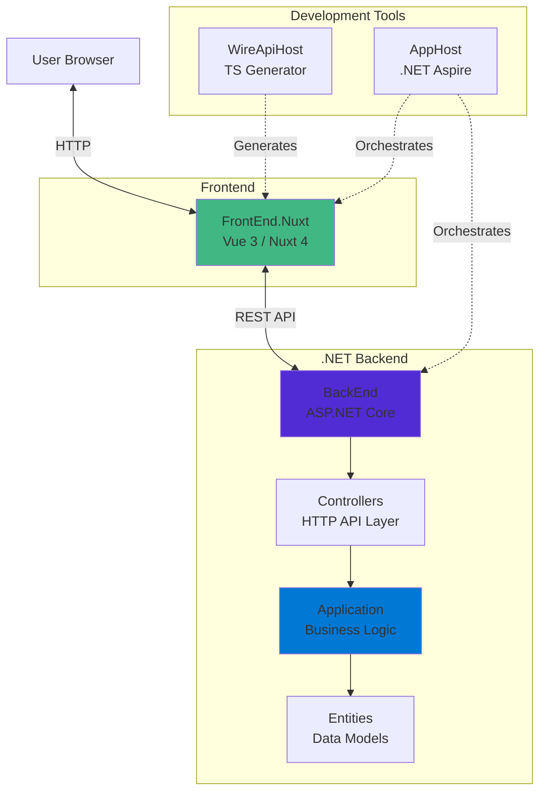

# YoFi.V3

[](https://github.com/jcoliz/YoFi.V3/actions/workflows/build.yaml)

This is the beginning of a structural refactor/rewrite of the [YoFi](https://github.com/jcoliz/yofi) project. YoFi was originally started on .NET Core 2.2, so it's time to modernize!

Currently, I'm collecting domain-independent building blocks of a more modern web stack. Once this is all together and working, I will start bringing actual YoFi code over to this project.

## Technology Stack

* Built with [Nuxt 4](https://nuxt.com/)
* Developed with [.NET Aspire](https://learn.microsoft.com/en-us/dotnet/aspire/get-started/aspire-overview)
* [Bootstrap](https://getbootstrap.com/) for styling
* [@coliz/vue-base-controls](https://www.npmjs.com/package/@coliz/vue-base-controls) for common Vue+Bootstrap controls

## Architecture




### Project Structure

- **src/AppHost** - .NET Aspire orchestration
- **src/BackEnd** - API host
- **src/Controllers** - HTTP API controllers
- **src/Application** - Business logic (Features)
- **src/Entities** - Data models and interfaces
- **src/WireApiHost** - TypeScript API client generator
- **src/FrontEnd.Nuxt** - Vue/Nuxt user interface
- **tests/Unit** - Unit tests for Application layer

## Getting Started

### Prerequisites

- .NET 10.0 SDK
- Node.js 20+ and pnpm
- Visual Studio 2022 or VS Code with C# Dev Kit

### Running Locally

1. Clone the repository
2. Run the Aspire AppHost:
   ```powershell
   dotnet watch --project src/AppHost
   ```
3. Open the Aspire Dashboard (URL shown in console output)
