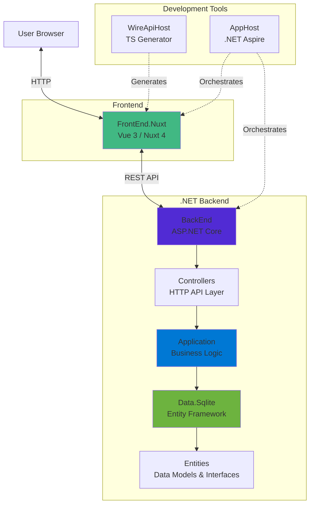

# YoFi.V3

[](https://github.com/jcoliz/YoFi.V3/actions/workflows/build.yaml)

This is the beginning of a structural refactor/rewrite of the [YoFi](https://github.com/jcoliz/yofi) project. YoFi was originally started on .NET Core 2.2, so it's time to modernize!

Currently, I'm collecting domain-independent building blocks of a more modern web stack. Once this is all together and working, I will start bringing actual YoFi code over to this project.

## Technology Stack

### Frontend

* [Nuxt 4](https://nuxt.com/) - Vue.js meta-framework
* [Vue 3](https://vuejs.org/) - Progressive JavaScript framework
* [Bootstrap 5](https://getbootstrap.com/) - CSS framework for responsive design
* [@coliz/vue-base-controls](https://www.npmjs.com/package/@coliz/vue-base-controls) - Reusable Vue+Bootstrap components
* [TypeScript](https://www.typescriptlang.org/) - Type-safe JavaScript

### Backend

* [.NET 10](https://dotnet.microsoft.com/) - Cross-platform development framework
* [ASP.NET Core](https://learn.microsoft.com/en-us/aspnet/core/) - Web API framework
* [Entity Framework Core](https://learn.microsoft.com/en-us/ef/core/) - Object-relational mapper (ORM)

### Development & Tooling

* [.NET Aspire](https://learn.microsoft.com/en-us/dotnet/aspire/get-started/aspire-overview) - Cloud-ready stack orchestration
* [NUnit](https://nunit.org/) - Testing framework
* [Playwright](https://playwright.dev/) - End-to-end testing framework
* [pnpm](https://pnpm.io/) - Fast, disk space efficient package manager

### Azure Resources

* [Azure Static Web Apps](https://azure.microsoft.com/en-us/products/app-service/static/) - Hosting for frontend application
* [Azure App Service](https://azure.microsoft.com/en-us/products/app-service/) - Managed hosting for web applications
* [Azure SQL Database](https://azure.microsoft.com/en-us/products/azure-sql/database/) - Managed relational database
* [Azure Storage](https://azure.microsoft.com/en-us/products/storage/blobs/) - Cloud object storage for documents and files

## Architecture

See [ARCHITECTURE.md](docs/ARCHITECTURE.md) for detailed architecture documentation and [Architecture Decision Records](docs/adr/README.md) for key design decisions.



### Project Structure

- **[src/AppHost](src/AppHost)** - .NET Aspire orchestration
- **[src/BackEnd](src/BackEnd)** - API host
- **[src/Controllers](src/Controllers)** - HTTP API controllers
- **[src/Application](src/Application)** - Business logic (Features)
- **[src/Data](src/Data)** - Data access layer (Entity Framework)
- **[src/Entities](src/Entities)** - Data models and interfaces
- **[src/WireApiHost](src/WireApiHost)** - TypeScript API client generator
- **[src/FrontEnd.Nuxt](src/FrontEnd.Nuxt)** - Vue/Nuxt user interface
- **[tests/Unit](tests/Unit)** - Unit tests for Application layer
- **[tests/Integration.Data](tests/Integration.Data)** - Integration tests for Data layer
- **[tests/Functional](tests/Functional)** - Functional tests for end-to-end scenarios

## Getting Started

For more details about the various environments where the app is built to run, please see [ENVIRONMENTS.md](./docs/ENVIRONMENTS.md).

### Development Setup

**Prerequisites:** .NET 10.0 SDK, Node.js 24+, pnpm, Visual Studio 2022 or VS Code

Run the automated setup script after cloning:

```powershell
.\scripts\Setup-Development.ps1
```

This will verify tools, restore dependencies, build the solution, and run tests. Then start developing:

```powershell
.\scripts\Start-LocalDev.ps1
```

See [CONTRIBUTING.md](docs/CONTRIBUTING.md) for detailed development guidelines and [scripts/README.md](scripts/README.md) for available automation scripts.

### Running in Container

It's quick and easy to run the app:

1. Clone the repository
2. Ensure Docker is installed and running
3. Build the containers
    ```
    ./scripts/Build-Container.ps1
    ```
4. Run the containers
    ```
    ./scripts/Start-Container.ps1
    ```

This will open a browser window to the running app.

