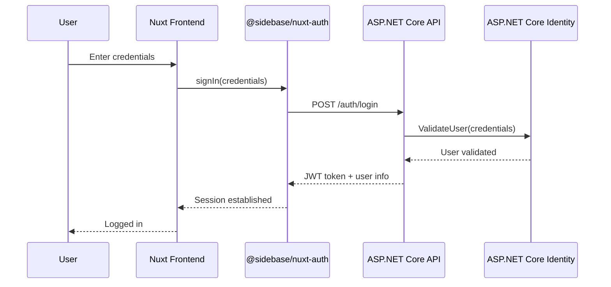

# Identity Design

This document provides detailed implementation guidance for the Identity system, following the architectural decisions made in [ADR 0008](./adr/0008-identity.md).

## Table of Contents

1. [Architecture Overview](#architecture-overview)
2. [Backend Implementation](#backend-implementation)
3. [Frontend Implementation](#frontend-implementation)
4. [Claims-Based Authorization](#claims-based-authorization)
5. [Advanced Patterns](#advanced-patterns)
6. [Security Considerations](#security-considerations)

## Architecture Overview

### High-Level Flow



### Key Integration Points

1. **Authentication**: `@sidebase/nuxt-auth` calls your ASP.NET Core `/api/auth/login` endpoint
2. **Token Management**: Frontend stores JWT token, includes it in API calls
3. **Session Persistence**: Nuxt auth handles token refresh and session management
4. **Authorization**: ASP.NET Core Identity validates JWT tokens on protected endpoints
5. **User Data**: Both systems share the same user data through the API

### Benefits of This Approach

✅ **Stateless**: JWT tokens mean no server-side session storage needed  
✅ **Secure**: ASP.NET Core Identity handles password hashing, validation  
✅ **Familiar**: You use standard ASP.NET Core auth patterns you already know  
✅ **Flexible**: Easy to add external providers later (Google, Microsoft, etc.)  
✅ **Frontend Friendly**: Nuxt auth handles token storage, refresh, route protection  

## Backend Implementation

### 1. ASP.NET Core Identity Configuration

#### Program.cs Setup

````csharp
// filepath: c:\Source\jcoliz\YoFi.V3\src\BackEnd\Program.cs
// Add Identity services
builder.Services.AddIdentity<ApplicationUser, IdentityRole>()
    .AddEntityFrameworkStores<ApplicationDbContext>()
    .AddDefaultTokenProviders();

// Configure JWT Authentication
builder.Services.AddAuthentication(options =>
{
    options.DefaultAuthenticateScheme = JwtBearerDefaults.AuthenticationScheme;
    options.DefaultChallengeScheme = JwtBearerDefaults.AuthenticationScheme;
})
.AddJwtBearer(options =>
{
    options.TokenValidationParameters = new TokenValidationParameters
    {
        ValidateIssuer = true,
        ValidateAudience = true,
        ValidateLifetime = true,
        ValidateIssuerSigningKey = true,
        ValidIssuer = builder.Configuration["Jwt:Issuer"],
        ValidAudience = builder.Configuration["Jwt:Audience"],
        IssuerSigningKey = new SymmetricSecurityKey(
            Encoding.UTF8.GetBytes(builder.Configuration["Jwt:Key"]))
    };
});

// Add Authorization policies
builder.Services.AddAuthorization(options =>
{
    options.AddPolicy("AccountAccess", policy =>
        policy.RequireAssertion(context =>
        {
            var accountId = context.Resource as string;
            var userId = context.User.FindFirst(ClaimTypes.NameIdentifier)?.Value;
            return CheckUserAccountAccess(userId, accountId);
        }));
});
````

### 2. Authorization Strategy

For your specific requirement of users having access to specific accounts:

````csharp
// filepath: c:\Source\jcoliz\YoFi.V3\src\BackEnd\Program.cs
// Custom authorization policy
builder.Services.AddAuthorization(options =>
{
    options.AddPolicy("AccountAccess", policy =>
        policy.RequireAssertion(context =>
        {
            var accountId = context.Resource as string; // Account ID from route
            var userId = context.User.FindFirst(ClaimTypes.NameIdentifier)?.Value;
            // Check database for user-account relationship
            return CheckUserAccountAccess(userId, accountId);
        }));
});
````

Usage in controllers:
````csharp
// In your controllers
[Authorize(Policy = "AccountAccess")]
[HttpGet("accounts/{accountId}/transactions")]
public async Task<IActionResult> GetTransactions(string accountId) { ... }
````

### 3. Authentication Controller

Create authentication endpoints that `@sidebase/nuxt-auth` can call:

````csharp
// filepath: c:\Source\jcoliz\YoFi.V3\src\BackEnd\Controllers\AuthController.cs
[ApiController]
[Route("api/[controller]")]
public class AuthController : ControllerBase
{
    private readonly SignInManager<ApplicationUser> _signInManager;
    private readonly UserManager<ApplicationUser> _userManager;
    private readonly IConfiguration _configuration;

    public AuthController(
        SignInManager<ApplicationUser> signInManager,
        UserManager<ApplicationUser> userManager,
        IConfiguration configuration)
    {
        _signInManager = signInManager;
        _userManager = userManager;
        _configuration = configuration;
    }

    [HttpPost("login")]
    public async Task<IActionResult> Login([FromBody] LoginRequest request)
    {
        var result = await _signInManager.PasswordSignInAsync(
            request.Email, 
            request.Password, 
            isPersistent: false, 
            lockoutOnFailure: false);

        if (result.Succeeded)
        {
            var user = await _userManager.FindByEmailAsync(request.Email);
            var token = GenerateJwtToken(user);
            
            return Ok(new
            {
                token = token,
                user = new
                {
                    id = user.Id,
                    email = user.Email,
                    name = user.UserName
                }
            });
        }

        return Unauthorized();
    }

    [HttpGet("user")]
    [Authorize]
    public async Task<IActionResult> GetCurrentUser()
    {
        var userId = User.FindFirst(ClaimTypes.NameIdentifier)?.Value;
        var user = await _userManager.FindByIdAsync(userId);
        
        return Ok(new
        {
            id = user.Id,
            email = user.Email,
            name = user.UserName
        });
    }

    [HttpPost("refresh-token")]
    [Authorize]
    public async Task<IActionResult> RefreshToken()
    {
        var userId = User.FindFirst(ClaimTypes.NameIdentifier)?.Value;
        var user = await _userManager.FindByIdAsync(userId);
        
        if (user == null)
        {
            return Unauthorized();
        }

        var token = GenerateJwtToken(user);
        return Ok(new { token });
    }

    [HttpPost("logout")]
    [Authorize]
    public async Task<IActionResult> Logout()
    {
        await _signInManager.SignOutAsync();
        return Ok();
    }

    private string GenerateJwtToken(ApplicationUser user)
    {
        var tokenHandler = new JwtSecurityTokenHandler();
        var key = Encoding.ASCII.GetBytes(_configuration["Jwt:Key"]);
        var tokenDescriptor = new SecurityTokenDescriptor
        {
            Subject = new ClaimsIdentity(new[]
            {
                new Claim(ClaimTypes.NameIdentifier, user.Id),
                new Claim(ClaimTypes.Email, user.Email)
            }),
            Expires = DateTime.UtcNow.AddHours(24),
            SigningCredentials = new SigningCredentials(
                new SymmetricSecurityKey(key), 
                SecurityAlgorithms.HmacSha256Signature)
        };
        var token = tokenHandler.CreateToken(tokenDescriptor);
        return tokenHandler.WriteToken(token);
    }
}
````

### 4. JWT Token Generation with Claims

Enhanced JWT token generation to include account access claims:

````csharp
// filepath: c:\Source\jcoliz\YoFi.V3\src\BackEnd\Controllers\AuthController.cs
private async Task<string> GenerateJwtToken(ApplicationUser user)
{
    var tokenHandler = new JwtSecurityTokenHandler();
    var key = Encoding.ASCII.GetBytes(_configuration["Jwt:Key"]);
    
    // Get user's accessible accounts from database
    var userAccounts = await GetUserAccountAccess(user.Id);
    
    var claims = new List<Claim>
    {
        new Claim(ClaimTypes.NameIdentifier, user.Id),
        new Claim(ClaimTypes.Email, user.Email),
        new Claim(ClaimTypes.Name, user.UserName ?? user.Email),
        new Claim("sub", user.Id), // Standard JWT claim
        new Claim("email", user.Email),
        new Claim("name", user.UserName ?? user.Email)
    };
    
    // Add account access claims
    foreach (var account in userAccounts)
    {
        claims.Add(new Claim("account_access", account.AccountId));
        claims.Add(new Claim($"account_role_{account.AccountId}", account.Role)); // e.g., "owner", "viewer", "editor"
    }
    
    // Add any other custom claims
    claims.Add(new Claim("user_preferences", user.Preferences ?? "{}"));
    
    var tokenDescriptor = new SecurityTokenDescriptor
    {
        Subject = new ClaimsIdentity(claims),
        Expires = DateTime.UtcNow.AddHours(24),
        Issuer = _configuration["Jwt:Issuer"],
        Audience = _configuration["Jwt:Audience"],
        SigningCredentials = new SigningCredentials(
            new SymmetricSecurityKey(key), 
            SecurityAlgorithms.HmacSha256Signature)
    };
    
    var token = tokenHandler.CreateToken(tokenDescriptor);
    return tokenHandler.WriteToken(token);
}

private async Task<List<UserAccountAccess>> GetUserAccountAccess(string userId)
{
    // This would query your database for user-to-account relationships
    return await _context.UserAccountAccess
        .Where(uaa => uaa.UserId == userId)
        .Select(uaa => new UserAccountAccess 
        { 
            AccountId = uaa.AccountId, 
            Role = uaa.Role 
        })
        .ToListAsync();
}
````

### 5. Data Models

````csharp
// filepath: c:\Source\jcoliz\YoFi.V3\src\BackEnd\Entities\Models\Identity.cs
public class LoginRequest
{
    public string Email { get; set; }
    public string Password { get; set; }
}

public class UserAccountAccess
{
    public string AccountId { get; set; }
    public string Role { get; set; } // "owner", "editor", "viewer"
}

public class ApplicationUser : IdentityUser
{
    public string? Preferences { get; set; }
    public virtual ICollection<UserAccountAccess> AccountAccess { get; set; }
}
````

## Frontend Implementation

### 1. Nuxt Configuration

Configure `@sidebase/nuxt-auth` to use your custom ASP.NET Core endpoints:

````typescript
// filepath: c:\Source\jcoliz\YoFi.V3\src\FrontEnd.Nuxt\nuxt.config.ts
export default defineNuxtConfig({
  modules: ['@sidebase/nuxt-auth'],
  auth: {
    baseURL: process.env.NUXT_PUBLIC_API_BASE_URL,
    provider: {
      type: 'authjs',
      trustHost: true,
      defaultProvider: 'credentials'
    },
    session: {
      enableRefreshPeriodically: true,
      enableRefreshOnWindowFocus: true,
    }
  },
  runtimeConfig: {
    authSecret: process.env.NUXT_AUTH_SECRET,
    public: {
      authJs: {
        baseUrl: process.env.NUXT_PUBLIC_API_BASE_URL
      }
    }
  }
})
````

### 2. Authentication Handler

Configure Auth.js to work with ASP.NET Core backend and expose JWT claims:

````typescript
// filepath: c:\Source\jcoliz\YoFi.V3\src\FrontEnd.Nuxt\server\api\auth\[...].ts
import CredentialsProvider from '@auth/core/providers/credentials'
import { NuxtAuthHandler } from '#auth'

export default NuxtAuthHandler({
  secret: useRuntimeConfig().authSecret,
  providers: [
    CredentialsProvider({
      name: 'credentials',
      credentials: {
        email: { label: 'Email', type: 'email' },
        password: { label: 'Password', type: 'password' }
      },
      async authorize(credentials) {
        try {
          const response = await $fetch(`${process.env.NUXT_PUBLIC_API_BASE_URL}/api/auth/login`, {
            method: 'POST',
            headers: { 'Content-Type': 'application/json' },
            body: JSON.stringify({
              email: credentials.email,
              password: credentials.password
            })
          })

          if (response.token) {
            return {
              id: response.user.id,
              email: response.user.email,
              name: response.user.name,
              accessToken: response.token
            }
          }
          return null
        } catch (error) {
          console.error('Auth error:', error)
          return null
        }
      }
    })
  ],
  callbacks: {
    async jwt({ token, user }) {
      if (user) {
        token.accessToken = user.accessToken
      }
      return token
    },
    async session({ session, token }) {
      session.accessToken = token.accessToken
      return session
    }
  }
})
````
#### authorize schema

Prompt: "Question about this design. In NuxtAuthHandler, in CredentialsProvider, in the authorize method, is there a certain schema I'm expected to return there?"

Yes, there is a specific schema expected from the `authorize` method in `@sidebase/nuxt-auth`'s `CredentialsProvider`. The `authorize` method should return either:

1. **A user object** (for successful authentication)
2. **`null`** (for failed authentication)

#### Expected User Object Schema

The user object returned from `authorize` should follow this structure:

````typescript
// Required fields
{
  id: string,        // Unique user identifier
  email?: string,    // User's email (optional but recommended)
  name?: string,     // User's display name (optional but recommended)
}

// You can add any additional custom properties
{
  id: string,
  email: string,
  name: string,
  accessToken?: string,        // Your JWT token
  accountAccess?: string[],    // Custom claims
  accountRoles?: Record<string, string>,  // Custom claims
  userPreferences?: any,       // Custom data
  // ... any other properties you need
}
````

#### Key Points

1. **`id` is required** - This becomes the primary identifier in the session
2. **Standard fields** - `email`, `name`, `image` are recognized by Auth.js
3. **Custom fields** - You can add any additional properties for your app's needs
4. **Return `null`** - For authentication failures

#### Example from Your Design

Looking at your design document, you have two examples:

**Basic version:**
````typescript
return {
  id: response.user.id,
  email: response.user.email,
  name: response.user.name,
  accessToken: response.token
}
````

**Enhanced version with claims:**
````typescript
return {
  id: decodedToken.sub || decodedToken.nameid,
  email: decodedToken.email,
  name: decodedToken.name,
  accessToken: response.token,
  // Include custom claims in the session
  accountAccess: decodedToken.account_access || [],
  accountRoles: Object.keys(decodedToken)
    .filter(key => key.startsWith('account_role_'))
    .reduce((acc, key) => {
      const accountId = key.replace('account_role_', '')
      acc[accountId] = decodedToken[key]
      return acc
    }, {} as Record<string, string>),
  userPreferences: decodedToken.user_preferences ? 
    JSON.parse(decodedToken.user_preferences) : {}
}
````

Both examples are correct! The enhanced version shows how you can include additional claims/data that will be available throughout your Nuxt app via the session.

#### session schema

Prompt: How about the `session` method. What is the expected structure of the result there?

Looking at the `session` callback in your NuxtAuthHandler, the `session` callback is expected to return a session object with a specific structure. Let me explain the expected schema:

#### Session Object Structure

The `session` callback should return an object with this structure:

````typescript
{
  user: {
    id?: string,
    name?: string,
    email?: string,
    image?: string,
    // ... any custom properties you add
  },
  expires: string, // ISO date string
  // ... any custom session properties
}
````

#### Key Points

1. **`user` object is required** - This contains the user information
2. **`expires` is handled automatically** - Auth.js manages this
3. **Custom properties** - You can add any additional properties to both the session and user objects

#### Example from Your Design

In your design document, you have this session callback:

````typescript
async session({ session, token }) {
  // Make claims available in the session
  session.user.id = token.id
  session.user.accountAccess = token.accountAccess
  session.user.accountRoles = token.accountRoles
  session.user.userPreferences = token.userPreferences
  session.accessToken = token.accessToken
  return session
}
````

This is correct! You're:

1. **Modifying the existing session object** - Adding custom properties to `session.user`
2. **Adding session-level properties** - Like `session.accessToken`
3. **Returning the modified session** - Auth.js will use this as the final session

## Complete Structure Your App Uses

Based on your design, your session object will look like this:

````typescript
{
  user: {
    id: string,
    name: string,
    email: string,
    // Custom claims from JWT
    accountAccess: string[],
    accountRoles: Record<string, string>,
    userPreferences: any
  },
  expires: string,
  // Custom session property
  accessToken: string
}
````

#### Best Practices

1. **Always return the session object** - Even if you don't modify it
2. **Don't store sensitive data** - Session data can be accessed client-side
3. **Keep it lightweight** - Large session objects can impact performance
4. **Use token data** - Transfer data from the JWT token to the session for easy access

The session callback is where you transform the internal token data into the format your app will use throughout the user's session.


---

### 3. Authenticated API Calls

Composable to automatically include JWT token in API requests:

````typescript
// filepath: c:\Source\jcoliz\YoFi.V3\src\FrontEnd.Nuxt\composables\useAuthenticatedFetch.ts
export const useAuthenticatedFetch = () => {
  const { data: session } = useAuth()
  
  return $fetch.create({
    onRequest({ request, options }) {
      if (session.value?.accessToken) {
        options.headers = {
          ...options.headers,
          Authorization: `Bearer ${session.value.accessToken}`
        }
      }
    }
  })
}

// Usage in components
// const authFetch = useAuthenticatedFetch()
// const transactions = await authFetch('/api/transactions')
````

### 4. Enhanced Authentication Handler with JWT Claims

For the claims-based authorization features, here's the enhanced authentication handler:

````typescript
// filepath: c:\Source\jcoliz\YoFi.V3\src\FrontEnd.Nuxt\server\api\auth\[...].ts
import CredentialsProvider from '@auth/core/providers/credentials'
import { NuxtAuthHandler } from '#auth'
import jwt from 'jsonwebtoken'

export default NuxtAuthHandler({
  secret: useRuntimeConfig().authSecret,
  providers: [
    CredentialsProvider({
      name: 'credentials',
      credentials: {
        email: { label: 'Email', type: 'email' },
        password: { label: 'Password', type: 'password' }
      },
      async authorize(credentials) {
        try {
          const response = await $fetch(`${process.env.NUXT_PUBLIC_API_BASE_URL}/api/auth/login`, {
            method: 'POST',
            headers: { 'Content-Type': 'application/json' },
            body: JSON.stringify({
              email: credentials.email,
              password: credentials.password
            })
          })

          if (response.token) {
            // Decode the JWT to access claims on the frontend
            const decodedToken = jwt.decode(response.token) as any
            
            return {
              id: decodedToken.sub || decodedToken.nameid,
              email: decodedToken.email,
              name: decodedToken.name,
              accessToken: response.token,
              // Include custom claims in the session
              accountAccess: decodedToken.account_access || [],
              accountRoles: Object.keys(decodedToken)
                .filter(key => key.startsWith('account_role_'))
                .reduce((acc, key) => {
                  const accountId = key.replace('account_role_', '')
                  acc[accountId] = decodedToken[key]
                  return acc
                }, {} as Record<string, string>),
              userPreferences: decodedToken.user_preferences ? 
                JSON.parse(decodedToken.user_preferences) : {}
            }
          }
          return null
        } catch (error) {
          console.error('Auth error:', error)
          return null
        }
      }
    })
  ],
  callbacks: {
    async jwt({ token, user }) {
      if (user) {
        // Preserve all user data including claims
        return {
          ...token,
          ...user
        }
      }
      return token
    },
    async session({ session, token }) {
      // Make claims available in the session
      session.user.id = token.id
      session.user.accountAccess = token.accountAccess
      session.user.accountRoles = token.accountRoles
      session.user.userPreferences = token.userPreferences
      session.accessToken = token.accessToken
      return session
    }
  }
})
````

### 5. Accessing Claims in Components

Now you can easily access the claims throughout your Nuxt app:

````typescript
// filepath: c:\Source\jcoliz\YoFi.V3\src\FrontEnd.Nuxt\composables\useAccountAccess.ts
export const useAccountAccess = () => {
  const { data: session } = useAuth()

  const hasAccountAccess = (accountId: string): boolean => {
    return session.value?.user?.accountAccess?.includes(accountId) || false
  }

  const getAccountRole = (accountId: string): string | null => {
    return session.value?.user?.accountRoles?.[accountId] || null
  }

  const canEditAccount = (accountId: string): boolean => {
    const role = getAccountRole(accountId)
    return role === 'owner' || role === 'editor'
  }

  const canViewAccount = (accountId: string): boolean => {
    return hasAccountAccess(accountId)
  }

  const isAccountOwner = (accountId: string): boolean => {
    return getAccountRole(accountId) === 'owner'
  }

  const accessibleAccounts = computed(() => {
    return session.value?.user?.accountAccess || []
  })

  const userPreferences = computed(() => {
    return session.value?.user?.userPreferences || {}
  })

  return {
    hasAccountAccess,
    getAccountRole,
    canEditAccount,
    canViewAccount,
    isAccountOwner,
    accessibleAccounts,
    userPreferences
  }
}
````

### 6. Middleware for Route Protection

Create middleware to automatically protect routes based on claims:

````typescript
// filepath: c:\Source\jcoliz\YoFi.V3\src\FrontEnd.Nuxt\middleware\account-access.ts
export default defineNuxtRouteMiddleware((to) => {
  const { hasAccountAccess } = useAccountAccess()
  const accountId = to.params.id as string

  if (accountId && !hasAccountAccess(accountId)) {
    throw createError({
      statusCode: 403,
      statusMessage: `Access denied to account ${accountId}`
    })
  }
})
````

### 7. Real-time Claims Updates

If account access can change while the user is logged in, you can create a method to refresh the token:

````typescript
// filepath: c:\Source\jcoliz\YoFi.V3\src\FrontEnd.Nuxt\composables\useAuthRefresh.ts
export const useAuthRefresh = () => {
  const { data: session, update } = useAuth()

  const refreshUserClaims = async () => {
    try {
      const authFetch = useAuthenticatedFetch()
      const response = await authFetch('/api/auth/refresh-token', {
        method: 'POST'
      })
      
      if (response.token) {
        // Decode new token and update session
        const decodedToken = jwt.decode(response.token) as any
        
        await update({
          ...session.value,
          user: {
            ...session.value?.user,
            accountAccess: decodedToken.account_access || [],
            accountRoles: Object.keys(decodedToken)
              .filter(key => key.startsWith('account_role_'))
              .reduce((acc, key) => {
                const accountId = key.replace('account_role_', '')
                acc[accountId] = decodedToken[key]
                return acc
              }, {} as Record<string, string>),
          },
          accessToken: response.token
        })
      }
    } catch (error) {
      console.error('Failed to refresh claims:', error)
    }
  }

  return { refreshUserClaims }
}
````

## Claims-Based Authorization

### 1. Claim Types

- `account_access`: List of account IDs the user has access to
- `account_role_{accountId}`: Role of the user for the specific account (e.g., "owner", "viewer", "editor")
- `user_preferences`: JSON string of user-specific settings/preferences

### 2. Using Claims in API

ASP.NET Core Identity automatically validates the claims in the JWT. You can also create custom authorization attributes:

````csharp
// filepath: c:\Source\jcoliz\YoFi.V3\src\BackEnd\Authorization\AccountAccessAttribute.cs
public class AccountAccessAttribute : AuthorizeAttribute
{
    protected override bool IsAuthorized(HttpActionContext actionContext)
    {
        var user = actionContext.User;
        var accountId = actionContext.ActionArguments["accountId"]?.ToString();

        return user != null && CheckUserAccountAccess(user.Identity.GetUserId(), accountId);
    }
}

// Usage in controllers
[Authorize(Policy = "AccountAccess")]
[HttpGet("accounts/{accountId}/transactions")]
public async Task<IActionResult> GetTransactions(string accountId) { ... }
````

### 3. Using Claims in Frontend

Claims are available in the Nuxt app through the `useAuth` composable:

````typescript
const { data: session } = useAuth()

const accountAccess = session.value?.user?.accountAccess
const canEdit = session.value?.user?.accountRoles[accountId] === 'editor'
````

### 4. Key Benefits of Claims-Based Authorization

✅ **Client-side Authorization**: No need to call the API to check permissions  
✅ **Performance**: Claims are cached in the JWT, reducing database calls  
✅ **Security**: Claims are cryptographically signed and tamper-proof  
✅ **Flexibility**: Easy to add new claim types without frontend changes  
✅ **Real-time**: Can refresh claims when permissions change  
✅ **Offline-friendly**: Works even when temporarily disconnected  

#### CheckUserAccountAccess

Prompt: The method `CheckUserAccountAccess` is referenced here. Is that provided by ASP.NET or do I need to implement that?

The `CheckUserAccountAccess` method is **not provided by ASP.NET Core** - you need to implement it yourself. This is a custom method that contains your application's specific business logic for determining whether a user has access to a particular account.

Here's how you would implement it:

#### Option 1: Simple Implementation

````csharp
public class AccountAccessService
{
    private readonly ApplicationDbContext _context;

    public AccountAccessService(ApplicationDbContext context)
    {
        _context = context;
    }

    public async Task<bool> CheckUserAccountAccessAsync(string userId, string accountId)
    {
        if (string.IsNullOrEmpty(userId) || string.IsNullOrEmpty(accountId))
            return false;

        // Check if user has access to this account
        return await _context.UserAccountAccess
            .AnyAsync(uaa => uaa.UserId == userId && uaa.AccountId == accountId);
    }
}
````

#### Option 2: Inline Implementation in Program.cs

For the authorization policy, you could implement it directly:

````csharp
builder.Services.AddAuthorization(options =>
{
    options.AddPolicy("AccountAccess", policy =>
        policy.RequireAssertion(async context =>
        {
            var accountId = context.Resource as string;
            var userId = context.User.FindFirst(ClaimTypes.NameIdentifier)?.Value;
            
            if (string.IsNullOrEmpty(userId) || string.IsNullOrEmpty(accountId))
                return false;

            // Get the DbContext from DI
            var dbContext = context.HttpContext.RequestServices
                .GetRequiredService<ApplicationDbContext>();
            
            // Check database for user-account relationship
            return await dbContext.UserAccountAccess
                .AnyAsync(uaa => uaa.UserId == userId && uaa.AccountId == accountId);
        }));
});
````

#### Option 3: Claims-Based Approach (Recommended)

Since you're already including account access in JWT claims, you can use those instead:

````csharp
builder.Services.AddAuthorization(options =>
{
    options.AddPolicy("AccountAccess", policy =>
        policy.RequireAssertion(context =>
        {
            var accountId = context.Resource as string;
            
            // Check if user has the account_access claim for this account
            var accountAccessClaims = context.User
                .FindAll("account_access")
                .Select(c => c.Value);
            
            return accountAccessClaims.Contains(accountId);
        }));
});
````

#### Usage in Controllers

Here's how you'd use it in your controllers:

````csharp
[ApiController]
[Route("api/accounts/{accountId}/[controller]")]
public class TransactionController : ControllerBase
{
    [HttpGet]
    [Authorize(Policy = "AccountAccess")]
    public async Task<IActionResult> GetTransactions(string accountId)
    {
        // The accountId will be passed as the resource to the policy
        // You can also manually check if needed:
        
        // Option 1: Using claims (fast)
        var accountAccessClaims = User.FindAll("account_access").Select(c => c.Value);
        if (!accountAccessClaims.Contains(accountId))
        {
            return Forbid();
        }

        // Your transaction logic here...
        return Ok();
    }
}
````

#### Alternative: Custom Authorization Handler

For more complex scenarios, you might want a custom authorization handler:

````csharp
public class AccountAccessRequirement : IAuthorizationRequirement
{
    public string AccountId { get; set; }
    
    public AccountAccessRequirement(string accountId = null)
    {
        AccountId = accountId;
    }
}

public class AccountAccessHandler : AuthorizationHandler<AccountAccessRequirement>
{
    private readonly ApplicationDbContext _context;

    public AccountAccessHandler(ApplicationDbContext context)
    {
        _context = context;
    }

    protected override async Task HandleRequirementAsync(
        AuthorizationHandlerContext context,
        AccountAccessRequirement requirement)
    {
        var userId = context.User.FindFirst(ClaimTypes.NameIdentifier)?.Value;
        var accountId = requirement.AccountId ?? context.Resource as string;

        if (string.IsNullOrEmpty(userId) || string.IsNullOrEmpty(accountId))
        {
            context.Fail();
            return;
        }

        // Check claims first (faster)
        var accountAccessClaims = context.User.FindAll("account_access").Select(c => c.Value);
        if (accountAccessClaims.Contains(accountId))
        {
            context.Succeed(requirement);
            return;
        }

        // Fallback to database check if claims don't contain it
        var hasAccess = await _context.UserAccountAccess
            .AnyAsync(uaa => uaa.UserId == userId && uaa.AccountId == accountId);

        if (hasAccess)
            context.Succeed(requirement);
        else
            context.Fail();
    }
}

// Register in Program.cs
builder.Services.AddScoped<IAuthorizationHandler, AccountAccessHandler>();
````

#### Recommendation

I'd recommend **Option 3 (Claims-Based)** since you're already including account access in your JWT tokens. This approach is:

- **Fast**: No database queries needed
- **Secure**: Claims are cryptographically signed
- **Scalable**: Works even if database is temporarily unavailable
- **Simple**: Minimal code required

The claims-based approach aligns perfectly with your JWT strategy outlined in the design document!

## Advanced Patterns

### 1. Token Refresh Strategy

Handle token refresh for long-lived sessions:

````typescript
// filepath: c:\Source\jcoliz\YoFi.V3\src\FrontEnd.Nuxt\composables\useAuthRefresh.ts
export const useAuthRefresh = () => {
  const { data: session, update } = useAuth()

  const refreshUserClaims = async () => {
    try {
      const authFetch = useAuthenticatedFetch()
      const response = await authFetch('/api/auth/refresh-token', {
        method: 'POST'
      })
      
      if (response.token) {
        // Decode new token and update session
        const decodedToken = jwt.decode(response.token) as any
        
        await update({
          ...session.value,
          user: {
            ...session.value?.user,
            accountAccess: decodedToken.account_access || [],
            accountRoles: Object.keys(decodedToken)
              .filter(key => key.startsWith('account_role_'))
              .reduce((acc, key) => {
                const accountId = key.replace('account_role_', '')
                acc[accountId] = decodedToken[key]
                return acc
              }, {} as Record<string, string>),
          },
          accessToken: response.token
        })
      }
    } catch (error) {
      console.error('Failed to refresh claims:', error)
    }
  }

  return { refreshUserClaims }
}
````

### 2. Dynamic Permission Updates

Handle real-time permission changes:

````typescript
// filepath: c:\Source\jcoliz\YoFi.V3\src\FrontEnd.Nuxt\composables\usePermissionUpdates.ts
export const usePermissionUpdates = () => {
  const { refreshUserClaims } = useAuthRefresh()

  // Call this when user permissions might have changed
  const handlePermissionChange = async () => {
    await refreshUserClaims()
    
    // Optionally redirect if user lost access to current page
    const route = useRoute()
    const { hasAccountAccess } = useAccountAccess()
    
    if (route.params.id && !hasAccountAccess(route.params.id as string)) {
      await navigateTo('/accounts')
    }
  }

  // Listen for permission change events (e.g., from WebSocket)
  onMounted(() => {
    // Example: WebSocket listener for permission changes
    // websocket.on('permissions-updated', handlePermissionChange)
  })

  return {
    handlePermissionChange
  }
}
````

### 3. Endpoint Configuration Flexibility

`@sidebase/nuxt-auth` provides complete flexibility in endpoint configuration:

#### Custom Provider Configuration

````typescript
// filepath: c:\Source\jcoliz\YoFi.V3\src\FrontEnd.Nuxt\server\api\auth\[...].ts
// Custom endpoints - fully configurable
const API_BASE = process.env.NUXT_PUBLIC_API_BASE_URL // e.g., "https://api.yourdomain.com"

// Your custom endpoints
const authEndpoints = {
  login: `${API_BASE}/api/auth/login`,
  user: `${API_BASE}/api/auth/user`,
  logout: `${API_BASE}/api/auth/logout`,
  refresh: `${API_BASE}/api/auth/refresh-token`
}

export default NuxtAuthHandler({
  providers: [
    CredentialsProvider({
      async authorize(credentials) {
        // Use your custom endpoints
        const response = await $fetch(authEndpoints.login, {
          method: 'POST',
          body: JSON.stringify(credentials)
        })
        return response
      }
    })
  ]
})
````

#### Key Benefits

✅ **Environment-specific**: Different URLs for dev/staging/prod  
✅ **Runtime configurable**: Can change without rebuilding  
✅ **Custom endpoints**: Use any URL structure you want  
✅ **Multiple backends**: Can authenticate against different services  

So you have complete control over where `@sidebase/nuxt-auth` makes its authentication calls - nothing is hard-coded!

### 4. Error Handling

Comprehensive error handling for authentication flows:

````typescript
// filepath: c:\Source\jcoliz\YoFi.V3\src\FrontEnd.Nuxt\composables\useAuthErrors.ts
export const useAuthErrors = () => {
  const handleAuthError = (error: any) => {
    if (error.status === 401) {
      // Token expired or invalid
      navigateTo('/login')
    } else if (error.status === 403) {
      // Insufficient permissions
      throw createError({
        statusCode: 403,
        statusMessage: 'Access denied'
      })
    } else if (error.status === 422) {
      // Validation error
      console.error('Authentication validation failed:', error.data)
    }
  }

  return { handleAuthError }
}
````

## Security Considerations

### 1. JWT Best Practices

- **Token Expiration**: Use reasonable expiration times (1-24 hours)
- **Token Size**: Limit claims to keep JWT lightweight (< 8KB recommended)
- **Sensitive Data**: Never include sensitive information in claims (they're base64 encoded, not encrypted)
- **Refresh Strategy**: Implement token refresh for long-lived sessions
- **Secure Storage**: Frontend stores tokens in secure httpOnly cookies when possible

### 2. Claims Validation

- **Backend Validation**: Always validate claims on the backend for sensitive operations
- **Frontend Guards**: Use claims for UI/UX decisions but not security enforcement
- **Role Hierarchy**: Implement proper role hierarchy checking
- **Claim Integrity**: Claims are cryptographically signed and tamper-proof

### 3. Configuration Security

````typescript
// filepath: c:\Source\jcoliz\YoFi.V3\src\FrontEnd.Nuxt\.env.example
# Auth Configuration - Keep these secret!
NUXT_AUTH_SECRET=your-super-secret-auth-secret-here-minimum-32-chars
NUXT_PUBLIC_API_BASE_URL=http://localhost:5000

# JWT Configuration (Backend) - Keep these secret!
JWT_KEY=your-jwt-signing-key-here-minimum-256-bits
JWT_ISSUER=YoFi.V3
JWT_AUDIENCE=YoFi.V3.Client
````

### 4. Key Benefits of Claims-Based Authorization

✅ **Client-side Authorization**: No need to call the API to check permissions  
✅ **Performance**: Claims are cached in the JWT, reducing database calls  
✅ **Security**: Claims are cryptographically signed and tamper-proof  
✅ **Flexibility**: Easy to add new claim types without frontend changes  
✅ **Real-time**: Can refresh claims when permissions change  
✅ **Offline-friendly**: Works even when temporarily disconnected  

This comprehensive implementation provides a secure, scalable identity system using ASP.NET Core Identity with @sidebase/nuxt-auth, including advanced features like claims-based authorization and real-time permission updates.
