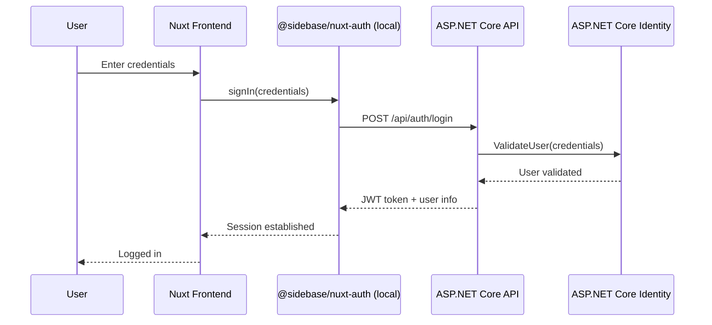

# Identity Design

This document provides detailed implementation guidance for the Identity system, following the architectural decisions made in [ADR 0008](./adr/0008-identity.md).

## Table of Contents

1. [Architecture Overview](#architecture-overview)
2. [Backend Implementation](#backend-implementation)
3. [Frontend Implementation](#frontend-implementation)
4. [Claims-Based Authorization](#claims-based-authorization)
5. [Advanced Patterns](#advanced-patterns)
6. [Security Considerations](#security-considerations)

## Architecture Overview

### High-Level Flow



### Key Integration Points

1. **Authentication**: `@sidebase/nuxt-auth` local provider calls your ASP.NET Core `/api/auth/login` endpoint
2. **Token Management**: Local provider automatically handles JWT token storage and inclusion in API calls
3. **Session Persistence**: Local provider manages token refresh and session management automatically
4. **Authorization**: ASP.NET Core Identity validates JWT tokens on protected endpoints
5. **User Data**: Both systems share the same user data through the API

### Benefits of This Approach

✅ **Stateless**: JWT tokens mean no server-side session storage needed  
✅ **Secure**: ASP.NET Core Identity handles password hashing, validation  
✅ **Familiar**: You use standard ASP.NET Core auth patterns you already know  
✅ **Flexible**: Easy to add external providers later (Google, Microsoft, etc.)  
✅ **Automated**: Local provider handles all token management automatically  
✅ **Standard REST**: Uses conventional REST endpoints for all auth operations  

## Backend Implementation

### 1. ASP.NET Core Identity Configuration

#### Program.cs Setup

````csharp
// filepath: c:\Source\jcoliz\YoFi.V3\src\BackEnd\Program.cs
// Add Identity services
builder.Services.AddIdentity<ApplicationUser, IdentityRole>()
    .AddEntityFrameworkStores<ApplicationDbContext>()
    .AddDefaultTokenProviders();

// Configure JWT Authentication
builder.Services.AddAuthentication(options =>
{
    options.DefaultAuthenticateScheme = JwtBearerDefaults.AuthenticationScheme;
    options.DefaultChallengeScheme = JwtBearerDefaults.AuthenticationScheme;
})
.AddJwtBearer(options =>
{
    options.TokenValidationParameters = new TokenValidationParameters
    {
        ValidateIssuer = true,
        ValidateAudience = true,
        ValidateLifetime = true,
        ValidateIssuerSigningKey = true,
        ValidIssuer = builder.Configuration["Jwt:Issuer"],
        ValidAudience = builder.Configuration["Jwt:Audience"],
        IssuerSigningKey = new SymmetricSecurityKey(
            Encoding.UTF8.GetBytes(builder.Configuration["Jwt:Key"]))
    };
});

// Add Authorization policies
builder.Services.AddAuthorization(options =>
{
    options.AddPolicy("AccountAccess", policy =>
        policy.RequireAssertion(context =>
        {
            var accountId = context.Resource as string;
            var accountAccessClaims = context.User.FindAll("account_access").Select(c => c.Value);
            return accountAccessClaims.Contains(accountId);
        }));
});
````

### 2. Authentication Controller

Create standard REST endpoints that the local provider expects:

````csharp
// filepath: c:\Source\jcoliz\YoFi.V3\src\BackEnd\Controllers\AuthController.cs
[ApiController]
[Route("api/auth")]
public class AuthController : ControllerBase
{
    private readonly SignInManager<ApplicationUser> _signInManager;
    private readonly UserManager<ApplicationUser> _userManager;
    private readonly IConfiguration _configuration;

    public AuthController(
        SignInManager<ApplicationUser> signInManager,
        UserManager<ApplicationUser> userManager,
        IConfiguration configuration)
    {
        _signInManager = signInManager;
        _userManager = userManager;
        _configuration = configuration;
    }

    [HttpPost("login")]
    public async Task<IActionResult> Login([FromBody] LoginRequest request)
    {
        var result = await _signInManager.PasswordSignInAsync(
            request.Email, 
            request.Password, 
            isPersistent: false, 
            lockoutOnFailure: false);

        if (result.Succeeded)
        {
            var user = await _userManager.FindByEmailAsync(request.Email);
            var token = await GenerateJwtToken(user);
            
            return Ok(new
            {
                token = token,
                user = new
                {
                    id = user.Id,
                    email = user.Email,
                    name = user.UserName
                }
            });
        }

        return Unauthorized(new { message = "Invalid email or password" });
    }

    [HttpGet("profile")]
    [Authorize]
    public async Task<IActionResult> GetProfile()
    {
        var userId = User.FindFirst(ClaimTypes.NameIdentifier)?.Value;
        var user = await _userManager.FindByIdAsync(userId);
        
        if (user == null)
        {
            return NotFound();
        }

        // Get claims from the JWT token
        var accountAccessClaims = User.FindAll("account_access").Select(c => c.Value).ToList();
        var accountRoles = User.Claims
            .Where(c => c.Type.StartsWith("account_role_"))
            .ToDictionary(
                c => c.Type.Replace("account_role_", ""),
                c => c.Value
            );

        return Ok(new
        {
            id = user.Id,
            email = user.Email,
            name = user.UserName,
            accountAccess = accountAccessClaims,
            accountRoles = accountRoles,
            userPreferences = User.FindFirst("user_preferences")?.Value
        });
    }

    [HttpPost("register")]
    public async Task<IActionResult> Register([FromBody] RegisterRequest request)
    {
        var user = new ApplicationUser
        {
            UserName = request.Email,
            Email = request.Email
        };

        var result = await _userManager.CreateAsync(user, request.Password);

        if (result.Succeeded)
        {
            var token = await GenerateJwtToken(user);
            
            return Ok(new
            {
                token = token,
                user = new
                {
                    id = user.Id,
                    email = user.Email,
                    name = user.UserName
                }
            });
        }

        return BadRequest(new { errors = result.Errors.Select(e => e.Description) });
    }

    [HttpPost("logout")]
    [Authorize]
    public async Task<IActionResult> Logout()
    {
        await _signInManager.SignOutAsync();
        return Ok(new { message = "Logged out successfully" });
    }

    private async Task<string> GenerateJwtToken(ApplicationUser user)
    {
        var tokenHandler = new JwtSecurityTokenHandler();
        var key = Encoding.ASCII.GetBytes(_configuration["Jwt:Key"]);
        
        // Get user's accessible accounts from database
        var userAccounts = await GetUserAccountAccess(user.Id);
        
        var claims = new List<Claim>
        {
            new Claim(ClaimTypes.NameIdentifier, user.Id),
            new Claim(ClaimTypes.Email, user.Email),
            new Claim(ClaimTypes.Name, user.UserName ?? user.Email),
            new Claim("sub", user.Id), // Standard JWT claim
            new Claim("email", user.Email),
            new Claim("name", user.UserName ?? user.Email)
        };
        
        // Add account access claims
        foreach (var account in userAccounts)
        {
            claims.Add(new Claim("account_access", account.AccountId));
            claims.Add(new Claim($"account_role_{account.AccountId}", account.Role)); // e.g., "owner", "viewer", "editor"
        }
        
        // Add any other custom claims
        claims.Add(new Claim("user_preferences", user.Preferences ?? "{}"));
        
        var tokenDescriptor = new SecurityTokenDescriptor
        {
            Subject = new ClaimsIdentity(claims),
            Expires = DateTime.UtcNow.AddHours(24),
            Issuer = _configuration["Jwt:Issuer"],
            Audience = _configuration["Jwt:Audience"],
            SigningCredentials = new SigningCredentials(
                new SymmetricSecurityKey(key), 
                SecurityAlgorithms.HmacSha256Signature)
        };
        
        var token = tokenHandler.CreateToken(tokenDescriptor);
        return tokenHandler.WriteToken(token);
    }

    private async Task<List<UserAccountAccess>> GetUserAccountAccess(string userId)
    {
        // This would query your database for user-to-account relationships
        return await _context.UserAccountAccess
            .Where(uaa => uaa.UserId == userId)
            .Select(uaa => new UserAccountAccess 
            { 
                AccountId = uaa.AccountId, 
                Role = uaa.Role 
            })
            .ToListAsync();
    }
}
````

### 3. Data Models

````csharp
// filepath: c:\Source\jcoliz\YoFi.V3\src\BackEnd\Entities\Models\Identity.cs
public class LoginRequest
{
    public string Email { get; set; }
    public string Password { get; set; }
}

public class RegisterRequest
{
    public string Email { get; set; }
    public string Password { get; set; }
    public string ConfirmPassword { get; set; }
}

public class UserAccountAccess
{
    public string AccountId { get; set; }
    public string Role { get; set; } // "owner", "editor", "viewer"
}

public class ApplicationUser : IdentityUser
{
    public string? Preferences { get; set; }
    public virtual ICollection<UserAccountAccess> AccountAccess { get; set; }
}
````

## Frontend Implementation

### 1. Nuxt Configuration

Configure `@sidebase/nuxt-auth` with the `local` provider:

````typescript
// filepath: c:\Source\jcoliz\YoFi.V3\src\FrontEnd.Nuxt\nuxt.config.ts
export default defineNuxtConfig({
  ssr: false, // SPA mode for static generation
  nitro: {
    preset: 'static'
  },
  
  modules: ['@sidebase/nuxt-auth'],
  
  auth: {
    providers: {
      local: {
        type: 'local',
        endpoints: {
          signIn: { path: '/login', method: 'post' },
          signOut: { path: '/logout', method: 'post' },
          signUp: { path: '/register', method: 'post' },
          getSession: { path: '/profile', method: 'get' }
        },
        pages: {
          login: '/login'
        },
        token: {
          signInResponseTokenPointer: '/token',
          type: 'Bearer',
          cookieName: 'auth.token',
          headerName: 'Authorization',
          headerType: 'Bearer',
          cookieMaxAge: 60 * 60 * 24 * 30 // 30 days
        },
        sessionDataType: { id: 'string', email: 'string', name: 'string' }
      }
    }
  },
  
  runtimeConfig: {
    public: {
      authBaseURL: process.env.NUXT_PUBLIC_API_BASE_URL || 'http://localhost:5000/api/auth'
    }
  }
})
````

### 2. Login Page

Simple login page using the local provider:

````vue
<!-- filepath: c:\Source\jcoliz\YoFi.V3\src\FrontEnd.Nuxt\pages\login.vue -->
<template>
  <div class="login-page">
    <form @submit.prevent="handleLogin" class="login-form">
      <h1>Sign In</h1>
      
      <div class="form-group">
        <label for="email">Email</label>
        <input
          id="email"
          v-model="form.email"
          type="email"
          required
          :disabled="pending"
        />
      </div>
      
      <div class="form-group">
        <label for="password">Password</label>
        <input
          id="password"
          v-model="form.password"
          type="password"
          required
          :disabled="pending"
        />
      </div>
      
      <button type="submit" :disabled="pending">
        {{ pending ? 'Signing in...' : 'Sign In' }}
      </button>
      
      <div v-if="error" class="error">
        {{ error }}
      </div>
    </form>
  </div>
</template>

<script setup lang="ts">
const { signIn } = useAuth()
const router = useRouter()

const form = reactive({
  email: '',
  password: ''
})

const pending = ref(false)
const error = ref('')

const handleLogin = async () => {
  pending.value = true
  error.value = ''
  
  try {
    const { error: signInError } = await signIn('local', {
      email: form.email,
      password: form.password,
      redirect: false
    })
    
    if (signInError) {
      error.value = 'Invalid email or password'
    } else {
      await router.push('/dashboard')
    }
  } catch (e) {
    error.value = 'An error occurred during sign in'
  } finally {
    pending.value = false
  }
}

definePageMeta({
  auth: false
})
</script>
````

### 3. Accessing User Session

The local provider automatically handles session management:

````typescript
// filepath: c:\Source\jcoliz\YoFi.V3\src\FrontEnd.Nuxt\composables\useUserSession.ts
export const useUserSession = () => {
  const { data: session, status } = useAuth()

  const user = computed(() => session.value?.user)
  const isLoggedIn = computed(() => status.value === 'authenticated')
  const isLoading = computed(() => status.value === 'loading')

  const userId = computed(() => user.value?.id)
  const userEmail = computed(() => user.value?.email)
  const userName = computed(() => user.value?.name)

  return {
    user,
    isLoggedIn,
    isLoading,
    userId,
    userEmail,
    userName
  }
}
````

### 4. Authenticated API Calls

The local provider automatically includes the Bearer token in requests:

````typescript
// filepath: c:\Source\jcoliz\YoFi.V3\src\FrontEnd.Nuxt\composables\useApi.ts
export const useApi = () => {
  const { $fetch } = useNuxtApp()
  const { getToken } = useAuth()

  return $fetch.create({
    baseURL: useRuntimeConfig().public.authBaseURL.replace('/api/auth', '/api'),
    async onRequest({ options }) {
      const token = await getToken()
      if (token) {
        options.headers = {
          ...options.headers,
          Authorization: `Bearer ${token}`
        }
      }
    }
  })
}

// Usage in components
// const api = useApi()
// const transactions = await api('/transactions')
````

## Claims-Based Authorization

### 1. Enhanced JWT with Claims

Since the local provider handles token management, you can focus on including the right claims:

````csharp
// filepath: c:\Source\jcoliz\YoFi.V3\src\BackEnd\Controllers\AuthController.cs
// In GenerateJwtToken method, add custom claims that will be available client-side
// through the session once the user profile is fetched
private async Task<string> GenerateJwtTokenWithClaims(ApplicationUser user)
{
    var tokenHandler = new JwtSecurityTokenHandler();
    var key = Encoding.ASCII.GetBytes(_configuration["Jwt:Key"]);
    
    // Get user's accessible accounts from database
    var userAccounts = await GetUserAccountAccess(user.Id);
    
    var claims = new List<Claim>
    {
        new Claim(ClaimTypes.NameIdentifier, user.Id),
        new Claim(ClaimTypes.Email, user.Email),
        new Claim(ClaimTypes.Name, user.UserName ?? user.Email),
        new Claim("sub", user.Id), // Standard JWT claim
        new Claim("email", user.Email),
        new Claim("name", user.UserName ?? user.Email)
    };
    
    // Add account access claims for authorization
    var userAccounts = await GetUserAccountAccess(user.Id);
    foreach (var account in userAccounts)
    {
        claims.Add(new Claim("account_access", account.AccountId));
        claims.Add(new Claim($"account_role_{account.AccountId}", account.Role));
    }
    
    // Add any other custom claims
    claims.Add(new Claim("user_preferences", user.Preferences ?? "{}"));
    
    var tokenDescriptor = new SecurityTokenDescriptor
    {
        Subject = new ClaimsIdentity(claims),
        Expires = DateTime.UtcNow.AddHours(24),
        Issuer = _configuration["Jwt:Issuer"],
        Audience = _configuration["Jwt:Audience"],
        SigningCredentials = new SigningCredentials(
            new SymmetricSecurityKey(key), 
            SecurityAlgorithms.HmacSha256Signature)
    };
    
    var token = tokenHandler.CreateToken(tokenDescriptor);
    return tokenHandler.WriteToken(token);
}
````

### 2. Profile Endpoint with Claims

Enhance the profile endpoint to return authorization data:

````csharp
// filepath: c:\Source\jcoliz\YoFi.V3\src\BackEnd\Controllers\AuthController.cs
[HttpGet("profile")]
[Authorize]
public async Task<IActionResult> GetProfile()
{
    var userId = User.FindFirst(ClaimTypes.NameIdentifier)?.Value;
    var user = await _userManager.FindByIdAsync(userId);
    
    if (user == null)
    {
        return NotFound();
    }

    // Get claims from the JWT token
    var accountAccessClaims = User.FindAll("account_access").Select(c => c.Value).ToList();
    var accountRoles = User.Claims
        .Where(c => c.Type.StartsWith("account_role_"))
        .ToDictionary(
            c => c.Type.Replace("account_role_", ""),
            c => c.Value
        );

    return Ok(new
    {
        id = user.Id,
        email = user.Email,
        name = user.UserName,
        accountAccess = accountAccessClaims,
        accountRoles = accountRoles,
        userPreferences = User.FindFirst("user_preferences")?.Value
    });
}
````

### 3. Frontend Claims Access

Create composables to work with the authorization data from the session:

````typescript
// filepath: c:\Source\jcoliz\YoFi.V3\src\FrontEnd.Nuxt\composables\useAccountAccess.ts
export const useAccountAccess = () => {
  const { data: session } = useAuth()

  const accountAccess = computed(() => session.value?.user?.accountAccess || [])
  const accountRoles = computed(() => session.value?.user?.accountRoles || {})
  const userPreferences = computed(() => {
    const prefs = session.value?.user?.userPreferences
    return prefs ? JSON.parse(prefs) : {}
  })

  const hasAccountAccess = (accountId: string): boolean => {
    return accountAccess.value.includes(accountId)
  }

  const getAccountRole = (accountId: string): string | null => {
    return accountRoles.value[accountId] || null
  }

  const canEditAccount = (accountId: string): boolean => {
    const role = getAccountRole(accountId)
    return role === 'owner' || role === 'editor'
  }

  const canViewAccount = (accountId: string): boolean => {
    return hasAccountAccess(accountId)
  }

  const isAccountOwner = (accountId: string): boolean => {
    return getAccountRole(accountId) === 'owner'
  }

  return {
    accountAccess,
    accountRoles,
    userPreferences,
    hasAccountAccess,
    getAccountRole,
    canEditAccount,
    canViewAccount,
    isAccountOwner
  }
}
````

### 4. Route Protection Middleware

Create middleware using the authorization composables:

````typescript
// filepath: c:\Source\jcoliz\YoFi.V3\src\FrontEnd.Nuxt\middleware\account-access.ts
export default defineNuxtRouteMiddleware((to) => {
  const { hasAccountAccess } = useAccountAccess()
  const accountId = to.params.id as string

  if (accountId && !hasAccountAccess(accountId)) {
    throw createError({
      statusCode: 403,
      statusMessage: `Access denied to account ${accountId}`
    })
  }
})
````

## Advanced Patterns

### 1. Token Refresh with Local Provider

The local provider handles token refresh automatically, but you can customize it:

````typescript
// filepath: c:\Source\jcoliz\YoFi.V3\src\FrontEnd.Nuxt\nuxt.config.ts
export default defineNuxtConfig({
  // ...existing config...
  
  auth: {
    providers: {
      local: {
        // ...existing config...
        refresh: {
          endpoint: {
            path: '/refresh',
            method: 'post'
          },
          token: {
            refreshTokenResponsePointer: '/token',
            maxAgeInSeconds: 60 * 60 * 24 * 30 // 30 days
          }
        }
      }
    }
  }
})
````

### 2. Permission Updates

Handle real-time permission changes by refreshing the session:

````typescript
// filepath: c:\Source\jcoliz\YoFi.V3\src\FrontEnd.Nuxt\composables\usePermissionUpdates.ts
export const usePermissionUpdates = () => {
  const { refresh } = useAuth()

  const handlePermissionChange = async () => {
    // Refresh the session to get updated claims
    await refresh()
    
    // Check if user still has access to current page
    const route = useRoute()
    const { hasAccountAccess } = useAccountAccess()
    
    if (route.params.id && !hasAccountAccess(route.params.id as string)) {
      await navigateTo('/accounts')
    }
  }

  return {
    handlePermissionChange
  }
}
````

## Security Considerations

### 1. Local Provider Benefits

- **Secure Token Storage**: Uses secure cookies automatically
- **CSRF Protection**: Built-in CSRF protection for auth operations
- **Token Refresh**: Handles token refresh transparently
- **Session Management**: Manages session state automatically

### 2. JWT Best Practices

- **Token Expiration**: Use reasonable expiration times (1-24 hours)
- **Claims Validation**: Always validate claims on the backend
- **Secure Configuration**: Keep JWT secrets secure and properly configured

### 3. Configuration Security

````typescript
// filepath: c:\Source\jcoliz\YoFi.V3\src\FrontEnd.Nuxt\.env.example
# Auth Configuration
NUXT_AUTH_SECRET=your-super-secret-auth-secret-here-minimum-32-chars
NUXT_PUBLIC_API_BASE_URL=http://localhost:5000/api/auth

# JWT Configuration (Backend)
JWT_KEY=your-jwt-signing-key-here-minimum-256-bits
JWT_ISSUER=YoFi.V3
JWT_AUDIENCE=YoFi.V3.Client
````

### 4. Key Benefits of Local Provider Approach

✅ **Automated Token Management**: No manual JWT handling required  
✅ **Standard REST Endpoints**: Uses conventional authentication API patterns  
✅ **Built-in Security**: CSRF protection, secure cookie storage  
✅ **Claims Integration**: Easy access to JWT claims through session data  
✅ **Future-Proof**: Easy migration to external providers later  
✅ **Performance**: Efficient token refresh and session management  

This implementation provides a secure, maintainable identity system using ASP.NET Core Identity with the @sidebase/nuxt-auth local provider, offering the benefits of both familiar backend patterns and modern frontend authentication management.
