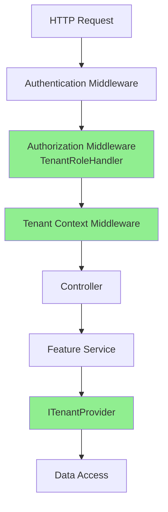

# Multi-Tenancy System

## Overview

YoFi.V3 implements a role-based multi-tenancy system where users can access multiple "workspaces" (tenants in implementation terms), each representing an isolated set of financial data. The implementation uses a lightweight pattern that provides complete data isolation while maintaining excellent performance.

### Design Goal: Microsoft Multi-Tenant Pattern Compliance

**Our goal is 100% compliance with Microsoft's official multi-tenancy architectural guidance**, specifically the [Multi-tenant SaaS database tenancy patterns](https://learn.microsoft.com/en-us/azure/architecture/guide/multitenant/considerations/tenancy-models) and [Multi-tenant application architecture](https://learn.microsoft.com/en-us/azure/architecture/guide/multitenant/overview) recommendations. Within the constraint of using the **Shared Database, Shared Schema** tenancy model, we follow Microsoft's best practices for security, authorization, and tenant isolation.

**Why Microsoft Patterns?**
- Industry-standard architectural guidance
- Battle-tested patterns for SaaS applications
- Clear security and scalability recommendations
- Well-documented best practices for multi-tenant systems

For detailed analysis of our compliance with Microsoft patterns, see [TENANCY-MICROSOFT-PATTERNS-ANALYSIS.md](wip/tenancy/TENANCY-MICROSOFT-PATTERNS-ANALYSIS.md).

**Key Features:**
- Complete tenant data isolation with single enforcement point
- Role-based access control (Viewer, Editor, Owner)
- Security-first design preventing tenant enumeration
- JWT claims-based authorization
- Middleware-driven tenant context management

### Microsoft Pattern Compliance

YoFi.V3 implements the following Microsoft-recommended patterns:

**Database Architecture:**
- ✅ **Shared Database, Shared Schema with Tenant Discriminator** - Microsoft's recommended approach for cost-effective SaaS applications with many small-to-medium tenants
- ✅ **Foreign Key Constraints** - Tenant relationship integrity enforced at database level
- ✅ **Indexed Discriminator Columns** - Performance-optimized queries with indexes on [`TenantId`](../src/Entities/Tenancy/ITenantModel.cs)

**Security & Authorization:**
- ✅ **Claims-Based Authorization** - JWT tokens with tenant role claims following Microsoft's OAuth/OIDC patterns
- ✅ **Tenant Enumeration Prevention** - Both "not found" and "no access" return 403 Forbidden (exceeds typical 404/403 patterns)
- ✅ **Row-Level Security** - Automatic tenant filtering at SQL level via discriminator pattern
- ✅ **Authentication/Authorization Separation** - Proper middleware pipeline ordering

**Architecture Patterns:**
- ✅ **Single Enforcement Point** - All queries filtered through [`GetBaseTransactionQuery()`](../src/Application/Features/TransactionsFeature.cs:151-157) pattern
- ✅ **Early Tenant Context Establishment** - Tenant validated during authorization, context set before business logic
- ✅ **Scoped Tenant Context** - [`ITenantProvider`](../src/Entities/Tenancy/ITenantProvider.cs) with request-scoped lifetime
- ✅ **Declarative Authorization** - [`[RequireTenantRole]`](../src/Controllers/Tenancy/RequireTenantRoleAttribute.cs) attributes on controllers

**Data Management:**
- ✅ **Cascade Delete** - Tenant deletion properly removes all associated data
- ✅ **Role Hierarchy** - Owner > Editor > Viewer permissions following RBAC best practices

For comprehensive analysis and comparison matrix, see [TENANCY-MICROSOFT-PATTERNS-ANALYSIS.md](wip/tenancy/TENANCY-MICROSOFT-PATTERNS-ANALYSIS.md).

## Architecture

### Core Components



**Pipeline Order:**
1. **Authentication** - Validates JWT token and establishes user identity
2. **Authorization** - [`TenantRoleHandler`](../src/Controllers/Tenancy/TenantRoleHandler.cs) verifies tenant access and role
3. **Tenant Context** - [`TenantContextMiddleware`](../src/Controllers/Tenancy/TenantContextMiddleware.cs) sets current tenant
4. **Controller/Feature** - Business logic executes with tenant context
5. **Data Access** - All queries automatically filtered by tenant

## Data Model

### Entities

**[`Tenant`](../src/Entities/Tenancy/Tenant.cs)** - Represents a workspace/organization
```csharp
public record Tenant
{
    public long Id { get; set; }              // Internal database key
    public Guid Key { get; set; }             // Public-facing identifier
    public string Name { get; set; }
    public string Description { get; set; }
    public DateTimeOffset CreatedAt { get; set; }
}
```

**[`UserTenantRoleAssignment`](../src/Entities/Tenancy/UserTenantRoleAssignment.cs)** - User-to-tenant relationships
```csharp
public record UserTenantRoleAssignment
{
    public long Id { get; set; }
    public string UserId { get; set; }        // Identity framework user ID
    public long TenantId { get; set; }
    public TenantRole Role { get; set; }      // Viewer, Editor, or Owner
}
```

**[`TenantRole`](../src/Entities/Tenancy/UserTenantRoleAssignment.cs:25-30)** - Hierarchical role levels
- **Viewer (1)** - Read-only access to tenant data
- **Editor (2)** - Can create, update, delete tenant data
- **Owner (3)** - Full control including user management

### Database Configuration

Key configuration in [`ApplicationDbContext.OnModelCreating`](../src/Data/Sqlite/ApplicationDbContext.cs:46-126):
- Unique constraint on (UserId, TenantId) - one role per user per tenant
- Foreign key relationships with cascade delete
- Indexes for tenant-scoped queries
- Enum to string conversion for roles

### Tenant-Scoped Entities

Application entities implement [`ITenantModel`](../src/Entities/Tenancy/ITenantModel.cs) to indicate tenant ownership:

```csharp
public interface ITenantModel
{
    long TenantId { get; set; }
}

// Example usage
public record Transaction : BaseTenantModel, ITenantModel
{
    public long TenantId { get; set; }  // From ITenantModel
    // ... other properties
}
```

## Authorization System

### Claims-Based Access

**Claim Format:** `tenant_role: "{tenantKey}:{role}"`

Example claims for a user:
```json
[
  { "type": "tenant_role", "value": "abc-123-def:Owner" },
  { "type": "tenant_role", "value": "xyz-789-ghi:Viewer" }
]
```

**Implementation:** [`TenantUserClaimsService`](../src/Controllers/Tenancy/TenantUserClaimsService.cs) implements `IUserClaimsProvider<TUser>` from NuxtIdentity, automatically adding tenant role claims to JWTs and user data.

### Authorization Policies

**Controller Decoration:**
```csharp
[Route("api/tenant/{tenantKey:guid}/[controller]")]
[ApiController]
public class TransactionsController : ControllerBase
{
    [HttpGet]
    [RequireTenantRole(TenantRole.Viewer)]  // Read requires Viewer or higher
    public async Task<IActionResult> GetTransactions() { }

    [HttpPost]
    [RequireTenantRole(TenantRole.Editor)]  // Write requires Editor or higher
    public async Task<IActionResult> CreateTransaction() { }
}
```

**How It Works:**
1. [`RequireTenantRoleAttribute`](../src/Controllers/Tenancy/RequireTenantRoleAttribute.cs) sets authorization policy
2. [`TenantRoleHandler`](../src/Controllers/Tenancy/TenantRoleHandler.cs) validates:
   - Extracts `tenantKey` from route parameter
   - Checks if user has matching `tenant_role` claim
   - Verifies role meets minimum requirement
   - Sets `TenantKey` and `TenantRole` in `HttpContext.Items`
3. Authorization succeeds or fails before controller method executes

**Registration:** [`ServiceCollectionExtensions.AddTenancy()`](../src/Controllers/Tenancy/ServiceCollectionExtensions.cs:15-39) registers policies for all role levels.

## Tenant Context Management

### Middleware Flow

[`TenantContextMiddleware`](../src/Controllers/Tenancy/TenantContextMiddleware.cs) runs after authorization:

1. **Checks route** - Does route contain `tenantKey` parameter?
2. **Extracts tenant** - Gets `TenantKey` from `HttpContext.Items` (set by authorization)
3. **Sets context** - Calls [`TenantContext.SetCurrentTenantAsync()`](../src/Controllers/Tenancy/TenantContext.cs:27-38)
4. **Validates** - Returns 401 if tenant route expected but context not set

**Result:** Downstream code can access current tenant via [`ITenantProvider.CurrentTenant`](../src/Entities/Tenancy/ITenantProvider.cs).

### Tenant Isolation Pattern

**Single Enforcement Point** in feature services:

```csharp
// From TransactionsFeature.cs
private IQueryable<Transaction> GetBaseTransactionQuery()
{
    return dataProvider.Get<Transaction>()
        .Where(t => t.TenantId == _currentTenant.Id)  // Tenant filter
        .OrderByDescending(t => t.Date)
        .ThenByDescending(t => t.Id);
}
```

**All operations use this base query:**
- Read: `GetTransactionsAsync()` calls `GetBaseTransactionQuery()`
- Update/Delete: `GetTransactionByKeyInternalAsync()` calls `GetBaseTransactionQuery()`
- Create: Explicitly sets `TenantId = _currentTenant.Id`

**Security Guarantee:** Impossible to bypass tenant filtering without deliberately avoiding `GetBaseTransactionQuery()`. All queries are automatically filtered at the SQL level.

**Implementation:** See [`TransactionsFeature`](../src/Application/Features/TransactionsFeature.cs:151-157) for reference pattern.

## Repository Layer

[`ITenantRepository`](../src/Entities/Tenancy/ITenantRepository.cs) provides tenant-specific data operations:

```csharp
public interface ITenantRepository
{
    Task<List<UserTenantRoleAssignment>> GetUserTenantRolesAsync(string userId);
    Task<UserTenantRoleAssignment?> GetUserTenantRoleAsync(string userId, long tenantId);
    Task AddUserTenantRoleAsync(UserTenantRoleAssignment assignment);
    Task RemoveUserTenantRoleAsync(UserTenantRoleAssignment assignment);
    Task<Tenant?> GetTenantAsync(long tenantId);
    Task<Tenant?> GetTenantByKeyAsync(Guid tenantKey);
    // ... additional methods
}
```

**Implementation:** [`ApplicationDbContext`](../src/Data/Sqlite/ApplicationDbContext.cs:170-222) implements the interface with proper exception handling.

## Exception Handling

### Tenancy-Specific Exceptions

Base exception: [`TenancyException`](../src/Entities/Tenancy/Exceptions/TenancyException.cs)

**Concrete Exceptions:**
- [`TenantNotFoundException`](../src/Entities/Tenancy/Exceptions/TenantNotFoundException.cs) → 403 Forbidden
- [`TenantAccessDeniedException`](../src/Entities/Tenancy/Exceptions/TenantAccessDeniedException.cs) → 403 Forbidden
- [`UserTenantRoleNotFoundException`](../src/Entities/Tenancy/Exceptions/UserTenantRoleNotFoundException.cs) → 404 Not Found
- [`DuplicateUserTenantRoleException`](../src/Entities/Tenancy/Exceptions/DuplicateUserTenantRoleException.cs) → 409 Conflict
- [`TenantContextNotSetException`](../src/Entities/Tenancy/Exceptions/TenantContextNotSetException.cs) → 500 Internal Server Error

### Security-First Error Strategy

**Both tenant not found AND access denied return 403 Forbidden:**

```csharp
// Tenant doesn't exist
throw new TenantNotFoundException(tenantKey);  // → 403

// Tenant exists but user lacks access
throw new TenantAccessDeniedException(userId, tenantKey);  // → 403
```

**Rationale:** Returning 403 for both cases prevents tenant enumeration attacks. An attacker cannot determine which tenant IDs exist by observing different status codes.

**Handler:** [`TenancyExceptionHandler`](../src/Controllers/Tenancy/Exceptions/TenancyExceptionHandler.cs) maps exceptions to appropriate HTTP responses with ProblemDetails.

## Tenant Management API

[`TenantController`](../src/Controllers/Tenancy/TenantController.cs) provides tenant CRUD operations:

**Available Endpoints:**
- `GET /api/user/tenants` - List all tenants for current user
- `GET /api/tenant/{tenantKey}` - Get specific tenant details
- `POST /api/user/tenants` - Create new tenant (user becomes owner)
- `PUT /api/tenant/{tenantKey}` - Update tenant details
- `DELETE /api/tenant/{tenantKey}` - Delete tenant

**Implementation:** [`TenantFeature`](../src/Controllers/Tenancy/TenantFeature.cs) provides the business logic.

## Testing

### Integration Test Coverage

**Security Tests** in [`TenantContextMiddlewareTests`](../tests/Integration.Controller/TenantContextMiddlewareTests.cs):
- Cross-tenant isolation verification
- Unauthorized cross-tenant access attempts
- Role-based authorization checks

**Critical Test:** `GetTransactionById_TransactionExistsInDifferentTenant_Returns404`
- User authenticated for Tenant 1
- Attempts to access Tenant 2's transaction via Tenant 1's route
- **Result:** 404 (hides existence from unauthorized users)
- **Validates:** Cannot bypass tenant isolation by knowing transaction IDs

**Transaction Tests** in [`TransactionsControllerTests`](../tests/Integration.Controller/TransactionsControllerTests.cs):
- All CRUD operations with proper tenant context
- Role-based access control for Viewer/Editor/Owner
- Error handling for invalid tenant IDs

### Test Pattern

Tests use Gherkin-style comments (Given/When/Then) as per project standards:

```csharp
[Test]
public async Task GetTransactions_MultipleTenantsInDatabase_ReturnsOnlyRequestedTenantTransactions()
{
    // Given: Two tenants with different transactions exist

    // And: User has access to both tenants

    // When: API Client requests transactions for Tenant 1

    // Then: Only Tenant 1's transactions are returned

    // And: Tenant 2's transactions are not included
}
```

## Implementation Benefits

### Superior to Original Design

The implemented pattern is simpler and more maintainable than the originally proposed `TenantDataProvider` wrapper:

1. **Single Enforcement Point** - `GetBaseTransactionQuery()` pattern
2. **No Wrapper Overhead** - Direct EF Core queries
3. **Clear Intent** - Obvious where tenant filtering occurs
4. **Easy to Test** - Simple to mock `ITenantProvider`
5. **Less Code** - Fewer abstractions = fewer bugs

### Performance

- Direct EF Core queries (no wrapper overhead)
- Tenant filter applied at SQL level
- Proper indexes on tenant-scoped queries
- No N+1 query issues

### Security

- Authorization enforced at middleware level before controllers
- Tenant filtering at data access level (single point)
- 403 responses prevent tenant enumeration
- Comprehensive integration test coverage

## Usage Examples

### Feature Service Pattern

```csharp
public class TransactionsFeature(ITenantProvider tenantProvider, IDataProvider dataProvider)
{
    private readonly Tenant _currentTenant = tenantProvider.CurrentTenant;

    // All queries filtered by tenant
    private IQueryable<Transaction> GetBaseTransactionQuery()
    {
        return dataProvider.Get<Transaction>()
            .Where(t => t.TenantId == _currentTenant.Id)
            .OrderByDescending(t => t.Date);
    }

    // Create operations explicitly set tenant
    public async Task<TransactionResultDto> AddTransactionAsync(TransactionEditDto dto)
    {
        var transaction = new Transaction
        {
            TenantId = _currentTenant.Id,  // Explicit tenant assignment
            // ... other properties
        };
        dataProvider.Add(transaction);
        await dataProvider.SaveChangesAsync();

        return MapToDto(transaction);
    }
}
```

### Controller Pattern

```csharp
[Route("api/tenant/{tenantKey:guid}/[controller]")]
[ApiController]
public class MyController(MyFeature feature) : ControllerBase
{
    [HttpGet]
    [RequireTenantRole(TenantRole.Viewer)]
    public async Task<IActionResult> GetItems()
    {
        var items = await feature.GetItemsAsync();
        return Ok(items);
    }

    [HttpPost]
    [RequireTenantRole(TenantRole.Editor)]
    public async Task<IActionResult> CreateItem([FromBody] ItemDto dto)
    {
        var result = await feature.CreateItemAsync(dto);
        return Created($"/api/tenant/{RouteData.Values["tenantKey"]}/items/{result.Key}", result);
    }
}
```

## Configuration

### Service Registration

In [`Program.cs`](../src/BackEnd/Program.cs):

```csharp
// Add tenancy services (authorization policies, middleware, etc.)
builder.Services.AddTenancy();

// Register tenant repository
builder.Services.AddScoped<ITenantRepository, ApplicationDbContext>();

// Register tenant context
builder.Services.AddScoped<TenantContext>();
builder.Services.AddScoped<ITenantProvider>(sp => sp.GetRequiredService<TenantContext>());

// Add tenant claims provider
builder.Services.AddSingleton<IUserClaimsProvider<IdentityUser>, TenantUserClaimsService<IdentityUser>>();
```

### Middleware Pipeline

Critical ordering in [`Program.cs`](../src/BackEnd/Program.cs):

```csharp
app.UseAuthentication();     // 1. Authenticate user
app.UseAuthorization();      // 2. Run TenantRoleHandler (sets Items["TenantKey"])
app.UseTenancy();            // 3. Set tenant context from Items["TenantKey"]
app.MapControllers();        // 4. Route to controllers
```

## Key Files Reference

**Core Infrastructure:**
- [`Tenant.cs`](../src/Entities/Tenancy/Tenant.cs) - Tenant entity
- [`UserTenantRoleAssignment.cs`](../src/Entities/Tenancy/UserTenantRoleAssignment.cs) - Role assignments
- [`ITenantProvider.cs`](../src/Entities/Tenancy/ITenantProvider.cs) - Current tenant access
- [`ITenantRepository.cs`](../src/Entities/Tenancy/ITenantRepository.cs) - Data operations

**Authorization:**
- [`TenantRoleHandler.cs`](../src/Controllers/Tenancy/TenantRoleHandler.cs) - Authorization logic
- [`RequireTenantRoleAttribute.cs`](../src/Controllers/Tenancy/RequireTenantRoleAttribute.cs) - Controller decoration
- [`TenantUserClaimsService.cs`](../src/Controllers/Tenancy/TenantUserClaimsService.cs) - Claims generation

**Context Management:**
- [`TenantContext.cs`](../src/Controllers/Tenancy/TenantContext.cs) - Current tenant state
- [`TenantContextMiddleware.cs`](../src/Controllers/Tenancy/TenantContextMiddleware.cs) - Context setup

**Business Logic:**
- [`TenantFeature.cs`](../src/Controllers/Tenancy/TenantFeature.cs) - Tenant management
- [`TenantController.cs`](../src/Controllers/Tenancy/TenantController.cs) - API endpoints

**Exception Handling:**
- [`TenancyException.cs`](../src/Entities/Tenancy/Exceptions/TenancyException.cs) - Base exception
- [`TenancyExceptionHandler.cs`](../src/Controllers/Tenancy/Exceptions/TenancyExceptionHandler.cs) - HTTP mapping

**Tests:**
- [`TenantContextMiddlewareTests.cs`](../tests/Integration.Controller/TenantContextMiddlewareTests.cs) - Security tests
- [`TenantControllerTests.cs`](../tests/Integration.Controller/TenantControllerTests.cs) - API tests

## See Also

- [ADR 0009: Multi-tenancy and Workspace Model](adr/0009-accounts-and-tenancy.md) - Architectural decision record
- [TODO: Remaining Tenancy Work](wip/TENANCY-TODO.md) - Outstanding implementation tasks
