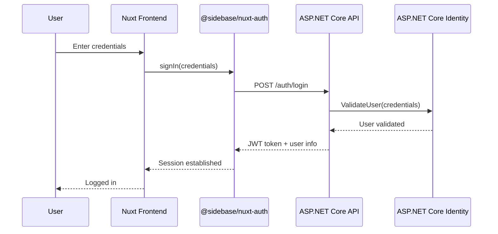

# 0008. Identity system

Date: 2025-11-13

## Status

Draft

## Context

### Question

What software components and/or possible identity providers should we use for identity authentication and authorization?

In the past, I have rolled my own custom system. While I am happy with this, I've also received feedback that this is an unsafe practice, and should attempt to use as many off-the-shelf components as possible which have more security reviewers looking at them.

Some questions that come to mind:

* For the front-end, should I use NuxtAuth? This was recommended.
* ASP.NET includes some identity components. Can I leverage those? I know them well. Can I combine them with NuxtAuth??
* Should I use an external identity providers?
* How do I handle authorization? Certain users will have access to certain accounts, and this is information that is unique to the app, so I'll have to store it here.
* Are there any examples of good existing systems that combine Nuxt frontend with ASP.NET backend for identity?

### Analysis

Based on the existing architecture (Nuxt 4 + ASP.NET Core + direct API calls), this is a well-structured ADR that correctly identifies the key architectural questions around authentication and authorization.

## Decision

### Hybrid Approach with ASP.NET Core Identity + @sidebase/nuxt-auth

Given the technology stack and requirements, implement:

#### Frontend (Nuxt 4)
- **Use [@sidebase/nuxt-auth](https://auth.sidebase.com/)** - The modern successor to NuxtAuth for Nuxt 3/4
- Configure it to work with the ASP.NET Core backend as a custom provider

#### Backend (ASP.NET Core)
- **Use ASP.NET Core Identity** with JWT tokens for stateless authentication
- This gives battle-tested auth components while maintaining the direct API call architecture

#### Identity Provider
- **Start with built-in authentication** (username/password stored in SQLite database)
- **Future-proof for external providers** (Microsoft Entra ID, Google, etc.) using ASP.NET Core Identity's external login providers

### Detailed Implementation Plan

#### Backend: Configure ASP.NET Core Identity with JWT

```csharp
// In Program.cs
builder.Services.AddIdentity<ApplicationUser, IdentityRole>()
    .AddEntityFrameworkStores<ApplicationDbContext>()
    .AddDefaultTokenProviders();

builder.Services.AddAuthentication(options =>
{
    options.DefaultAuthenticateScheme = JwtBearerDefaults.AuthenticationScheme;
    options.DefaultChallengeScheme = JwtBearerDefaults.AuthenticationScheme;
})
.AddJwtBearer(options =>
{
    options.TokenValidationParameters = new TokenValidationParameters
    {
        ValidateIssuer = true,
        ValidateAudience = true,
        ValidateLifetime = true,
        ValidateIssuerSigningKey = true,
        ValidIssuer = builder.Configuration["Jwt:Issuer"],
        ValidAudience = builder.Configuration["Jwt:Audience"],
        IssuerSigningKey = new SymmetricSecurityKey(
            Encoding.UTF8.GetBytes(builder.Configuration["Jwt:Key"]))
    };
});
```

#### Frontend: Configure @sidebase/nuxt-auth

```typescript
// nuxt.config.ts
export default defineNuxtConfig({
  modules: ['@sidebase/nuxt-auth'],
  auth: {
    baseURL: process.env.NUXT_PUBLIC_API_BASE_URL,
    provider: {
      type: 'authjs'
    }
  }
})
```

### Addressing Specific Questions

1. **NuxtAuth?** → Use **@sidebase/nuxt-auth** instead (modern, actively maintained for Nuxt 3/4)

2. **ASP.NET Identity?** → **Yes, absolutely**. It's mature, well-tested, and integrates perfectly with your stack

3. **External providers?** → **Later**. Start with built-in, add external providers when needed using ASP.NET Core's external login system

4. **Authorization?** → Use **ASP.NET Core's policy-based authorization** with custom claims for account access. Store user-to-account mappings in your database

5. **Examples?** → The combination is common. Key is using JWT tokens as the bridge between frontend and backend auth

### Why This Approach Works Well

✅ **Security**: ASP.NET Core Identity is battle-tested with regular security updates  
✅ **Familiar**: You already know ASP.NET Core Identity well  
✅ **Stateless**: JWT tokens work perfectly with your direct API call architecture  
✅ **Extensible**: Easy to add external providers later  
✅ **Single Database**: User data stays in your SQLite database with your business data  
✅ **Authorization Ready**: Built-in support for roles and custom claims for account-level permissions  

### Authorization Strategy

For your specific requirement of users having access to specific accounts:

```csharp
// Custom authorization policy
builder.Services.AddAuthorization(options =>
{
    options.AddPolicy("AccountAccess", policy =>
        policy.RequireAssertion(context =>
        {
            var accountId = context.Resource as string; // Account ID from route
            var userId = context.User.FindFirst(ClaimTypes.NameIdentifier)?.Value;
            // Check database for user-account relationship
            return CheckUserAccountAccess(userId, accountId);
        }));
});

// In your controllers
[Authorize(Policy = "AccountAccess")]
[HttpGet("accounts/{accountId}/transactions")]
public async Task<IActionResult> GetTransactions(string accountId) { ... }
```

## Implementation Details

### How @sidebase/nuxt-auth Interacts with ASP.NET Core Identity

The interaction happens through **JWT tokens** as the bridge between the frontend and backend:

#### Authentication Flow



#### Backend API Configuration

Create authentication endpoints that `@sidebase/nuxt-auth` can call:

```csharp
// Controllers/AuthController.cs
[ApiController]
[Route("api/[controller]")]
public class AuthController : ControllerBase
{
    private readonly SignInManager<ApplicationUser> _signInManager;
    private readonly UserManager<ApplicationUser> _userManager;
    private readonly IConfiguration _configuration;

    [HttpPost("login")]
    public async Task<IActionResult> Login([FromBody] LoginRequest request)
    {
        var result = await _signInManager.PasswordSignInAsync(
            request.Email, 
            request.Password, 
            isPersistent: false, 
            lockoutOnFailure: false);

        if (result.Succeeded)
        {
            var user = await _userManager.FindByEmailAsync(request.Email);
            var token = GenerateJwtToken(user);
            
            return Ok(new
            {
                token = token,
                user = new
                {
                    id = user.Id,
                    email = user.Email,
                    name = user.UserName
                }
            });
        }

        return Unauthorized();
    }

    [HttpGet("user")]
    [Authorize]
    public async Task<IActionResult> GetCurrentUser()
    {
        var userId = User.FindFirst(ClaimTypes.NameIdentifier)?.Value;
        var user = await _userManager.FindByIdAsync(userId);
        
        return Ok(new
        {
            id = user.Id,
            email = user.Email,
            name = user.UserName
        });
    }

    private string GenerateJwtToken(ApplicationUser user)
    {
        var tokenHandler = new JwtSecurityTokenHandler();
        var key = Encoding.ASCII.GetBytes(_configuration["Jwt:Key"]);
        var tokenDescriptor = new SecurityTokenDescriptor
        {
            Subject = new ClaimsIdentity(new[]
            {
                new Claim(ClaimTypes.NameIdentifier, user.Id),
                new Claim(ClaimTypes.Email, user.Email)
            }),
            Expires = DateTime.UtcNow.AddHours(24),
            SigningCredentials = new SigningCredentials(
                new SymmetricSecurityKey(key), 
                SecurityAlgorithms.HmacSha256Signature)
        };
        var token = tokenHandler.CreateToken(tokenDescriptor);
        return tokenHandler.WriteToken(token);
    }
}
```

#### Frontend Configuration

Configure `@sidebase/nuxt-auth` to use your custom ASP.NET Core endpoints:

```typescript
// nuxt.config.ts
export default defineNuxtConfig({
  modules: ['@sidebase/nuxt-auth'],
  auth: {
    baseURL: process.env.NUXT_PUBLIC_API_BASE_URL,
    provider: {
      type: 'authjs',
      trustHost: true,
      defaultProvider: 'credentials'
    },
    session: {
      enableRefreshPeriodically: true,
      enableRefreshOnWindowFocus: true,
    }
  },
  runtimeConfig: {
    public: {
      authJs: {
        baseUrl: process.env.NUXT_PUBLIC_API_BASE_URL
      }
    }
  }
})
```

```typescript
// server/api/auth/[...].ts
import CredentialsProvider from '@auth/core/providers/credentials'
import { NuxtAuthHandler } from '#auth'

export default NuxtAuthHandler({
  secret: useRuntimeConfig().authSecret,
  providers: [
    CredentialsProvider({
      name: 'credentials',
      credentials: {
        email: { label: 'Email', type: 'email' },
        password: { label: 'Password', type: 'password' }
      },
      async authorize(credentials) {
        try {
          const response = await $fetch(`${process.env.NUXT_PUBLIC_API_BASE_URL}/api/auth/login`, {
            method: 'POST',
            headers: { 'Content-Type': 'application/json' },
            body: JSON.stringify({
              email: credentials.email,
              password: credentials.password
            })
          })

          if (response.token) {
            return {
              id: response.user.id,
              email: response.user.email,
              name: response.user.name,
              accessToken: response.token
            }
          }
          return null
        } catch (error) {
          console.error('Auth error:', error)
          return null
        }
      }
    })
  ],
  callbacks: {
    async jwt({ token, user }) {
      if (user) {
        token.accessToken = user.accessToken
      }
      return token
    },
    async session({ session, token }) {
      session.accessToken = token.accessToken
      return session
    }
  }
})
```

#### Making Authenticated API Calls

Once authenticated, use the JWT token for subsequent API calls:

```typescript
// composables/useAuthenticatedFetch.ts
export const useAuthenticatedFetch = () => {
  const { data: session } = useAuth()
  
  return $fetch.create({
    onRequest({ request, options }) {
      if (session.value?.accessToken) {
        options.headers = {
          ...options.headers,
          Authorization: `Bearer ${session.value.accessToken}`
        }
      }
    }
  })
}

// Usage in components
const authFetch = useAuthenticatedFetch()
const transactions = await authFetch('/api/transactions')
```

### Key Integration Points

1. **Authentication**: `@sidebase/nuxt-auth` calls your ASP.NET Core `/api/auth/login` endpoint
2. **Token Management**: Frontend stores JWT token, includes it in API calls
3. **Session Persistence**: Nuxt auth handles token refresh and session management
4. **Authorization**: ASP.NET Core Identity validates JWT tokens on protected endpoints
5. **User Data**: Both systems share the same user data through the API

### Benefits of This Approach

✅ **Stateless**: JWT tokens mean no server-side session storage needed  
✅ **Secure**: ASP.NET Core Identity handles password hashing, validation  
✅ **Familiar**: You use standard ASP.NET Core auth patterns you already know  
✅ **Flexible**: Easy to add external providers later (Google, Microsoft, etc.)  
✅ **Frontend Friendly**: Nuxt auth handles token storage, refresh, route protection  

This architecture gives you the best of both worlds: robust, battle-tested authentication from ASP.NET Core Identity with modern, developer-friendly session management from `@sidebase/nuxt-auth`.

### Endpoint Configuration Flexibility

`@sidebase/nuxt-auth` does not hard-code endpoints. It's quite flexible in how you configure authentication endpoints:

#### Custom Provider Endpoints

When using a custom provider (like your ASP.NET Core backend), you define the endpoints yourself:

```typescript
// server/api/auth/[...].ts
import CredentialsProvider from '@auth/core/providers/credentials'

export default NuxtAuthHandler({
  providers: [
    CredentialsProvider({
      async authorize(credentials) {
        // YOU control this URL - not hard-coded
        const response = await $fetch(`${process.env.NUXT_PUBLIC_API_BASE_URL}/api/auth/login`, {
          method: 'POST',
          // ... your custom implementation
        })
        return response
      }
    })
  ]
})
```

#### Configuration Options

The endpoints are configured through:

1. **Environment Variables**: `NUXT_PUBLIC_API_BASE_URL`, `AUTH_SECRET`, etc.
2. **Runtime Config**: Nuxt's `runtimeConfig` for dynamic configuration
3. **Provider Configuration**: Each provider can have custom endpoint URLs

For your ASP.NET Core setup, the endpoints would be:

```typescript
// Completely configurable - not hard-coded
const API_BASE = process.env.NUXT_PUBLIC_API_BASE_URL // e.g., "https://api.yourdomain.com"

// Your custom endpoints
const loginEndpoint = `${API_BASE}/api/auth/login`
const userEndpoint = `${API_BASE}/api/auth/user`
const logoutEndpoint = `${API_BASE}/api/auth/logout`
```

#### Key Benefits

✅ **Environment-specific**: Different URLs for dev/staging/prod  
✅ **Runtime configurable**: Can change without rebuilding  
✅ **Custom endpoints**: Use any URL structure you want  
✅ **Multiple backends**: Can authenticate against different services  

So you have complete control over where `@sidebase/nuxt-auth` makes its authentication calls - nothing is hard-coded!

## Consequences

### What becomes easier:

- **Security**: ASP.NET Core Identity is battle-tested with regular security updates
- **Familiarity**: Leverages existing ASP.NET Core Identity knowledge
- **Stateless Architecture**: JWT tokens work perfectly with direct API call architecture
- **Extensibility**: Easy to add external providers later
- **Single Database**: User data stays in SQLite database with business data
- **Authorization**: Built-in support for roles and custom claims for account-level permissions

### What becomes more complex:

- **Initial Setup**: Requires configuration of both frontend and backend auth systems
- **Token Management**: Need to handle JWT token lifecycle and refresh
- **Custom Claims**: Account-level authorization requires custom implementation
- **Testing**: Authentication flows need to be tested across both frontend and backend

### Future Considerations:

- External identity providers can be added incrementally
- Session management handled by @sidebase/nuxt-auth
- Authorization policies can be extended for more granular permissions