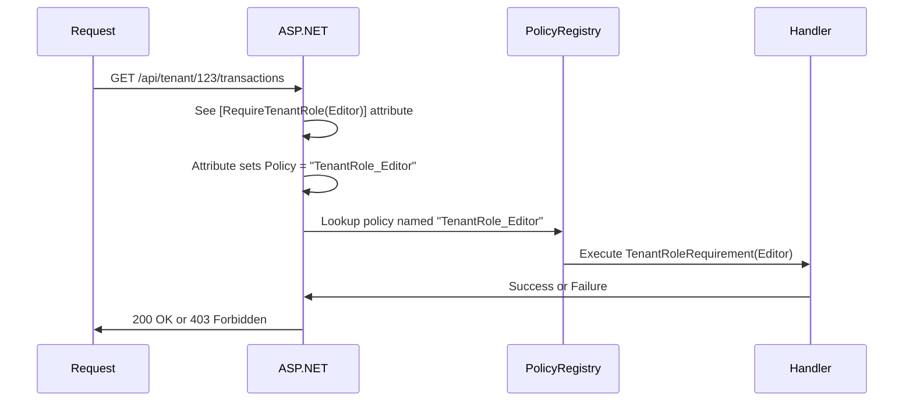

# How ASP.NET Authorization Policies Work

## Yes, You're Exactly Right!

The attribute simply sets a **policy name string**. That policy name must be **independently registered** in the DI container. It's a two-step process:


## Step-by-Step Example

### Step 1: Register Policies (Startup/Program.cs)

```csharp
builder.Services.AddAuthorization(options =>
{
    // Register a policy with the NAME "TenantRole_Editor"
    options.AddPolicy("TenantRole_Editor", policy =>
        policy.Requirements.Add(new TenantRoleRequirement(TenantRole.Editor)));

    // Register a policy with the NAME "TenantRole_Viewer"
    options.AddPolicy("TenantRole_Viewer", policy =>
        policy.Requirements.Add(new TenantRoleRequirement(TenantRole.Viewer)));
});
```

This creates a **dictionary** of policy names → policy definitions:
```
{
    "TenantRole_Editor": <policy requiring Editor role>,
    "TenantRole_Viewer": <policy requiring Viewer role>
}
```

### Step 2: Use Policy Names in Controllers

```csharp
// Option A: Use AuthorizeAttribute directly with policy name
[Authorize(Policy = "TenantRole_Editor")]  // ← String must match registered name
public async Task<IActionResult> GetTransactions() { }

// Option B: Create custom attribute that sets the policy name
public class RequireTenantRoleAttribute : AuthorizeAttribute
{
    public RequireTenantRoleAttribute(TenantRole minimumRole)
    {
        // Set the Policy property to match registered policy name
        Policy = $"TenantRole_{minimumRole}";  // ← Creates "TenantRole_Editor"
    }
}

[RequireTenantRole(TenantRole.Editor)]  // ← Internally sets Policy = "TenantRole_Editor"
public async Task<IActionResult> GetTransactions() { }
```

### Step 3: ASP.NET Matches by Name

When a request comes in:



## The Confusing Part

**The custom attribute is just syntactic sugar!**

```csharp
// These two are EXACTLY THE SAME:

[Authorize(Policy = "TenantRole_Editor")]
public async Task<IActionResult> GetTransactions() { }

[RequireTenantRole(TenantRole.Editor)]  // Internally does: Policy = "TenantRole_Editor"
public async Task<IActionResult> GetTransactions() { }
```

## Why This Two-Step Process?

**Separation of concerns:**
1. **Registration** (Program.cs): Define what policies exist and their logic
2. **Usage** (Controllers): Reference policies by name

**Benefits:**
- Policies can be tested independently
- Same policy can be reused across multiple controllers
- Policy logic is centralized
- Can change policy requirements without touching controllers

## Complete Working Example

```csharp
// ==================== STEP 1: Define Requirements & Handlers ====================

public enum TenantRole { Viewer = 1, Editor = 2, Owner = 3 }

public class TenantRoleRequirement : IAuthorizationRequirement
{
    public TenantRole MinimumRole { get; }
    public TenantRoleRequirement(TenantRole minimumRole) => MinimumRole = minimumRole;
}

public class TenantRoleHandler : AuthorizationHandler<TenantRoleRequirement>
{
    private readonly IHttpContextAccessor _httpContextAccessor;

    public TenantRoleHandler(IHttpContextAccessor httpContextAccessor)
    {
        _httpContextAccessor = httpContextAccessor;
    }

    protected override Task HandleRequirementAsync(
        AuthorizationHandlerContext context,
        TenantRoleRequirement requirement)
    {
        // Extract tenant ID from route
        var tenantId = _httpContextAccessor.HttpContext?
            .Request.RouteValues["tenantId"]?.ToString();

        if (string.IsNullOrEmpty(tenantId))
            return Task.CompletedTask; // Fail

        // Check user's claims for this tenant's role
        var claim = context.User.FindFirst(c =>
            c.Type == "tenant_role" &&
            c.Value.StartsWith($"{tenantId}:"));

        if (claim != null)
        {
            var parts = claim.Value.Split(':');
            if (parts.Length == 2 &&
                Enum.TryParse<TenantRole>(parts[1], out var userRole) &&
                userRole >= requirement.MinimumRole)
            {
                context.Succeed(requirement);
            }
        }

        return Task.CompletedTask;
    }
}

// ==================== STEP 2: Create Custom Attribute ====================

public class RequireTenantRoleAttribute : AuthorizeAttribute
{
    public RequireTenantRoleAttribute(TenantRole minimumRole)
    {
        // THIS IS THE KEY LINE - Sets the policy name string
        Policy = $"TenantRole_{minimumRole}";
    }
}

// ==================== STEP 3: Register Policies ====================

// In Program.cs
builder.Services.AddHttpContextAccessor();
builder.Services.AddSingleton<IAuthorizationHandler, TenantRoleHandler>();

builder.Services.AddAuthorization(options =>
{
    // Register each policy NAME that the attribute might create
    foreach (TenantRole role in Enum.GetValues<TenantRole>())
    {
        // This creates: "TenantRole_Viewer", "TenantRole_Editor", "TenantRole_Owner"
        options.AddPolicy($"TenantRole_{role}", policy =>
            policy.Requirements.Add(new TenantRoleRequirement(role)));
    }
});

// ==================== STEP 4: Use in Controllers ====================

[Route("api/tenant/{tenantId:guid}/[controller]")]
public class TransactionController : ControllerBase
{
    [HttpGet]
    [RequireTenantRole(TenantRole.Viewer)]  // Policy = "TenantRole_Viewer"
    public async Task<IActionResult> GetAll() { }

    [HttpPost]
    [RequireTenantRole(TenantRole.Editor)]  // Policy = "TenantRole_Editor"
    public async Task<IActionResult> Create() { }

    [HttpDelete]
    [RequireTenantRole(TenantRole.Owner)]   // Policy = "TenantRole_Owner"
    public async Task<IActionResult> Delete() { }
}
```

## What Happens at Runtime?

1. Request comes in: `GET /api/tenant/abc123/transactions`
2. ASP.NET sees `[RequireTenantRole(TenantRole.Viewer)]`
3. Attribute constructor runs: `Policy = "TenantRole_Viewer"`
4. ASP.NET looks up policy named `"TenantRole_Viewer"` in registry
5. Finds policy with `TenantRoleRequirement(TenantRole.Viewer)`
6. Executes `TenantRoleHandler.HandleRequirementAsync()`
7. Handler checks if user has `tenant_role: "abc123:Viewer"` (or higher) claim
8. Returns 200 OK or 403 Forbidden

## Common Mistake

```csharp
// WRONG - Policy registered but never used
options.AddPolicy("MyPolicy", policy => { });  // Registered

[Authorize(Policy = "MyPolycy")]  // TYPO! Will fail at runtime
public async Task<IActionResult> Get() { }

// RIGHT - Names must match exactly
options.AddPolicy("MyPolicy", policy => { });  // Registered

[Authorize(Policy = "MyPolicy")]  // ✓ Matches
public async Task<IActionResult> Get() { }
```

## Summary

**Yes, you're exactly right:**

1. **Policies must be registered** in `AddAuthorization()` with a name
2. **Attributes reference policies** by setting the `Policy` property to that name
3. **ASP.NET matches by string comparison** at runtime

The custom `RequireTenantRoleAttribute` is just a convenience wrapper that:
- Takes a type-safe enum parameter
- Converts it to the policy name string format
- Sets the `Policy` property

This gives you compile-time checking and IntelliSense while still using the standard ASP.NET policy system under the hood.
