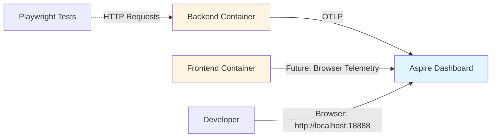

# Adding Aspire Dashboard to Docker Compose

## Context

Currently, when running the application locally via Aspire AppHost, the Aspire Dashboard provides excellent visibility into structured logs, traces, and metrics. However, when running in containers via docker-compose (for functional tests or debugging generated frontend issues), this observability is lost.

**Primary Use Cases:**
1. **Functional test debugging** - View logs and traces during Playwright test execution to diagnose failures
2. **Generated frontend debugging** - Troubleshoot issues specific to the production-built frontend that don't occur in dev mode

**Not Required:**
- CI/CD pipeline observability (tests in GitHub Actions)
- Container evaluation/demos

## Current State

### What's Already Working

Your application already has excellent OpenTelemetry instrumentation:

**In [`src/ServiceDefaults/Extensions.cs`](../src/ServiceDefaults/Extensions.cs):**
- ✅ OpenTelemetry logging with formatted messages and scopes
- ✅ Metrics: ASP.NET Core, HTTP Client, Runtime, Entity Framework Core
- ✅ Tracing: ASP.NET Core, HTTP Client, Entity Framework Core
- ✅ OTLP exporter support via `OTEL_EXPORTER_OTLP_ENDPOINT` environment variable
- ✅ Azure Monitor exporter support (optional)

**In [`src/BackEnd/Program.cs`](../src/BackEnd/Program.cs):**
- ✅ Service defaults already integrated via `builder.AddServiceDefaults(logger)`

### The Gap

When running in docker-compose, telemetry is generated but has nowhere to go:
- Logs go to stdout (visible via `docker logs`)
- Traces and metrics are lost (no OTLP endpoint configured)
- No unified dashboard to correlate logs, traces, and metrics

## Recommended Solution

**Add the standalone Aspire Dashboard as a service in docker-compose.**

This is the simplest, most lightweight solution that gives you the exact same dashboard experience you have in local development.

### Architecture



### Why Aspire Dashboard?

**Pros:**
- ✅ **Identical to local dev** - Same UI/UX you already know
- ✅ **Zero code changes** - Just environment variables
- ✅ **Lightweight** - Single container, minimal resources
- ✅ **OTLP native** - Built specifically for OpenTelemetry
- ✅ **Free and open source** - No licensing concerns
- ✅ **Microsoft supported** - Part of .NET Aspire

**Cons:**
- ❌ Data not persisted (ephemeral, container-scoped)
- ❌ Single instance only (fine for local dev)
- ❌ Requires exposing dashboard port

### Alternatives Considered

#### Option 2: Jaeger + Prometheus + Grafana
**Why Not:**
- Requires 3+ containers (Jaeger, Prometheus, Grafana, maybe Loki for logs)
- Complex configuration and integration
- Different UI than Aspire (learning curve)
- Overkill for local development debugging

#### Option 3: Seq
**Why Not:**
- Commercial license required for team use
- Primarily log-focused (traces require separate tools)
- Different UI paradigm
- Additional cost and procurement

#### Option 4: Elastic Stack (ELK)
**Why Not:**
- Very resource-heavy (Elasticsearch)
- Complex setup and maintenance
- Massive overkill for local dev
- Steep learning curve

## Implementation Plan

### 1. Add Aspire Dashboard Service to docker-compose-ci.yml

```yaml
services:
  aspire-dashboard:
    image: mcr.microsoft.com/dotnet/aspire-dashboard:10.0
    container_name: aspire-dashboard
    ports:
      - "18888:18888"  # Dashboard UI
      - "18889:18889"  # OTLP/gRPC endpoint
      - "4317:4317"    # OTLP/gRPC (standard port)
    environment:
      - DOTNET_DASHBOARD_UNSECURED_ALLOW_ANONYMOUS=true
    restart: unless-stopped

  backend:
    # ... existing backend config ...
    environment:
      # ... existing vars ...
      - OTEL_EXPORTER_OTLP_ENDPOINT=http://aspire-dashboard:4317
      - OTEL_EXPORTER_OTLP_PROTOCOL=grpc
    depends_on:
      - aspire-dashboard
```

### 2. Update Scripts

**[`scripts/Start-Container.ps1`](../scripts/Start-Container.ps1):**
```powershell
# After docker compose up --wait -d
Write-Host "OK Containers started successfully" -ForegroundColor Green
Write-Host ""
Write-Host "Opening application and dashboard..." -ForegroundColor Cyan
Start-Process "http://localhost:5000"  # Frontend
Start-Process "http://localhost:18888" # Aspire Dashboard
```

**[`scripts/Run-FunctionalTestsVsContainer.ps1`](../scripts/Run-FunctionalTestsVsContainer.ps1):**
```powershell
# Add after starting containers
Write-Host "Aspire Dashboard available at http://localhost:18888" -ForegroundColor Cyan
```

### 3. Optional: Add Frontend Telemetry

Currently, only backend telemetry is captured. For complete observability, consider adding browser telemetry from the frontend.

**See:** [`docs/wip/FRONTEND-TELEMETRY-ASPIRE-DASHBOARD.md`](FRONTEND-TELEMETRY-ASPIRE-DASHBOARD.md) for implementation details.

This is optional and can be added later if frontend visibility becomes important.

### 4. Documentation Updates

**[`docker/README.md`](../docker/README.md):**
- Add section on Aspire Dashboard
- Document how to access dashboard
- Note port 18888 must be available

**[`docs/CONTAINER-ENVIRONMENT.md`](../docs/CONTAINER-ENVIRONMENT.md):**
- Update troubleshooting section
- Add "View telemetry in Aspire Dashboard" as debugging option
- Document dashboard features

## Configuration Details

### Environment Variables for Backend

| Variable | Value | Purpose |
|----------|-------|---------|
| `OTEL_EXPORTER_OTLP_ENDPOINT` | `http://aspire-dashboard:4317` | OTLP receiver endpoint |
| `OTEL_EXPORTER_OTLP_PROTOCOL` | `grpc` | Use gRPC protocol (more efficient) |

### Aspire Dashboard Environment Variables

| Variable | Value | Purpose |
|----------|-------|---------|
| `DOTNET_DASHBOARD_UNSECURED_ALLOW_ANONYMOUS` | `true` | Allow access without authentication (local dev only) |

**Security Note:** Anonymous access is fine for local development. If you ever expose the dashboard beyond localhost, add authentication.

### Ports

| Port | Service | Purpose |
|------|---------|---------|
| 18888 | Dashboard UI | Browser access to dashboard |
| 18889 | OTLP/gRPC | Alternative OTLP endpoint |
| 4317 | OTLP/gRPC | Standard OTLP port (what backend uses) |

## Usage Workflow

### Debugging Functional Tests

```powershell
# 1. Start containers with dashboard
.\scripts\Start-Container.ps1

# 2. Open dashboard in browser (auto-opens)
# http://localhost:18888

# 3. Run functional tests
.\scripts\Run-FunctionalTestsVsContainer.ps1

# 4. View real-time telemetry in dashboard:
#    - Structured Logs tab: See all backend logs with correlation
#    - Traces tab: See request flows through the application
#    - Metrics tab: See performance counters, EF queries, etc.
```

### Debugging Generated Frontend Issues

```powershell
# 1. Start containers
.\scripts\Start-Container.ps1

# 2. Reproduce the issue in browser (http://localhost:5000)

# 3. View backend telemetry in dashboard (http://localhost:18888)
#    - Check if API calls are reaching backend
#    - Look for errors in backend logs
#    - Trace request flow and timing

# 4. Check browser console for frontend errors
#    - Network tab for failed requests
#    - Console for JavaScript errors
```

## Dashboard Features

### Structured Logs Tab
- **Filter by level** (Debug, Info, Warning, Error)
- **Search by message content** (e.g., "Transaction" or "Authentication")
- **Filter by TraceId** (correlate logs with specific requests)
- **View log properties** (expand to see structured data)
- **Time range selection**

### Traces Tab
- **Distributed traces** showing request flow through application
- **Timing breakdown** of each operation
- **Filter by status** (success, error)
- **Search by TraceId or operation name**
- **View trace details** including all spans and tags

### Metrics Tab
- **ASP.NET Core metrics**: Request rate, duration, active requests
- **HTTP client metrics**: Outbound request stats
- **Runtime metrics**: GC, thread pool, exceptions
- **EF Core metrics**: Query duration, connection pool

### Resources Tab
- **Service health status**
- **Resource attributes** (service name, version, environment)
- **Runtime information**

## Testing the Setup

### Verify OTLP Connection

After starting containers, check that backend is sending telemetry:

```powershell
# Check backend logs for OTLP exporter initialization
docker logs yofi-v3-backend-1 | Select-String "OTLP"

# Expected output:
# Configuring OpenTelemetry to use OTLP exporter to endpoint http://aspire-dashboard:4317
```

### Verify Dashboard Access

1. Open http://localhost:18888 in browser
2. Should see "Resources" tab with "backend" service listed
3. Navigate to "Structured Logs" tab
4. Should see backend startup logs

### Generate Test Telemetry

```powershell
# Make an API request to generate traces
curl http://localhost:5001/api/version

# View in dashboard:
# - Logs tab: Should see request logs
# - Traces tab: Should see GET /api/version trace
```

## Troubleshooting

### Dashboard Not Accessible

**Symptom:** Cannot connect to http://localhost:18888

**Solutions:**
1. Check dashboard container is running: `docker ps | findstr aspire`
2. Check port is not in use: `netstat -an | findstr 18888`
3. Check dashboard logs: `docker logs aspire-dashboard`

### No Telemetry in Dashboard

**Symptom:** Dashboard loads but no data appears

**Solutions:**
1. Verify OTLP endpoint is configured: `docker exec yofi-v3-backend-1 printenv | findstr OTEL`
2. Check backend logs for OTLP errors: `docker logs yofi-v3-backend-1 | Select-String "OpenTelemetry"`
3. Verify dashboard can receive OTLP: `docker logs aspire-dashboard`
4. Check network connectivity: `docker exec yofi-v3-backend-1 nc -zv aspire-dashboard 4317`

### Backend Can't Reach Dashboard

**Symptom:** Backend logs show connection errors to aspire-dashboard

**Solution:**
- Ensure `depends_on: aspire-dashboard` is in backend service
- Check both services are on same Docker network
- Try using dashboard container IP instead of hostname

## Resource Usage

**Aspire Dashboard:**
- **Memory:** ~100-150 MB
- **CPU:** Minimal (idle), moderate (active viewing)
- **Disk:** Ephemeral (no persistence)
- **Startup time:** ~2-3 seconds

**Total overhead:** Negligible for local development/testing scenarios.

## Future Enhancements

### Optional Additions (Not Required for Core Use Cases)

1. **Frontend Browser Telemetry**
   - Add OpenTelemetry instrumentation to Nuxt frontend
   - Send browser traces/metrics to dashboard via OTLP/HTTP
   - See [`docs/wip/FRONTEND-TELEMETRY-ASPIRE-DASHBOARD.md`](FRONTEND-TELEMETRY-ASPIRE-DASHBOARD.md)

2. **Persistent Storage**
   - Mount volume for dashboard data persistence
   - Retain telemetry across container restarts
   - Useful if analyzing historical test runs

3. **Authentication**
   - Enable dashboard authentication if exposing beyond localhost
   - Use `DASHBOARD__FRONTEND__AUTHMODE=OpenIdConnect` (future feature)

4. **Resource Limits**
   - Add `mem_limit` and `cpus` to dashboard service
   - Prevent dashboard from consuming too many resources

## Benefits Summary

### Before (Current State)
- ❌ Logs only via `docker logs` (no structured filtering)
- ❌ No trace visibility
- ❌ No metrics visibility
- ❌ No correlation between logs and requests
- ❌ Difficult to debug functional test failures

### After (With Dashboard)
- ✅ Unified view of logs, traces, and metrics
- ✅ Filter and search structured logs
- ✅ Visualize request flows through application
- ✅ Correlate logs with specific requests via TraceId
- ✅ Monitor performance metrics in real-time
- ✅ Same UI/UX as local Aspire development
- ✅ Fast iteration on functional test debugging

## Implementation Effort

**Time Estimate:** 30-60 minutes

**Complexity:** Low

**Changes Required:**
- 1 file modified: [`docker/docker-compose-ci.yml`](../docker/docker-compose-ci.yml) (~15 lines)
- 2 scripts updated: [`scripts/Start-Container.ps1`](../scripts/Start-Container.ps1), [`scripts/Run-FunctionalTestsVsContainer.ps1`](../scripts/Run-FunctionalTestsVsContainer.ps1) (~5 lines each)
- 2 docs updated: [`docker/README.md`](../docker/README.md), [`docs/CONTAINER-ENVIRONMENT.md`](../docs/CONTAINER-ENVIRONMENT.md) (~50 lines total)

**No code changes required** - purely configuration and documentation.
