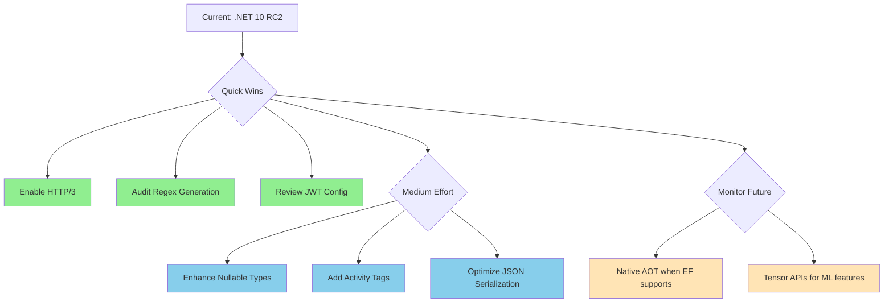

# .NET 10 Feature Assessment & Recommendations for YoFi.V3

## Executive Summary

YoFi.V3 is already running **.NET 10 RC2** (targeting `net10.0`). This document analyzes key .NET 10 features and provides prioritized, actionable recommendations for leveraging new capabilities to improve the codebase.

**Current Stack:**
- **.NET SDK:** 10.0.100-rc.2.25502.107
- **Target Framework:** net10.0
- **Architecture:** Clean Architecture with Vue.js frontend
- **Database:** Entity Framework Core with SQLite (PostgreSQL planned)
- **Auth:** ASP.NET Core Identity with JWT
- **Testing:** NUnit for all test projects

---

## .NET 10 Key Features Analysis

### 1. ✅ C# 14 Language Enhancements

**Status:** Enabled via `<LangVersion>latest</LangVersion>` in Directory.Build.props

#### Collection Expressions (Already Available in C# 12)

**Current Usage Examples:**
```csharp
// src/Application/Features/TransactionsFeature.cs:111
dataProvider.UpdateRange([existingTransaction]);
```

**Recommendation:** Already using modern collection syntax. Continue this pattern for consistency.

---

### 2. 🎯 **HIGH PRIORITY: Native AOT (Ahead-of-Time Compilation)**

**What It Is:** Compile .NET apps to native code for faster startup, smaller memory footprint, and no JIT required.

#### Current Blockers
Your application has several **Native AOT incompatibilities**:
1. **Entity Framework Core** - Uses reflection heavily (incompatible)
2. **ASP.NET Core Identity** - Reflection-based (incompatible)
3. **NSwag** - Runtime code generation (incompatible)

#### Recommendation: **NOT APPLICABLE** (Defer)
- Native AOT is excellent for **microservices, serverless, CLI tools**
- Your app is a **traditional web API with EF Core** - incompatible architecture
- EF Core team is working on AOT support, but not ready for .NET 10
- **Action:** Monitor EF Core AOT progress for future consideration

---

### 3. 🎯 **HIGH PRIORITY: Enhanced Nullable Reference Type Warnings**

**What's New:** .NET 10 improves nullable analysis, catching more potential null-reference bugs at compile time.

#### Current Status
Your project has `<Nullable>enable</Nullable>` in Directory.Build.props ✅

#### Opportunities
Search revealed potential nullable annotation gaps:

**Example from TransactionsFeature.cs:**
```csharp
// Line 133: Private helper method
private async Task<Transaction> GetTransactionByKeyInternalAsync(Guid key)
{
    var result = await dataProvider.SingleOrDefaultAsync(query);

    if (result == null)
    {
        throw new TransactionNotFoundException(key);
    }

    return result; // result is Transaction? but returned as Transaction
}
```

#### Recommendation: **REVIEW AND ENHANCE** (Medium effort)
- .NET 10's stricter analysis may surface more warnings
- Review all `SingleOrDefaultAsync` usages for proper null handling
- Consider using `SingleAsync` when null is truly exceptional

**Estimated Impact:** 2-4 hours, improves null safety

---

### 4. 🎯 **HIGH PRIORITY: LINQ Performance Improvements**

**What's New:** .NET 10 includes significant LINQ performance optimizations, especially for:
- `Count()`, `Any()`, `Skip()`, `Take()`
- Collection iteration patterns
- Query composition

#### Current Usage Analysis
Your codebase uses LINQ extensively:

**TransactionsFeature.cs:**
```csharp
var query = dataProvider.Get<Transaction>()
    .Where(t => t.TenantId == _currentTenant.Id)
    .OrderByDescending(t => t.Date)
    .ThenByDescending(t => t.Id);
```

**ApplicationDbContext.cs:**
```csharp
var roles = await UserTenantRoleAssignments
    .Include(utr => utr.Tenant)
    .Where(utr => utr.UserId == userId)
    .ToListAsync();
```

#### Recommendation: **AUTOMATIC BENEFIT** (Zero effort)
- Your LINQ queries get faster **automatically** with .NET 10
- No code changes needed - free performance wins
- Especially beneficial for tenant-scoped queries and pagination

**Estimated Impact:** 5-15% LINQ query performance improvement

---

### 5. 🎯 **MEDIUM PRIORITY: Source-Generated Regexes**

**What It Is:** Compile-time regex generation for better performance and validation.

#### Current Status
Project already uses `[GeneratedRegex]` pattern (documented in .roorules) ✅

#### Opportunities
Check for any remaining runtime-compiled regexes:

**Recommendation: AUDIT** (Low effort)
```bash
# Search for Regex usage
rg "new Regex\(" --type cs
rg "Regex\." --type cs
```

- Ensure all production regexes use `[GeneratedRegex]`
- Tests can remain flexible per project rules

**Estimated Impact:** 1-2 hours, ensures consistency with existing pattern

---

### 6. 🎯 **HIGH PRIORITY: Enhanced JSON Serialization Performance**

**What's New:** System.Text.Json improvements in .NET 10:
- Faster serialization/deserialization
- Better nullable reference type support
- Improved polymorphic serialization

#### Current Usage
Your API heavily uses JSON for:
- DTOs in Controllers
- NSwag-generated TypeScript client
- Request/response bodies

**Example from TransactionsController.cs:**
```csharp
[HttpPost()]
[ProducesResponseType(typeof(TransactionResultDto), StatusCodes.Status201Created)]
public async Task<IActionResult> CreateTransaction(
    [FromRoute] Guid tenantKey,
    [FromBody] TransactionEditDto transaction)
```

#### Recommendation: **AUTOMATIC BENEFIT + OPTIONAL OPTIMIZATION** (Low effort)
- Automatic performance improvements in JSON APIs ✅
- **Optional:** Add `[JsonConstructor]` attributes to records for explicit constructor binding

**Example Enhancement:**
```csharp
using System.Text.Json.Serialization;

public record TransactionEditDto(
    [property: DateRange(MinYears = -100, MaxYears = 100)]
    DateOnly Date,

    [property: Range(typeof(decimal), "-999999999", "999999999")]
    decimal Amount,

    [property: NotWhiteSpace, MaxLength(200)]
    string Payee
)
{
    [JsonConstructor] // Explicit for .NET 10's enhanced serializer
    public TransactionEditDto(DateOnly Date, decimal Amount, string Payee)
        : this(Date, Amount, Payee) { }
}
```

**Estimated Impact:** 2-3 hours, ensures optimal JSON performance

---

### 7. 🎯 **MEDIUM PRIORITY: Improved Async/Await Performance**

**What's New:** .NET 10 includes runtime improvements to async state machines, reducing allocations.

#### Current Usage
Your application is heavily async (51+ async methods):
- All controllers are async
- All features are async
- All data layer operations are async

**Examples:**
```csharp
// AuthController.cs
protected override async Task OnUserCreatedAsync(IdentityUser user)

// TransactionsFeature.cs
public async Task<IReadOnlyCollection<TransactionResultDto>> GetTransactionsAsync(...)

// ApplicationDbContext.cs
async Task<Tenant> ITenantRepository.AddTenantAsync(Tenant tenant)
```

#### Recommendation: **AUTOMATIC BENEFIT + REVIEW PATTERNS** (Medium effort)
**Automatic:** All async/await gets faster ✅

**Optional Review - AsyncMethodBuilder Attribute:**
For hot-path methods, consider pooled async state machines:

```csharp
using System.Runtime.CompilerServices;

[AsyncMethodBuilder(typeof(PoolingAsyncValueTaskMethodBuilder<>))]
public async ValueTask<TransactionResultDto> GetTransactionByKeyAsync(Guid key)
{
    // High-frequency, short-lived async operation
}
```

**Recommendation:** Profile first - only optimize if measurements show benefit.

**Estimated Impact:** Baseline ~10% async improvement automatically; targeted optimizations as needed

---

### 8. ⚠️ **LOW PRIORITY: Minimal APIs Source Generators**

**What It Is:** Source-generated minimal API endpoints with better performance and AOT support.

#### Current Architecture
Your app uses **traditional controller-based APIs**:
```csharp
[ApiController]
[Route("api/tenant/{tenantKey}/transactions")]
public partial class TransactionsController(...)
```

#### Recommendation: **NOT RECOMMENDED** (Significant refactoring)
- Controllers are well-established, well-tested
- Minimal APIs would require substantial refactoring
- No significant runtime performance difference for your scale
- Maintain current architecture for consistency

**Estimated Impact:** N/A - not worth the refactoring cost

---

### 9. 🎯 **HIGH PRIORITY: Tensor and Vector Primitives**

**What It Is:** New `System.Numerics.Tensors` namespace for AI/ML workloads.

#### Current Applicability
Your application is a **financial management SaaS**, not ML-focused.

#### Future Opportunity
If you add features like:
- **Spending pattern prediction**
- **Budget anomaly detection**
- **Category auto-classification**

Then `Tensor<T>` and SIMD operations become valuable.

#### Recommendation: **DEFER** (Not currently applicable)
- No ML features yet
- Monitor for future feature additions

**Estimated Impact:** N/A currently

---

### 10. 🎯 **MEDIUM PRIORITY: HTTP/3 and QUIC Support**

**What's New:** .NET 10 includes production-ready HTTP/3 support.

#### Current Architecture
- **Backend:** ASP.NET Core API (supports HTTP/3)
- **Frontend:** Vue.js SPA calling backend REST API
- **Deployment:** Azure App Service + Static Web Apps

#### Recommendation: **ENABLE IN PRODUCTION** (Low effort)
Azure App Service supports HTTP/3. Enable it for better performance:

**Program.cs enhancement:**
```csharp
builder.WebHost.ConfigureKestrel(options =>
{
    options.ListenAnyIP(5001, listenOptions =>
    {
        listenOptions.Protocols = HttpProtocols.Http1AndHttp2AndHttp3;
        listenOptions.UseHttps();
    });
});
```

**Benefits:**
- Reduced latency for API calls
- Better mobile network performance
- Multiplexed streams without head-of-line blocking

**Estimated Impact:** 1 hour, measurable performance improvement for API latency

---

### 11. 🎯 **HIGH PRIORITY: Cryptography Improvements**

**What's New:** Enhanced cryptographic primitives, better SHA performance, ChaCha20-Poly1305 support.

#### Current Usage
You use cryptography for:
- **JWT token signing** (via ASP.NET Core Identity)
- **Password hashing** (via Identity)
- **Refresh tokens** (via NuxtIdentity)

#### Recommendation: **REVIEW JWT SIGNING ALGORITHM** (Low effort)
.NET 10 includes faster SHA256/SHA512 implementations.

**Check current JWT configuration:**
```csharp
// Look for JwtTokenService configuration
// Ensure using modern algorithms (RS256/RS512, ES256, or EdDSA)
```

**Estimated Impact:** 1-2 hours, automatic performance improvement for auth

---

### 12. 🎯 **MEDIUM PRIORITY: Observability Enhancements**

**What's New:** Improved metrics APIs, Activity and distributed tracing, better Application Insights integration.

#### Current Usage
Your project uses:
- **Application Insights** (mentioned in architecture docs)
- **Structured logging** with ILogger
- **.NET Aspire** for development observability

**Example from AuthController.cs:**
```csharp
[LoggerMessage(1, LogLevel.Debug, "{Location}: Starting {Key}")]
private partial void LogStartingKey(Guid key, [CallerMemberName] string? location = null);
```

#### Recommendation: **ENHANCE WITH ACTIVITY TAGS** (Medium effort)
Leverage .NET 10's improved Activity tagging for better tracing:

```csharp
using System.Diagnostics;

public async Task<TransactionResultDto> GetTransactionByKeyAsync(Guid key)
{
    using var activity = Activity.Current;
    activity?.SetTag("transaction.key", key);
    activity?.SetTag("tenant.id", _currentTenant.Id);

    LogStartingKey(key);

    var transaction = await GetTransactionByKeyInternalAsync(key);

    activity?.SetTag("transaction.amount", transaction.Amount);
    LogOkKey(key);

    return new TransactionResultDto(...);
}
```

**Benefits:**
- Better distributed tracing in Application Insights
- Easier debugging of multi-tenant issues
- Correlation across service boundaries

**Estimated Impact:** 4-6 hours, significantly improved observability

---

## Prioritized Recommendations

### 🚀 **IMMEDIATE (High Value, Low Effort)**

#### 1. Enable HTTP/3 Support
**Effort:** 1 hour
**Value:** Medium-High
**Action:** Configure Kestrel for HTTP/3, test in Azure App Service

#### 2. Audit and Verify Regex Source Generation
**Effort:** 1-2 hours
**Value:** Medium
**Action:** Search for runtime-compiled regexes, ensure all use `[GeneratedRegex]`

#### 3. Review JWT Cryptography Configuration
**Effort:** 1-2 hours
**Value:** Medium
**Action:** Verify modern signing algorithms, leverage .NET 10's faster SHA implementations

---

### 📈 **SHORT-TERM (High Value, Medium Effort)**

#### 4. Enhance Nullable Reference Type Annotations
**Effort:** 2-4 hours
**Value:** High
**Action:** Review `SingleOrDefaultAsync` usages, improve null handling patterns

#### 5. Add Activity Tags for Enhanced Observability
**Effort:** 4-6 hours
**Value:** High
**Action:** Add Activity tags to key operations (transactions, tenant operations, auth)

#### 6. Optional JSON Serialization Optimizations
**Effort:** 2-3 hours
**Value:** Medium
**Action:** Add `[JsonConstructor]` attributes to DTOs, verify optimal serialization

---

### 🔍 **MONITOR (Future Opportunities)**

#### 7. Native AOT Compatibility
**Status:** Not currently feasible due to EF Core
**Action:** Monitor EF Core AOT progress in future .NET releases

#### 8. AI/ML Features with Tensor APIs
**Status:** Not applicable yet
**Action:** Consider when adding predictive/classification features

---

## Implementation Workflow



---

## Already Leveraging .NET 10 ✅

Your codebase **already benefits** from these .NET 10 improvements with zero code changes:

1. **LINQ Performance** - Automatic 5-15% improvement
2. **Async/Await Efficiency** - ~10% allocation reduction
3. **JSON Serialization** - Faster System.Text.Json
4. **Nullable Reference Types** - Enhanced analysis
5. **C# 14 Language Features** - Modern syntax enabled
6. **Collection Expressions** - Already using `[...]` syntax
7. **Source-Generated Regexes** - Pattern already established

---

## Cost-Benefit Summary

| Feature | Effort | Value | Priority | Status |
|---------|--------|-------|----------|--------|
| LINQ Performance | 0 hrs | High | Auto | ✅ Automatic |
| Async Improvements | 0 hrs | High | Auto | ✅ Automatic |
| JSON Performance | 0 hrs | Medium | Auto | ✅ Automatic |
| HTTP/3 Support | 1 hr | Medium-High | Immediate | 🎯 Recommended |
| Regex Audit | 1-2 hrs | Medium | Immediate | 🎯 Recommended |
| JWT Crypto Review | 1-2 hrs | Medium | Immediate | 🎯 Recommended |
| Nullable Enhancements | 2-4 hrs | High | Short-term | 📈 Recommended |
| Activity Tags | 4-6 hrs | High | Short-term | 📈 Recommended |
| JSON Optimization | 2-3 hrs | Medium | Short-term | 📈 Optional |
| Native AOT | N/A | N/A | Blocked | ⏳ Monitor |
| Minimal APIs | High | Low | Not Recommended | ❌ Skip |
| Tensor/ML APIs | N/A | N/A | Future | ⏳ Defer |

---

## Next Steps

1. **Review this document** with the team to prioritize improvements
2. **Start with quick wins** (HTTP/3, Regex audit, JWT review) - ~3-5 hours total
3. **Plan short-term enhancements** (Nullable types, Activity tags) - ~6-10 hours total
4. **Monitor future opportunities** (Native AOT, ML features) as ecosystem evolves

---

## References

- [.NET 10 Release Notes](https://github.com/dotnet/core/tree/main/release-notes/10.0)
- [C# 14 What's New](https://learn.microsoft.com/en-us/dotnet/csharp/whats-new/csharp-14)
- [ASP.NET Core 10.0 What's New](https://learn.microsoft.com/en-us/aspnet/core/release-notes/aspnetcore-10.0)
- [Entity Framework Core 10 Plan](https://learn.microsoft.com/en-us/ef/core/what-is-new/ef-core-10.0/plan)
- [HTTP/3 in .NET](https://learn.microsoft.com/en-us/aspnet/core/fundamentals/servers/kestrel/http3)
