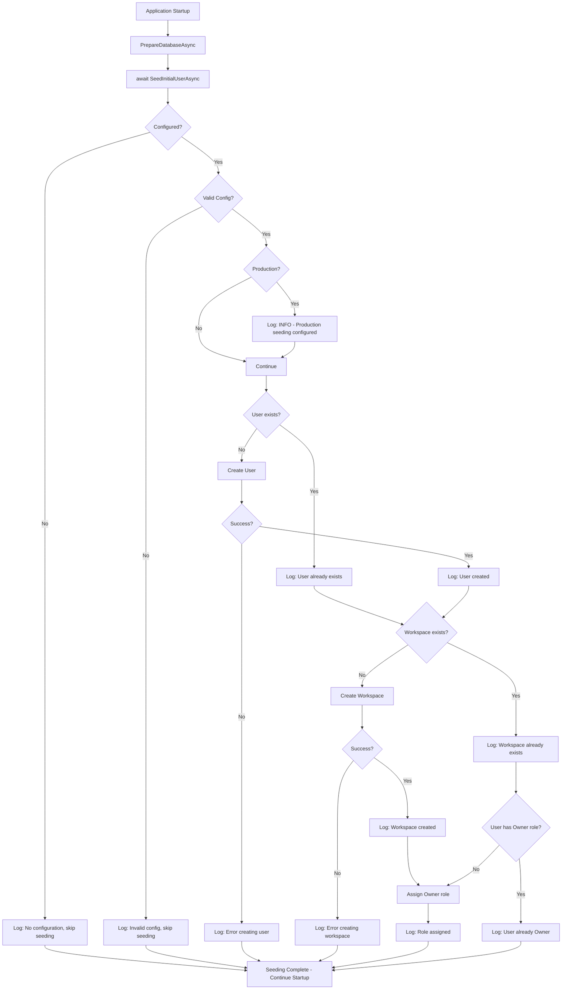

# Initial User Seeding Design

## Problem Statement

Currently, there is no built-in mechanism to create an initial user for accessing the YoFi.V3 application. Users must be created manually or through the functional test [`TestControlController`](../../src/Controllers/TestControlController.cs) (which only creates test users with the `__TEST__` prefix).

**Key challenges:**
- New developers need a way to access the application immediately after setup
- Container environment needs a known user for evaluation and functional testing
- Production deployments need a secure way to bootstrap the first admin user
- Must maintain security across all environments (no hardcoded passwords in source)

## Requirements

### Functional Requirements

1. **Environment-Specific Behavior**
   - Development: Auto-seed a known development user on startup
   - Container: Auto-seed a known evaluation user on startup
   - Production: Opt-in seeding via `-InitialUserEmail` parameter in Provision-Resources.ps1

2. **User + Workspace Creation**
   - Create an initial user with confirmed email
   - Create an initial workspace/tenant for that user
   - Assign the user as Owner of that workspace

3. **Idempotency**
   - Safe to run multiple times (doesn't fail if user/workspace already exists)
   - Detect existing user/workspace and skip creation

4. **Configurability**
   - Username, email, password configurable via `appsettings.json` or environment variables
   - Workspace name and description configurable
   - Enable/disable seeding per environment

### Security Requirements

1. **Production Safety**
   - NEVER store production passwords in source code or configuration files
   - Production passwords generated by Provision-Resources.ps1 using cryptographic random bytes
   - **Opt-in by design:** Seeding only configured when `-InitialUserEmail` parameter provided to provision script
   - Seeding triggered by presence of configuration (Email + Password environment variables)
   - Log when initial user seeding occurs in production

2. **Development/Container Safety**
   - Use clearly marked development credentials
   - Credentials should be obvious they're for non-production use
   - Document security implications in configuration

3. **Audit Trail**
   - Log when initial user is seeded
   - Log when seeding is skipped (user already exists)
   - Log when seeding is skipped (no configuration)

## Proposed Architecture

### Configuration Schema

**Simplified Design Principles:**
- If configuration is present (Email + Password), seed the user
- If configuration is missing or incomplete, skip seeding
- Username derived from email (local part before @)
- Workspace name auto-generated: "{Username}'s Workspace"
- Workspace description auto-generated: "Workspace for {Email}"

Add to `ApplicationOptions` or create new `InitialUserOptions`:

```jsonc
{
  "InitialUser": {
    "Email": "developer@example.com",         // Email for initial user (required)
    "Password": "DevPassword123!"             // Password (from env var in production) (required)
  }
}
```

**Environment-specific defaults:**

**Development (`appsettings.Development.json`):**
```json
{
  "InitialUser": {
    "Email": "developer@example.com",
    "Password": "DevPassword123!"
  }
}
```
- Username: `developer` (from email)
- Workspace name: `developer's Workspace`
- Workspace description: `Workspace for developer@example.com`

**Container (via docker-compose environment variables):**
```yaml
environment:
  - InitialUser__Email=demo@example.com
  - InitialUser__Password=DemoPassword123!
```
- Username: `demo` (from email)
- Workspace name: `demo's Workspace`
- Workspace description: `Workspace for demo@example.com`

**Production (via Provision-Resources.ps1):**
- Provision script generates secure credentials and sets environment variables
- Password automatically generated (similar to JWT key generation)

### Service Architecture

**New Service: `InitialUserSeeder`**

Location: `src/BackEnd/Setup/InitialUserSeeder.cs`

```csharp
/// <summary>
/// Seeds an initial user and workspace for application bootstrapping.
/// </summary>
/// <remarks>
/// This service creates an initial user with a workspace to allow immediate
/// access to the application. It is intended for development, container, and
/// initial production bootstrap scenarios.
///
/// The seeding operation is idempotent - it will detect existing users/workspaces
/// and skip creation. This makes it safe to enable across application restarts.
/// </remarks>
public class InitialUserSeeder
{
    private readonly UserManager<IdentityUser> _userManager;
    private readonly ITenantRepository _tenantRepository;
    private readonly InitialUserOptions _options;
    private readonly IHostEnvironment _environment;
    private readonly ILogger<InitialUserSeeder> _logger;

    public async Task SeedAsync()
    {
        // 1. Check if seeding is enabled
        // 2. Validate configuration (username, email, password present)
        // 3. Check if user already exists (by username or email)
        // 4. If exists, log and return
        // 5. Create user with UserManager
        // 6. Check if workspace already exists (by name)
        // 7. If not, create workspace
        // 8. Assign user as Owner of workspace
        // 9. Log success
    }
}
```

### Integration Points

**1. Startup Integration (`Program.cs`)**

Add after [`PrepareDatabaseAsync()`](../../src/BackEnd/Program.cs:65):

```csharp
// Prepare the database
app.PrepareDatabaseAsync();

// Seed initial user (if configured) - MUST await to avoid SQLite concurrency issues
await app.SeedInitialUserAsync();
```

**2. Extension Method (`ServiceCollectionExtensions.cs`)**

Add new extension method:

```csharp
public static async Task SeedInitialUserAsync(this WebApplication app)
{
    using var scope = app.Services.CreateScope();
    var seeder = scope.ServiceProvider.GetRequiredService<InitialUserSeeder>();
    await seeder.SeedAsync();
}
```

**3. Service Registration (`SetupIdentity.cs` or new file)**

```csharp
services.Configure<InitialUserOptions>(configuration.GetSection("InitialUser"));
services.AddScoped<InitialUserSeeder>();
```

## Detailed Design

### Configuration Options Class

```csharp
namespace YoFi.V3.Entities.Options;

/// <summary>
/// Configuration options for seeding an initial user and workspace.
/// </summary>
/// <remarks>
/// Seeding is automatic when both Email and Password are configured.
/// If either is missing or empty, seeding is skipped.
/// Username is derived from the email's local part (before @).
/// Workspace name and description are auto-generated from username and email.
/// </remarks>
public record InitialUserOptions
{
    /// <summary>
    /// Configuration section name.
    /// </summary>
    public static readonly string Section = "InitialUser";

    /// <summary>
    /// Email address for the initial user.
    /// </summary>
    /// <remarks>
    /// Required for seeding. The username is derived from the local part (before @).
    /// Example: "developer@example.com" → username is "developer"
    /// </remarks>
    public string? Email { get; init; }

    /// <summary>
    /// Password for the initial user.
    /// </summary>
    /// <remarks>
    /// Required for seeding.
    /// In production, this should come from a secure source like Azure Key Vault
    /// or environment variables, NEVER from source code.
    /// </remarks>
    public string? Password { get; init; }

    /// <summary>
    /// Checks if the configuration is complete for seeding.
    /// </summary>
    public bool IsConfigured => !string.IsNullOrWhiteSpace(Email) && !string.IsNullOrWhiteSpace(Password);

    /// <summary>
    /// Gets the username derived from the email address.
    /// </summary>
    public string GetUsername()
    {
        if (string.IsNullOrWhiteSpace(Email))
            throw new InvalidOperationException("Email is required to derive username");

        var atIndex = Email.IndexOf('@');
        return atIndex > 0 ? Email[..atIndex] : Email;
    }

    /// <summary>
    /// Gets the auto-generated workspace name.
    /// </summary>
    public string GetWorkspaceName() => $"{GetUsername()}'s Workspace";

    /// <summary>
    /// Gets the auto-generated workspace description.
    /// </summary>
    public string GetWorkspaceDescription() => $"Workspace for {Email}";
}
```

### Seeding Service Implementation

**Key Implementation Details:**

1. **Configuration Check**
   - If `Email` or `Password` is null/empty, skip seeding entirely
   - Log: "Initial user seeding skipped - no configuration"
   - Derive username from email local part (before @)
   - Generate workspace name: "{Username}'s Workspace"
   - Generate workspace description: "Workspace for {Email}"

2. **Idempotency Strategy**
   - Check if user exists by username OR email before creating
   - Check if workspace exists by exact name before creating
   - If user exists but workspace doesn't, create workspace and assign user
   - If both exist, verify user has Owner role, add if missing

3. **Error Handling**
   - Log validation errors (invalid email format, password too weak)
   - Log creation errors (user creation failed, workspace creation failed)
   - Continue application startup even if seeding fails (non-fatal)
   - Return clear error messages for troubleshooting

4. **Security Validations**
   - Log at Information level when seeding in production (not a warning - it's expected behavior)
   - Validate email format (contains @)
   - UserManager validates password meets Identity requirements
   - Log all seeding operations at Information level

4. **Transaction Safety**
   - Use UserManager for user creation (handles validation, password hashing)
   - Use TenantFeature for workspace creation (maintains consistency)
   - Each operation is atomic (user, workspace, role assignment)
   - Failures in later steps don't roll back earlier steps (idempotent retries)

### Workflow Diagram



**Critical:** The `await` on `SeedInitialUserAsync` ensures seeding completes before the application accepts requests. This prevents SQLite concurrency issues.

## Environment-Specific Usage

### Development Environment

**Configuration:** `appsettings.Development.json`

```json
{
  "InitialUser": {
    "Enabled": true,
    "Username": "developer",
    "Email": "developer@example.com",
    "Password": "DevPassword123!",
    "Workspace": {
      "Name": "Developer Workspace",
      "Description": "Development workspace for local testing"
    }
  }
}
```

**Usage:**
1. Developer clones repository
2. Runs `dotnet run` in AppHost
3. Initial user automatically seeded
4. Developer can log in immediately with `developer` / `DevPassword123!`

**Developer Experience:**
- No manual user creation needed
- Consistent credentials across all developers
- Can start testing immediately
- Clearly marked as development credentials

### Container Environment

**Configuration:** Docker Compose environment variables

```yaml
# docker/docker-compose-ci.yml
services:
  backend:
    environment:
      - ASPNETCORE_ENVIRONMENT=Container
      - InitialUser__Email=demo@example.com
      - InitialUser__Password=DemoPassword123!
```

**Usage:**
1. Evaluator runs `./scripts/Start-Container.ps1`
2. Container builds and starts
3. Initial user automatically seeded
4. Evaluator can log in with `demo` / `DemoPassword123!`

**Benefits:**
- Zero manual setup for evaluation
- Consistent demo credentials
- Easy to include in documentation
- Can be customized via environment variables

### Production Environment

**Configuration:** `appsettings.json` (disabled by default)

```json
{
  "InitialUser": {
    "Enabled": false
  }
}
```

**Bootstrap Process (one-time setup):**

1. **Run Provision-Resources.ps1 with initial user email:**
   ```powershell
   .\scripts\Provision-Resources.ps1 `
     -ResourceGroup "yofi-rg" `
     -Location "eastus" `
     -StaticWebAppLocation "eastus2" `
     -InitialUserEmail "admin@mycompany.com"
   ```

   **Optional parameter `-InitialUserEmail`:**
   - If provided: Script generates credentials and configures seeding
   - If omitted: No initial user seeding configured
   - **This is the opt-in mechanism** - user explicitly requests initial user

   **When parameter is provided:**
   - Script generates secure JWT key (existing behavior)
   - Script generates secure initial user password (using cryptographic random bytes)
   - Script sets App Service environment variables:
     - `InitialUser__Email=<provided-email>`
     - `InitialUser__Password=<generated-secure-password>`

2. **First Deployment:**
   - CI/CD pipeline deploys application
   - Application starts with environment variables configured
   - Initial user automatically seeded with secure credentials
   - Script output displays admin credentials (similar to JWT key output)

3. **Post-Bootstrap:**
   - **IMPORTANT:** Manually remove environment variables via Azure Portal
   - Change admin password via UI
   - Create additional admin users
   - Optional: Delete initial user if no longer needed

**Security Notes:**
- **Opt-in by design:** No default email = no seeding configuration
- Password generated using cryptographically secure random bytes (like JWT key)
- Password only displayed once in script output (save securely)
- Environment variables configured automatically when opt-in parameter provided
- Seeding happens automatically when Email + Password configured
- Remove variables after first login to disable future seeding
- Application logs at Information level when seeding in production

**Automatic Derivations:**
- Username: `admin` (from email `admin@mycompany.com`)
- Workspace name: `admin's Workspace`
- Workspace description: `Workspace for admin@mycompany.com`

**Example without initial user (default):**
```powershell
.\scripts\Provision-Resources.ps1 -ResourceGroup "yofi-rg" -Location "eastus" -StaticWebAppLocation "eastus2"
# No initial user configured - users must be created another way
```

## Security Considerations

### Development/Container

**Acceptable:**
- Hardcoded credentials in configuration files
- Clearly marked as development/demo credentials (via email domain)
- Simple passwords (meeting minimum Identity requirements)
- Auto-seeding on every startup

**Best Practices:**
- Use non-production email domains (`@example.com`)
- Username automatically derived from email (clear and consistent)
- Include "Dev" or "Demo" in passwords to make intent clear
- Document credentials prominently in README

### Production

**Required:**
- NO hardcoded passwords in source code or configuration files
- Passwords generated by provision script using secure random generation
- No configuration in `appsettings.json` by default (seeding disabled)
- Automatic configuration via Provision-Resources.ps1
- Warning logs when seeding is configured in production

**Recommended:**
- Use strong, randomly generated passwords
- Change password after first login
- Create additional admin users immediately
- Remove Email/Password environment variables after bootstrap
- Audit log entry for initial user creation

## Alternative Approaches Considered

### 1. CLI Tool for User Creation

**Approach:** Create a separate command-line tool to seed users.

**Pros:**
- More explicit control over when seeding happens
- Clearer security boundary (tool vs. application)
- Could support additional admin operations

**Cons:**
- Requires separate deployment/distribution
- More complex for simple use cases
- Adds maintenance burden
- Doesn't improve developer experience

**Decision:** Rejected - Too complex for the problem. Built-in seeding with configuration is simpler.

### 2. Migration-Based Seeding

**Approach:** Add initial user as a database migration.

**Pros:**
- Runs exactly once automatically
- Familiar pattern for database changes

**Cons:**
- Migrations shouldn't contain environment-specific logic
- Password hashing needs runtime services (UserManager)
- Harder to customize per environment
- Can't easily disable in production

**Decision:** Rejected - Wrong layer of abstraction. Identity operations belong in application logic.

### 3. First-Run Setup Wizard

**Approach:** Show UI wizard on first application access to create admin user.

**Pros:**
- Most user-friendly for production
- No credential management needed
- Guided experience

**Cons:**
- Requires frontend implementation
- Complicates development/container workflows
- Must handle race conditions (multiple simultaneous first accesses)
- Requires unauthenticated endpoint (security concern)

**Decision:** Rejected for initial implementation - Could be added later as enhancement. Current need is simpler bootstrap.

### 4. TestControl Endpoint Enhancement

**Approach:** Extend [`TestControlController`](../../src/Controllers/TestControlController.cs) to support non-test users

**Pros:**
- Reuses existing infrastructure
- Already has user/workspace creation logic

**Cons:**
- TestControl is for functional testing only (has `__TEST__` prefix safety)
- Requires API call (not automatic)
- Wrong semantic purpose (test vs. bootstrap)
- Mixes concerns (testing vs. production operations)

**Decision:** Rejected - TestControl should remain focused on test scenarios.

## Implementation Phases

### Phase 1: Core Seeding Infrastructure
- Create `InitialUserOptions` configuration class
- Implement `InitialUserSeeder` service
- Add startup integration in `Program.cs`
- Add service registration
- Unit tests for seeder logic

### Phase 2: Development Environment
- Add configuration to `appsettings.Development.json`
- Test in local development (Aspire)
- Document developer usage in README

### Phase 3: Container Environment
- Add environment variables to `docker-compose-ci.yml`
- Test in container environment
- Update container documentation
- Update functional test setup if needed

### Phase 4: Production Provisioning Integration
- Add optional `-InitialUserEmail` parameter to Provision-Resources.ps1
- Update script to generate credentials only when parameter provided
- Set environment variables in App Service when opted in
- Display credentials in script output when opted in
- Document production bootstrap process with opt-in parameter

### Phase 5: Enhancements (Future)
- Option to seed sample transactions
- Option to create multiple workspaces
- Integration with Azure Key Vault for password storage (currently environment variables)
- Additional parameters for workspace name customization (if needed)

## Testing Strategy

### Unit Tests

Location: `tests/Unit/BackEnd/Setup/InitialUserSeederTests.cs`

**Test Cases:**
- Seeding disabled - no operations performed
- Invalid configuration - logs error, continues startup
- User exists - skips user creation, continues with workspace
- Workspace exists - skips workspace creation, verifies role
- Full seeding - creates user, workspace, assigns Owner role
- Production environment - logs warning
- Idempotency - multiple runs produce same result
- Error handling - user creation fails, workspace creation fails

### Integration Tests

Location: `tests/Integration.Controller/InitialUserSeedingTests.cs`

**Test Cases:**
- End-to-end seeding in test environment
- User can authenticate with seeded credentials
- User has access to seeded workspace
- User has Owner role in seeded workspace
- Re-seeding doesn't create duplicates

### Manual Testing

**Development:**
1. Delete `app.db`
2. Run `dotnet run` in AppHost
3. Verify user created
4. Log in with `developer` / `DevPassword123!`
5. Verify workspace exists and accessible

**Container:**
1. Run `./scripts/Build-Container.ps1`
2. Run `./scripts/Start-Container.ps1`
3. Verify user created (check logs)
4. Log in with `demo` / `DemoPassword123!`
5. Verify workspace exists and accessible

## Open Questions

1. **Should seeding support multiple initial users?**
   - Current design: Single user only
   - Alternative: Array of users in configuration
   - Decision: Start with single user, extend if needed

2. **Should seeding support sample transactions?**
   - Current design: User + workspace only
   - Alternative: Include sample financial data
   - Decision: Keep separate from initial user (could be separate feature)

3. **Should we validate password strength beyond Identity defaults?**
   - Current design: Use Identity's built-in validation
   - Alternative: Add custom password requirements
   - Decision: Identity validation is sufficient

4. **Should seeding be synchronous or async during startup?**
   - Current design: Async (using `await`)
   - Alternative: Fire-and-forget background task
   - Decision: Synchronous - ensures user exists before app accepts requests

5. **Should production seeding be completely disabled or just defaulted off?**
   - Current design: Defaulted off, can be enabled with warning
   - Alternative: Completely remove in production builds
   - Decision: Allow entirely - needed for initial bootstrap

## Related Documentation

- [ENVIRONMENTS.md](../ENVIRONMENTS.md) - Environment configuration
- [CONTAINER-ENVIRONMENT.md](../CONTAINER-ENVIRONMENT.md) - Container setup
- [ADR 0008: Identity System](../adr/0008-identity.md) - Authentication foundation
- [ADR 0009: Accounts and Tenancy](../adr/0009-accounts-and-tenancy.md) - Workspace model
- [TENANCY.md](../TENANCY.md) - Tenant implementation details
- [TestControlController.cs](../../src/Controllers/TestControlController.cs) - Test user creation reference

## Implementation Checklist

### Core Implementation
- [ ] Create `InitialUserOptions` class in `src/Entities/Options/`
- [ ] Create `InitialUserSeeder` class in `src/BackEnd/Setup/`
- [ ] Add seeding service registration in `src/BackEnd/Setup/SetupIdentity.cs`
- [ ] Add `SeedInitialUserAsync()` extension in `src/BackEnd/Setup/SetupIdentity.cs`
- [ ] Integrate seeding call in `src/BackEnd/Program.cs`

### Configuration
- [ ] Add configuration to `src/BackEnd/appsettings.Development.json`
- [ ] Add environment variables to `docker/docker-compose-ci.yml`
- [ ] Update `scripts/Provision-Resources.ps1` to generate initial user credentials

### Provision Script Updates
- [ ] Add optional `-InitialUserEmail` parameter to Provision-Resources.ps1
- [ ] Check if parameter provided (opt-in detection)
- [ ] Generate secure initial user password when parameter provided (similar to JWT key)
- [ ] Set `InitialUser__Email` environment variable in App Service (only if opted in)
- [ ] Set `InitialUser__Password` environment variable in App Service (only if opted in)
- [ ] Display initial user credentials in script output (only if opted in)
- [ ] Update script help documentation with new optional parameter

### Testing
- [ ] Create unit tests in `tests/Unit/`
- [ ] Create integration tests in `tests/Integration.Controller/`
- [ ] Test in all three environments

### Documentation
- [ ] Update `README.md` with developer credentials
- [ ] Update `docker/README.md` with demo credentials
- [ ] Update `docs/PROVISION-RESOURCES.md` with new credentials output
- [ ] Add XML documentation comments to all new classes/methods
- [ ] Add logging following project logging patterns
