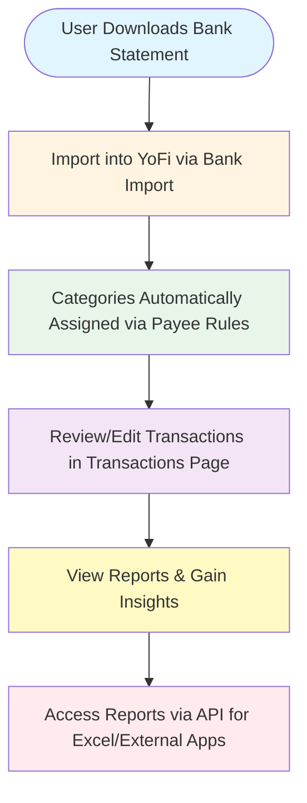
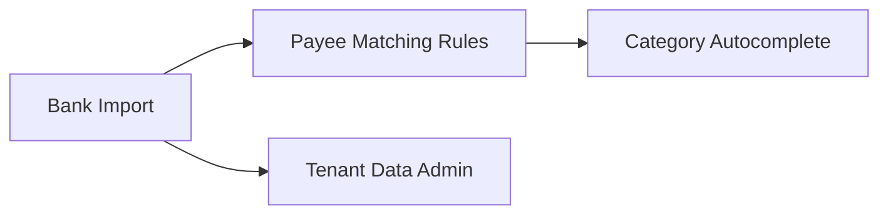
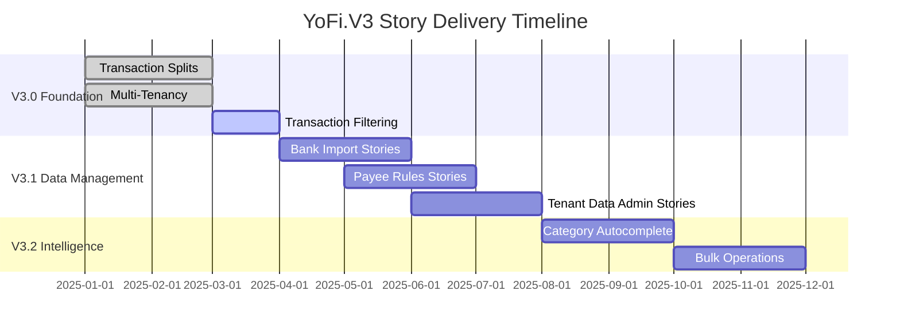

# YoFi.V3 Product Roadmap

**Status**: Draft
**Last Updated**: 2025-12-21
**Owner**: James Coliz

> [!NOTE] This document itself is a work in progress. When complete, I will move to top level docs as project documentation.

---

## Vision

YoFi.V3 is a modern personal finance tracking application that makes managing household money **effortless through intelligent automation**. We eliminate tedious manual categorization while providing the insights users need to make informed financial decisions.

**Core Principles:**
- **Automation First** - Minimize manual work through smart rules and pattern matching
- **Multi-User Ready** - Built for households and teams from day one
- **Data Privacy** - Your financial data stays under your control
- **Clean UX** - Simple workflows that don't overwhelm casual users

---

## User Journey

The core YoFi workflow follows a continuous cycle of data import, automated categorization, manual review, and insight generation:



**Primary Flow:**
1. **Download** transactions from bank → **Import** into YoFi
2. **Auto-categorize** transactions via payee matching rules
3. **Review/Edit** transactions (splits, categories, reconciliation)
4. **View reports** (category spending, trends, budgets)
5. **Export** data via API to Excel or external apps

**Side Quests (branch off from Review step):**
- **Update Payee Rules** - Create/edit matching rules, then re-match transactions
- **Workspace Data Management** - Bulk import/export all workspace data (XLSX)
- **Create/Modify Budgets** - Set up category budgets and spending targets

---

## Strategic Themes

### 🧮 Core Transaction Management
**Goal**: Provide robust, flexible transaction tracking that handles real-world complexity

**Why It Matters**: Users need accurate transaction records as the foundation for all financial insights. Single-category transactions are insufficient for real-world scenarios (grocery trips with food + household items, business expenses with mixed categories).

**Features**:
- Transaction CRUD with splits
- Transaction filtering and search
- Balance tracking and reconciliation
- Transaction record validation

### 🤖 Data Intelligence & Automation
**Goal**: Reduce manual categorization work through intelligent pattern matching

**Why It Matters**: Manual categorization at scale (hundreds of transactions per month) creates friction that prevents users from maintaining their financial tracking. Automation is the key differentiator that makes YoFi practical for daily use.

**Features**:
- Payee matching rules (substring and regex)
- Category autocomplete (future)
- Split templates (future)
- Bulk operations (future)

### 📥 Import & Integration
**Goal**: Seamlessly bring in transaction data from external sources

**Why It Matters**: Manual data entry is the #1 barrier to adoption. Users need frictionless import from their banks and other financial institutions.

**Features**:
- Bank file import (OFX/QFX)
- Duplicate detection
- Tenant data administration (XLSX import/export)
- API integrations (future - Plaid, etc.)

### 👥 Multi-User & Collaboration
**Goal**: Enable households and teams to manage finances together

**Why It Matters**: Financial management is often a shared responsibility. Multi-tenancy with role-based access enables collaboration while maintaining data isolation.

**Features**:
- Multi-tenancy (workspace) foundation
- Role-based access (Owner/Editor/Viewer)
- User management
- Activity auditing (future)

### 📊 Reports & Insights
**Goal**: Transform transaction data into actionable insights

**Why It Matters**: The ultimate value of transaction tracking is understanding spending patterns and making informed decisions. Reports close the loop on the user journey.

**Features**:
- Category spending reports
- Trend analysis and visualizations
- Budget creation and tracking
- API access for external reporting tools
- Custom dashboards
- Net worth tracking (balance sheet view)
- Tax planning and historical tax analysis

### 📎 Document Management
**Goal**: Connect supporting documents with transactions for complete records

**Why It Matters**: Financial tracking requires receipts, invoices, and statements as evidence. Automating attachment matching reduces manual filing work.

**Features**:
- Transaction attachments (receipts, invoices)
- Bulk document upload with auto-matching to transactions
- Filename-based matching patterns
- Document storage and retrieval

---

## Feature Map

> [!NOTE]
> Features are delivered incrementally through user stories. A feature may span multiple releases as stories are completed. Status reflects the overall feature state, not individual stories.

### V3.0 - Foundation (Current Focus)

| Feature | Status | User Stories | PRD | Technical Design | Notes |
|---------|--------|--------------|-----|------------------|-------|
| **Transaction Splits** | ✅ Implemented | 5/5 complete | [PRD](transactions/PRD-TRANSACTION-SPLITS.md) | [Design](transactions/TRANSACTION-SPLIT-DESIGN.md) | Split transactions across categories - core capability |
| **Transaction Filtering** | 🚧 In Progress | 2/4 complete | [PRD](transactions/PRD-TRANSACTION-FILTERING.md) | [UI Recommendations](transactions/TRANSACTION-FILTERING-UI-RECOMMENDATIONS.md) | Search and filter transaction list |
| **Multi-Tenancy Foundation** | ✅ Implemented | All complete | [ADR-0009](../adr/0009-accounts-and-tenancy.md) | [TENANCY.md](../TENANCY.md) | Workspace isolation with role-based access |
| **Authentication** | ✅ Implemented | All complete | [ADR-0008](../adr/0008-identity.md) | - | JWT-based auth with ASP.NET Core Identity |

**Theme Focus**: 🧮 Core Transaction Management + 👥 Multi-User & Collaboration

### V3.1 - Data Management (Next)

| Feature | Status | User Stories | PRD | Technical Design | Notes |
|---------|--------|--------------|-----|------------------|-------|
| **Bank Import (OFX/QFX)** | 📝 Approved | 0/4 started | [PRD](import-export/PRD-BANK-IMPORT.md) | TBD | Import transactions with duplicate detection |
| **Tenant Data Administration** | 📝 Draft | 0/5 started | [PRD](import-export/PRD-TENANT-DATA-ADMIN.md) | TBD | XLSX import/export for all entities |
| **Payee Matching Rules** | 📝 Approved | 0/5 started | [PRD](payee-rules/PRD-PAYEE-RULES.md) | TBD | Auto-categorize transactions by payee patterns |

**Theme Focus**: 📥 Import & Integration + 🤖 Data Intelligence & Automation

**Key Dependencies**:


### V3.2 - Intelligence & Efficiency (Planned)

| Feature | Status | User Stories | PRD | Notes |
|---------|--------|--------------|-----|-------|
| **Category Autocomplete** | 💡 Future | Not scoped | TBD | Suggest categories based on usage patterns |
| **Split Templates** | 💡 Future | Not scoped | TBD | Save common split patterns for reuse |
| **Bulk Categorization** | 💡 Future | Not scoped | TBD | Apply category/rules to multiple transactions |
| **Transaction Record Design** | 🎨 Design Complete | Documentation | [PRD](transactions/PRD-TRANSACTION-RECORD.md) | Formal transaction schema definition |

**Theme Focus**: 🤖 Data Intelligence & Automation

### V3.3+ - Reporting & Financial Planning (Future)

| Feature | Theme | Priority | User Stories | Notes |
|---------|-------|----------|--------------|-------|
| **Budget Creation & Tracking** | 📊 Reports & Insights | High | Not scoped | Create category budgets, track vs. actual, alerts |
| **Transaction Attachments** | 📎 Document Management | High | Not scoped | Attach receipts/invoices to transactions |
| **Bulk Document Upload** | 📎 Document Management | Medium | Not scoped | Upload documents with auto-match to transactions by filename |
| **API Reporting Endpoints** | 📊 Reports & Insights | Medium | Not scoped | Export reports for Excel and external tools |
| **Net Worth & Balance Sheet** | 📊 Reports & Insights | Medium | Not scoped | Investment tracking, asset/liability reporting |
| **Tax Planning & Analysis** | 📊 Reports & Insights | Medium | Not scoped | Map transactions to tax return, historical analysis, future planning |

### Future Backlog (Lower Priority)

| Feature | Theme | Priority | User Stories | Notes |
|---------|-------|----------|--------------|-------|
| Trend Visualization | 📊 Reports & Insights | Medium | Not scoped | Interactive charts for spending patterns over time |
| Plaid Integration | 📥 Import & Integration | Low | Not scoped | Real-time bank connectivity |
| Mobile App | 🧮 Core Transaction Management | Low | Not scoped | Native iOS/Android apps |
| Custom Dashboards | 📊 Reports & Insights | Low | Not scoped | User-configurable dashboard widgets |

---

## Story Delivery Approach

**Incremental Delivery Philosophy:**
- Features are delivered through **individual user stories**, not monolithic releases
- Stories are prioritized based on user value and technical dependencies
- A "feature" may have stories delivered across multiple releases
- Features remain in "🚧 In Progress" until all stories are complete

**Example: Bank Import Feature**
```
Story 1: Upload OFX file (2 weeks) → Delivered in V3.1-alpha
Story 2: Review imported transactions (2 weeks) → Delivered in V3.1-alpha
Story 3: Duplicate detection (3 weeks) → Delivered in V3.1-beta
Story 4: Error handling (1 week) → Delivered in V3.1-rc
```

**Tracking Story Progress:**
- Each PRD lists user stories with acceptance criteria
- Feature Map shows "X/Y complete" to track progress
- Stories can be linked to ADO work items for detailed tracking
- Status updates reflect latest completed stories

## Release Timeline

> [!NOTE]
> Timeline shows **when features start** and **expected completion**, but individual stories may deliver incrementally throughout the period.



**Reading this timeline:**
- Bars represent **active development periods** for feature stories
- Stories may deliver to users incrementally within the bar duration
- Overlapping bars indicate parallel work on multiple features
- Timeline is illustrative and adjusts based on story completion rates

---

## Feature Dependencies

### Critical Path
1. **Multi-Tenancy Foundation** (V3.0) → Enables all tenant-scoped features
2. **Transaction Splits** (V3.0) → Enables accurate category reporting
3. **Bank Import** (V3.1) → Enables high-volume transaction workflows
4. **Payee Matching Rules** (V3.1) → Makes bank import practical at scale

### Optional Enhancements
- **Category Autocomplete** depends on transaction history volume
- **Split Templates** depends on user workflow patterns
- **Bulk Operations** depends on user pain points with individual edits

---

## Success Metrics

### Product-Level KPIs

**User Engagement**:
- Monthly Active Users (MAU) growth rate
- Average transactions tracked per user per month (target: 100+)
- User retention rate at 90 days (target: >60%)

**Automation Effectiveness**:
- % of transactions auto-categorized via payee rules (target: >80%)
- Average time to categorize 100 transactions (target: <20 seconds)
- % of users who create payee rules within first month (target: >90%)

**Data Quality**:
- % of unbalanced split transactions (target: <1%)
- % of uncategorized transactions older than 30 days (target: <5%)

**Feature Adoption**:
- % of users using bank import (target: >60% within 30 days)
- % of users creating split transactions (target: >20%)
- Average payee rules per active user (target: >50)

### Feature-Specific Metrics
See individual PRDs for detailed feature success metrics.

---

## Status & Priority Definitions

### Status Values
- **💡 Future** - Identified but not yet planned
- **📝 Draft** - Initial requirements gathering, not yet reviewed
- **📝 Approved** - Requirements approved, ready for design
- **🎨 Design Complete** - Technical design finished, ready for implementation
- **🚧 In Progress** - Implementation underway
- **✅ Implemented** - Code complete and released

### Priority Levels
- **High** - Core functionality, blocking other features, or critical user needs
- **Medium** - Important but not blocking; enhances user experience
- **Low** - Nice to have, can be deferred indefinitely

---

## Out of Scope

**Explicitly NOT in YoFi.V3**:
- ❌ **Bill payment integration** - Tracking only, no payment execution
- ❌ **Tax preparation software** - Tax planning yes, but not a tax prep tool
- ❌ **Multi-currency** - Single currency per tenant (USD assumed)
- ❌ **Loan/mortgage amortization calculators** - Complex financial modeling out of scope
- ❌ **Cryptocurrency trading** - Too volatile and specialized for V3
- ❌ **Credit score monitoring** - External service integration, not core value

---

## Creating a New PRD

### Process
1. **Identify Strategic Theme** - Which capability area does this feature belong to?
2. **Copy Template** - Use [`PRD-TEMPLATE.md`](wip/PRD-TEMPLATE.md)
3. **Create PRD File** - Save in feature area folder: `docs/wip/{feature-area}/PRD-{FEATURE-NAME}.md`
4. **Fill Out Sections** - Problem Statement, Goals, User Stories, Technical Approach
5. **Update Roadmap** - Add feature to appropriate release section in this document
6. **Request Review** - Update status as PRD progresses through lifecycle

### PRD Guidelines
- **Keep PRDs concise** - Under 200 lines preferred; link to separate design docs for implementation details
- **Focus on what and why** - Save how (implementation) for technical design documents
- **Include acceptance criteria** - Make user stories testable with clear success conditions
- **Link to designs** - Reference detailed technical documents for implementation guidance
- **Reference existing patterns** - Link to similar features or architecture documents

### Handoff Checklist (for AI Implementation)
Before marking a PRD as "Design Complete" or "Ready for Implementation":
- [ ] All user stories have clear acceptance criteria
- [ ] Open questions are resolved or documented as design decisions
- [ ] Technical approach section indicates affected layers (Frontend, API, Application, Database)
- [ ] Existing code patterns and files are referenced as examples
- [ ] Companion technical design document created if needed (for complex features)

---

## Related Documentation

### Architecture & Decisions
- [`ARCHITECTURE.md`](ARCHITECTURE.md) - System architecture overview
- [`adr/README.md`](adr/README.md) - Architecture Decision Records

### Technical Guides
- [`TENANCY.md`](TENANCY.md) - Multi-tenancy architecture
- [`LOGGING-POLICY.md`](LOGGING-POLICY.md) - Logging standards
- [`COMMIT-CONVENTIONS.md`](COMMIT-CONVENTIONS.md) - Git commit format

### Development
- [`CONTRIBUTING.md`](CONTRIBUTING.md) - Development guidelines
- [`scripts/README.md`](../scripts/README.md) - Automation scripts
- [`.roorules`](../.roorules) - Project coding standards

---

## Feedback & Updates

This roadmap is a living document. As we learn from users and evolve our understanding of their needs, features may move between releases or change priority.

**How to provide feedback:**
- Open a GitHub Discussion for strategic questions
- Open a GitHub Issue for specific feature requests
- Contact the owner directly for roadmap questions

**Last Major Update**: 2025-12-21 - Initial roadmap creation with integrated feature map
