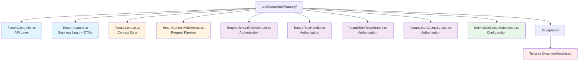
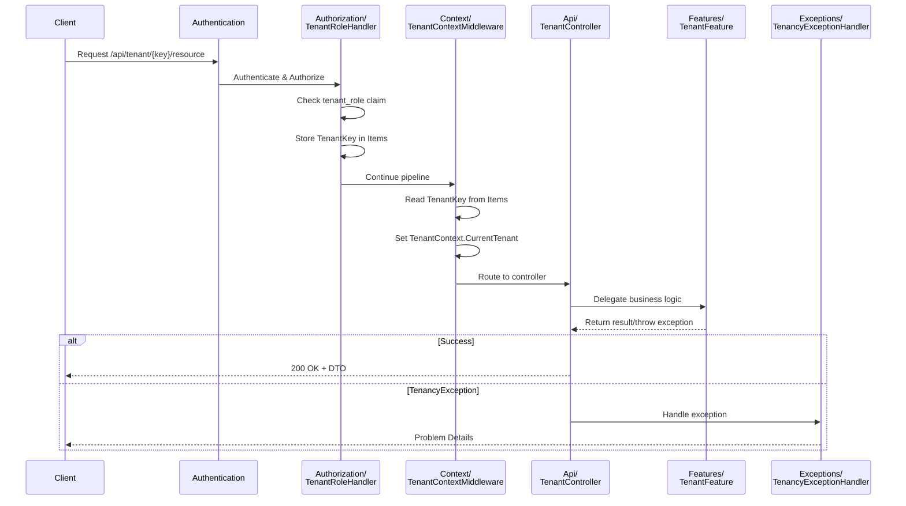

# Tenancy Directory Restructure - Visual Guide

## Before: Current Structure (Mixed Concerns)



**Problem**: 9 different files at root level with 5 different concerns mixed together!

## After: Proposed Structure (Organized by Concern)

```mermaid
graph TD
    Root[src/Controllers/Tenancy/]

    Root --> ApiDir[Api/<br/>API Layer]
    Root --> AuthDir[Authorization/<br/>Auth Layer]
    Root --> ContextDir[Context/<br/>Context Layer]
    Root --> FeaturesDir[Features/<br/>Business Logic]
    Root --> ExDir[Exceptions/<br/>Error Handling]
    Root --> Extensions[ServiceCollectionExtensions.cs<br/>Configuration]

    ApiDir --> Controller[TenantController.cs]
    ApiDir --> DtoDir[Dto/]
    DtoDir --> EditDto[TenantEditDto.cs]
    DtoDir --> ResultDto[TenantResultDto.cs]
    DtoDir --> RoleDto[TenantRoleResultDto.cs]

    AuthDir --> Attribute[RequireTenantRoleAttribute.cs]
    AuthDir --> Handler[TenantRoleHandler.cs]
    AuthDir --> Requirement[TenantRoleRequirement.cs]
    AuthDir --> Claims[TenantUserClaimsService.cs]

    ContextDir --> Context[TenantContext.cs]
    ContextDir --> Middleware[TenantContextMiddleware.cs]

    FeaturesDir --> Feature[TenantFeature.cs]

    ExDir --> ExHandler[TenancyExceptionHandler.cs]

    style ApiDir fill:#e1f5ff
    style Controller fill:#e1f5ff
    style DtoDir fill:#e1f5ff
    style EditDto fill:#e1f5ff
    style ResultDto fill:#e1f5ff
    style RoleDto fill:#e1f5ff

    style AuthDir fill:#f3e5f5
    style Attribute fill:#f3e5f5
    style Handler fill:#f3e5f5
    style Requirement fill:#f3e5f5
    style Claims fill:#f3e5f5

    style ContextDir fill:#fff3e0
    style Context fill:#fff3e0
    style Middleware fill:#fff3e0

    style FeaturesDir fill:#e1f5ff
    style Feature fill:#e1f5ff

    style Extensions fill:#e8f5e9

    style ExDir fill:#ffebee
    style ExHandler fill:#ffebee
```



**Solution**: Clear hierarchy with 6 top-level items (5 directories + 1 config file), each focused on a single concern!

## Concern Mapping

### Legend
- 🔵 **Blue** = API Layer (Controllers, DTOs)
- 🟣 **Purple** = Authorization Layer
- 🟠 **Orange** = Context Management Layer
- 🟢 **Green** = Configuration
- 🔴 **Red** = Exception Handling

### Current File Distribution by Concern

| Concern | Files | Current Location |
|---------|-------|------------------|
| 🔵 API | 1 file + 3 inline DTOs | Root |
| 🟣 Authorization | 4 files | Root (scattered) |
| 🟠 Context | 2 files | Root (scattered) |
| 🔵 Business Logic | 1 file | Root |
| 🟢 Configuration | 1 file | Root |
| 🔴 Exception Handling | 1 file | Exceptions/ |

### Proposed File Distribution by Concern

| Concern | Files | Proposed Location |
|---------|-------|-------------------|
| 🔵 API | 1 file + 3 separate DTOs | Api/ and Api/Dto/ |
| 🟣 Authorization | 4 files | Authorization/ |
| 🟠 Context | 2 files | Context/ |
| 🔵 Business Logic | 1 file | Features/ |
| 🟢 Configuration | 1 file | Root (stays) |
| 🔴 Exception Handling | 1 file | Exceptions/ (stays) |

## Request Processing Flow

This diagram shows how the components interact during a tenant-scoped API request:



## Benefits Visualization

### Before: Finding Authorization Code
```
src/Controllers/Tenancy/
├── RequireTenantRoleAttribute.cs     ← Scan 9 files
├── ServiceCollectionExtensions.cs    ← to find all
├── TenantContext.cs                  ← authorization
├── TenantContextMiddleware.cs        ← components
├── TenantController.cs               ← scattered
├── TenantFeature.cs                  ← throughout
├── TenantRoleHandler.cs              ← the
├── TenantRoleRequirement.cs          ← directory
└── TenantUserClaimsService.cs        ← Mixed!
```

### After: Finding Authorization Code
```
src/Controllers/Tenancy/
└── Authorization/                     ← All auth code
    ├── RequireTenantRoleAttribute.cs  ← in one
    ├── TenantRoleHandler.cs           ← clearly
    ├── TenantRoleRequirement.cs       ← labeled
    └── TenantUserClaimsService.cs     ← directory!
```

## Directory Size Comparison

| Directory | Current | Proposed | Change |
|-----------|---------|----------|--------|
| **Root Level** | 9 files + 1 dir | 1 file + 5 dirs | Better organization |
| **Total Directories** | 2 (Tenancy/, Exceptions/) | 7 (Tenancy/, Api/, Dto/, Auth/, Context/, Features/, Exceptions/) | +5 |
| **Total Files** | 10 files | 13 files | +3 (extracted DTOs) |
| **Max Depth** | 2 levels | 3 levels | +1 |

## Navigation Examples

### Example 1: "Where are the DTOs?"

**Before:**
```
❓ Check TenantFeature.cs
❓ Check TenantController.cs
❓ Maybe they're inline?
```

**After:**
```
✅ Look in Api/Dto/
   - TenantEditDto.cs
   - TenantResultDto.cs
   - TenantRoleResultDto.cs
```

### Example 2: "How does authorization work?"

**Before:**
```
❓ TenantRoleHandler.cs (in root)
❓ RequireTenantRoleAttribute.cs (in root)
❓ TenantRoleRequirement.cs (in root)
❓ TenantUserClaimsService.cs (in root)
❓ ServiceCollectionExtensions.cs (in root - setup)
```

**After:**
```
✅ Look in Authorization/
   - All authorization components together
   - Clear flow visible from file list
```

### Example 3: "What runs in the request pipeline?"

**Before:**
```
❓ TenantContextMiddleware.cs (in root with 8 other files)
```

**After:**
```
✅ Look in Context/
   - TenantContextMiddleware.cs
   - TenantContext.cs (state it manages)
   - Clear relationship
```

## Summary

### Key Improvements

1. **Discoverability**: 5 directories = 5 clear concerns
2. **Scalability**: Each concern has room to grow independently
3. **Maintainability**: Changes to one concern don't touch others
4. **Understandability**: Structure matches architecture
5. **Standard Patterns**: Follows ASP.NET Core conventions

### Migration Effort

- **Files to Move**: 9 files
- **Files to Extract**: 3 DTOs from 1 file
- **Namespace Updates**: ~12 files
- **Test Updates**: 2-3 test files
- **Total Effort**: Low-Medium (mostly mechanical refactoring)

### Risk Level

**Low Risk** - This is a pure structural refactoring:
- No logic changes
- No behavior changes
- Compiler ensures correctness
- Tests validate functionality
