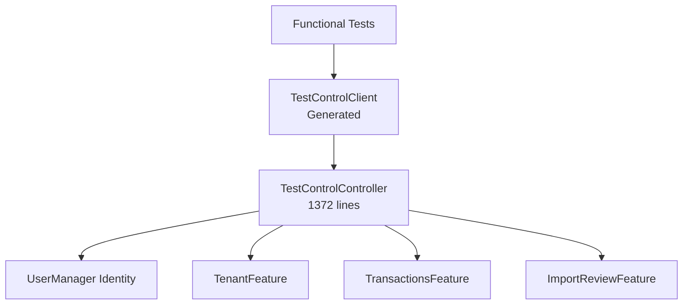
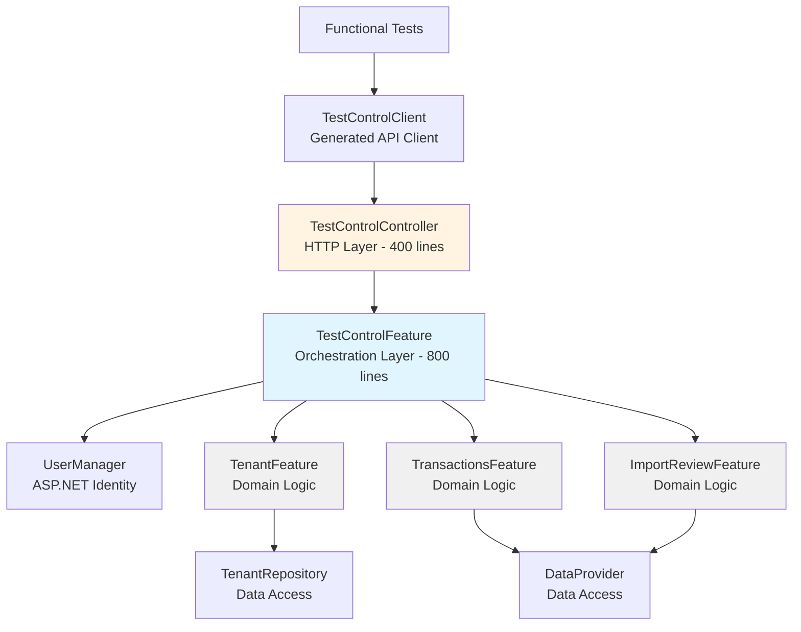

# Test Control Controller Refactoring Options

## Problem Statement

[`TestControlController.cs`](../../src/Controllers/TestControlController.cs) has grown to **1372 lines** and handles multiple distinct responsibilities:

1. **Test Identification** - Logging test correlation metadata (1 endpoint)
2. **User Management** - Creating, approving, and deleting test users (5 endpoints: v1 + v2)
3. **Workspace Management** - Creating, assigning, and deleting test workspaces (6 endpoints)
4. **Transaction Seeding** - Seeding transactions and import review data (3 endpoints)
5. **Error Testing** - Generating various HTTP error responses (2 endpoints)
6. **Pagination Testing** - Testing pagination UI components (1 endpoint)

The controller also contains:
- 7 DTOs/records (lines 24-91)
- Multiple helper methods for validation, password generation, and shared logic
- 14 logger message methods
- Heavy coupling to UserManager, TenantFeature, TransactionsFeature, and ImportReviewFeature

This violates the Single Responsibility Principle and makes the code difficult to maintain, test, and extend.

## Current Architecture



**Key Issues:**
- Single monolithic controller with 6 distinct responsibility areas
- 18 total endpoints in one controller
- Direct injection of multiple features and UserManager
- Business logic mixed with HTTP concerns (validation, error handling)
- Test helper methods (password generation, user creation) embedded in controller

---

## Dependency Flow: TestControlFeature Architecture

### How TestControlFeature Would Work

**Key Principle:** TestControlFeature **orchestrates** test setup by calling domain features (TenantFeature, TransactionsFeature, etc.). The controller becomes a thin HTTP adapter.



### Keeping ASP.NET Identity Out of Application Layer

**Challenge:** UserManager is an ASP.NET Core Identity type. We want to keep Application layer free of infrastructure dependencies.

**Solution:** Create an abstraction layer (ITestUserRepository) in Entities, implement it in Controllers layer.

### Dependency Injection Pattern (Clean Architecture)

**ITestUserRepository (Entities Layer - Interface):**
```csharp
// src/Entities/Providers/ITestUserRepository.cs
namespace YoFi.V3.Entities.Providers;

public interface ITestUserRepository
{
    Task<TestUserResult> CreateUserAsync(string username, string email, string password);
    Task<TestUserResult?> FindUserByNameAsync(string username);
    Task<IReadOnlyCollection<TestUserResult>> GetUsersWithPrefixAsync(string prefix);
    Task DeleteUserAsync(Guid userId);
}

public record TestUserResult(Guid Id, string Username, string Email);
```

**TestUserRepository (Controllers Layer - Implementation):**
```csharp
// src/Controllers/TestControl/TestUserRepository.cs
using Microsoft.AspNetCore.Identity;
using YoFi.V3.Entities.Providers;

namespace YoFi.V3.Controllers.TestControl;

public class TestUserRepository(UserManager<IdentityUser> userManager) : ITestUserRepository
{
    public async Task<TestUserResult> CreateUserAsync(string username, string email, string password)
    {
        var user = new IdentityUser
        {
            UserName = username,
            Email = email,
            EmailConfirmed = true
        };

        var result = await userManager.CreateAsync(user, password);

        if (!result.Succeeded)
        {
            var errors = string.Join("; ", result.Errors.Select(e => e.Description));
            throw new InvalidOperationException($"Unable to create user {username}: {errors}");
        }

        return new TestUserResult(Guid.Parse(user.Id), user.UserName!, user.Email!);
    }

    public async Task<TestUserResult?> FindUserByNameAsync(string username)
    {
        var user = await userManager.FindByNameAsync(username);
        if (user == null) return null;

        return new TestUserResult(Guid.Parse(user.Id), user.UserName!, user.Email!);
    }

    public async Task<IReadOnlyCollection<TestUserResult>> GetUsersWithPrefixAsync(string prefix)
    {
        var users = userManager.Users
            .Where(u => u.UserName != null && u.UserName.Contains(prefix))
            .ToList();

        return users.Select(u => new TestUserResult(
            Guid.Parse(u.Id),
            u.UserName!,
            u.Email!
        )).ToList();
    }

    public async Task DeleteUserAsync(Guid userId)
    {
        var user = await userManager.FindByIdAsync(userId.ToString());
        if (user != null)
        {
            await userManager.DeleteAsync(user);
        }
    }
}
```

**TestControlController (HTTP Layer):**
```csharp
public partial class TestControlController(
    TestControlFeature testControlFeature,  // ← Only dependency
    ILogger<TestControlController> logger
) : ControllerBase
{
    [HttpPost("users")]
    public async Task<IActionResult> CreateUsers([FromBody] IReadOnlyCollection<string> usernames)
    {
        LogStartingCount(usernames.Count);

        // Delegate to feature - no business logic here
        var credentials = await testControlFeature.CreateUsersAsync(usernames);

        LogOkCount(credentials.Count);
        return CreatedAtAction(nameof(CreateUsers), credentials);
    }
}
```

**TestControlFeature (Orchestration Layer - NO ASP.NET DEPENDENCIES):**
```csharp
// src/Application/Features/TestControl/TestControlFeature.cs
using YoFi.V3.Entities.Providers;  // ← Only depends on abstraction

public class TestControlFeature(
    ITestUserRepository testUserRepository,  // ← Clean abstraction!
    TenantFeature tenantFeature,
    ILogger<TestControlFeature> logger
)
{
    public async Task<IReadOnlyCollection<TestUserCredentials>> CreateUsersAsync(
        IReadOnlyCollection<string> usernames)
    {
        // Business logic here: validation, password generation, orchestration
        var runSuffix = Guid.NewGuid().ToString("N")[..8];
        var credentials = new List<TestUserCredentials>();

        foreach (var username in usernames)
        {
            var finalUsername = username.StartsWith(TestPrefix)
                ? username
                : TestPrefix + username;
            finalUsername += "_" + runSuffix;

            var email = $"{finalUsername}@test.com";
            var password = GenerateSecurePassword(16);

            // Call abstraction - no ASP.NET Identity dependency
            var result = await testUserRepository.CreateUserAsync(
                finalUsername,
                email,
                password
            );

            credentials.Add(new TestUserCredentials(
                Id: result.Id,
                ShortName: username,
                Username: result.Username,
                Email: result.Email,
                Password: password
            ));
        }

        return credentials;
    }

    public async Task<TenantResultDto> CreateWorkspaceForUserAsync(
        string username,
        WorkspaceCreateRequest request)
    {
        // Validate username and workspace name have test prefix
        ValidateTestPrefix(username, "username");
        ValidateTestPrefix(request.Name, "workspace name");

        // Find user via abstraction (not UserManager!)
        var user = await testUserRepository.FindUserByNameAsync(username);
        if (user == null)
        {
            throw new UserNotFoundException(username);
        }

        // Call TenantFeature to create workspace
        var tenantDto = new TenantEditDto(request.Name, request.Description);
        var result = await tenantFeature.CreateTenantAsync(tenantDto);

        // Get tenant ID and assign role via TenantFeature
        var tenant = await tenantFeature.GetTenantByKeyAsync(result.Key);
        await tenantFeature.AddUserTenantRoleAsync(
            user.Id,  // ← Clean: Guid from abstraction
            tenant!.Id,
            TenantRole.Owner
        );

        return result;
    }

    public async Task<IReadOnlyCollection<TransactionResultDto>> SeedTransactionsAsync(
        string username,
        Guid tenantKey,
        TransactionSeedRequest request,
        TransactionsFeature transactionsFeature)  // ← Passed from controller!
    {
        // Validate user/workspace access
        await ValidateUserWorkspaceAccessAsync(username, tenantKey);

        // Generate transaction data
        var transactions = GenerateTestTransactions(request);

        // Call TransactionsFeature to create transactions
        // Note: TransactionsFeature already has tenant context set
        var results = new List<TransactionResultDto>();
        foreach (var tx in transactions)
        {
            var result = await transactionsFeature.AddTransactionAsync(tx);
            results.Add(new TransactionResultDto(...));
        }

        return results;
    }
}
```

### Why TransactionsFeature is Special

**TransactionsFeature depends on tenant context** (via ITenantProvider in constructor). This is set by:
1. `[Authorize("AllowAnonymousTenantAccess")]` on controller endpoint
2. Authorization handler sets `HttpContext.Items["TenantKey"]`
3. TenantContextMiddleware reads it and sets tenant in scoped ITenantProvider
4. TransactionsFeature gets injected with tenant context **already set**

**Therefore:** TestControlFeature **cannot** inject TransactionsFeature in constructor (tenant context not available yet). Instead:
- Controller injects TransactionsFeature via `[FromServices]`
- Controller passes it to TestControlFeature method
- Feature uses it with tenant context already established

**Example:**
```csharp
// Controller
[HttpPost("users/{username}/workspaces/{tenantKey:guid}/transactions/seed")]
[Authorize("AllowAnonymousTenantAccess")]  // ← Sets tenant context
public async Task<IActionResult> SeedTransactions(
    string username,
    Guid tenantKey,
    [FromBody] TransactionSeedRequest request,
    [FromServices] TransactionsFeature transactionsFeature)  // ← Injected with context
{
    var result = await testControlFeature.SeedTransactionsAsync(
        username,
        tenantKey,
        request,
        transactionsFeature  // ← Pass to feature
    );
    return Ok(result);
}
```

### Architecture Layers

```
┌─────────────────────────────────────────────────────────────┐
│ Controllers Layer (Infrastructure)                          │
│  - TestControlController (HTTP)                             │
│  - TestUserRepository (ASP.NET Identity wrapper)            │
└────────────────┬────────────────────────────────────────────┘
                 │ depends on ↓
┌────────────────▼────────────────────────────────────────────┐
│ Application Layer (Business Logic)                          │
│  - TestControlFeature (orchestration)                       │
│  - TenantFeature (domain logic)                             │
│  - TransactionsFeature (domain logic)                       │
└────────────────┬────────────────────────────────────────────┘
                 │ depends on ↓
┌────────────────▼────────────────────────────────────────────┐
│ Entities Layer (Abstractions)                               │
│  - ITestUserRepository (interface)                          │
│  - ITenantRepository (interface)                            │
│  - IDataProvider (interface)                                │
└─────────────────────────────────────────────────────────────┘
```

### Summary: Who Calls What

| Component | Calls | Why |
|-----------|-------|-----|
| **TestControlController** | TestControlFeature | Thin HTTP adapter, delegates all business logic |
| **TestControlFeature** | ITestUserRepository | Clean abstraction for user operations (no ASP.NET dependency!) |
| **TestControlFeature** | TenantFeature | Reuses domain logic for workspace/role management |
| **TestControlFeature** | TransactionsFeature | Receives from controller (tenant context dependency) |
| **TestControlFeature** | ImportReviewFeature | Receives from controller (tenant context dependency) |
| **TestUserRepository** | UserManager | Implementation detail hidden in Controllers layer |

**Benefits:**
- ✅ Controller has **only one dependency** (TestControlFeature)
- ✅ TestControlFeature **reuses existing domain features** (no duplication)
- ✅ **Application layer is free of ASP.NET dependencies** (Clean Architecture!)
- ✅ Clean separation: HTTP + Identity in Controllers, orchestration in Application
- ✅ Business logic (validation, password generation) testable without HTTP or Identity
- ✅ Tenant context handling preserved (via middleware + authorization)
- ✅ ITestUserRepository can be mocked for unit testing TestControlFeature

## Refactoring Options

### Option 1: Create TestControlFeature (Application Layer)

**Move business logic to a new Application Feature while keeping a single controller.**

#### Structure

```
src/Application/Features/
  ├── TestControl/
  │   ├── TestControlFeature.cs         # User/workspace/transaction orchestration
  │   └── Dto/
  │       ├── TestUserCredentials.cs
  │       ├── WorkspaceCreateRequest.cs
  │       └── ...other DTOs

src/Controllers/
  └── TestControlController.cs          # Slim HTTP layer (400 lines)
```

#### Responsibilities

**TestControlFeature:**
- User creation/deletion logic with password generation
- Workspace creation/assignment logic
- Transaction seeding orchestration
- Validation logic (test prefix checks, user-workspace access)
- Coordination between UserManager, TenantFeature, and TransactionsFeature

**TestControlController:**
- HTTP routing and request/response handling
- Minimal validation (model binding)
- Calling TestControlFeature methods
- Logging and ProblemDetails generation

#### Pros

✅ Separates business logic from HTTP concerns (Clean Architecture)
✅ TestControlFeature can be unit tested without HTTP infrastructure
✅ Reduces controller size significantly (~400 lines)
✅ Centralizes test control logic in one feature
✅ Easier to add new test control capabilities
✅ Single API client generation (no breaking changes)

#### Cons

❌ Still a large single controller (though much smaller)
❌ TestControlFeature would be large (~800-900 lines)
❌ Doesn't address the multiple responsibilities issue fully
❌ May create a "god feature" that does too much

#### Effort

**Medium** - Requires creating new Application Feature project structure and moving logic.

---

### Option 2: Multiple Domain-Specific Controllers

**Split by responsibility domain into separate controllers.**

#### Structure

```
src/Controllers/TestControl/
  ├── TestUserController.cs             # User management (v1 + v2)
  ├── TestWorkspaceController.cs        # Workspace creation/assignment
  ├── TestDataSeedingController.cs      # Transaction/import seeding
  ├── TestErrorController.cs            # Error generation
  └── TestUtilityController.cs          # Test identification, pagination

src/Controllers/TestControl/Shared/
  └── TestControlHelpers.cs             # Shared validation/helpers
```

#### Route Structure

```
/TestUser/users                         # User operations
/TestUser/users/{username}/approve

/TestWorkspace/workspaces               # Workspace operations
/TestWorkspace/users/{username}/workspaces
/TestWorkspace/users/{username}/workspaces/{key}/assign

/TestDataSeeding/seed/transactions      # Data seeding
/TestDataSeeding/seed/import-review
/TestDataSeeding/data                   # Delete all test data

/TestError/errors                       # Error testing
/TestError/errors/{code}

/TestUtility/ident                      # Utilities
/TestUtility/pagination/strings
```

#### Pros

✅ Clear separation of concerns by domain
✅ Each controller is small and focused (150-300 lines each)
✅ Easy to understand and maintain individual controllers
✅ Independent evolution of each responsibility area
✅ Better alignment with REST principles
✅ Easier to add new capabilities to specific domains

#### Cons

❌ **Breaking change** - All functional test code must be updated
❌ Multiple API clients generated (TestUserClient, TestWorkspaceClient, etc.)
❌ May need to duplicate some validation logic across controllers
❌ URL paths change significantly
❌ More files to manage (5+ controllers vs 1)

#### Effort

**High** - Requires splitting controller AND updating all functional tests.

---

### Option 3: Feature + Focused Controllers (Hybrid)

**Combine Option 1 and Option 2: Create TestControlFeature AND split into focused controllers.**

#### Structure

```
src/Application/Features/TestControl/
  ├── TestControlFeature.cs             # Orchestration logic
  └── Dto/
      ├── TestUserCredentials.cs
      └── ...other DTOs

src/Controllers/TestControl/
  ├── TestUserController.cs             # Users (calls feature)
  ├── TestWorkspaceController.cs        # Workspaces (calls feature)
  ├── TestDataSeedingController.cs      # Seeding (calls feature)
  ├── TestErrorController.cs            # Errors (no feature needed)
  └── TestUtilityController.cs          # Utilities (no feature needed)
```

#### Route Structure

Same as Option 2 (domain-specific routes).

#### Pros

✅ **Best separation of concerns** at both Application and Controller layers
✅ Clean Architecture compliance (business logic in Application layer)
✅ Each controller is small, focused, and testable
✅ TestControlFeature can be thoroughly unit tested
✅ Controllers become thin HTTP adapters
✅ Most maintainable long-term

#### Cons

❌ **Breaking change** - All functional tests must be updated
❌ Most work required (both feature creation AND controller splitting)
❌ Multiple API clients generated
❌ May be over-engineered for test infrastructure
❌ More complex directory structure

#### Effort

**Very High** - Requires creating Application Feature AND splitting controllers AND updating all tests.

---

### Option 4: Keep Single Controller, Extract Helpers

**Minimal refactoring: Extract helper methods and DTOs, keep single controller.**

#### Structure

```
src/Controllers/TestControl/
  ├── TestControlController.cs          # All endpoints (~800 lines)
  ├── Helpers/
  │   ├── TestUserHelper.cs             # User creation/password logic
  │   ├── TestValidationHelper.cs       # Test prefix validation
  │   └── TestTransactionHelper.cs      # Transaction seeding logic
  └── Dto/
      ├── TestUserCredentials.cs
      └── ...other DTOs
```

#### Pros

✅ **No breaking changes** - Functional tests continue to work
✅ Minimal effort - Just extract helper classes
✅ Reduces controller line count (~800 lines)
✅ Single API client (no changes)
✅ Improved organization without major restructuring

#### Cons

❌ Still a single large controller with multiple responsibilities
❌ Doesn't address architectural concerns
❌ Helper classes would still be coupled to Controller layer
❌ Business logic remains in Controllers layer (not Clean Architecture)
❌ Limited improvement in maintainability

#### Effort

**Low** - Just extract helper classes and move DTOs.

---

## Comparison Matrix

| Criteria | Option 1<br/>Feature | Option 2<br/>Controllers | Option 3<br/>Hybrid | Option 4<br/>Helpers |
|----------|---------------------|--------------------------|---------------------|----------------------|
| **Separation of Concerns** | Good | Excellent | Excellent | Poor |
| **Clean Architecture** | Yes | No | Yes | No |
| **Controller Size** | Medium (~400 lines) | Small (150-300 each) | Small (150-300 each) | Large (~800 lines) |
| **Breaking Changes** | None | Yes (all tests) | Yes (all tests) | None |
| **Effort** | Medium | High | Very High | Low |
| **Maintainability** | Good | Very Good | Excellent | Fair |
| **Testability** | Excellent | Good | Excellent | Fair |
| **Long-term Value** | Good | Good | Excellent | Low |

---

## Recommendations

### Recommended: **Option 1 - Create TestControlFeature**

**Rationale:**
- Achieves Clean Architecture goals (business logic in Application layer)
- Significantly reduces controller size and complexity
- **No breaking changes** to functional tests (critical for test infrastructure)
- Medium effort with high value
- Can be done incrementally without disrupting test execution
- Aligns with existing pattern (TransactionsFeature, TenantFeature, etc.)

**Implementation Approach:**
1. Create `src/Application/Features/TestControl/TestControlFeature.cs`
2. Move DTOs to `src/Application/Features/TestControl/Dto/`
3. Extract user management logic to feature methods
4. Extract workspace management logic to feature methods
5. Extract transaction seeding logic to feature methods
6. Update controller to delegate to feature
7. Add unit tests for TestControlFeature
8. Verify functional tests still pass (no changes needed)

### Alternative: **Option 2 - Multiple Controllers** (if breaking changes acceptable)

If functional test updates are acceptable and you want **maximum separation of concerns at the API level**, Option 2 is also viable. However, this requires:
- Updating all functional test step definitions
- Regenerating API client
- Testing all functional scenarios
- Coordinating changes across test infrastructure

### Not Recommended: **Option 3** (over-engineering) or **Option 4** (insufficient improvement)

---

## Migration Path (Option 1)

### Phase 1: Create Feature Infrastructure
- [ ] Create `src/Application/Features/TestControl/` directory
- [ ] Create `TestControlFeature.cs` with constructor and basic structure
- [ ] Move DTOs from controller to `src/Application/Features/TestControl/Dto/`
- [ ] Update controller using statements

### Phase 2: Extract User Management
- [ ] Move `CreateUsersInternalAsync()` to feature
- [ ] Move `GenerateSecurePassword()` to feature
- [ ] Add `CreateUsersAsync()` and `CreateUsersV2Async()` to feature
- [ ] Add `DeleteUsersAsync()` and `DeleteUsersV2Async()` to feature
- [ ] Update controller endpoints to call feature methods

### Phase 3: Extract Workspace Management
- [ ] Move `ValidateUserWorkspaceAccessAsync()` to feature
- [ ] Add workspace creation methods to feature
- [ ] Add workspace assignment methods to feature
- [ ] Add bulk workspace setup to feature
- [ ] Add workspace deletion to feature
- [ ] Update controller endpoints to call feature methods

### Phase 4: Extract Transaction Seeding
- [ ] Move `CreateTransactionsAsync()` to feature
- [ ] Add transaction seeding methods to feature
- [ ] Add import review seeding to feature
- [ ] Update controller endpoints to call feature methods

### Phase 5: Testing & Cleanup
- [ ] Add unit tests for TestControlFeature
- [ ] Run functional tests to verify no regressions
- [ ] Remove unused helper methods from controller
- [ ] Update XML documentation
- [ ] Final code review

---

## Open Questions

1. **Should error testing endpoints remain in TestControlController?**
   - These are simple and don't need feature logic
   - Could move to separate `TestErrorController` if desired

2. **Should DTOs be shared across Application layer?**
   - Currently in controller DTOs namespace
   - Should move to `Application.Features.TestControl.Dto`
   - Affects imports in functional tests (via generated client)

3. **Should TestControlFeature have sub-features?**
   - Could split into `TestUserFeature`, `TestWorkspaceFeature`, etc.
   - Adds complexity but might be cleaner long-term

4. **What about the anonymous tenant access authorization?**
   - Currently handled by controller with `[Authorize("AllowAnonymousTenantAccess")]`
   - Feature would need access to HttpContext or tenant key passed as parameter
   - May need to refactor how tenant context is set for seeding operations

---

## Related Files

- [`src/Controllers/TestControlController.cs`](../../src/Controllers/TestControlController.cs) - Current implementation
- [`src/Application/Features/TransactionsFeature.cs`](../../src/Application/Features/TransactionsFeature.cs) - Feature pattern example
- [`src/Application/Tenancy/Features/TenantFeature.cs`](../../src/Application/Tenancy/Features/TenantFeature.cs) - Feature pattern example
- [`tests/Functional/Infrastructure/FunctionalTestBase.cs`](../../tests/Functional/Infrastructure/FunctionalTestBase.cs) - Test infrastructure
- [`tests/Functional/Steps/AuthSteps.cs`](../../tests/Functional/Steps/AuthSteps.cs) - Uses TestControlClient
- [`tests/Functional/Steps/Workspace/WorkspaceDataSteps.cs`](../../tests/Functional/Steps/Workspace/WorkspaceDataSteps.cs) - Uses TestControlClient

---

## Decision

**Status:** Awaiting feedback

**Next Steps:**
1. Review proposed options with team
2. Assess tolerance for breaking changes in functional tests
3. Choose option and create implementation plan
4. Execute refactoring in phases with continuous test verification
