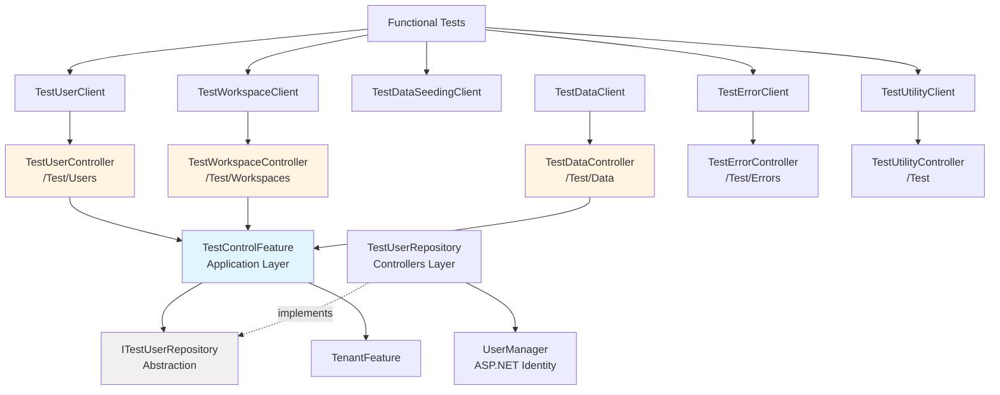

# Test Control Refactoring - Selected Approach

## Selected: Hybrid Approach (Option 3) with `/Test` Route Prefix

**Combines:**
- TestControlFeature in Application layer (Clean Architecture)
- Multiple focused controllers in Controllers layer (Scalability)
- Shared `/Test` route prefix (API cohesion)
- ITestUserRepository abstraction (No ASP.NET in Application layer)

### Rationale

✅ **Ready for growth** - Test control needs expected to double or triple
✅ **Clean Architecture** - Business logic in Application layer
✅ **Focused controllers** - Each 150-300 lines, easy to maintain
✅ **Scalable** - Each domain can evolve independently
✅ **Testable** - Feature can be unit tested without HTTP infrastructure
✅ **ASP.NET-free Application layer** - Uses ITestUserRepository abstraction

### Architecture



## Directory Structure

```
src/Application/Features/TestControl/
  ├── TestControlFeature.cs             # Orchestration logic (800 lines)
  └── Dto/
      ├── TestUserCredentials.cs
      ├── WorkspaceCreateRequest.cs
      ├── WorkspaceSetupRequest.cs
      ├── UserRoleAssignment.cs
      ├── TransactionSeedRequest.cs
      ├── WorkspaceSetupResult.cs
      └── ErrorCodeInfo.cs

src/Entities/Providers/
  ├── ITestUserRepository.cs            # User operations abstraction
  └── TestUserResult.cs                 # Clean DTO (no ASP.NET)

src/Controllers/TestControl/
  ├── TestUserController.cs             # User management (150-200 lines)
  ├── TestWorkspaceController.cs        # Workspace operations (200-250 lines)
  ├── TestDataController.cs             # Data management + example data (250-300 lines)
  ├── TestErrorController.cs            # Error generation (100-150 lines)
  ├── TestUtilityController.cs          # Cross-cutting test utilities (50-100 lines)
  └── TestUserRepository.cs             # ITestUserRepository impl (150 lines)
```

## Route Structure (Shared `/Test` Prefix)

### TestUserController - `[Route("Test/Users")]`

| Method | Route | Description |
|--------|-------|-------------|
| POST | /Test/Users | Create users (v1) |
| POST | /Test/Users/v2 | Create users (v2 - client-generated credentials) |
| PUT | /Test/Users/{username}/approve | Approve user |
| DELETE | /Test/Users | Delete users (v1 - all with prefix) |
| DELETE | /Test/Users/v2 | Delete users (v2 - explicit list) |

### TestWorkspaceController - `[Route("Test/Workspaces")]`

| Method | Route | Description |
|--------|-------|-------------|
| POST | /Test/Workspaces/users/{username}/workspaces | Create workspace for user |
| POST | /Test/Workspaces/users/{username}/workspaces/{key}/assign | Assign user to workspace |
| POST | /Test/Workspaces/users/{username}/workspaces/bulk | Bulk workspace setup |
| DELETE | /Test/Workspaces | Delete multiple workspaces |
| DELETE | /Test/Workspaces/data | Delete ALL test data |

### TestDataController - `[Route("Test/Data")]`

| Method | Route | Description |
|--------|-------|-------------|
| POST | /Test/Data/users/{username}/workspaces/{tenantKey}/transactions/seed | Seed random transactions |
| POST | /Test/Data/users/{username}/workspaces/{tenantKey}/transactions/seed-precise | Seed specific transactions |
| POST | /Test/Data/users/{username}/workspaces/{tenantKey}/import/seed | Seed import review transactions |
| GET | /Test/Data/pagination/strings | Get paginated test strings (example data for pagination UI testing) |

### TestErrorController - `[Route("Test/Errors")]`

| Method | Route | Description |
|--------|-------|-------------|
| GET | /Test/Errors | List available error codes |
| GET | /Test/Errors/{code} | Generate specific error |

### TestUtilityController - `[Route("Test")]`

| Method | Route | Description |
|--------|-------|-------------|
| POST | /Test/ident | Identify current test (log correlation) - **Special route for trace visibility** |

**Note:** TestUtilityController provides cross-cutting test utilities with broad applicability. Currently contains the `ident` endpoint for test correlation; designed to accommodate future utilities that span multiple test scenarios.

## Key Design Decisions

### 1. ITestUserRepository Abstraction

**Why:** Keep ASP.NET Identity out of Application layer (Clean Architecture).

**Interface (Entities layer):**
```csharp
public interface ITestUserRepository
{
    Task<TestUserResult> CreateUserAsync(string username, string email, string password);
    Task<TestUserResult?> FindUserByNameAsync(string username);
    Task<IReadOnlyCollection<TestUserResult>> GetUsersWithPrefixAsync(string prefix);
    Task DeleteUserAsync(Guid userId);
}
```

**Implementation (Controllers layer):**
```csharp
public class TestUserRepository(UserManager<IdentityUser> userManager) : ITestUserRepository
{
    // Wraps UserManager operations
}
```

### 2. TestControlFeature Dependencies

```csharp
public class TestControlFeature(
    ITestUserRepository testUserRepository,   // ← Clean abstraction
    TenantFeature tenantFeature,              // ← Domain feature
    ILogger<TestControlFeature> logger
)
```

**Note:** TransactionsFeature and ImportReviewFeature are **not** constructor dependencies.
They're passed as method parameters from controllers (tenant context already set).

### 3. Tenant Context Handling

**Data management endpoints** require tenant context:
- Use `[Authorize("AllowAnonymousTenantAccess")]` attribute
- Authorization handler sets `HttpContext.Items["TenantKey"]`
- TenantContextMiddleware sets tenant in scoped ITenantProvider
- TransactionsFeature injected via `[FromServices]` with context set
- Feature receives it as parameter

**Example:**
```csharp
[HttpPost("users/{username}/workspaces/{tenantKey:guid}/transactions/seed")]
[Authorize("AllowAnonymousTenantAccess")]
public async Task<IActionResult> SeedTransactions(
    string username,
    Guid tenantKey,
    [FromBody] TransactionSeedRequest request,
    [FromServices] TransactionsFeature transactionsFeature)
{
    var result = await _testControlFeature.SeedTransactionsAsync(
        username, tenantKey, request, transactionsFeature);
    return CreatedAtAction(nameof(SeedTransactions), result);
}
```

### 4. Controller Pattern

**All controllers:**
- Inject only TestControlFeature (single dependency)
- Delegate all business logic to feature
- Handle HTTP concerns (routing, status codes, logging)
- Use ProblemWithLog() helper for errors

**Example:**
```csharp
public partial class TestUserController(
    TestControlFeature testControlFeature,
    ILogger<TestUserController> logger
) : ControllerBase
{
    [HttpPost]
    [Route("Test/Users")]
    public async Task<IActionResult> CreateUsers([FromBody] IReadOnlyCollection<string> usernames)
    {
        LogStartingCount(usernames.Count);

        // Feature throws exceptions, middleware converts to ProblemDetails
        var credentials = await testControlFeature.CreateUsersAsync(usernames);

        LogOkCount(credentials.Count);
        return CreatedAtAction(nameof(CreateUsers), credentials);
    }
}
```

## Error Handling Pattern

### Feature Layer Throws Exceptions

TestControlFeature throws domain exceptions for business rule violations:

```csharp
public class TestControlFeature
{
    public async Task<TenantResultDto> CreateWorkspaceForUserAsync(
        string username,
        WorkspaceCreateRequest request)
    {
        // Validate and throw exceptions - middleware handles conversion
        if (!username.StartsWith(TestPrefix))
        {
            throw new TestPrefixRequiredException("username", username, TestPrefix);
        }

        if (!request.Name.StartsWith(TestPrefix))
        {
            throw new TestPrefixRequiredException("workspace name", request.Name, TestPrefix);
        }

        var user = await testUserRepository.FindUserByNameAsync(username);
        if (user == null)
        {
            throw new TestUserNotFoundException(username);
        }

        // ... rest of logic
    }
}
```

### Middleware Converts to ProblemDetails

Existing exception handler middleware catches and converts:
- `TestUserNotFoundException` → 404 with ProblemDetails
- `TestPrefixRequiredException` → 403 with ProblemDetails
- `TenantNotFoundException` → 404 with ProblemDetails
- `DuplicateUserTenantRoleException` → 409 with ProblemDetails
- Other exceptions → 500 with ProblemDetails

**Benefits:**
- ✅ Controllers become even thinner (no error handling logic)
- ✅ Feature layer is pure business logic
- ✅ Consistent error handling across all controllers
- ✅ Logging happens in middleware (single place)
- ✅ Easy to test - just verify exceptions are thrown

## Migration Path

### Phase 1: Application Layer Infrastructure (Week 1)

#### 1.1 Create Abstraction
- [ ] Create `src/Entities/Providers/ITestUserRepository.cs`
- [ ] Define interface methods (Create, Find, GetWithPrefix, Delete)
- [ ] Create `TestUserResult` record

#### 1.2 Create TestControlFeature
- [ ] Create `src/Application/Features/TestControl/` directory
- [ ] Create `TestControlFeature.cs` with constructor
- [ ] Move all DTOs to `src/Application/Features/TestControl/Dto/`
- [ ] Add TestPrefix constant

#### 1.3 Implement TestUserRepository
- [ ] Create `src/Controllers/TestControl/` directory
- [ ] Create `TestUserRepository.cs` implementing interface
- [ ] Wrap all UserManager operations
- [ ] Register in DI (Program.cs): `services.AddScoped<ITestUserRepository, TestUserRepository>()`

### Phase 2: Extract Business Logic (Week 1-2)

#### 2.1 User Management
- [ ] Move `CreateUsersInternalAsync()` → `CreateUsersAsync()` in feature
- [ ] Move `GenerateSecurePassword()` to feature
- [ ] Add `CreateUsersV2Async()`, `DeleteUsersAsync()`, `DeleteUsersV2Async()`
- [ ] Add `ApproveUserAsync()` (if needed)

#### 2.2 Workspace Management
- [ ] Move `ValidateUserWorkspaceAccessAsync()` to feature
- [ ] Add `CreateWorkspaceForUserAsync()`
- [ ] Add `AssignUserToWorkspaceAsync()`
- [ ] Add `BulkWorkspaceSetupAsync()`
- [ ] Add `DeleteWorkspacesAsync()`
- [ ] Add `DeleteAllTestDataAsync()`

#### 2.3 Transaction Seeding
- [ ] Move `CreateTransactionsAsync()` to feature
- [ ] Add `SeedTransactionsAsync()` (accepts TransactionsFeature param)
- [ ] Add `SeedTransactionsPreciseAsync()`
- [ ] Add `SeedImportReviewTransactionsAsync()` (accepts ImportReviewFeature param)

#### 2.4 Unit Tests
- [ ] Create `tests/Unit/Features/TestControl/TestControlFeatureTests.cs`
- [ ] Test user creation with mocked ITestUserRepository
- [ ] Test workspace creation with mocked TenantFeature
- [ ] Test validation logic
- [ ] Test password generation
- [ ] Run `dotnet test tests/Unit`

### Phase 3: Split Controllers (Week 2)

#### 3.1 TestUserController
- [ ] Create `src/Controllers/TestControl/TestUserController.cs`
- [ ] Add `[Route("Test/Users")]` and `[ApiController]`
- [ ] Move 5 user endpoints (Create v1/v2, Approve, Delete v1/v2)
- [ ] Inject TestControlFeature, delegate to feature methods
- [ ] Add LoggerMessage methods (success path only)
- [ ] No error handling - let exceptions propagate to middleware

#### 3.2 TestWorkspaceController
- [ ] Create `TestWorkspaceController.cs`
- [ ] Add `[Route("Test/Workspaces")]`
- [ ] Move 5 workspace endpoints
- [ ] Inject TestControlFeature, delegate to feature methods
- [ ] Add LoggerMessage methods (success path only)
- [ ] No error handling - let exceptions propagate to middleware

#### 3.3 TestDataController
- [ ] Create `TestDataController.cs`
- [ ] Add `[Route("Test/Data")]`
- [ ] Move 3 data seeding endpoints (transaction seeding + import seeding)
- [ ] Move pagination/strings endpoint (example data for UI testing)
- [ ] Use `[Authorize("AllowAnonymousTenantAccess")]` on seeding endpoints
- [ ] Inject TestControlFeature + TransactionsFeature/ImportReviewFeature via [FromServices] for seeding
- [ ] No feature dependency for pagination endpoint (simple test utility)
- [ ] Add LoggerMessage methods (success path only)
- [ ] No error handling - let exceptions propagate to middleware

#### 3.4 TestErrorController
- [ ] Create `TestErrorController.cs`
- [ ] Add `[Route("Test/Errors")]`
- [ ] Move 2 error endpoints (ListErrors, ReturnError)
- [ ] No feature dependency (simple logic)
- [ ] Add LoggerMessage methods
- [ ] Note: This controller intentionally generates errors for testing - different pattern

#### 3.5 TestUtilityController
- [ ] Create `TestUtilityController.cs`
- [ ] Add `[Route("Test")]` (base route)
- [ ] Move Identify endpoint with route `[HttpPost("ident")]` → /Test/ident (special: stands out in traces)
- [ ] No feature dependency (simple test correlation logging)
- [ ] Add LoggerMessage methods
- [ ] Note: Reserved for cross-cutting test utilities with broad applicability across test scenarios

### Phase 2.5: Create Domain Exceptions (Before Splitting Controllers)

#### 2.5.1 Test Control Exceptions
- [ ] Create `src/Entities/Exceptions/TestPrefixRequiredException.cs`
- [ ] Create `src/Entities/Exceptions/TestUserNotFoundException.cs`
- [ ] Add properties for structured error information

#### 2.5.2 Update Exception Middleware
- [ ] Update global exception handler to map new exceptions to ProblemDetails
- [ ] Map TestPrefixRequiredException → 403 Forbidden
- [ ] Map TestUserNotFoundException → 404 Not Found
- [ ] Ensure logging happens in middleware

#### 2.5.3 Update TestControlFeature
- [ ] Replace validation that returns errors with throwing exceptions
- [ ] Throw TestPrefixRequiredException for prefix validation failures
- [ ] Throw TestUserNotFoundException when user not found
- [ ] Remove any ProblemDetails-related code from feature

### Phase 4: Update Functional Tests (Week 3)

#### 4.1 Regenerate API Client
- [ ] Build solution: `dotnet build`
- [ ] Verify 5 clients generated: TestUserClient, TestWorkspaceClient, TestDataClient, TestErrorClient, TestUtilityClient
- [ ] Review generated code in `tests/Functional/obj/Generated/ApiClient.cs`

#### 4.2 Update Test Infrastructure
- [ ] Update `tests/Functional/Infrastructure/FunctionalTestBase.cs`
- [ ] Create properties for each client (lazy initialization pattern)
- [ ] Ensure test correlation headers propagate to all clients
- [ ] Update ITestContext interface

#### 4.3 Update Step Definitions
- [ ] `AuthSteps.cs`: Change `TestControlClient` → `TestUserClient`
- [ ] `WorkspaceDataSteps.cs`: Change to `TestWorkspaceClient`
- [ ] `TransactionDataSteps.cs`: Change to `TestDataClient`
- [ ] `BankImportDataSteps.cs`: Change to `TestDataClient`
- [ ] Search entire `tests/Functional/Steps/` for `TestControlClient` usage
- [ ] Update all references

#### 4.4 Verify Tests
- [ ] Run backend tests: `.\scripts\Run-Tests.ps1`
- [ ] Run functional tests: `.\scripts\Run-FunctionalTestsVsContainer.ps1`
- [ ] Fix any failing tests
- [ ] Verify test correlation still works
- [ ] Check container logs for proper test identification

### Phase 5: Cleanup & Documentation (Week 3)

#### 5.1 Remove Old Controller
- [ ] Delete `src/Controllers/TestControlController.cs`
- [ ] Search for any remaining references
- [ ] Verify solution builds

#### 5.2 Documentation
- [ ] Create `src/Controllers/TestControl/README.md`
- [ ] Document controller structure and routing
- [ ] Document TestControlFeature purpose
- [ ] Update `tests/Functional/README.md` with new client usage
- [ ] Update `docs/TESTING-STRATEGY.md` if needed

#### 5.3 Final Verification
- [ ] Run all unit tests: `.\scripts\Run-Tests.ps1`
- [ ] Run all functional tests: `.\scripts\Run-FunctionalTestsVsContainer.ps1`
- [ ] Code review
- [ ] Update `docs/HISTORY.md` with refactoring summary

## API Client Usage Changes

### Before (Single Client)
```csharp
await _context.TestControlClient.CreateUsersV2Async(credentials);
await _context.TestControlClient.CreateWorkspaceForUserAsync(username, request);
await _context.TestControlClient.SeedTransactionsAsync(username, tenantKey, request);
```

### After (Multiple Clients)
```csharp
await _context.TestUserClient.CreateUsersV2Async(credentials);
await _context.TestWorkspaceClient.CreateWorkspaceForUserAsync(username, request);
await _context.TestDataClient.SeedTransactionsAsync(username, tenantKey, request);
await _context.TestUtilityClient.IdentAsync();  // Special: /Test/ident for trace visibility
```

## Benefits Summary

✅ **Clean Architecture** - Application layer free of ASP.NET dependencies
✅ **Scalable** - Ready for doubling/tripling of test control needs
✅ **Maintainable** - Each controller 150-300 lines, focused responsibility
✅ **Testable** - TestControlFeature fully unit testable
✅ **Cohesive API** - Shared `/Test` prefix maintains grouping
✅ **Independent Evolution** - Each domain can change without affecting others
✅ **Reusable Logic** - TestControlFeature orchestrates domain features (no duplication)

## Risks & Mitigation

| Risk | Mitigation |
|------|------------|
| **Breaking change to functional tests** | Update tests systematically, verify after each step |
| **Multiple API clients to manage** | Document client usage clearly, use consistent patterns |
| **Complexity of feature + controllers** | Start with feature extraction, add unit tests, then split controllers |
| **Tenant context handling** | Preserve existing authorization + middleware pattern |
| **Coordination between developers** | Complete in isolated branch, communicate changes clearly |

## Timeline

- **Week 1:** Application layer (TestControlFeature + ITestUserRepository + unit tests)
- **Week 2:** Split controllers + basic verification
- **Week 3:** Update functional tests + documentation + final verification

**Total: 3 weeks**

## Success Criteria

✅ All unit tests pass
✅ All functional tests pass
✅ TestControlController.cs deleted
✅ Application layer has no ASP.NET dependencies
✅ Each new controller < 300 lines
✅ Test correlation still works
✅ Documentation updated

---

## Related Documents

- [`TEST-CONTROL-REFACTORING-OPTIONS.md`](TEST-CONTROL-REFACTORING-OPTIONS.md) - Complete analysis of all options
- [`src/Controllers/TestControlController.cs`](../../src/Controllers/TestControlController.cs) - Current implementation
