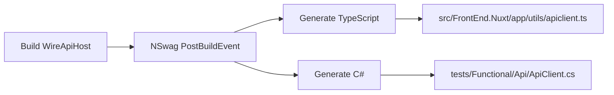

# API Client Generation Technical Debt

## Implementation Results (December 2024)

### Status: ✅ RESOLVED

The technical debt described in this document has been successfully resolved. The C# API client for functional tests is now generated into the `obj/` directory during the test project build, eliminating the need to check generated code into source control.

### Implemented Solution

**Approach:** Solution 1 - Generate in Functional Tests Project (see line 95)

**Key Changes:**
1. ✅ Moved C# client generation from WireApiHost to Functional tests project
2. ✅ Generated file now goes to `tests/Functional/obj/Generated/ApiClient.cs` (excluded from source control)
3. ✅ Removed cross-project dependency (WireApiHost no longer writes to tests directory)
4. ✅ Deleted checked-in `tests/Functional/Api/ApiClient.cs` from source control
5. ✅ Updated [`scripts/Generate-ApiClient.ps1`](../../scripts/Generate-ApiClient.ps1) to only reference TypeScript generation

### Implementation Details

**MSBuild Configuration:** [`tests/Functional/YoFi.V3.Tests.Functional.csproj`](../../tests/Functional/YoFi.V3.Tests.Functional.csproj)

```xml
<ItemGroup>
  <PackageReference Include="NSwag.MSBuild" Version="14.2.5">
    <IncludeAssets>runtime; build; native; contentfiles; analyzers; buildtransitive</IncludeAssets>
    <PrivateAssets>all</PrivateAssets>
  </PackageReference>
</ItemGroup>

<PropertyGroup>
  <ApiClientGeneratedDir>$(BaseIntermediateOutputPath)Generated</ApiClientGeneratedDir>
  <ApiClientOutputFile>$(ApiClientGeneratedDir)\ApiClient.cs</ApiClientOutputFile>
  <ApiClientOutputFileFullPath>$(MSBuildProjectDirectory)\$(ApiClientOutputFile)</ApiClientOutputFileFullPath>
  <ApiClientConfigFile>Api\nswag.json</ApiClientConfigFile>
</PropertyGroup>

<Target Name="GenerateApiClient" BeforeTargets="CoreCompile">
  <MakeDir Directories="$(ApiClientGeneratedDir)" />
  <Exec WorkingDirectory="$(MSBuildProjectDirectory)"
        Command="$(NSwagExe_Net100) run $(ApiClientConfigFile) /variables:OutputFile=$(ApiClientOutputFileFullPath)" />
  <ItemGroup>
    <Compile Include="$(ApiClientOutputFile)" />
  </ItemGroup>
</Target>

<Target Name="CleanApiClient" AfterTargets="Clean">
  <Delete Files="$(ApiClientOutputFile)" />
</Target>
```

**NSwag Configuration:** [`tests/Functional/Api/nswag.json`](../../tests/Functional/Api/nswag.json)
- Moved from `tests/Functional/nswag.json` to `tests/Functional/Api/nswag.json` for better organization
- Uses `$(OutputFile)` variable passed from MSBuild
- Generates to `obj/Generated/ApiClient.cs` (not checked into source control)

### Key Technical Discovery

**Problem Solved:** Using `$(BaseIntermediateOutputPath)` instead of `$(IntermediateOutputPath)`

The original blocker (line 77: "But that's not working") was caused by using `$(IntermediateOutputPath)` in the PropertyGroup, which wasn't yet set at that point in the build process. The solution was to use `$(BaseIntermediateOutputPath)` (which resolves to `obj/`), as it's available early in the MSBuild evaluation.

### Benefits Achieved

✅ **No more generated code in source control** - C# client lives only in `obj/` directory
✅ **No more cross-project dependencies** - Each project generates its own clients
✅ **No more rebuild noise** - Generated file changes don't appear in git status
✅ **No more merge conflicts** - Generated file is excluded from source control
✅ **Automatic regeneration** - Client regenerates on every test project build
✅ **Clean operation** - Generated file is properly cleaned during `dotnet clean`

### Separation of Concerns

**TypeScript Client (Frontend):**
- Generated by: [`src/WireApiHost`](../../src/WireApiHost/) project
- Output: [`src/FrontEnd.Nuxt/app/utils/apiclient.ts`](../../src/FrontEnd.Nuxt/app/utils/apiclient.ts)
- Checked into source control: ✅ Yes (deliberate - frontend dependency)
- Regenerate: Build WireApiHost or run `./scripts/Generate-ApiClient.ps1`

**C# Client (Functional Tests):**
- Generated by: [`tests/Functional`](../../tests/Functional/) project
- Output: `tests/Functional/obj/Generated/ApiClient.cs`
- Checked into source control: ❌ No (excluded via .gitignore)
- Regenerate: Build Functional tests project (automatic)

### Updated Documentation

- ✅ [`tests/Functional/Api/README.md`](../../tests/Functional/Api/README.md) - Updated with new generation approach
- ✅ [`scripts/Generate-ApiClient.ps1`](../../scripts/Generate-ApiClient.ps1) - Removed C# client references
- ✅ [`scripts/README.md`](../../scripts/README.md) - Updated script descriptions

### Related Implementation Documents

- [`docs/wip/functional-tests/API-CLIENT-GENERATION-IMPLEMENTATION-PLAN.md`](API-CLIENT-GENERATION-IMPLEMENTATION-PLAN.md) - Detailed implementation plan created during this work

---

## Original Analysis (Historical Context)

## Current State

### Overview
The project generates two API clients from the backend OpenAPI specification:
1. **TypeScript client** for the Vue/Nuxt frontend
2. **C# client** for functional tests

Both clients are generated by the [`src/WireApiHost`](../../src/WireApiHost/) project using NSwag after each build.

### Current Generation Flow



### Implementation Details

**Location:** [`src/WireApiHost/YoFi.V3.WireApiHost.csproj`](../../src/WireApiHost/YoFi.V3.WireApiHost.csproj)

```xml
<PropertyGroup>
  <RunPostBuildEvent>OnBuildSuccess</RunPostBuildEvent>
  <ApiClientConfigFile>nswag.json</ApiClientConfigFile>
  <ApiClientOutputFile>../FrontEnd.Nuxt/app/utils/apiclient.ts</ApiClientOutputFile>
</PropertyGroup>

<Target Name="NSwag" AfterTargets="PostBuildEvent">
  <Exec WorkingDirectory="$(ProjectDir)" Command="$(NSwagExe_Net100) run $(ApiClientConfigFile) /variables:Configuration=$(Configuration),MSBuildOutputPath=$(OutputPath),MSBuildProjectFile=$(MSBuildProjectFile),OutputFile=$(ApiClientOutputFile)"/>
</Target>
```

**Configuration:** [`src/WireApiHost/nswag.json`](../../src/WireApiHost/nswag.json)
- Generates **TypeScript** client to `../FrontEnd.Nuxt/app/utils/apiclient.ts` (line 81)
- Generates **C# client** to `../../tests/Functional/Api/ApiClient.cs` (line 174)

### Current Approach Characteristics

✅ **Pros:**
- Single source of truth (WireApiHost generates both clients)
- Automatic regeneration on every backend build
- Guarantees clients stay in sync with backend API
- Works reliably in current setup

❌ **Cons:**
- **Generated files checked into source control** (discouraged practice)
- **Cross-project dependency** (backend project writes into test project)
- **Non-standard location** (generated code typically goes to `obj/` or `bin/`)
- **Rebuild noise** (generated files show as modified after every backend build)
- **Merge conflicts** (generated files can create unnecessary conflicts)

## Known Issues

### Issue 1: Generated Code in Source Control

**Problem:** [`tests/Functional/Api/ApiClient.cs`](../../tests/Functional/Api/ApiClient.cs) is a generated file checked into Git.

**Standard Practice:** Generated code should go to `obj/` or `bin/` directories (excluded from source control).

**Current Rationale:** Per [`tests/Functional/Api/README.md`](../../tests/Functional/Api/README.md):
> "The C# file here is built and placed here by the WireApiHost project, and we check it into source control so it's always here."

**Why This Works:** Ensures functional tests can be built independently without requiring a backend build first.

### Issue 2: Desired vs. Actual Generation Location

**Desired Location:** `tests/Functional/obj/Generated/ApiClient.cs`

**Actual Location:** `tests/Functional/Api/ApiClient.cs` (source directory)

**Blocker (Per README):**
> "Better would be that we generate it HERE into our obj directory... But that's not working."

**Unknown:** What specific issue prevented generation into `obj/` directory?

### Issue 3: Functional Tests Have Two NSwag Configs

**Configuration Files:**
1. [`tests/Functional/nswag.json`](../../tests/Functional/nswag.json) - Currently unused
2. [`src/WireApiHost/nswag.json`](../../src/WireApiHost/nswag.json) - Actually used for generation

**Observation:** The functional tests have their own `nswag.json` but it's not used. Instead, WireApiHost's config generates the client.

**Question:** Was `tests/Functional/nswag.json` intended to be the proper solution (generate during test build) but failed for some reason?

## Investigated Solutions

### Solution 1: Generate in Functional Tests Project

**Approach:** Move generation to [`tests/Functional/YoFi.V3.Tests.Functional.csproj`](../../tests/Functional/YoFi.V3.Tests.Functional.csproj)

**Configuration:** Use existing [`tests/Functional/nswag.json`](../../tests/Functional/nswag.json)

**Target Output:** `$(IntermediateOutputPath)/Generated/ApiClient.cs` (e.g., `obj/Debug/net10.0/Generated/ApiClient.cs`)

**Required Changes:**
```xml
<ItemGroup>
  <PackageReference Include="NSwag.MSBuild" Version="14.6.3">
    <IncludeAssets>runtime; build; native; contentfiles; analyzers; buildtransitive</IncludeAssets>
    <PrivateAssets>all</PrivateAssets>
  </PackageReference>
</ItemGroup>

<PropertyGroup>
  <ApiClientGeneratedDir>$(IntermediateOutputPath)Generated</ApiClientGeneratedDir>
  <ApiClientOutputFile>$(ApiClientGeneratedDir)\ApiClient.cs</ApiClientOutputFile>
</PropertyGroup>

<Target Name="GenerateApiClient" BeforeTargets="CoreCompile">
  <!-- Ensure output directory exists -->
  <MakeDir Directories="$(ApiClientGeneratedDir)" />

  <!-- Generate client from backend OpenAPI spec -->
  <Exec WorkingDirectory="$(ProjectDir)"
        Command="$(NSwagExe_Net100) run nswag.json /variables:OutputFile=$(ApiClientOutputFile)" />

  <!-- Include generated file in compilation -->
  <ItemGroup>
    <Compile Include="$(ApiClientOutputFile)" />
  </ItemGroup>
</Target>
```

**Blockers to Investigate:**
- Does NSwag support OpenAPI spec URL (vs. local project reference)?
- Does functional test build need to depend on backend build?
- How to ensure OpenAPI spec is available at generation time?

### Solution 2: Generate from OpenAPI Spec File

**Approach:** Export OpenAPI spec to file, then generate from file

**Step 1:** Export spec during backend build
```xml
<!-- In WireApiHost.csproj -->
<Target Name="ExportOpenApiSpec" AfterTargets="Build">
  <Exec Command="dotnet tool run swagger tofile --output ../../openapi/spec.json $(OutputPath)YoFi.V3.WireApiHost.dll v1" />
</Target>
```

**Step 2:** Generate client from spec file
```json
// In tests/Functional/nswag.json
{
  "documentGenerator": {
    "fromDocument": {
      "url": "../../openapi/spec.json"
    }
  }
}
```

**Advantages:**
- Decouples functional tests from backend build
- Standard approach for API client generation
- Spec file can be versioned if needed

**Disadvantages:**
- Requires backend build to export spec first
- Another file to manage (spec.json)

### Solution 3: Use Shared MSBuild Targets

**Approach:** Create shared `.targets` file for API client generation

**Location:** `src/ApiClient.targets`

**Usage:**
```xml
<!-- In tests/Functional/YoFi.V3.Tests.Functional.csproj -->
<Import Project="../../src/ApiClient.targets" />
```

**Advantages:**
- Centralized generation logic
- Can be reused for other test projects
- Maintains single source of truth

### Solution 4: Keep Current Approach (Accept Technical Debt)

**Rationale:**
- ✅ Current approach **works reliably**
- ✅ Automatic regeneration guarantees sync
- ✅ No build dependencies to manage
- ❌ Minor annoyance (generated files in source control)
- ❌ Not following best practices

**When to Accept:**
- If investigating alternatives is low priority
- If current approach isn't causing actual problems
- If team agrees the tradeoff is acceptable

## Recommended Investigation Plan

### Phase 1: Research (2-4 hours)

1. **Test `tests/Functional/nswag.json`** - Determine why it's unused
   - Try running it manually: `nswag run tests/Functional/nswag.json`
   - Check if it successfully generates the client
   - Document any errors encountered

2. **Test OpenAPI spec generation** - Verify spec can be exported
   ```bash
   cd src/WireApiHost
   dotnet build
   dotnet tool run swagger tofile --output openapi.json bin/Debug/net10.0/YoFi.V3.WireApiHost.dll v1
   ```

3. **Test generation from spec file** - Verify client can be generated from spec
   ```bash
   cd tests/Functional
   # Modify nswag.json to use fromDocument instead of aspNetCoreToOpenApi
   nswag run nswag.json
   ```

4. **Research NSwag build integration** - Review NSwag.MSBuild documentation
   - How to generate during test project build?
   - How to reference OpenAPI spec from another project?
   - Best practices for multi-client generation?

### Phase 2: Proof of Concept (4-8 hours)

1. **Implement Solution 1 or 2** (whichever passes research)
2. **Test build scenarios:**
   - Clean build (no backend built yet)
   - Incremental build (backend already built)
   - CI/CD build (fresh checkout)
3. **Verify functional tests still pass**
4. **Document any issues encountered**

### Phase 3: Decision Point

**If PoC succeeds:**
- Create implementation plan
- Estimate effort for full rollout
- Schedule implementation

**If PoC fails:**
- Document specific blockers
- Consider Solution 4 (accept current approach)
- Add to backlog for future investigation

## Alternative: Document Current Approach

If investigation is not a priority, document the current approach as an intentional design decision:

**Location:** [`tests/Functional/Api/README.md`](../../tests/Functional/Api/README.md)

**Content to Add:**
```markdown
## Generation Approach

The API client is generated by the WireApiHost project (not the Functional tests project) as a
post-build step. This is an intentional design decision with the following rationale:

**Advantages:**
- Guarantees client is always in sync with backend API
- Automatic regeneration on every backend build
- Functional tests can be built independently (client pre-generated)
- Single source of truth for client generation

**Tradeoffs:**
- Generated file is checked into source control (not typical practice)
- Backend build writes into test project directory (cross-project dependency)
- Generated file shows as modified after backend builds

**Future Improvement:** Move generation to functional tests project with generation into
`obj/` directory. This requires solving the dependency problem: how to reference the backend
OpenAPI spec during functional test builds without requiring a backend build first.

## Regenerating the Client

The client is automatically regenerated when you build the WireApiHost project:

```bash
cd src/WireApiHost
dotnet build
```

To manually regenerate:

```bash
cd src/WireApiHost
nswag run nswag.json
```
```

## Related Files

- [`src/WireApiHost/YoFi.V3.WireApiHost.csproj`](../../src/WireApiHost/YoFi.V3.WireApiHost.csproj) - MSBuild target for generation
- [`src/WireApiHost/nswag.json`](../../src/WireApiHost/nswag.json) - NSwag configuration (generates both TypeScript and C# clients)
- [`tests/Functional/nswag.json`](../../tests/Functional/nswag.json) - Unused configuration (originally intended for test-side generation?)
- [`tests/Functional/Api/README.md`](../../tests/Functional/Api/README.md) - Current documentation with known issues
- [`tests/Functional/Api/ApiClient.cs`](../../tests/Functional/Api/ApiClient.cs) - Generated C# client (checked into source control)
- [`tests/Functional/Api/API-CLIENT-REFERENCE.md`](../../tests/Functional/Api/API-CLIENT-REFERENCE.md) - API reference documentation

## Decision Required

**Question:** Is fixing this technical debt a priority?

**Options:**
1. **Investigate and fix** - Follow investigation plan above (6-12 hours effort)
2. **Accept current approach** - Document intentional design decision, close as "won't fix"
3. **Defer** - Keep on backlog for future consideration

**Recommendation:** **Accept current approach** unless one of these triggers occurs:
- Merge conflicts in generated files become frequent
- CI/CD pipeline issues related to generated files
- Need to generate clients for multiple test projects
- Team adopts stricter policy against checking in generated code

The current approach works reliably and the tradeoffs are minor. Engineering time is better spent on higher-value improvements unless this becomes a real pain point.
