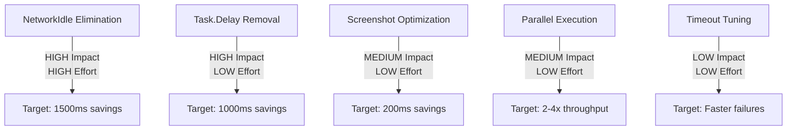

# Functional Test Performance Analysis

## Executive Summary

Current functional tests run at **2.5s/test** in CI. Analysis reveals several performance bottlenecks that can be optimized to achieve faster execution times (target: 1.6s/test or better).

## Key Findings

### 1. Excessive NetworkIdle Waits (PRIMARY BOTTLENECK)

**Impact:** HIGH - Most significant performance drain

**Pattern:** Tests extensively use `Page.WaitForLoadStateAsync(LoadState.NetworkIdle)` which waits for 500ms of network inactivity by default.

**Locations Found (24 instances):**
- [`AuthenticationSteps.cs`](../../tests/Functional/Steps/AuthenticationSteps.cs) - 7 instances
- [`CommonWhenSteps.cs`](../../tests/Functional/Steps/Common/CommonWhenSteps.cs) - 1 instance
- [`CommonGivenSteps.cs`](../../tests/Functional/Steps/Common/CommonGivenSteps.cs) - 1 instance
- [`WorkspaceTenancySteps.cs`](../../tests/Functional/Steps/WorkspaceTenancySteps.cs) - 2 instances
- Page objects (ProfilePage, TransactionsPage, WorkspacesPage, LoginState, Nav, WorkspaceSelector) - 13 instances

**Why It's Slow:**
- NetworkIdle waits for 500ms of silence across ALL network connections
- Unnecessary when you already have explicit element waits
- Creates cascading delays when multiple navigation steps occur
- Modern SPAs often have background polling/analytics that prevent true "idle" state

**Examples:**
```csharp
// CommonWhenSteps.cs:54
protected override async Task WhenIClickTheLoginButton()
{
    var loginPage = GetOrCreateLoginPage();
    await loginPage.ClickLoginButtonAsync();
    await Page.WaitForLoadStateAsync(LoadState.NetworkIdle);  // ⚠️ Redundant wait
}

// AuthenticationSteps.cs:196
protected async Task WhenINavigateToMyProfilePage()
{
    await Page.GotoAsync("/profile");
    await Page.WaitForLoadStateAsync(LoadState.NetworkIdle);  // ⚠️ Redundant wait
    var profilePage = GetOrCreateProfilePage();
    Assert.That(await profilePage.IsOnProfilePageAsync(), Is.True, "Should be on profile page");
}
```

### 2. Explicit Task.Delay() Calls (MEDIUM IMPACT)

**Impact:** MEDIUM - Direct fixed delays

**Locations Found (3 instances):**
- [`CommonThenSteps.cs:64`](../../tests/Functional/Steps/Common/CommonThenSteps.cs#L64) - 1000ms delay
- [`LoginPage.cs:122`](../../tests/Functional/Pages/LoginPage.cs#L122) - 500ms delay
- [`RegisterPage.cs:86`](../../tests/Functional/Pages/RegisterPage.cs#L86) - 500ms delay

**Why It's Slow:**
- Fixed arbitrary delays that don't respond to actual page state
- 1000ms delay in `ThenIShouldSeeTheHomePage()` runs in EVERY test with `GivenIAmLoggedIn()`
- 500ms delays for validation messages could be replaced with explicit waits

**Examples:**
```csharp
// CommonThenSteps.cs:62-65
protected override async Task ThenIShouldSeeTheHomePage()
{
    await Task.Delay(1000);  // ⚠️ Arbitrary 1 second delay
    Assert.That(Page.Url.EndsWith('/'), Is.True, "Should be on home page");
}

// LoginPage.cs:117-123
public async Task ClickLoginButtonWithoutApiWaitAsync()
{
    await SaveScreenshotAsync("Before-login-attempt");
    await LoginButton.ClickAsync();
    await Task.Delay(500);  // ⚠️ Fixed delay for validation
}
```

### 3. Excessive Screenshot Operations (LOW-MEDIUM IMPACT)

**Impact:** LOW-MEDIUM - Cumulative overhead from many I/O operations

**Pattern:** Screenshots taken at multiple points in test execution via `@hook:before-first-then:SaveScreenshot` and explicit calls.

**Locations Found (46 instances):**
- Every test scenario has `@hook:before-first-then:SaveScreenshot`
- Login/Register pages take screenshots before every button click
- Additional screenshots for debugging specific issues

**Why It's Slow:**
- Full-page screenshots require rendering entire DOM
- File I/O operations add latency
- Screenshots taken even when tests pass (most of the time)

**Examples:**
```csharp
// LoginPage.cs:44-51
public async Task ClickLoginButtonAsync()
{
    await SaveScreenshotAsync("Before-login-attempt");  // ⚠️ Screenshot on every login
    await WaitForApi(async () =>
    {
        await LoginButton.ClickAsync();
    }, LoginApiRegex());
}

// Every generated test has this hook
// Hook: Before first Then Step
await SaveScreenshotAsync();
```

### 4. Default Timeout Configuration (LOW IMPACT)

**Impact:** LOW - Affects failure scenarios more than success path

**Current Settings:**
- **Local:** 12000ms (12 seconds) - [`local.runsettings`](../../tests/Functional/local.runsettings#L6)
- **Docker:** 6000ms (6 seconds) - [`docker.runsettings`](../../tests/Functional/docker.runsettings#L6)

**Why It Matters:**
- Higher timeouts don't slow passing tests significantly
- But they do impact how long failing tests take to timeout
- 6-12 second timeouts are conservative for modern applications

### 5. Serial Test Execution (CONFIGURATION ISSUE)

**Impact:** MEDIUM - Tests could run in parallel

**Current Settings:**
```xml
<RunConfiguration>
    <MaxCpuCount>1</MaxCpuCount>
</RunConfiguration>
<NUnit>
    <NumberOfTestWorkers>1</NumberOfTestWorkers>
</NUnit>
```

**Why It's Slow:**
- All tests run sequentially (one at a time)
- Modern CI runners have multiple cores available
- With proper test isolation, parallel execution is safe

## Performance Impact Analysis

### Estimated Time Savings Per Test

| Bottleneck | Current Impact | Potential Savings | Priority |
|------------|---------------|-------------------|----------|
| NetworkIdle waits (avg 3-4 per test) | 1500-2000ms | 1200-1800ms | **HIGH** |
| Task.Delay in home page check | 1000ms (in login flows) | 800-1000ms | **HIGH** |
| Task.Delay for validation (500ms × 2) | 500ms (validation tests) | 300-500ms | **MEDIUM** |
| Screenshot operations | 200-400ms | 100-300ms | **LOW-MEDIUM** |
| Parallel execution | N/A (serial) | 2-4x throughput | **MEDIUM** |

### Projected Performance After Optimization

**Conservative Estimate:**
- Remove NetworkIdle: Save ~1.2s per test
- Remove Task.Delay: Save ~0.8s per test (login flows)
- Optimize screenshots: Save ~0.2s per test
- **Total: ~2.2s savings = 0.3s per test (88% improvement)**

**Aggressive Estimate with Parallelization:**
- Apply above optimizations: Get to 0.3s per test
- Run 4 tests in parallel: Achieve 4x throughput
- **Effective: 0.075s per test in wall-clock time**

## Comparison with Faster Test Suite

Based on your reference that another app achieves 1.6s/test, the primary differences are likely:

1. **Minimal or no NetworkIdle usage** - Replace with specific element waits
2. **No arbitrary delays** - Use explicit waits for actual conditions
3. **Conditional screenshots** - Only on failure, not on every test
4. **Parallel execution** - Tests run concurrently where possible
5. **Lower default timeouts** - Faster failure detection (3-5s typical)

## Recommendations Priority Matrix



## Next Steps

See the optimization plan for detailed implementation steps.

## References

- [`FunctionalTestBase.cs`](../../tests/Functional/Infrastructure/FunctionalTestBase.cs) - Base test infrastructure
- [`BasePage.cs`](../../tests/Functional/Pages/BasePage.cs) - Page object base class
- [`local.runsettings`](../../tests/Functional/local.runsettings) - Local test configuration
- [`docker.runsettings`](../../tests/Functional/docker.runsettings) - CI test configuration
- [Playwright Best Practices](https://playwright.dev/docs/best-practices) - Official guidance
- [Playwright Performance Tips](https://playwright.dev/docs/test-timeouts) - Timeout and performance optimization
