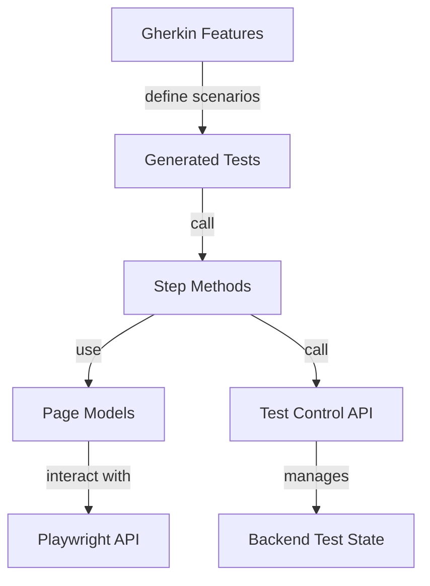

# Functional Tests Directory Organization Analysis

## Current Structure Analysis

### Directory Tree
```
tests/Functional/
├── Api/                          # Backend API client (auto-generated)
│   ├── ApiClient.cs
│   ├── API-CLIENT-REFERENCE.md
│   └── README.md
├── Components/                    # Reusable UI component models
│   ├── ErrorDisplay.cs
│   ├── LoginState.cs
│   ├── Nav.cs
│   ├── README.md
│   ├── SiteHeader.cs
│   └── WorkspaceSelector.cs
├── Features/                      # Gherkin feature files (source of truth)
│   ├── About.feature
│   ├── Authentication.feature
│   ├── FunctionalTest.mustache   # Template for test generation
│   ├── Tenancy-Collaboration.feature
│   ├── Tenancy.feature
│   └── Weather.feature
├── Helpers/                       # Test utilities
│   ├── DataTable.cs
│   └── DataTableExtensions.cs
├── Pages/                         # Page Object Models
│   ├── BasePage.cs
│   ├── HomePage.cs
│   ├── LoginPage.cs
│   ├── ProfilePage.cs
│   ├── README.md
│   ├── RegisterPage.cs
│   ├── TransactionsPage.cs
│   └── WorkspacesPage.cs
├── plans/                         # ⚠️ WRONG LOCATION - Design documents
│   ├── hybrid-refactoring-summary.md
│   └── page-model-thickness-comparison.md
├── Steps/                         # Step definitions (method implementations)
│   ├── AuthenticationSteps.cs
│   ├── FunctionalTest.cs         # Base class with shared steps
│   ├── TODO.md
│   ├── WeatherSteps.cs
│   └── WorkspaceTenancySteps.cs
├── Tests/                         # Generated C# test files
│   ├── Authentication.feature.cs
│   ├── README.md
│   ├── Tenancy.feature.cs
│   └── Weather.feature.cs
├── .roo/                         # Hidden Roo config
├── .vscode/                      # VSCode config
├── e2e/                          # ⚠️ Empty directory (unused?)
├── AssemblyInfo.cs
├── docker.runsettings
├── INSTRUCTIONS.md               # Instructions for generating tests
├── local.runsettings
├── nswag.json
├── README.md
├── TEST-CONTROLS.md
└── YoFi.V3.Tests.Functional.csproj
```

## Identified Issues

### 1. ⚠️ Misplaced Documentation (HIGH PRIORITY)
**Problem:** Planning documents in `tests/Functional/plans/` violate project conventions.

**Files Affected:**
- [`plans/hybrid-refactoring-summary.md`](../../tests/Functional/plans/hybrid-refactoring-summary.md)
- [`plans/page-model-thickness-comparison.md`](../../tests/Functional/plans/page-model-thickness-comparison.md)

**Issue:** Per project rules (Documentation and Planning Pattern), all planning/WIP documents should be in `docs/wip/`, NOT in a project-specific `plans/` directory.

**Recommendation:** Move to `docs/wip/functional-tests/` subdirectory:
```
docs/wip/functional-tests/
├── hybrid-refactoring-summary.md
└── page-model-thickness-comparison.md
```

**Rationale:**
- Maintains single source of truth for planning documents
- Prevents directory proliferation across projects
- Aligns with established project conventions
- Makes documents discoverable in central location

### 2. ⚠️ Empty/Unused Directory
**Problem:** `tests/Functional/e2e/` directory exists but is empty.

**Impact:** Creates confusion about purpose and whether it should be used.

**Recommendation:**
- **Option A (Preferred):** Delete if not needed
- **Option B:** If reserved for future use, add a README explaining intent

### 3. ⚠️ Unclear Separation: Steps vs Tests
**Problem:** Naming creates potential confusion about roles:
- `Steps/` contains step method implementations
- `Tests/` contains generated test classes

**Current Flow:**
```
Features/*.feature → (manual process) → Tests/*.feature.cs → Steps/*.cs methods
```

**Issue:** "Steps" in BDD traditionally means step definitions in feature files, but here it means C# method implementations.

**Considerations:**
- **Gherkin Convention:** "Steps" = Given/When/Then statements in feature files
- **SpecFlow Convention:** "Step Definitions" = C# methods bound to Gherkin steps
- **Current Usage:** "Steps" = C# method implementations (like SpecFlow step definitions)

**Analysis:** This is actually reasonable because:
- `Features/` clearly contains Gherkin (the source of truth)
- `Steps/` contains the implementations (like SpecFlow's step definitions)
- `Tests/` contains the generated glue code

**Recommendation:** Consider renaming for clarity:
- **Option A:** Keep as-is (acceptable, documented in README)
- **Option B:** Rename `Steps/` → `StepDefinitions/` (more explicit)
- **Option C:** Rename `Tests/` → `Generated/` (makes generation more obvious)

**Risk:** Renaming would require updating namespaces, using statements, and templates.

### 4. ⚠️ Mixed Responsibilities in Steps/FunctionalTest.cs
**Problem:** [`Steps/FunctionalTest.cs`](../../tests/Functional/Steps/FunctionalTest.cs) is a 600-line file containing:
- Base test infrastructure (setup/teardown)
- Common step implementations (Given/When/Then methods)
- Helper utilities (SaveScreenshot, GetOrCreatePage methods)
- ObjectStore helper class

**Issue:** Violates Single Responsibility Principle - too many concerns in one file.

**Current Structure:**
```csharp
FunctionalTest.cs (600 lines)
├── Fields & Properties
├── Setup/Teardown
├── Steps: GIVEN
├── Steps: WHEN
├── Steps: THEN
├── Helpers
└── ObjectStore class
```

**Recommendation:** Split into clearer separation of concerns:
```
Infrastructure/                      # Test infrastructure (at tests/Functional level)
├── FunctionalTestBase.cs           # Base class, setup/teardown
└── ObjectStore.cs                  # Extracted helper

Steps/
├── Common/
│   ├── CommonGivenSteps.cs         # Shared Given steps
│   ├── CommonWhenSteps.cs          # Shared When steps
│   └── CommonThenSteps.cs          # Shared Then steps
├── AuthenticationSteps.cs          # Feature-specific steps
├── WeatherSteps.cs
└── WorkspaceTenancySteps.cs
```

**Risk:** This would be a **breaking change** requiring:
- Updating `@baseclass` tags in all feature files
- Updating all generated test files
- Updating template to support multiple base classes

**Verdict:** **Not recommended** unless pain points emerge. Current structure works and is well-documented.

### 5. ⚠️ Inconsistent TODO Tracking
**Problem:** [`Steps/TODO.md`](../../tests/Functional/Steps/TODO.md) tracks incomplete implementations.

**Issue:**
- TODOs scattered between dedicated file and inline comments
- No clear ownership or prioritization
- High-priority TODOs blocking test scenarios

**Current TODOs:**
1. `ThenIShouldSeeAMessageIndicatingINeedToLogIn()` - blocks Anonymous user tests
2. `ThenAfterLoggingInIShouldBeRedirectedToTheOriginallyRequestedPage()` - blocks redirect tests

**Recommendation:**
- **Option A:** Move TODOs to main project `docs/TODO.md` or `docs/wip/FUNCTIONAL-TESTS-TODO.md`
- **Option B:** Keep TODO.md but integrate with test tracking (GitHub Issues)
- **Option C:** Use `[Explicit]` attribute on blocked tests instead of TODO tracking

**Preferred:** Move to `docs/wip/FUNCTIONAL-TESTS-TODO.md` for visibility.

### 6. ⚠️ API Client Generation Concerns
**Problem:** Per [`Api/README.md`](../../tests/Functional/Api/README.md):
> "I don't love how it's generated, but I could not get it to work a better way, so leaving it alone for now."
> "The C# file here is built and placed here by the WireApiHost project, and we check it into source control so it's always here."
> "Better would be that we generate it HERE into our obj directory... But that's not working."

**Issue:**
- Non-standard generation approach
- Checked-in generated code (usually discouraged)
- Known technical debt acknowledged in README

**Recommendation:** Document in `docs/wip/` as technical debt with investigation plan:
```
docs/wip/API-CLIENT-GENERATION-IMPROVEMENT.md
- Current approach (WireApiHost → Functional/Api/)
- Desired approach (generate during build → obj/)
- Blockers encountered
- Alternative solutions to investigate
```

## Strengths of Current Organization

### ✅ Clear Separation of Concerns
- **Features/** = Business-readable specifications (source of truth)
- **Tests/** = Generated code (clearly marked as generated)
- **Steps/** = Step implementations
- **Pages/** = UI structure knowledge
- **Components/** = Reusable UI patterns

### ✅ Excellent Documentation
- Each directory has a README explaining its purpose
- [`INSTRUCTIONS.md`](../../tests/Functional/INSTRUCTIONS.md) provides clear generation guidance
- Main [`README.md`](../../tests/Functional/README.md) explains architecture and principles
- Step methods have XML documentation with Gherkin patterns

### ✅ Hybrid Page Model Pattern
- Provides both high-level workflows AND primitive actions
- Well-documented in [`plans/hybrid-refactoring-summary.md`](../../tests/Functional/plans/hybrid-refactoring-summary.md)
- Enables both convenience and flexibility
- Zero breaking changes approach

### ✅ Test Correlation & Diagnostics
- W3C Trace Context headers for distributed tracing
- Custom test correlation headers (X-Test-Name, X-Test-Id)
- Browser console log capture
- Clear prerequisite checking with actionable error messages

### ✅ Clean Architecture


## Best Practices Comparison

### Industry Standards (Playwright + BDD)

**Playwright's Official Recommendation:**
- Use Page Object Models (✅ followed)
- Separate test logic from page structure (✅ followed)
- Use locators over selectors (✅ followed - see data-test-id pattern)

**BDD/Gherkin Standards:**
- Feature files as source of truth (✅ followed)
- Step definitions separate from tests (✅ followed)
- Reusable steps across features (✅ followed)

**SpecFlow/Cucumber Conventions:**
```
typical-bdd-project/
├── Features/              # Gherkin files
├── StepDefinitions/       # Step implementations
├── PageObjects/           # Page models
└── Hooks/                 # Test lifecycle
```

**Current Project Mapping:**
```
YoFi.V3/tests/Functional/
├── Features/              ✅ Matches convention
├── Steps/                 ✅ Equivalent to StepDefinitions
├── Pages/                 ✅ Equivalent to PageObjects
└── (Setup in base class)  ✅ Equivalent to Hooks
```

**Verdict:** Current structure aligns well with industry standards.

## Alternative Organization Patterns

### Pattern 1: Feature-Centric Organization
```
tests/Functional/
├── Authentication/
│   ├── Authentication.feature
│   ├── Authentication.feature.cs
│   ├── AuthenticationSteps.cs
│   └── Pages/
│       ├── LoginPage.cs
│       └── RegisterPage.cs
├── Tenancy/
│   ├── Tenancy.feature
│   ├── Tenancy.feature.cs
│   ├── TenancySteps.cs
│   └── Pages/
│       └── WorkspacesPage.cs
└── Shared/
    ├── Components/
    └── Infrastructure/
```

**Pros:**
- Feature isolation
- Easy to find everything related to one feature
- Could support independent deployment of feature tests

**Cons:**
- Harder to share pages across features
- Duplicates shared infrastructure
- Breaks current working structure
- Massive refactoring effort

**Verdict:** ❌ Not recommended - current structure works well.

### Pattern 2: Layer-First (Current Approach)
```
tests/Functional/
├── Features/              # All Gherkin
├── Tests/                 # All generated tests
├── Steps/                 # All step implementations
├── Pages/                 # All page models
└── Components/            # All reusable components
```

**Pros:**
- ✅ Clear separation of concerns
- ✅ Easy to navigate by layer
- ✅ Promotes reuse across features
- ✅ Matches industry conventions
- ✅ Already working well

**Cons:**
- Feature concerns span multiple directories
- Need to jump between directories when working on one feature

**Verdict:** ✅ Current approach is solid.

## Recommendations Summary

### High Priority (Should Fix)

#### 1. Move Planning Documents ⚠️
```bash
# Move from tests/Functional/plans/ to docs/wip/functional-tests/
mkdir docs/wip/functional-tests/
mv tests/Functional/plans/hybrid-refactoring-summary.md docs/wip/functional-tests/
mv tests/Functional/plans/page-model-thickness-comparison.md docs/wip/functional-tests/
rmdir tests/Functional/plans/
```

**Rationale:** Aligns with project conventions for documentation organization.

#### 2. Clean Up Empty Directory
```bash
# Remove unused e2e directory
rmdir tests/Functional/e2e/
```

**Rationale:** Reduces confusion, keeps structure clean.

#### 3. Document API Client Technical Debt
Create `docs/wip/API-CLIENT-GENERATION-IMPROVEMENT.md` documenting:
- Current generation process
- Known issues
- Desired approach
- Investigation plan

**Rationale:** Makes technical debt visible and trackable.

### Medium Priority (Consider)

#### 4. Consolidate TODO Tracking
Move `Steps/TODO.md` content to `docs/wip/FUNCTIONAL-TESTS-TODO.md`.

**Rationale:** Central tracking, better visibility.

#### 5. Add Directory Purpose Comments
Add brief comments to `.csproj` or README clarifying:
- `Tests/` = Generated code (do not edit directly)
- `Steps/` = Step method implementations (edit here)
- `Features/` = Source of truth (edit here)

**Rationale:** Prevents accidental editing of generated code.

### Low Priority (Optional)

#### 6. Consider Renaming for Clarity
If confusion arises, consider:
- `Tests/` → `Generated/` (makes generation explicit)
- `Steps/` → `StepDefinitions/` (more explicit naming)

**Rationale:** Marginal clarity improvement, not worth the refactoring effort right now.

**Verdict:** ⛔ Do NOT rename - current names are acceptable and documented.

## Conclusion

**Overall Assessment:** The current organization is **solid and follows best practices**. The structure aligns with industry standards for Playwright + BDD testing.

**Key Strengths:**
- ✅ Clear separation of concerns (Layer-first pattern)
- ✅ Well-documented architecture
- ✅ Follows Playwright and BDD conventions
- ✅ Excellent test correlation and diagnostics
- ✅ Hybrid page model pattern for flexibility

**Required Changes:**
1. ⚠️ Move `plans/` documents to `docs/wip/functional-tests/`
2. ⚠️ Remove empty `e2e/` directory
3. ⚠️ Document API client generation technical debt

**Optional Improvements:**
- Consider consolidating TODO tracking
- Add clarifying comments about generated vs. source code
- Implement blocked step methods

**Verdict:** **No major restructuring needed.** The current organization works well and follows best practices. Focus on cleaning up the few organizational issues identified above.
