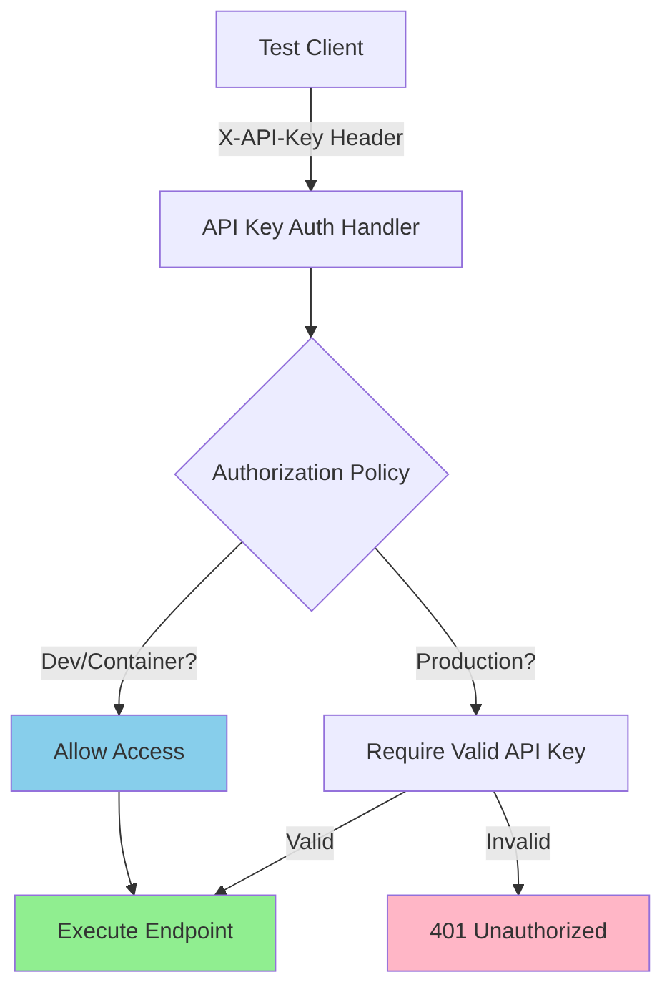

# Test Control API Key Protection - Implementation Plan

## Overview

This document provides an implementation plan for adding API key protection to the Test Control APIs. The production functional test infrastructure already exists with full support for environment variables and `.env` files, providing a solid foundation for this security enhancement.

## Background

### Existing Production Test Infrastructure

The functional tests already support running against production environments via:

**✅ Environment Variable Support** ([`FunctionalTestBase.cs`](../../../tests/Functional/Infrastructure/FunctionalTestBase.cs))
- Automatic `.env` file loading with multiple search paths (lines 211-245)
- `{ENV_VAR}` syntax for variable resolution in `.runsettings` files (lines 434-456)
- Clear error messages when environment variables are missing

**✅ Production Configuration** ([`tests/Functional/runsettings/production.runsettings`](../../../tests/Functional/runsettings/production.runsettings))
- Production runsettings file using environment variables:
  ```xml
  <Parameter name="webAppUrl" value="{PRODUCTION_WEB_APP_URL}" />
  <Parameter name="apiBaseUrl" value="{PRODUCTION_API_BASE_URL}" />
  ```

**✅ Documentation** ([`tests/Functional/README.md`](../../../tests/Functional/README.md))
- Complete documentation for running tests against production (lines 79-146)
- `.env.example` template file for developers

**✅ Gitignore Protection** ([`tests/Functional/.gitignore`](../../../tests/Functional/.gitignore))
- `.env` files already excluded from source control

### Test Control API Current State

The [`TestControlController`](../../../src/Controllers/TestControlController.cs) provides administrative endpoints for:
- Creating and deleting test users
- Managing test workspaces
- Seeding test data
- Generating error responses

**Current security:** No authentication or authorization applied - accessible to anyone.

## Problem Statement

The Test Control APIs must be protected in production environments while remaining easily accessible during development and testing. The existing `.env` infrastructure provides the foundation; we need to:

1. Implement API key authentication for production environments
2. Integrate with existing `.env`/environment variable infrastructure
3. Maintain zero-impact on development and container testing
4. Support production functional testing with secure API key management

## Solution Design

### Architecture Overview



### Key Design Decisions

#### 1. Leverage Existing `{VAR}` Syntax

**Decision:** Use the existing `{ENV_VAR}` syntax already implemented in [`FunctionalTestBase`](../../../tests/Functional/Infrastructure/FunctionalTestBase.cs).

**Rationale:**
- Already working for `webAppUrl` and `apiBaseUrl` parameters
- Has comprehensive error handling and path resolution
- Familiar pattern for developers
- No new infrastructure needed

**Example:**
```xml
<!-- production.runsettings -->
<Parameter name="testControlApiKey" value="{TEST_CONTROL_API_KEY}" />
```

```bash
# .env (not committed)
TEST_CONTROL_API_KEY=your-base64-encoded-key-here
```

#### 2. Environment-Based Authorization

**Decision:** Use `IWebHostEnvironment.IsProduction()` to determine if API key is required.

**Behavior:**
- **Development** (`ASPNETCORE_ENVIRONMENT=Development`): No API key required
- **Container** (`ASPNETCORE_ENVIRONMENT=Container`): No API key required
- **Production** (`ASPNETCORE_ENVIRONMENT=Production`): API key required via `X-API-Key` header

**Benefits:**
- Clear semantics - only production requires authentication
- Works correctly with custom "Container" environment
- No complex null-checking logic needed
- Follows ASP.NET Core conventions

#### 3. Optional Test Parameter

**Decision:** Make `testControlApiKey` parameter optional in functional tests.

**Behavior:**
- If parameter **not present** → No `X-API-Key` header added → Works in Dev/Container
- If parameter **present** → Resolve environment variable → Add header → Works in Production

**Benefits:**
- No breaking changes to existing tests
- Container/CI tests continue working without modification
- Production tests opt-in via runsettings

## Implementation Plan

### Phase 1: Core Authentication Infrastructure

#### 1.1 Create Authentication Handler

**File:** `src/Controllers/Authentication/ApiKeyAuthenticationHandler.cs`

```csharp
/// <summary>
/// Authentication handler for API key validation via X-API-Key header.
/// </summary>
public class ApiKeyAuthenticationHandler : AuthenticationHandler<ApiKeyAuthenticationOptions>
{
    protected override async Task<AuthenticateResult> HandleAuthenticateAsync()
    {
        // Extract X-API-Key header
        if (!Request.Headers.TryGetValue("X-API-Key", out var apiKeyHeaderValues))
        {
            return AuthenticateResult.NoResult();
        }

        var providedApiKey = apiKeyHeaderValues.FirstOrDefault();
        if (string.IsNullOrWhiteSpace(providedApiKey))
        {
            return AuthenticateResult.NoResult();
        }

        // Get expected API key from options
        var expectedApiKey = Options.ApiKey;
        if (string.IsNullOrWhiteSpace(expectedApiKey))
        {
            // No API key configured - let policy decide
            return AuthenticateResult.NoResult();
        }

        // Constant-time comparison (prevent timing attacks)
        if (!CryptographicOperations.FixedTimeEquals(
            Encoding.UTF8.GetBytes(providedApiKey),
            Encoding.UTF8.GetBytes(expectedApiKey)))
        {
            return AuthenticateResult.Fail("Invalid API key");
        }

        // Create authenticated principal
        var claims = new[] { new Claim(ClaimTypes.Name, "TestControlApiKey") };
        var identity = new ClaimsIdentity(claims, Scheme.Name);
        var principal = new ClaimsPrincipal(identity);
        var ticket = new AuthenticationTicket(principal, Scheme.Name);

        return AuthenticateResult.Success(ticket);
    }
}
```

#### 1.2 Create Configuration Options

**File:** `src/Entities/Options/TestControlOptions.cs`

```csharp
/// <summary>
/// Configuration options for Test Control API protection.
/// </summary>
public class TestControlOptions
{
    /// <summary>
    /// Configuration section name.
    /// </summary>
    public const string Section = "TestControl";

    /// <summary>
    /// API key required to access Test Control endpoints.
    /// </summary>
    /// <remarks>
    /// If null or empty, Test Control APIs are unprotected (dev/test environments).
    /// If set, API key is required via X-API-Key header (production).
    /// </remarks>
    public string? ApiKey { get; set; }
}
```

#### 1.3 Service Registration Extension

**File:** `src/Controllers/Extensions/ServiceCollectionExtensions.cs` (add method)

```csharp
/// <summary>
/// Adds Test Control API authentication to the service collection.
/// </summary>
public static IServiceCollection AddTestControlAuthentication(
    this IServiceCollection services,
    IConfiguration configuration,
    IWebHostEnvironment environment)
{
    // Bind TestControl options
    services.Configure<TestControlOptions>(
        configuration.GetSection(TestControlOptions.Section));

    // Add ApiKey authentication scheme
    services
        .AddAuthentication()
        .AddScheme<ApiKeyAuthenticationOptions, ApiKeyAuthenticationHandler>(
            "ApiKey",
            options => { });

    // Register authorization policy
    services.AddAuthorization(options =>
    {
        options.AddPolicy("TestControlApiAccess", policy =>
        {
            policy.AddAuthenticationSchemes("ApiKey");

            policy.RequireAssertion(context =>
            {
                // If authenticated via API key, allow
                if (context.User.Identity?.IsAuthenticated == true &&
                    context.User.Identity.AuthenticationType == "ApiKey")
                {
                    return true;
                }

                // Allow unrestricted access in non-Production environments
                if (!environment.IsProduction())
                {
                    return true;
                }

                // Production requires authentication
                return false;
            });
        });
    });

    return services;
}
```

#### 1.4 Configuration Files

**File:** `src/BackEnd/appsettings.json` (add section)

```json
{
  "TestControl": {
    "ApiKey": ""
  }
}
```

**File:** `src/BackEnd/appsettings.Development.json` (add section)

```json
{
  "TestControl": {
    "ApiKey": ""
  }
}
```

#### 1.5 Apply Authorization

**File:** `src/Controllers/TestControlController.cs` (add attribute to class)

```csharp
[Route("[controller]")]
[ApiController]
[Authorize("TestControlApiAccess")] // ← Add this
public partial class TestControlController(...)
{
    // ... existing code ...
}
```

Update class XML documentation to mention API key requirement.

#### 1.6 Register Services

**File:** `src/BackEnd/Program.cs` (add call)

```csharp
// Add Test Control authentication
builder.Services.AddTestControlAuthentication(
    builder.Configuration,
    builder.Environment);
```

### Phase 2: Functional Test Support

#### 2.1 Update Test Client

**File:** `tests/Functional/Infrastructure/FunctionalTestBase.cs`

Update the `testControlClient` property (lines 46-71) to add API key header support:

```csharp
protected TestControlClient testControlClient
{
    get
    {
        if (_testControlClient is null)
        {
            var httpClient = new HttpClient();

            // Add test correlation headers if test activity exists
            if (_testActivity is not null)
            {
                var headers = BuildTestCorrelationHeaders();
                foreach (var header in headers)
                {
                    httpClient.DefaultRequestHeaders.Add(header.Key, header.Value);
                }
            }

            // Add API key header if configured (for production testing)
            var apiKey = TestContext.Parameters["testControlApiKey"];
            if (!string.IsNullOrWhiteSpace(apiKey))
            {
                // Resolve environment variable using existing helper
                apiKey = ResolveEnvironmentVariables(apiKey, "testControlApiKey");
                httpClient.DefaultRequestHeaders.Add("X-API-Key", apiKey);
            }

            _testControlClient = new TestControlClient(
                baseUrl: GetRequiredParameter("apiBaseUrl"),
                httpClient: httpClient
            );
        }
        return _testControlClient;
    }
}
```

#### 2.2 Update Production Runsettings

**File:** `tests/Functional/runsettings/production.runsettings`

Add the `testControlApiKey` parameter:

```xml
<?xml version="1.0" encoding="utf-8"?>
<RunSettings>
	<TestRunParameters>
		<Parameter name="webAppUrl" value="{PRODUCTION_WEB_APP_URL}" />
		<Parameter name="apiBaseUrl" value="{PRODUCTION_API_BASE_URL}" />
		<Parameter name="testControlApiKey" value="{TEST_CONTROL_API_KEY}" />
		<Parameter name="defaultTimeout" value="30000" />
		<Parameter name="screenshotContext" value="Production" />
	</TestRunParameters>
	<!-- ... existing configuration ... -->
</RunSettings>
```

#### 2.3 Update Environment Example

**File:** `tests/Functional/.env.example`

Add Test Control API key documentation:

```bash
# Example environment variables for functional tests
# Copy this file to .env and customize values as needed

# Production Environment URLs
# Used by production.runsettings
# PRODUCTION_WEB_APP_URL=https://your-app-name.azurestaticapps.net
# PRODUCTION_API_BASE_URL=https://your-api-name.azurewebsites.net

# Test Control API Key (for production testing)
# Obtain from provisioning script output or Azure App Service settings
# TEST_CONTROL_API_KEY=your-base64-encoded-key-here

# Staging Environment URLs (example for future use)
# STAGING_WEB_APP_URL=https://your-app-name-staging.azurestaticapps.net
# STAGING_API_BASE_URL=https://your-api-name-staging.azurewebsites.net
```

### Phase 3: Infrastructure & Provisioning

#### 3.1 Add API Key Generation

**File:** `scripts/Provision-Resources.ps1`

Add API key generation (similar to JWT key generation):

```powershell
Write-Host "Generating Test Control API key..." -ForegroundColor Cyan
# Generate cryptographically secure 256-bit (32 bytes) random key
$testControlApiKeyBytes = New-Object byte[] 32
[Security.Cryptography.RandomNumberGenerator]::Create().GetBytes($testControlApiKeyBytes)
$testControlApiKey = [Convert]::ToBase64String($testControlApiKeyBytes)
Write-Verbose "Generated Test Control API key: $testControlApiKey"
```

Pass to Bicep deployment and output in summary.

#### 3.2 Update Bicep Configuration

**File:** `infra/main.bicep`

Add secure parameter:

```bicep
@description('Test Control API key for protecting test endpoints in production')
@secure()
param testControlApiKey string
```

Add to backend configuration:

```bicep
{
  name: 'TestControl__ApiKey'
  value: testControlApiKey
}
```

#### 3.3 Secret Rotation Script

**File:** `scripts/Rotate-JwtKey.ps1` → Rename to `scripts/Rotate-Secrets.ps1`

Add support for rotating Test Control API key:

```powershell
[CmdletBinding()]
param(
    [Parameter(Mandatory=$true)]
    [string]$ResourceGroup,

    [Parameter(Mandatory=$true)]
    [string]$AppServiceName,

    [switch]$RotateJwtKey,
    [switch]$RotateTestControlApiKey,
    [switch]$RotateAll
)

# Implementation for rotating both JWT key and Test Control API key
```

### Phase 4: Testing

#### 4.1 Unit Tests

**File:** `tests/Unit/Controllers/ApiKeyAuthenticationHandlerTests.cs`

Test scenarios:
- Valid API key → Authentication succeeds
- Invalid API key → Authentication fails
- Missing API key header → NoResult
- Empty API key header → NoResult
- No API key configured → NoResult
- Timing attack resistance (constant-time comparison)

#### 4.2 Integration Tests

**File:** `tests/Integration.Controller/TestControlAuthenticationTests.cs`

Test scenarios:
- Production mode + valid key → 200 OK
- Production mode + invalid key → 401 Unauthorized
- Production mode + missing key → 401 Unauthorized
- Development mode + no header → 200 OK (permissive)
- Development mode + invalid header → 200 OK (ignored)

#### 4.3 Optional Functional Test

**File:** `tests/Functional/Features/TestControlProtection.feature` (optional)

```gherkin
@explicit @production-simulation
Feature: Test Control API Protection

  Scenario: Production environment requires API key
    Given the API is configured with an API key
    When I request test control endpoints without API key
    Then I should receive 401 Unauthorized
```

### Phase 5: Documentation

#### 5.1 Deployment Documentation

**File:** `docs/DEPLOYMENT.md`

Update to reflect Test Control API key in deployment outputs and rotation process.

#### 5.2 Scripts Documentation

**File:** `scripts/README.md`

Add `Rotate-Secrets.ps1` documentation with examples for rotating JWT key, API key, or both.

#### 5.3 Provisioning Documentation

**File:** `docs/PROVISION-RESOURCES.md` (if exists)

Document Test Control API key generation and configuration.

## Implementation Checklist

### Core Authentication ✓
- [ ] Create `ApiKeyAuthenticationHandler.cs`
- [ ] Create `ApiKeyAuthenticationOptions.cs`
- [ ] Create `TestControlOptions.cs`
- [ ] Add `AddTestControlAuthentication()` extension method
- [ ] Add `[Authorize("TestControlApiAccess")]` to `TestControlController`
- [ ] Add configuration sections to appsettings files
- [ ] Register services in `Program.cs`
- [ ] Update `TestControlController` XML documentation

### Functional Test Support ✓
- [ ] Update `FunctionalTestBase.testControlClient` to add `X-API-Key` header
- [ ] Add `testControlApiKey` parameter to `production.runsettings`
- [ ] Update `.env.example` with API key documentation
- [ ] Verify container tests still pass (no breaking changes)

### Infrastructure ✓
- [ ] Add API key generation to `Provision-Resources.ps1`
- [ ] Add `testControlApiKey` parameter to `infra/main.bicep`
- [ ] Add `TestControl__ApiKey` configuration in Bicep
- [ ] Rename `Rotate-JwtKey.ps1` to `Rotate-Secrets.ps1`
- [ ] Add API key rotation support to script

### Testing ✓
- [ ] Create unit tests for `ApiKeyAuthenticationHandler`
- [ ] Create integration tests for authorization policy
- [ ] Optional: Add functional test for API key protection
- [ ] Run all test suites and verify pass

### Documentation ✓
- [ ] Update `docs/DEPLOYMENT.md`
- [ ] Update `docs/PROVISION-RESOURCES.md`
- [ ] Update `scripts/README.md`

## Testing Strategy

### Verification Steps

**After Phase 1 (Core Authentication):**
1. Run container tests → Should pass (no API key required in Container environment)
2. Manually test with hardcoded API key in `appsettings.json`
3. Verify 401 response when no key provided in simulated production mode

**After Phase 2 (Functional Test Support):**
1. Configure local test API with API key
2. Set `TEST_CONTROL_API_KEY` in `.env`
3. Run production runsettings → Should pass with API key header

**After Phase 3 (Infrastructure):**
1. Run provisioning script
2. Verify API key is generated and configured in Azure
3. Test against provisioned environment

**After Phase 4 (Testing):**
1. Run unit test suite
2. Run integration test suite
3. Verify all tests pass

## Security Considerations

### API Key Management

**Generation:**
- Use cryptographically secure random generation (32 bytes = 256 bits)
- Base64-encode for HTTP header compatibility
- Never use weak passwords or predictable values

**Storage:**
- Store in Azure App Service application settings (encrypted at rest)
- Never commit to source control
- Never include in container images
- Never log in application logs

**Rotation:**
- Use `Rotate-Secrets.ps1` script for regular rotation
- Update `.env` file for local production testing
- Update CI/CD pipeline secrets if automated tests run against production

### Transport Security

- Require HTTPS in production (Azure App Service enforces by default)
- API keys in headers MUST use TLS
- Local development can use HTTP (no API key configured anyway)

### Timing Attack Prevention

Use `CryptographicOperations.FixedTimeEquals()` for constant-time comparison to prevent timing attacks where attacker measures response time to guess key bytes.

## Benefits of This Approach

### ✅ Seamless Integration

- Leverages existing `.env` infrastructure
- Uses familiar `{ENV_VAR}` syntax
- No new concepts for developers to learn

### ✅ Zero Breaking Changes

- Container/CI tests continue working without modification
- Development workflow unchanged
- Production tests opt-in via runsettings parameter

### ✅ Security Best Practices

- Environment-based protection (only production requires authentication)
- Constant-time comparison prevents timing attacks
- Cryptographically secure key generation
- Secrets never committed to source control

### ✅ Operational Simplicity

- Single shared API key (not per-user)
- Simple rotation process via script
- Clear error messages for troubleshooting

## Conclusion

This implementation plan builds upon the solid foundation of existing production functional test infrastructure. The `.env` support and `{VAR}` resolution pattern provide exactly what we need for secure API key management.

**Key advantages:**
- Production test infrastructure already complete
- No breaking changes to existing tests
- Clear separation of concerns (environment-based)
- Simple, secure, and maintainable

**Next steps:**
1. Implement Phase 1 (Core Authentication) - **highest priority for production safety**
2. Implement Phase 2 (Functional Test Support) - enables production testing
3. Implement Phase 3 (Infrastructure) - enables Azure deployment
4. Complete testing and documentation (Phases 4-5)
