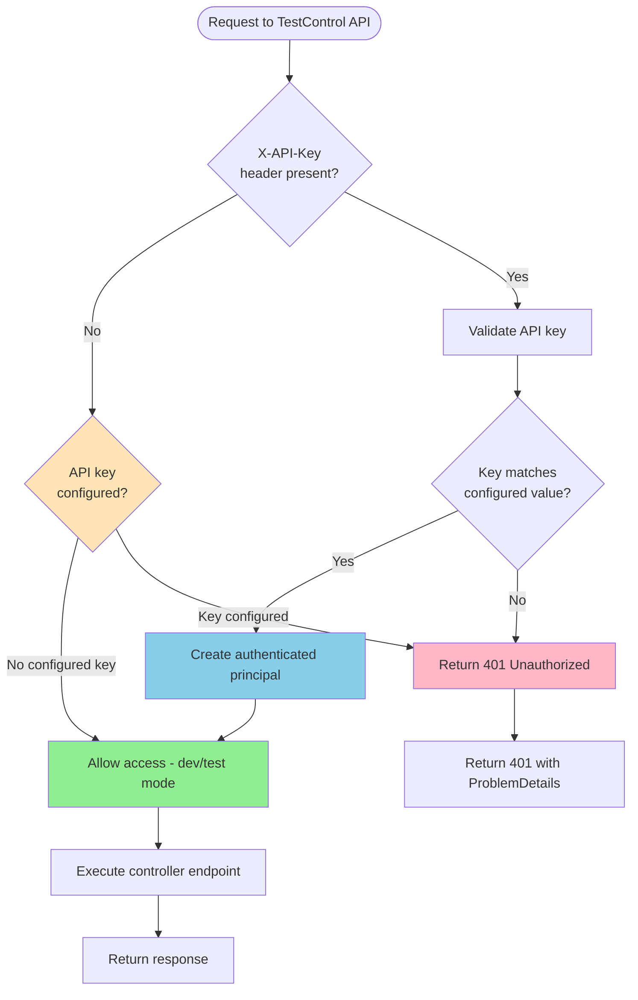
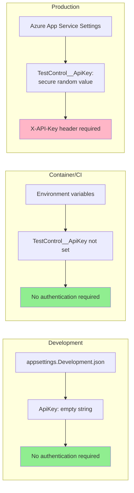

# Test Control API Key Protection Design

## Overview

This document describes the design for protecting Test Control APIs in production with an API key authentication mechanism. The system ensures that test control endpoints remain easily accessible during development and testing while being securely protected in production environments.

## Problem Statement

The [`TestControlController`](../../src/Controllers/TestControlController.cs) provides powerful administrative APIs for:
- Creating and deleting test users
- Creating and managing test workspaces
- Seeding test data
- Generating error responses for testing

These endpoints are essential for functional testing but pose a security risk if left unprotected in production. We need a mechanism to:
1. **Protect in production** - Require API key authentication in production environments
2. **Allow unrestricted access in dev/test** - No authentication required in Development, Container, or CI environments
3. **Simple management** - Single shared API key for operational simplicity
4. **Zero impact on existing tests** - Functional tests continue working without modification

## Architecture Analysis

### Current Security Infrastructure

The application uses:
- **ASP.NET Core Identity** for user authentication ([`SetupIdentity.cs`](../../src/BackEnd/Setup/SetupIdentity.cs))
- **NuxtIdentity** for JWT token-based authentication
- **Authorization policies** for tenant role-based access ([`ServiceCollectionExtensions.cs`](../../src/Controllers/Tenancy/ServiceCollectionExtensions.cs))
- **Custom authorization handlers** for tenant access control ([`TenantRoleHandler.cs`](../../src/Controllers/Tenancy/Authorization/TenantRoleHandler.cs))

### Test Control API Usage

Test control APIs are consumed by:
1. **Functional tests** via auto-generated [`TestControlClient`](../../tests/Functional/Api/ApiClient.cs)
2. **Step definitions** in [`CommonGivenSteps.cs`](../../tests/Functional/Steps/Common/CommonGivenSteps.cs) and [`WorkspaceTenancySteps.cs`](../../tests/Functional/Steps/WorkspaceTenancySteps.cs)
3. **Test infrastructure** in [`FunctionalTestBase.cs`](../../tests/Functional/Infrastructure/FunctionalTestBase.cs)

The test infrastructure creates `HttpClient` instances with test correlation headers for distributed tracing.

## Design Solution

### 1. API Key Authentication Scheme

**Approach**: Custom authentication scheme using `X-API-Key` header validation.

**Why not alternatives:**
- ❌ **Bearer tokens** - Too complex, requires token endpoint, short-lived tokens
- ❌ **Basic Auth** - Requires username/password, not semantic for API keys
- ❌ **Query parameters** - Security anti-pattern (logged in URLs)
- ✅ **Custom header** - Simple, industry-standard pattern for API keys

**Header format:**
```
X-API-Key: <api-key-value>
```

**Implementation approach:**
```csharp
public class ApiKeyAuthenticationHandler : AuthenticationHandler<ApiKeyAuthenticationOptions>
{
    protected override async Task<AuthenticateResult> HandleAuthenticateAsync()
    {
        // 1. Extract X-API-Key header
        if (!Request.Headers.TryGetValue("X-API-Key", out var apiKeyHeaderValues))
        {
            return AuthenticateResult.NoResult();
        }

        var providedApiKey = apiKeyHeaderValues.FirstOrDefault();
        if (string.IsNullOrWhiteSpace(providedApiKey))
        {
            return AuthenticateResult.NoResult();
        }

        // 2. Get expected API key from options
        var expectedApiKey = Options.ApiKey;
        if (string.IsNullOrWhiteSpace(expectedApiKey))
        {
            // No API key configured - authentication not available
            // Authorization policy will handle environment-based access
            return AuthenticateResult.NoResult();
        }

        // 3. Constant-time comparison (prevent timing attacks)
        if (!CryptographicOperations.FixedTimeEquals(
            Encoding.UTF8.GetBytes(providedApiKey),
            Encoding.UTF8.GetBytes(expectedApiKey)))
        {
            return AuthenticateResult.Fail("Invalid API key");
        }

        // 4. Create authenticated principal
        var claims = new[] { new Claim(ClaimTypes.Name, "TestControlApiKey") };
        var identity = new ClaimsIdentity(claims, Scheme.Name);
        var principal = new ClaimsPrincipal(identity);
        var ticket = new AuthenticationTicket(principal, Scheme.Name);

        return AuthenticateResult.Success(ticket);
    }
}
```

### 2. Configuration Management

**Configuration location**: `appsettings.json` and Azure App Service application settings.

**Configuration structure:**
```json
{
  "TestControl": {
    "ApiKey": ""
  }
}
```

**Environment-specific behavior:**
- **Development** (`ASPNETCORE_ENVIRONMENT=Development`): `ApiKey` = `""` (empty, no protection needed)
- **Container** (`ASPNETCORE_ENVIRONMENT=Container`): `ApiKey` not set (no protection needed)
- **Production** (`ASPNETCORE_ENVIRONMENT=Production`): `ApiKey` set to secure random value during provisioning (protected)

**Note:** Authorization policy checks `!environment.IsProduction()` to allow unrestricted access in Development and Container environments.

**Options class:**
```csharp
/// <summary>
/// Configuration options for Test Control API protection.
/// </summary>
public class TestControlOptions
{
    /// <summary>
    /// Configuration section name.
    /// </summary>
    public const string Section = "TestControl";

    /// <summary>
    /// API key required to access Test Control endpoints.
    /// </summary>
    /// <remarks>
    /// If null or empty, Test Control APIs are unprotected (dev/test environments).
    /// If set, API key is required via X-API-Key header (production).
    /// </remarks>
    public string? ApiKey { get; set; }
}
```

**Provisioning-time configuration:**

The API key is generated and configured during resource provisioning, following the same pattern as the JWT key. See [`scripts/Provision-Resources.ps1`](../../scripts/Provision-Resources.ps1) for implementation.

**Generation (in Provision-Resources.ps1):**
```powershell
Write-Host "Generating Test Control API key..." -ForegroundColor Cyan
# Generate cryptographically secure 256-bit (32 bytes) random key
$testControlApiKeyBytes = New-Object byte[] 32
[Security.Cryptography.RandomNumberGenerator]::Create().GetBytes($testControlApiKeyBytes)
$testControlApiKey = [Convert]::ToBase64String($testControlApiKeyBytes)
Write-Verbose "Generated Test Control API key: $testControlApiKey"
```

**Bicep parameter (in infra/main.bicep):**
```bicep
@description('Test Control API key for protecting test endpoints in production')
@secure()
param testControlApiKey string
```

**Bicep configuration (in infra/main.bicep backend module):**
```bicep
{
  name: 'TestControl__ApiKey'
  value: testControlApiKey
}
```

**Provisioning script output:**
```powershell
Write-Host "Test Control Configuration:" -ForegroundColor Cyan
Write-Output "  API Key: $testControlApiKey"
Write-Host ""
Write-Host "IMPORTANT: Store the Test Control API key securely!" -ForegroundColor Yellow
Write-Host "This key is required to access test control endpoints in production." -ForegroundColor Yellow
```

**API key generation** (standalone, for manual configuration):
```csharp
// Use cryptographically secure random generation
var keyBytes = new byte[32]; // 256 bits
using var rng = RandomNumberGenerator.Create();
rng.GetBytes(keyBytes);
var apiKey = Convert.ToBase64String(keyBytes); // Example: "xK2jP9vL..."
```

**Manual Azure App Service configuration** (if needed):
```bash
# Set in Azure Portal or via Azure CLI
az webapp config appsettings set \
  --resource-group <rg-name> \
  --name <app-name> \
  --settings TestControl__ApiKey="<secure-random-value>"
```

### 3. Authorization Policy

**Policy name**: `"TestControlApiAccess"`

**Policy configuration:**
```csharp
services.AddAuthorization(options =>
{
    options.AddPolicy("TestControlApiAccess", policy =>
    {
        // Require authentication via ApiKey scheme
        policy.AddAuthenticationSchemes("ApiKey");

        // Allow access if:
        // - User is authenticated via ApiKey scheme, OR
        // - No API key is configured (dev/test environments)
        policy.RequireAssertion(context =>
        {
            // If user is authenticated via ApiKey scheme, allow
            if (context.User.Identity?.IsAuthenticated == true &&
                context.User.Identity.AuthenticationType == "ApiKey")
            {
                return true;
            }

            // If no API key is configured, allow (permissive fallback)
            var apiKeyConfigured = !string.IsNullOrWhiteSpace(
                context.Resource is HttpContext httpContext
                    ? httpContext.RequestServices
                        .GetRequiredService<IOptions<TestControlOptions>>()
                        .Value.ApiKey
                    : null
            );

            return !apiKeyConfigured;
        });
    });
});
```

**Apply to controller:**
```csharp
[Route("[controller]")]
[ApiController]
[Authorize("TestControlApiAccess")] // Add this attribute
public partial class TestControlController(
    UserManager<IdentityUser> userManager,
    TenantFeature tenantFeature,
    ILogger<TestControlController> logger
) : ControllerBase
{
    // All endpoints now protected by policy
}
```

### 4. Authentication Scheme Registration

**Service registration** in [`src/Controllers/Extensions/ServiceCollectionExtensions.cs`](../../src/Controllers/Extensions/ServiceCollectionExtensions.cs):

Create new extension method `AddTestControlAuthentication()`:

```csharp
/// <summary>
/// Adds Test Control API authentication to the service collection.
/// </summary>
/// <param name="services">The service collection to add services to.</param>
/// <param name="configuration">The application configuration.</param>
/// <param name="environment">The hosting environment.</param>
/// <returns>The service collection for chaining.</returns>
public static IServiceCollection AddTestControlAuthentication(
    this IServiceCollection services,
    IConfiguration configuration,
    IWebHostEnvironment environment)
{
    // Bind TestControl options
    services.Configure<TestControlOptions>(
        configuration.GetSection(TestControlOptions.Section));

    // Add ApiKey authentication scheme
    services
        .AddAuthentication()
        .AddScheme<ApiKeyAuthenticationOptions, ApiKeyAuthenticationHandler>(
            "ApiKey",
            options =>
            {
                // Options are populated from TestControlOptions via DI
            });

    // Register authorization policy
    services.AddAuthorization(options =>
    {
        options.AddPolicy("TestControlApiAccess", policy =>
        {
            // Require authentication via ApiKey scheme
            policy.AddAuthenticationSchemes("ApiKey");

            // Allow access if:
            // - User is authenticated via ApiKey scheme, OR
            // - Not running in Production environment
            policy.RequireAssertion(context =>
            {
                // If user is authenticated via ApiKey scheme, allow
                if (context.User.Identity?.IsAuthenticated == true &&
                    context.User.Identity.AuthenticationType == "ApiKey")
                {
                    return true;
                }

                // Allow unrestricted access in non-Production environments
                // (Development, Container, CI environments)
                if (!environment.IsProduction())
                {
                    return true;
                }

                // Production environment requires authentication
                return false;
            });
        });
    });

    return services;
}
```

**Usage in [`Program.cs`](../../src/BackEnd/Program.cs):**

```csharp
builder.Services.AddTestControlAuthentication(builder.Configuration, builder.Environment);
```

**Why `IWebHostEnvironment` parameter is required:**

The authorization policy needs to check the current environment to determine whether API key authentication is required. The policy uses `environment.IsProduction()` to enforce protection only in production:

```csharp
policy.RequireAssertion(context =>
{
    // If authenticated via API key, allow
    if (context.User.Identity?.IsAuthenticated == true &&
        context.User.Identity.AuthenticationType == "ApiKey")
    {
        return true;
    }

    // Allow unrestricted access in non-Production environments
    if (!environment.IsProduction())
    {
        return true;
    }

    // Production environment requires authentication
    return false;
});
```

**Environment configuration:**
- **Development**: `ASPNETCORE_ENVIRONMENT=Development` (local dev with appsettings.Development.json)
- **Container**: `ASPNETCORE_ENVIRONMENT=Container` (Docker container, CI pipeline)
- **Production**: `ASPNETCORE_ENVIRONMENT=Production` (Azure App Service)

**Benefits of environment-based approach:**
- ✅ Explicit and clear intent - only production requires authentication
- ✅ No complex API key null-checking logic
- ✅ Follows ASP.NET Core conventions for environment-specific behavior
- ✅ Uses `IsProduction()` check - clearer semantics than `IsDevelopment()`
- ✅ Works correctly with custom "Container" environment
- ✅ Azure App Service defaults to Production environment

### 5. Functional Test Adaptations

**Current behavior (Container environment):**
Tests run in Container environment where Test Control APIs are unprotected, so no changes needed.

**Future support (Production environment):**
To support running functional tests against production, tests need optional API key support with secure secret management.

#### Environment Variable Indirection

**Problem:** API keys cannot be committed to source control in `.runsettings` files.

**Solution:** Use environment variable placeholders in `.runsettings`, resolve at runtime using DotNetEnv.

**Implementation in [`FunctionalTestBase.cs`](../../tests/Functional/Infrastructure/FunctionalTestBase.cs):**

```csharp
[OneTimeSetUp]
public async Task OneTimeSetup()
{
    // Load .env file if present (for local production testing)
    var envPath = Path.Combine(TestContext.CurrentContext.TestDirectory, ".env");
    if (File.Exists(envPath))
    {
        DotNetEnv.Env.Load(envPath);
    }

    // ... existing prerequisite checks ...
}

protected TestControlClient testControlClient
{
    get
    {
        if (_testControlClient is null)
        {
            var httpClient = new HttpClient();

            // Add test correlation headers
            if (_testActivity is not null)
            {
                var headers = BuildTestCorrelationHeaders();
                foreach (var header in headers)
                {
                    httpClient.DefaultRequestHeaders.Add(header.Key, header.Value);
                }
            }

            // Add API key header if configured in test parameters
            // This enables running tests against production environment
            var apiKey = TestContext.Parameters["testControlApiKey"];
            if (!string.IsNullOrWhiteSpace(apiKey))
            {
                // Resolve environment variable if value starts with $
                if (apiKey.StartsWith("$"))
                {
                    var envVarName = apiKey.Substring(1);
                    apiKey = Environment.GetEnvironmentVariable(envVarName);

                    if (string.IsNullOrWhiteSpace(apiKey))
                    {
                        throw new InvalidOperationException(
                            $"Test Control API key environment variable '{envVarName}' is not set. " +
                            $"For production testing, create tests/Functional/.env with: {envVarName}=<your-api-key>");
                    }
                }

                httpClient.DefaultRequestHeaders.Add("X-API-Key", apiKey);
            }

            _testControlClient = new TestControlClient(
                baseUrl: TestContext.Parameters["apiBaseUrl"]
                    ?? throw new NullReferenceException("apiBaseUrl test parameter not set"),
                httpClient: httpClient
            );
        }
        return _testControlClient;
    }
}
```

#### Test Configuration Files

**Container/CI tests (.runsettings)** - No API key needed:
```xml
<RunSettings>
  <TestRunParameters>
    <Parameter name="webAppUrl" value="http://localhost:8080" />
    <Parameter name="apiBaseUrl" value="http://localhost:5000" />
    <!-- No testControlApiKey - Container environment doesn't require it -->
  </TestRunParameters>
</RunSettings>
```

**Production tests (.runsettings)** - Environment variable placeholder:
```xml
<RunSettings>
  <TestRunParameters>
    <Parameter name="webAppUrl" value="https://production-frontend.azurestaticapps.net" />
    <Parameter name="apiBaseUrl" value="https://production-api.azurewebsites.net" />
    <Parameter name="testControlApiKey" value="$TEST_CONTROL_API_KEY" />
  </TestRunParameters>
</RunSettings>
```

**Environment file (`tests/Functional/.env`)** - NOT committed to source control:
```bash
# Test Control API Key for production testing
# Obtain from provisioning script output or Azure App Service settings
TEST_CONTROL_API_KEY=<your-base64-encoded-key-here>
```

**Gitignore entry (add to `.gitignore`):**
```
# Don't commit .env files with secrets
tests/Functional/.env
```

**Environment file template (`tests/Functional/.env.template`)** - Committed as documentation:
```bash
# Test Control API Key for production testing
# Copy this file to .env and fill in your actual key
# Obtain key from provisioning script output or Azure App Service settings
TEST_CONTROL_API_KEY=your-api-key-here
```

#### NuGet Package

Add `DotNetEnv` package to functional tests project:

```xml
<PackageReference Include="DotNetEnv" Version="3.0.0" />
```

#### Usage Scenarios

**Local production testing:**
1. Copy `.env.template` to `.env`
2. Fill in `TEST_CONTROL_API_KEY` with actual key
3. Run tests with production `.runsettings`
4. `.env` file is gitignored - secrets stay local

**CI/CD production testing:**
1. Set `TEST_CONTROL_API_KEY` as pipeline secret/environment variable
2. Run tests with production `.runsettings`
3. Environment variable automatically resolved at runtime

**Container/CI tests (default):**
1. Use default `.runsettings` without API key
2. Tests run against Container environment
3. No secrets needed

#### Benefits

- ✅ No secrets in source control
- ✅ No breaking changes to existing tests
- ✅ Environment variable indirection for flexibility
- ✅ `.env` file for local development convenience
- ✅ Same pattern used for other secrets (webAppUrl, apiBaseUrl already support environment variables)
- ✅ Clear error message if API key missing for production tests

### 6. Error Responses

**Unauthorized (401)** when API key is required but missing or invalid:
```json
{
  "type": "https://tools.ietf.org/html/rfc7235#section-3.1",
  "title": "Unauthorized",
  "status": 401,
  "detail": "API key authentication failed"
}
```

**No WWW-Authenticate header** to avoid leaking implementation details.

## Implementation Components

### Files to Create

1. **`src/Controllers/Authentication/ApiKeyAuthenticationHandler.cs`**
   - Custom authentication handler for X-API-Key header validation
   - Constant-time comparison to prevent timing attacks
   - Claims principal creation for authenticated requests

2. **`src/Controllers/Authentication/ApiKeyAuthenticationOptions.cs`**
   - Authentication scheme options
   - Reference to TestControlOptions for API key value

3. **`src/Entities/Options/TestControlOptions.cs`**
   - Configuration options class
   - ApiKey property with documentation

4. **`tests/Functional/.env.template`**
   - Template file for environment variables
   - Committed to source control as documentation

### Files to Modify

1. **[`src/Controllers/TestControlController.cs`](../../src/Controllers/TestControlController.cs)**
   - Add `[Authorize("TestControlApiAccess")]` attribute to class
   - Update XML documentation to mention API key requirement in production

2. **[`src/Controllers/Extensions/ServiceCollectionExtensions.cs`](../../src/Controllers/Extensions/ServiceCollectionExtensions.cs)**
   - Add `AddTestControlAuthentication()` extension method
   - Register ApiKey authentication scheme
   - Register TestControlApiAccess authorization policy

3. **[`src/BackEnd/Program.cs`](../../src/BackEnd/Program.cs)**
   - Call `builder.Services.AddTestControlAuthentication(builder.Configuration, builder.Environment);`

4. **`src/BackEnd/appsettings.json`**
   - Add empty `TestControl:ApiKey` configuration section

5. **`src/BackEnd/appsettings.Development.json`**
   - Add `TestControl:ApiKey: ""` to explicitly document no protection in dev

6. **[`tests/Functional/Infrastructure/FunctionalTestBase.cs`](../../tests/Functional/Infrastructure/FunctionalTestBase.cs)**
   - Add DotNetEnv.Env.Load() in `OneTimeSetup()`
   - Update `testControlClient` property with environment variable resolution
   - Add `X-API-Key` header when API key parameter is present

7. **`tests/Functional/YoFi.V3.Tests.Functional.csproj`**
   - Add `<PackageReference Include="DotNetEnv" Version="3.0.0" />`

8. **`.gitignore`**
   - Add `tests/Functional/.env` to prevent committing secrets

9. **[`scripts/Provision-Resources.ps1`](../../scripts/Provision-Resources.ps1)**
   - Generate Test Control API key (same pattern as JWT key)
   - Pass key as parameter to Bicep deployment
   - Output key in deployment summary

10. **[`scripts/Rotate-JwtKey.ps1`](../../scripts/Rotate-JwtKey.ps1)**
    - Rename to `Rotate-Secrets.ps1`
    - Add support for rotating Test Control API key
    - Add parameter to rotate JWT key, API key, or both
    - Update confirmation message to mention both secrets

11. **[`infra/main.bicep`](../../infra/main.bicep)**
    - Add `@secure() param testControlApiKey string` parameter
    - Add `TestControl__ApiKey` to backend configuration array

12. **[`docs/DEPLOYMENT.md`](../../docs/DEPLOYMENT.md)**
    - Update to reflect Test Control API key is configured during provisioning
    - Document key rotation process using updated Rotate-Secrets.ps1
    - Add Test Control API key to deployment outputs section

13. **`docs/PROVISION-RESOURCES.md`** (if exists)
    - Document Test Control API key generation and configuration
    - Include in provisioning script output documentation

### Files to Review and Update

1. **[`tests/Functional/Infrastructure/FunctionalTestBase.cs`](../../tests/Functional/Infrastructure/FunctionalTestBase.cs)**
   - Update `testControlClient` property to check for `testControlApiKey` test parameter
   - Add `X-API-Key` header when parameter is present
   - Maintains backward compatibility (no breaking changes)

2. **`tests/Functional/.runsettings`** (if exists, or create for production testing)
   - Add `testControlApiKey` parameter for production environment testing
   - Document usage for running tests against production

## Security Considerations

### 1. API Key Security

**Generation:**
- Use cryptographically secure random generation (32 bytes = 256 bits)
- Base64-encode for HTTP header compatibility
- Never use weak passwords or predictable values

**Storage:**
- Store in Azure App Service application settings (encrypted at rest)
- Never commit to source control
- Never include in container images
- Never log in application logs

**Rotation:**

Use the [`scripts/Rotate-Secrets.ps1`](../../scripts/Rotate-Secrets.ps1) script to rotate secrets:

```powershell
# Rotate both JWT key and Test Control API key
.\scripts\Rotate-Secrets.ps1 -ResourceGroup "yofi-rg" -AppServiceName "web-abc123" -RotateAll

# Rotate only Test Control API key
.\scripts\Rotate-Secrets.ps1 -ResourceGroup "yofi-rg" -AppServiceName "web-abc123" -RotateTestControlApiKey

# Rotate only JWT key (backwards compatible)
.\scripts\Rotate-Secrets.ps1 -ResourceGroup "yofi-rg" -AppServiceName "web-abc123" -RotateJwtKey
```

Manual rotation (if needed):
```bash
# Generate new key
openssl rand -base64 32

# Update Azure App Service setting
az webapp config appsettings set \
  --resource-group <rg-name> \
  --name <app-name> \
  --settings TestControl__ApiKey="<new-key>"

# Update any automation/tools using the API key
```

### 2. Timing Attack Prevention

Use `CryptographicOperations.FixedTimeEquals()` for constant-time comparison:
```csharp
if (!CryptographicOperations.FixedTimeEquals(
    Encoding.UTF8.GetBytes(providedApiKey),
    Encoding.UTF8.GetBytes(expectedApiKey)))
{
    return AuthenticateResult.Fail("Invalid API key");
}
```

**Why:** Prevents timing attacks where attacker measures response time to guess key bytes.

### 3. Transport Security

- **Require HTTPS in production** - API keys transmitted in headers MUST use TLS
- Azure App Service enforces HTTPS by default
- Local development can use HTTP (no API key configured anyway)

### 4. Logging and Monitoring

**DO log:**
- Authentication attempts (success/failure counts)
- Suspicious patterns (multiple failures from same IP)
- API key rotation events

**DO NOT log:**
- The API key value itself
- X-API-Key header contents
- Partial key values (even for debugging)

**Logging pattern:**
```csharp
[LoggerMessage(1, LogLevel.Warning, "{Location}: API key authentication failed")]
private partial void LogAuthenticationFailed([CallerMemberName] string? location = null);

[LoggerMessage(2, LogLevel.Information, "{Location}: API key authentication succeeded")]
private partial void LogAuthenticationSucceeded([CallerMemberName] string? location = null);
```

### 5. Rate Limiting (Future Enhancement)

Consider adding rate limiting to prevent brute-force attacks:
- Limit authentication attempts per IP address
- Implement exponential backoff after failures
- Use ASP.NET Core rate limiting middleware

## Testing Strategy

### 1. Unit Tests (New)

**Test file**: `tests/Unit/Controllers/ApiKeyAuthenticationHandlerTests.cs`

Test scenarios:
- ✅ Valid API key → Authentication succeeds
- ✅ Invalid API key → Authentication fails
- ✅ Missing API key header → NoResult (allows policy to handle)
- ✅ Empty API key header → NoResult
- ✅ No API key configured → NoResult (permissive for dev/test)
- ✅ Timing attack resistance (constant-time comparison)

### 2. Integration Tests (New)

**Test file**: `tests/Integration.Controller/TestControlAuthenticationTests.cs`

Test scenarios:
- ✅ Production mode (API key configured) + valid key → 200 OK
- ✅ Production mode (API key configured) + invalid key → 401 Unauthorized
- ✅ Production mode (API key configured) + missing key → 401 Unauthorized
- ✅ Development mode (no API key) + no header → 200 OK (permissive)
- ✅ Development mode (no API key) + invalid header → 200 OK (ignored)

### 3. Functional Tests (Existing)

**No changes required** - Tests run in environments without API key configuration.

**Optional enhancement** - Add explicit test for production-mode protection:
```gherkin
@explicit @production-simulation
Feature: Test Control API Protection

  Scenario: Production environment requires API key
    Given the API is configured with an API key
    When I request test control endpoints without API key
    Then I should receive 401 Unauthorized

  Scenario: Valid API key allows access
    Given the API is configured with an API key
    When I request test control endpoints with valid API key
    Then I should receive successful responses
```

## Deployment Checklist

### Initial Production Deployment (Using Provision-Resources.ps1)

1. ✅ Run provisioning script - automatically generates and configures both JWT key and Test Control API key
2. ✅ Save output values securely (JWT key, Test Control API key, deployment tokens)
3. ✅ Deploy backend application with authentication handler
4. ✅ Verify production health check (should still work - no auth required)
5. ✅ Test TestControl endpoint without key → Expect 401
6. ✅ Test TestControl endpoint with key → Expect 200
7. ✅ Document API key in secure location (Azure Key Vault, password manager)
8. ✅ Share key with authorized automation/tools

### Development/CI Environments

1. ✅ Verify `appsettings.Development.json` has empty `ApiKey`
2. ✅ Verify Docker containers don't set `TestControl__ApiKey` environment variable
3. ✅ Verify CI pipeline doesn't set API key variable
4. ✅ Run functional tests → Should pass without changes

### API Key Rotation

1. Run rotation script: `.\scripts\Rotate-Secrets.ps1 -ResourceGroup <rg> -AppServiceName <app> -RotateTestControlApiKey`
2. Save new key securely (displayed in script output)
3. Update any automation/tools with new key
4. Monitor logs for authentication failures

**Note:** The Rotate-Secrets.ps1 script supports rotating JWT key, Test Control API key, or both. See script documentation for details.

## Mermaid Diagram: Authentication Flow



## Mermaid Diagram: Environment Configuration



## Alternative Approaches Considered

### 1. Environment-based Disable (Rejected)

**Approach**: Completely disable test control endpoints in production via conditional compilation or middleware.

**Why rejected:**
- Requires separate production and test builds
- No flexibility for authorized production testing
- Makes production troubleshooting harder
- API key protection is simpler and more flexible

### 2. JWT Token Authentication (Rejected)

**Approach**: Require JWT tokens for test control APIs.

**Why rejected:**
- Overly complex for simple API key scenario
- Requires token endpoint and token management
- Short-lived tokens require refresh logic
- Not semantic for non-user API access

### 3. IP Allowlist (Rejected)

**Approach**: Restrict test control APIs to specific IP addresses.

**Why rejected:**
- Fragile (IPs change, especially in cloud environments)
- Difficult to manage across teams/locations
- Doesn't prevent access from compromised allowed IPs
- Can't be easily tested/rotated

### 4. Multiple API Keys (Rejected for v1)

**Approach**: Support multiple API keys for different clients/teams.

**Why rejected for initial implementation:**
- Adds complexity for uncertain benefit
- Test control APIs are internal/administrative only
- Single key is sufficient for operational simplicity
- Can be added later if needed without breaking changes

## Future Enhancements

### 1. Rate Limiting
Add request throttling to prevent brute-force attacks:
```csharp
builder.Services.AddRateLimiter(options =>
{
    options.AddFixedWindowLimiter("TestControlApi", limiter =>
    {
        limiter.Window = TimeSpan.FromMinutes(1);
        limiter.PermitLimit = 100;
    });
});
```

### 2. API Key Metadata
Track key creation date, last used date, usage counts:
```json
{
  "TestControl": {
    "ApiKey": "...",
    "ApiKeyCreatedDate": "2025-01-01T00:00:00Z",
    "ApiKeyLastRotatedDate": "2025-06-01T00:00:00Z"
  }
}
```

### 3. Multiple Keys Support
Support multiple keys for different clients:
```json
{
  "TestControl": {
    "ApiKeys": [
      { "Name": "CI-Pipeline", "Key": "..." },
      { "Name": "Manual-Testing", "Key": "..." }
    ]
  }
}
```

### 4. Audit Logging
Enhanced logging with structured data for security monitoring:
```csharp
[LoggerMessage(3, LogLevel.Warning,
    "{Location}: API key authentication failed from IP {IpAddress}")]
private partial void LogAuthenticationFailedWithIp(
    string ipAddress,
    [CallerMemberName] string? location = null);
```

## References

### Project Documentation
- [Logging Policy](../LOGGING-POLICY.md) - Logging patterns and security considerations
- [Deployment Guide](../DEPLOYMENT.md) - Deployment process and configuration management
- [Commit Conventions](../COMMIT-CONVENTIONS.md) - Commit message format

### Code Files
- [`TestControlController.cs`](../../src/Controllers/TestControlController.cs) - Test control endpoints
- [`SetupIdentity.cs`](../../src/BackEnd/Setup/SetupIdentity.cs) - Identity configuration
- [`ServiceCollectionExtensions.cs`](../../src/Controllers/Tenancy/ServiceCollectionExtensions.cs) - Authorization policies
- [`FunctionalTestBase.cs`](../../tests/Functional/Infrastructure/FunctionalTestBase.cs) - Test infrastructure

### External Resources
- [ASP.NET Core Authentication](https://learn.microsoft.com/en-us/aspnet/core/security/authentication/) - Authentication concepts
- [Custom Authentication Schemes](https://learn.microsoft.com/en-us/aspnet/core/security/authentication/policyschemes) - Custom auth handlers
- [API Key Best Practices](https://www.rfc-editor.org/rfc/rfc8959.html) - API key security guidelines

## Questions and Clarifications

### Q: Should we support query parameter API keys?
**A**: No. Query parameters are logged in web server logs, proxy logs, and browser history. Headers are more secure.

### Q: How long should the API key be?
**A**: 32 bytes (256 bits) provides strong security. Base64-encoded = ~43 characters.

### Q: Should the API key expire?
**A**: Not automatically. Manual rotation is simpler and sufficient for this use case. Can add expiration in future if needed.

### Q: What if the API key is compromised?
**A**: Rotate immediately by generating new key and updating Azure App Service settings. Old key becomes invalid instantly.

### Q: Can we use the same pattern for other internal APIs?
**A**: Yes! This authentication handler can be reused for any internal/administrative APIs requiring API key protection.
