# DbContext Concurrency Issue - Deep Architectural Analysis

## Executive Summary

**Problem:** Intermittent `InvalidOperationException` during login after user registration due to Entity Framework Core DbContext concurrency violations.

**Root Cause:** **FIRE-AND-FORGET BACKGROUND TASK** in `EfRefreshTokenService.GenerateRefreshTokenAsync()` continues using the DbContext after the method returns, causing concurrent access when subsequent operations execute.

**Specific Bug:** Lines 75-85 in [`EfRefreshTokenService.cs`](submodules/NuxtIdentity/src/EntityFrameworkCore/Services/EfRefreshTokenService.cs:75-85) spawn a `Task.Run()` background task for token cleanup that uses the same scoped DbContext instance, violating EF Core's single-threaded constraint.

**Impact:** Critical - blocks end-to-end authentication flow testing and potentially affects production reliability.

**Risk Level:** HIGH - Race condition makes this intermittent and difficult to reproduce consistently.

**Solution:** Remove the fire-and-forget background task or use a separate DbContext factory for background operations.

---

## THE SMOKING GUN 🔫

### The Actual Bug

From [`EfRefreshTokenService.cs:51-88`](submodules/NuxtIdentity/src/EntityFrameworkCore/Services/EfRefreshTokenService.cs:51-88):

```csharp
public async Task<string> GenerateRefreshTokenAsync(string userId)
{
    var token = GenerateSecureToken();
    var tokenHash = HashToken(token);

    var entity = new RefreshTokenEntity { /* ... */ };

    _context.Set<RefreshTokenEntity>().Add(entity);
    await _context.SaveChangesAsync();

    // Clear change tracker after saving
    _context.ChangeTracker.Clear();

    LogTokenGenerated(userId, entity.ExpiresAt, token);

    // ❌ BUG: Fire-and-forget cleanup of expired tokens
    _ = Task.Run(async () =>
    {
        try
        {
            await DeleteExpiredTokensAsync();  // ⚠️ USES _context!
        }
        catch (Exception ex)
        {
            LogCleanupFailed(ex);
        }
    });

    return token;  // ← Method returns BUT background task still running!
}

private async Task<int> DeleteExpiredTokensAsync()
{
    var tokensToDelete = await _context.Set<RefreshTokenEntity>()  // ⚠️ CONCURRENT ACCESS
        .Where(t => t.ExpiresAt < now)
        .ToListAsync();

    if (tokensToDelete.Count > 0)
    {
        _context.Set<RefreshTokenEntity>().RemoveRange(tokensToDelete);
        await _context.SaveChangesAsync();  // ❌ BOOM - Concurrent operation!
    }

    return tokensToDelete.Count;
}
```

### Why You Were Awaiting Correctly But Still Getting Concurrency

You were absolutely right - you ARE awaiting all operations correctly! The problem is that `GenerateRefreshTokenAsync()` **appears** to complete (returns a string), but it secretly leaves a background task running that continues to use the DbContext.

**Timeline of the Bug:**

```
Time | Main Thread                              | Background Task (Task.Run)
-----|------------------------------------------|---------------------------
T1   | await RefreshTokenService                |
     |   .GenerateRefreshTokenAsync()           |
T2   |   → SaveChangesAsync()                   |
T3   |   → ChangeTracker.Clear()                |
T4   |   → Task.Run(() => DeleteExpired...)     | ← Background task spawned
T5   |   → return token ✓                       | → Starting...
T6   | await CreateUserInfoAsync()              | → Querying _context
T7   |   → UserManager.GetRolesAsync()          | → Still using _context
T8   |   → ❌ EXCEPTION: Concurrent operation!  | → SaveChangesAsync()
```

The `await` on line 103 of `CreateLoginResponseAsync` waits for the method to return, but NOT for the fire-and-forget background task!

---

## Problem Statement

### The Failing Scenario

From [`EndToEndAuthenticationTests.cs:131`](tests/Integration.Controller/EndToEndAuthenticationTests.cs:131):

```csharp
// 1. User registers successfully (SignUp endpoint)
var signupResponse = await _client.PostAsJsonAsync("/api/auth/signup", signupRequest);

// 2. User immediately logs in (Login endpoint)
var loginResponse = await _client.PostAsJsonAsync("/api/auth/login", loginRequest);
// ❌ FAILS HERE - Often but not always
```

### The Exception

```
System.InvalidOperationException: A second operation was started on this context instance
before a previous operation completed. This is usually caused by different threads
concurrently using the same instance of DbContext.
```

**Location:** [`NuxtAuthControllerBase.cs:157`](submodules/NuxtIdentity/src/AspNetCore/Controllers/NuxtAuthControllerBase.cs:157) in `CreateUserInfoAsync()` when calling `UserManager.GetRolesAsync(user)`.

---

## Architectural Analysis

### Current DbContext Registration

From [`ServiceCollectionExtensions.cs:19-33`](src/Data/Sqlite/ServiceCollectionExtensions.cs:19-33):

```csharp
services.AddDbContext<ApplicationDbContext>(options => {
    options.UseSqlite(connectionString, sqliteOptions => {
        sqliteOptions.CommandTimeout(30);
    });
    options.EnableSensitiveDataLogging(false);
});

services.AddScoped<IDataProvider, ApplicationDbContext>();
services.AddScoped<ITenantRepository, ApplicationDbContext>();
services.AddScoped<IDbContextCleaner, ApplicationDbContext>();
```

**Issue:** The same `ApplicationDbContext` instance is registered for THREE different interfaces, AND it's injected into `EfRefreshTokenService`, meaning all services share the SAME DbContext instance per request.

### The Authentication Flow with Background Task

```mermaid
sequenceDiagram
    participant Controller
    participant RefreshTokenService
    participant DbContext
    participant BackgroundTask
    participant UserManager

    Controller->>RefreshTokenService: GenerateRefreshTokenAsync()
    RefreshTokenService->>DbContext: Add(token)
    RefreshTokenService->>DbContext: SaveChangesAsync()
    RefreshTokenService->>DbContext: ChangeTracker.Clear()

    Note over RefreshTokenService: Start background cleanup

    RefreshTokenService->>BackgroundTask: Task.Run(DeleteExpiredTokensAsync)
    RefreshTokenService-->>Controller: return token ✓

    Note over Controller: Method returned, continue...

    Controller->>Controller: CreateUserInfoAsync()

    par Main Thread
        Controller->>UserManager: GetRolesAsync(user)
        UserManager->>DbContext: Query AspNetUserRoles
    and Background Thread
        BackgroundTask->>DbContext: Query RefreshTokens (DELETE)
        BackgroundTask->>DbContext: SaveChangesAsync()
    end

    Note over DbContext: ❌ CONCURRENT OPERATION DETECTED

    DbContext-->>UserManager: EXCEPTION!
```



### Why It's Intermittent

The race condition depends on timing:

1. **Fast cleanup:** Background task finishes before `CreateUserInfoAsync()` starts → Test passes
2. **Slow cleanup:** Background task still running when `CreateUserInfoAsync()` queries → Test fails

Factors affecting timing:
- Number of expired tokens to delete
- Database I/O speed
- CPU scheduling
- SQLite locking state

---

## The Fix

### Option 1: Remove Fire-and-Forget (RECOMMENDED)

Simply remove the background cleanup from the hot path:

```csharp
public async Task<string> GenerateRefreshTokenAsync(string userId)
{
    var token = GenerateSecureToken();
    var tokenHash = HashToken(token);

    var entity = new RefreshTokenEntity { /* ... */ };

    _context.Set<RefreshTokenEntity>().Add(entity);
    await _context.SaveChangesAsync();

    // Clear change tracker after saving
    _context.ChangeTracker.Clear();

    LogTokenGenerated(userId, entity.ExpiresAt, token);

    // ✅ REMOVED: Fire-and-forget background task
    // Token cleanup should be handled by:
    // 1. Scheduled background job (e.g., Hangfire, Quartz)
    // 2. Separate API endpoint for maintenance
    // 3. Database TTL/expiration (if supported)

    return token;
}
```

**Pros:**
- ✅ Fixes the concurrency issue completely
- ✅ Simplest solution
- ✅ Token cleanup can be handled more appropriately elsewhere

**Cons:**
- ⚠️ Need alternative token cleanup strategy

### Option 2: Use DbContext Factory for Background Task

If cleanup must happen inline, use a separate DbContext:

```csharp
private readonly IDbContextFactory<TContext> _contextFactory;

public async Task<string> GenerateRefreshTokenAsync(string userId)
{
    var token = GenerateSecureToken();
    var tokenHash = HashToken(token);

    var entity = new RefreshTokenEntity { /* ... */ };

    _context.Set<RefreshTokenEntity>().Add(entity);
    await _context.SaveChangesAsync();
    _context.ChangeTracker.Clear();

    LogTokenGenerated(userId, entity.ExpiresAt, token);

    // ✅ Use separate DbContext for background cleanup
    _ = Task.Run(async () =>
    {
        try
        {
            await using var cleanupContext = await _contextFactory.CreateDbContextAsync();
            await DeleteExpiredTokensAsync(cleanupContext);
        }
        catch (Exception ex)
        {
            LogCleanupFailed(ex);
        }
    });

    return token;
}

private async Task<int> DeleteExpiredTokensAsync(TContext context)
{
    var now = DateTime.UtcNow;
    var tokensToDelete = await context.Set<RefreshTokenEntity>()
        .Where(t => t.ExpiresAt < now)
        .ToListAsync();

    if (tokensToDelete.Count > 0)
    {
        context.Set<RefreshTokenEntity>().RemoveRange(tokensToDelete);
        await context.SaveChangesAsync();
        LogTokensDeleted(tokensToDelete.Count);
    }

    return tokensToDelete.Count;
}
```

**Pros:**
- ✅ Fixes concurrency issue
- ✅ Keeps inline cleanup behavior
- ✅ Separate DbContext for background work

**Cons:**
- ❌ Requires `IDbContextFactory<T>` registration
- ❌ More complex than Option 1
- ❌ Still has fire-and-forget issues (error handling, cancellation)

### Option 3: Make Cleanup Synchronous (NOT RECOMMENDED)

Wait for cleanup to complete:

```csharp
public async Task<string> GenerateRefreshTokenAsync(string userId)
{
    var token = GenerateSecureToken();
    var tokenHash = HashToken(token);

    var entity = new RefreshTokenEntity { /* ... */ };

    _context.Set<RefreshTokenEntity>().Add(entity);
    await _context.SaveChangesAsync();

    // ✅ Cleanup completes before returning
    try
    {
        await DeleteExpiredTokensAsync();
    }
    catch (Exception ex)
    {
        LogCleanupFailed(ex);
    }

    _context.ChangeTracker.Clear();
    LogTokenGenerated(userId, entity.ExpiresAt, token);

    return token;
}
```

**Pros:**
- ✅ Fixes concurrency issue
- ✅ No fire-and-forget complexity

**Cons:**
- ❌ Slows down token generation for every request
- ❌ User waits for cleanup that doesn't affect their request
- ❌ Poor performance characteristics

---

## Recommended Solution

### Immediate Fix (Critical)

**Remove the fire-and-forget background task from `EfRefreshTokenService.GenerateRefreshTokenAsync()`.**

This is a bug in the NuxtIdentity library that violates DbContext usage patterns. The cleanup should NOT happen in the hot path of token generation.

### Proper Token Cleanup Strategy

Implement one of these approaches:

#### Option A: Scheduled Background Job (BEST)

```csharp
// Using Hangfire, Quartz, or ASP.NET Core BackgroundService
public class RefreshTokenCleanupService : BackgroundService
{
    private readonly IServiceProvider _serviceProvider;

    protected override async Task ExecuteAsync(CancellationToken stoppingToken)
    {
        while (!stoppingToken.IsCancellationRequested)
        {
            await Task.Delay(TimeSpan.FromHours(1), stoppingToken);

            using var scope = _serviceProvider.CreateScope();
            var refreshTokenService = scope.ServiceProvider
                .GetRequiredService<IRefreshTokenService>();

            await refreshTokenService.CleanupExpiredTokensAsync();
        }
    }
}
```

#### Option B: Maintenance Endpoint

```csharp
[HttpPost("api/maintenance/cleanup-tokens")]
[Authorize(Roles = "Admin")]
public async Task<IActionResult> CleanupExpiredTokens()
{
    var deleted = await refreshTokenService.CleanupExpiredTokensAsync();
    return Ok(new { deleted });
}
```

#### Option C: Database TTL (If Supported)

Some databases support automatic expiration:
- PostgreSQL: `pg_cron` extension
- SQL Server: SQL Agent jobs
- SQLite: Would need external scheduler

---

## Why This Bug Was Hard to Find

1. **Misleading await:** The `await` on `GenerateRefreshTokenAsync()` appears to wait for completion, but doesn't wait for fire-and-forget tasks

2. **Timing-dependent:** The bug only manifests if:
   - Background task is slow enough to still be running
   - Next operation happens quickly enough to overlap
   - DbContext detects the concurrent access

3. **Proper usage elsewhere:** Your code WAS awaiting correctly - the bug was hidden inside a library method

4. **Change tracker clearing:** The `ChangeTracker.Clear()` on line 70 makes it seem safe, but doesn't prevent concurrent access from background threads

---

## Action Items

### Critical (Fix Immediately)

- [ ] **Remove fire-and-forget task** from `EfRefreshTokenService.GenerateRefreshTokenAsync()` (lines 75-85)
- [ ] **Test the fix** - The intermittent failure should disappear
- [ ] **Implement proper cleanup** - Add scheduled background job or maintenance endpoint

### High Priority

- [ ] **Report to NuxtIdentity** - This is a library bug that should be fixed upstream
- [ ] **Add test** - Create a test that exposes this race condition reliably
- [ ] **Review other fire-and-forget** - Search codebase for other `_ = Task.Run` patterns

### Medium Priority

- [ ] **Document pattern** - Add rule about fire-and-forget + DbContext to team guidelines
- [ ] **Code review checklist** - Flag any fire-and-forget operations using scoped services

---

## Additional Bugs Found

While analyzing this issue, we also found bugs in [`CreateUserInfoAsync()`](submodules/NuxtIdentity/src/AspNetCore/Controllers/NuxtAuthControllerBase.cs:155-170):

```csharp
foreach (var roleName in roles)
{
    var role = await UserManager.FindByNameAsync(roleName);  // ⚠️ BUG: Should be RoleManager
    if (role != null)
    {
        var claims = await UserManager.GetClaimsAsync(user);  // ⚠️ BUG: Gets user claims, not role claims
        roleClaims.AddRange(claims);
    }
}
```

These should also be fixed, but they're not the cause of the concurrency issue.

---

## References

- [EF Core DbContext Lifetime](https://learn.microsoft.com/en-us/ef/core/dbcontext-configuration/)
- [EF Core Threading Issues](https://go.microsoft.com/fwlink/?linkid=2097913)
- [Task.Run and Async/Await](https://learn.microsoft.com/en-us/archive/msdn-magazine/2013/march/async-await-best-practices-in-asynchronous-programming)
- [`EfRefreshTokenService.cs:75-85`](submodules/NuxtIdentity/src/EntityFrameworkCore/Services/EfRefreshTokenService.cs:75-85)
- [`EndToEndAuthenticationTests.cs:131`](tests/Integration.Controller/EndToEndAuthenticationTests.cs:131)
- [`NuxtAuthControllerBase.cs:157`](submodules/NuxtIdentity/src/AspNetCore/Controllers/NuxtAuthControllerBase.cs:157)

---

## Conclusion

**You were absolutely right** - you ARE awaiting all your operations correctly! The bug was hidden in a library method (`EfRefreshTokenService`) that uses a fire-and-forget background task, violating the DbContext single-threaded constraint.

This is a perfect example of why fire-and-forget operations with scoped dependencies are dangerous:
- The scoped service (DbContext) lives for the HTTP request duration
- The background task outlives the method but still references the scoped DbContext
- When other code uses the same DbContext, concurrent access occurs

**The fix is simple:** Remove the fire-and-forget background task and implement proper scheduled cleanup.
