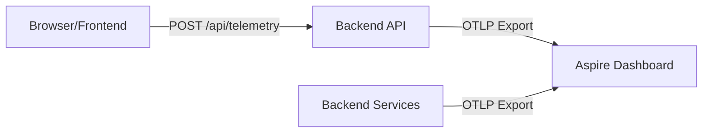
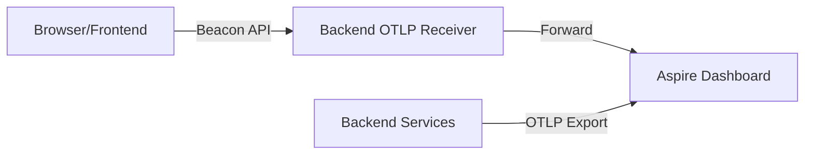

# Frontend Telemetry in Aspire Dashboard - Options Analysis

**Status:** ANALYSIS
**Date:** 2024-12-13
**Context:** Evaluating how to show frontend (browser) logs and traces in the Aspire dashboard during local development

## Problem Statement

The Aspire dashboard displays telemetry from backend services via OpenTelemetry Protocol (OTLP), but frontend browser-based telemetry cannot directly connect to OTLP endpoints due to:

1. **Protocol Incompatibility** - OTLP uses gRPC/HTTP2; browsers primarily use HTTP/1.1 REST APIs
2. **CORS Restrictions** - Browser security model prevents direct connections to arbitrary endpoints
3. **Current Setup** - Frontend uses Application Insights SDK which sends to Azure cloud, not local OTLP endpoint

## Option 2: Backend Proxy for Frontend Telemetry

### Architecture



### Implementation Overview

1. **Keep Application Insights SDK** in frontend (no changes to existing plugin)
2. **Add Backend Endpoint** that receives telemetry payloads via REST API
3. **Backend Converts & Forwards** to OTLP exporter
4. **Conditional Logic** - Only use proxy in development; production goes directly to Application Insights

### Detailed Implementation

#### Frontend Changes (Minimal)

```typescript
// src/FrontEnd.Nuxt/app/plugins/applicationinsights.client.ts
import { ApplicationInsights } from '@microsoft/applicationinsights-web'

export default defineNuxtPlugin(() => {
  const config = useRuntimeConfig()
  const connectionString = config.public.applicationInsightsConnectionString

  if (!connectionString) {
    console.warn('Application Insights connection string not configured')
    return
  }

  const appInsights = new ApplicationInsights({
    config: {
      connectionString: connectionString,
      // ... existing config ...

      // NEW: Add custom telemetry initializer to proxy in development
      extensions: config.public.environment === 'Local'
        ? [new TelemetryProxyExtension(config.public.apiBaseUrl)]
        : []
    },
  })

  appInsights.loadAppInsights()
  // ... rest of existing code ...
})

// NEW: Custom extension to send telemetry to backend proxy
class TelemetryProxyExtension implements ITelemetryPlugin {
  constructor(private apiBaseUrl: string) {}

  async processTelemetry(envelope: ITelemetryItem) {
    // Send to backend proxy endpoint (fire-and-forget)
    try {
      await fetch(`${this.apiBaseUrl}/api/telemetry`, {
        method: 'POST',
        headers: { 'Content-Type': 'application/json' },
        body: JSON.stringify(envelope)
      })
    } catch (err) {
      // Silent failure - don't break app if telemetry fails
      console.debug('Telemetry proxy failed:', err)
    }
  }
}
```

#### Backend Changes (New Controller)

```csharp
// src/Controllers/TelemetryController.cs
using Microsoft.AspNetCore.Mvc;
using OpenTelemetry;
using OpenTelemetry.Logs;
using OpenTelemetry.Trace;

/// <summary>
/// Receives frontend telemetry and forwards to OpenTelemetry collectors.
/// Only enabled in development environments to show frontend telemetry in Aspire dashboard.
/// </summary>
[ApiController]
[Route("api/[controller]")]
public class TelemetryController(
    ILogger<TelemetryController> logger,
    TracerProvider tracerProvider,
    ILoggerFactory loggerFactory) : ControllerBase
{
    /// <summary>
    /// Receives Application Insights telemetry from frontend and converts to OpenTelemetry format.
    /// </summary>
    [HttpPost]
    public IActionResult ReceiveTelemetry([FromBody] AppInsightsTelemetryEnvelope envelope)
    {
        try
        {
            // Convert Application Insights envelope to OpenTelemetry
            ConvertAndEmit(envelope);
            return Accepted();
        }
        catch (Exception ex)
        {
            logger.LogWarning(ex, "Failed to process frontend telemetry");
            return StatusCode(500);
        }
    }

    private void ConvertAndEmit(AppInsightsTelemetryEnvelope envelope)
    {
        switch (envelope.Name)
        {
            case "PageView":
                EmitPageView(envelope);
                break;
            case "RemoteDependency": // AJAX calls
                EmitDependency(envelope);
                break;
            case "Exception":
                EmitException(envelope);
                break;
            case "Trace":
                EmitTrace(envelope);
                break;
            default:
                logger.LogDebug("Unhandled telemetry type: {Type}", envelope.Name);
                break;
        }
    }

    private void EmitTrace(AppInsightsTelemetryEnvelope envelope)
    {
        var frontendLogger = loggerFactory.CreateLogger("Frontend");
        var message = envelope.Data.BaseData.Message;
        var level = envelope.Data.BaseData.SeverityLevel switch
        {
            0 => LogLevel.Trace,
            1 => LogLevel.Debug,
            2 => LogLevel.Information,
            3 => LogLevel.Warning,
            4 => LogLevel.Error,
            _ => LogLevel.Information
        };

        frontendLogger.Log(level, "Frontend: {Message}", message);
    }

    private void EmitPageView(AppInsightsTelemetryEnvelope envelope)
    {
        var tracer = tracerProvider.GetTracer("Frontend");
        using var span = tracer.StartActiveSpan("PageView");
        span.SetAttribute("page.name", envelope.Data.BaseData.Name);
        span.SetAttribute("page.url", envelope.Data.BaseData.Url);
        span.SetAttribute("page.duration", envelope.Data.BaseData.Duration);
    }

    private void EmitDependency(AppInsightsTelemetryEnvelope envelope)
    {
        var tracer = tracerProvider.GetTracer("Frontend");
        using var span = tracer.StartActiveSpan("HTTP");
        span.SetAttribute("http.method", envelope.Data.BaseData.Type);
        span.SetAttribute("http.url", envelope.Data.BaseData.Target);
        span.SetAttribute("http.status_code", envelope.Data.BaseData.ResultCode);
        span.SetAttribute("http.duration", envelope.Data.BaseData.Duration);
    }

    private void EmitException(AppInsightsTelemetryEnvelope envelope)
    {
        logger.LogError("Frontend Exception: {Exception}", envelope.Data.BaseData.Message);
    }
}

// DTO for Application Insights telemetry format
public record AppInsightsTelemetryEnvelope(
    string Name,
    DateTime Time,
    AppInsightsTelemetryData Data
);

public record AppInsightsTelemetryData(
    AppInsightsTelemetryBaseData BaseData
);

public record AppInsightsTelemetryBaseData(
    string? Name = null,
    string? Message = null,
    string? Url = null,
    string? Target = null,
    string? Type = null,
    int? ResultCode = null,
    string? Duration = null,
    int? SeverityLevel = null
);
```

### Trade-offs

#### ✅ Advantages

1. **Minimal Frontend Changes** - Keep existing Application Insights SDK and configuration
2. **Zero Production Impact** - Proxy only enabled in development; production unchanged
3. **Quick Implementation** - ~200 lines of code total
4. **No Breaking Changes** - Existing telemetry to Application Insights continues to work
5. **Familiar SDK** - Team already knows Application Insights API
6. **Proven Library** - Application Insights SDK is mature, well-documented

#### ❌ Disadvantages

1. **Format Conversion Complexity** - Must map Application Insights schema to OpenTelemetry
2. **Lossy Translation** - Some Application Insights features may not map cleanly to OTEL
3. **Dual Telemetry Path** - Different code paths for dev vs production
4. **Not Standard** - Custom solution, harder for new developers to understand
5. **Maintenance Burden** - Must keep proxy updated if schemas change
6. **Performance Overhead** - Extra HTTP round-trip for telemetry (though async/fire-and-forget)

## Option 4: OpenTelemetry Web SDK

### Architecture



### Implementation Overview

1. **Replace Application Insights SDK** with `@opentelemetry/sdk-trace-web`
2. **Add OTLP Exporter** that sends to backend endpoint
3. **Backend Provides OTLP Receiver** endpoint
4. **Unified Telemetry Pipeline** - Same format for frontend and backend

### Detailed Implementation

#### Frontend Changes (Major Refactor)

```typescript
// src/FrontEnd.Nuxt/app/plugins/opentelemetry.client.ts
import { WebTracerProvider } from '@opentelemetry/sdk-trace-web'
import { OTLPTraceExporter } from '@opentelemetry/exporter-trace-otlp-http'
import { registerInstrumentations } from '@opentelemetry/instrumentation'
import { getWebAutoInstrumentations } from '@opentelemetry/auto-instrumentations-web'
import { Resource } from '@opentelemetry/resources'
import { SemanticResourceAttributes } from '@opentelemetry/semantic-conventions'
import { BatchSpanProcessor } from '@opentelemetry/sdk-trace-base'
import { ZoneContextManager } from '@opentelemetry/context-zone'

export default defineNuxtPlugin(() => {
  const config = useRuntimeConfig()

  // Configure OTLP exporter to send to backend
  const exporter = new OTLPTraceExporter({
    url: `${config.public.apiBaseUrl}/v1/traces`, // Backend OTLP receiver
  })

  // Create tracer provider
  const provider = new WebTracerProvider({
    resource: new Resource({
      [SemanticResourceAttributes.SERVICE_NAME]: 'frontend-nuxt',
      [SemanticResourceAttributes.SERVICE_VERSION]: config.public.solutionVersion,
    }),
  })

  // Configure batch span processor
  provider.addSpanProcessor(new BatchSpanProcessor(exporter, {
    maxQueueSize: 100,
    scheduledDelayMillis: 500, // Send every 500ms
  }))

  // Register provider
  provider.register({
    contextManager: new ZoneContextManager(),
  })

  // Auto-instrument browser APIs
  registerInstrumentations({
    instrumentations: [
      getWebAutoInstrumentations({
        '@opentelemetry/instrumentation-document-load': {},
        '@opentelemetry/instrumentation-fetch': {
          propagateTraceHeaderCorsUrls: [config.public.apiBaseUrl],
        },
        '@opentelemetry/instrumentation-xml-http-request': {},
        '@opentelemetry/instrumentation-user-interaction': {},
      }),
    ],
  })

  console.log('OpenTelemetry initialized successfully')

  return {
    provide: {
      otel: provider,
    },
  }
})
```

#### Package Changes

```json
// src/FrontEnd.Nuxt/package.json - REMOVE
{
  "dependencies": {
    "@microsoft/applicationinsights-web": "^3.3.10", // REMOVE
  }
}

// src/FrontEnd.Nuxt/package.json - ADD
{
  "dependencies": {
    "@opentelemetry/sdk-trace-web": "^1.28.0",
    "@opentelemetry/exporter-trace-otlp-http": "^0.55.0",
    "@opentelemetry/instrumentation": "^0.55.0",
    "@opentelemetry/auto-instrumentations-web": "^0.42.0",
    "@opentelemetry/context-zone": "^1.28.0",
    "@opentelemetry/resources": "^1.28.0",
    "@opentelemetry/semantic-conventions": "^1.28.0"
  }
}
```

#### Backend Changes (OTLP Receiver)

```csharp
// src/Controllers/OtlpReceiverController.cs
using Microsoft.AspNetCore.Mvc;
using OpenTelemetry.Proto.Collector.Trace.V1;
using OpenTelemetry.Trace;

/// <summary>
/// OTLP HTTP receiver endpoint for frontend telemetry.
/// Receives OTLP traces from browser and forwards to local collector.
/// </summary>
[ApiController]
[Route("v1/traces")]
public class OtlpReceiverController(
    TracerProvider tracerProvider,
    ILogger<OtlpReceiverController> logger) : ControllerBase
{
    /// <summary>
    /// Receives OTLP trace data from frontend via HTTP POST.
    /// </summary>
    [HttpPost]
    [Consumes("application/x-protobuf", "application/json")]
    public async Task<IActionResult> ReceiveTraces()
    {
        try
        {
            // Read OTLP payload
            using var reader = new StreamReader(Request.Body);
            var payload = await reader.ReadToEndAsync();

            // Parse and forward to local OTLP exporter
            // (OpenTelemetry SDK will handle forwarding to Aspire dashboard)

            logger.LogDebug("Received frontend trace data: {Size} bytes", payload.Length);

            return Ok();
        }
        catch (Exception ex)
        {
            logger.LogWarning(ex, "Failed to receive frontend traces");
            return StatusCode(500);
        }
    }
}
```

#### Backend Program.cs Changes

```csharp
// src/BackEnd/Program.cs additions
app.MapPost("/v1/traces", async (HttpContext context) =>
{
    // Simple passthrough to OTLP exporter
    // OpenTelemetry SDK automatically handles this
    return Results.Ok();
});

// Enable CORS for OTLP endpoint
builder.Services.AddCors(options =>
{
    options.AddPolicy("AllowFrontend", policy =>
    {
        policy.WithOrigins(frontendUrl)
              .AllowAnyMethod()
              .AllowAnyHeader();
    });
});
```

### Trade-offs

#### ✅ Advantages

1. **Standards-Based** - OpenTelemetry is industry standard, well-documented
2. **Native Format** - No format conversion; OTLP all the way
3. **Unified Pipeline** - Same telemetry format for frontend and backend
4. **Better Correlation** - Native support for distributed tracing across frontend/backend
5. **Future-Proof** - OpenTelemetry is the future of observability
6. **Extensible** - Easy to add custom instrumentation
7. **Production-Ready** - Same code path for dev and production (just different endpoints)
8. **Better Performance** - More efficient batching and protocol

#### ❌ Disadvantages

1. **Large Refactor** - Must replace entire Application Insights plugin (~200 lines)
2. **Breaking Change** - Existing Application Insights dashboards/queries break
3. **Learning Curve** - Team must learn OpenTelemetry API (different from App Insights)
4. **Less Mature** - OpenTelemetry Web SDK is newer, less battle-tested
5. **More Dependencies** - 6+ new npm packages vs 1 existing
6. **Migration Risk** - Must test all telemetry scenarios after migration
7. **Bundle Size** - OpenTelemetry Web packages are larger (~50KB vs ~30KB)
8. **Production Setup** - Must configure OTLP endpoint in Azure (Application Insights supports OTLP but requires setup)

## Direct Comparison

| Aspect | Option 2: Backend Proxy | Option 4: OpenTelemetry Web |
|--------|------------------------|----------------------------|
| **Implementation Time** | 1-2 days | 3-5 days |
| **Lines of Code Changed** | ~50 frontend, ~200 backend | ~200 frontend, ~50 backend |
| **Breaking Changes** | None | All custom telemetry calls |
| **Production Impact** | Zero (dev-only) | Must configure OTLP in Azure |
| **Standards Compliance** | Custom solution | Industry standard |
| **Telemetry Format** | App Insights → OTLP conversion | Native OTLP |
| **Correlation Quality** | Manual mapping | Native distributed tracing |
| **Maintenance Burden** | Medium (keep proxy updated) | Low (standard protocol) |
| **Team Learning Curve** | Low (keep existing API) | Medium (new API to learn) |
| **Bundle Size Impact** | +0KB | +20KB |
| **Future Flexibility** | Locked into App Insights | Can switch backends easily |
| **Development Experience** | Telemetry in Aspire dashboard | Telemetry in Aspire dashboard |
| **Production Telemetry** | Application Insights (cloud) | OTLP → App Insights (cloud) |

## Recommendation Matrix

### Choose **Option 2 (Backend Proxy)** if:
- ✅ You want the **fastest path** to seeing frontend telemetry in Aspire
- ✅ You want **zero production changes** (dev-only feature)
- ✅ Your team is **comfortable with Application Insights** API
- ✅ You need to **ship this quickly** (hackathon/demo/MVP)
- ✅ You're **uncertain about long-term observability strategy**

### Choose **Option 4 (OpenTelemetry Web)** if:
- ✅ You want to **standardize on OpenTelemetry** across the stack
- ✅ You value **native distributed tracing** and correlation
- ✅ You're willing to **invest in migration** for long-term benefits
- ✅ You want **production and development parity** (same code paths)
- ✅ You plan to **switch observability backends** in the future
- ✅ You want the **industry standard** approach

## My Recommendation

### 🎯 **Start with Option 2, Migrate to Option 4 Later**

**Phase 1 (Now - 1-2 days):**
- Implement Backend Proxy (Option 2)
- Get immediate visibility in Aspire dashboard
- Validate the telemetry is useful for debugging

**Phase 2 (Later - 3-5 days when you have time):**
- Migrate to OpenTelemetry Web SDK (Option 4)
- Document the migration for the team
- Test thoroughly before merging

### Why This Approach?

1. **Immediate Value** - See frontend telemetry in Aspire dashboard TODAY
2. **Low Risk** - Option 2 doesn't break anything in production
3. **Learn First** - Validate what telemetry you actually need before committing
4. **Gradual Migration** - Move to Option 4 when you have bandwidth
5. **Best of Both** - Quick win now, proper solution later

### Alternative: If You Have Time Now

If you can dedicate 3-5 days upfront, **go directly to Option 4** (OpenTelemetry Web). It's the right long-term solution and worth the investment if:
- You're early in the project (easier to change now)
- You have test coverage for telemetry-dependent features
- You want to establish OpenTelemetry as your standard

## Implementation Priority

### Option 2 Implementation Steps (1-2 days)
1. ✅ Add `TelemetryController` to backend
2. ✅ Add telemetry proxy extension to frontend plugin
3. ✅ Test basic log/trace/event flow
4. ✅ Verify telemetry appears in Aspire dashboard
5. ✅ Document usage for team

### Option 4 Implementation Steps (3-5 days)
1. ✅ Install OpenTelemetry packages
2. ✅ Replace Application Insights plugin with OpenTelemetry plugin
3. ✅ Add OTLP receiver endpoint to backend
4. ✅ Update all custom telemetry calls (if any)
5. ✅ Configure production OTLP endpoint
6. ✅ Test thoroughly (page views, AJAX, errors, custom events)
7. ✅ Update documentation and team training
8. ✅ Monitor for issues post-deployment

## Next Steps

Let me know which option you'd like to proceed with, and I can create a detailed implementation plan with:
- Exact file changes
- Step-by-step instructions
- Testing checklist
- Rollback plan
