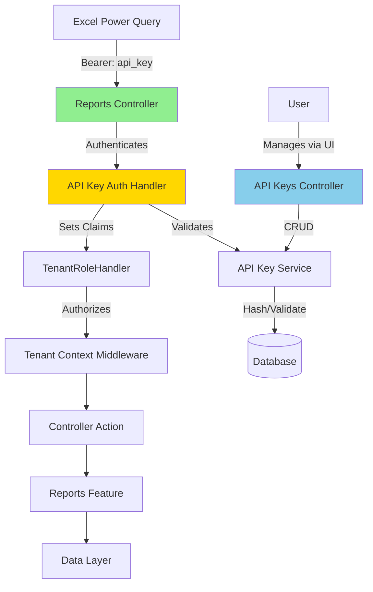

# Detailed Design: Reports Export API

**Status:** Design Document
**Date:** 2025-12-23
**Related:** [`PRD-EXPORT-API.md`](PRD-EXPORT-API.md)

## Overview

This document provides the detailed technical design for the Reports Export API feature, which enables Excel users to connect directly to YoFi's API to retrieve report data using API key authentication.

**Key Design Decisions:**
- User-scoped API keys (one key for all workspaces)
- Custom authentication scheme (not middleware)
- Reports endpoints follow tenant-scoped URL pattern: `/api/tenant/{key}/reports/*`
- Array-of-objects JSON format for Excel compatibility

---

## Architecture

### System Context



### Request Flow

1. **Excel sends request** with `Authorization: Bearer yofi_user_xxx`
2. **ApiKeyAuthenticationHandler** validates key, creates claims principal
3. **Authorization** runs - TenantRoleHandler checks user has access to tenant in URL
4. **TenantContextMiddleware** sets current tenant context
5. **ReportsController** action executes
6. **ReportsFeature** generates report data
7. **Response** returns JSON array optimized for Excel

---

## Data Model

### API Key Entity

```csharp
namespace YoFi.V3.Entities.Models;

/// <summary>
/// API key for programmatic access to reports.
/// </summary>
public record ApiKey : BaseModel
{
    /// <summary>
    /// User-friendly name for the key (e.g., "Excel - Home Computer").
    /// </summary>
    public string Name { get; set; } = string.Empty;

    /// <summary>
    /// SHA-256 hash of the API key (never store plaintext).
    /// </summary>
    public string KeyHash { get; set; } = string.Empty;

    /// <summary>
    /// First 8 characters of key for display purposes (e.g., "yofi_use").
    /// </summary>
    public string KeyPrefix { get; set; } = string.Empty;

    /// <summary>
    /// User who owns this API key.
    /// </summary>
    public Guid UserId { get; set; }

    /// <summary>
    /// Scope of access granted by this key.
    /// </summary>
    public ApiKeyScope Scope { get; set; }

    /// <summary>
    /// When the key was created.
    /// </summary>
    public DateTimeOffset CreatedAt { get; set; }

    /// <summary>
    /// Last time the key was used (updated on each request).
    /// </summary>
    public DateTimeOffset? LastUsedAt { get; set; }

    /// <summary>
    /// Whether the key is active (soft delete via this flag).
    /// </summary>
    public bool IsActive { get; set; } = true;
}

/// <summary>
/// Access scope for API keys.
/// </summary>
public enum ApiKeyScope
{
    /// <summary>
    /// Read-only access to report endpoints only.
    /// </summary>
    ReadOnlyReports = 1
}
```

**Design Notes:**
- User-scoped (no TenantId field) - one key works for all user's tenants
- SHA-256 hash only (no salt needed - keys have 128+ bits entropy)
- Soft delete via IsActive flag (preserves audit history)
- LastUsedAt updated asynchronously (fire-and-forget, don't block request)

### Database Migration

```sql
CREATE TABLE ApiKeys (
    Id INTEGER PRIMARY KEY AUTOINCREMENT,
    Key TEXT NOT NULL UNIQUE,
    Name TEXT NOT NULL,
    KeyHash TEXT NOT NULL,
    KeyPrefix TEXT NOT NULL,
    UserId TEXT NOT NULL,
    Scope INTEGER NOT NULL DEFAULT 1,
    CreatedAt TEXT NOT NULL,
    LastUsedAt TEXT,
    IsActive INTEGER NOT NULL DEFAULT 1,
    FOREIGN KEY (UserId) REFERENCES AspNetUsers(Id) ON DELETE CASCADE
);

CREATE INDEX IX_ApiKeys_UserId ON ApiKeys(UserId);
CREATE INDEX IX_ApiKeys_KeyHash ON ApiKeys(KeyHash) WHERE IsActive = 1;
```

---

## Authentication Implementation

### API Key Format

**Format:** `yofi_user_{32_hex_chars}`

**Example:** `yofi_user_9f8e7d6c5b4a3210fedcba9876543210abcdef12`

**Generation:**
```csharp
public static string GenerateApiKey()
{
    var randomBytes = new byte[16]; // 128 bits
    using (var rng = RandomNumberGenerator.Create())
    {
        rng.GetBytes(randomBytes);
    }
    var randomHex = Convert.ToHexString(randomBytes).ToLowerInvariant();
    return $"yofi_user_{randomHex}";
}
```

**Hash Storage:**
```csharp
public static string HashApiKey(string apiKey)
{
    using var sha256 = SHA256.Create();
    var hashBytes = sha256.ComputeHash(Encoding.UTF8.GetBytes(apiKey));
    return Convert.ToHexString(hashBytes).ToLowerInvariant();
}
```

### Authentication Handler

Register as custom authentication scheme:

```csharp
// Program.cs
builder.Services.AddAuthentication()
    .AddScheme<ApiKeyAuthenticationOptions, ApiKeyAuthenticationHandler>(
        "ApiKey",
        options => { }
    );
```

**Implementation:**

```csharp
namespace YoFi.V3.Controllers.Authentication;

/// <summary>
/// Authentication handler for API key Bearer tokens.
/// </summary>
public class ApiKeyAuthenticationHandler : AuthenticationHandler<ApiKeyAuthenticationOptions>
{
    private readonly IApiKeyService _apiKeyService;

    public ApiKeyAuthenticationHandler(
        IOptionsMonitor<ApiKeyAuthenticationOptions> options,
        ILoggerFactory logger,
        UrlEncoder encoder,
        IApiKeyService apiKeyService)
        : base(options, logger, encoder)
    {
        _apiKeyService = apiKeyService;
    }

    protected override async Task<AuthenticateResult> HandleAuthenticateAsync()
    {
        // Extract Authorization header
        if (!Request.Headers.TryGetValue("Authorization", out var authHeader))
        {
            return AuthenticateResult.NoResult();
        }

        var headerValue = authHeader.ToString();
        if (!headerValue.StartsWith("Bearer ", StringComparison.OrdinalIgnoreCase))
        {
            return AuthenticateResult.NoResult();
        }

        var apiKey = headerValue.Substring("Bearer ".Length).Trim();

        // Validate API key
        var keyInfo = await _apiKeyService.ValidateKeyAsync(apiKey);
        if (keyInfo == null || !keyInfo.IsActive)
        {
            return AuthenticateResult.Fail("Invalid or revoked API key");
        }

        // Create claims principal
        var claims = new List<Claim>
        {
            new Claim(ClaimTypes.NameIdentifier, keyInfo.UserId.ToString()),
            new Claim("api_key_id", keyInfo.KeyId.ToString()),
            new Claim("api_key_scope", keyInfo.Scope.ToString())
        };

        var identity = new ClaimsIdentity(claims, Scheme.Name);
        var principal = new ClaimsPrincipal(identity);
        var ticket = new AuthenticationTicket(principal, Scheme.Name);

        // Track usage (fire-and-forget)
        _ = _apiKeyService.UpdateLastUsedAsync(keyInfo.KeyId);

        return AuthenticateResult.Success(ticket);
    }
}

public class ApiKeyAuthenticationOptions : AuthenticationSchemeOptions
{
    // No custom options needed for Phase 1
}
```

### API Key Service

```csharp
namespace YoFi.V3.Application.Features;

public interface IApiKeyService
{
    Task<ApiKeyValidationResult?> ValidateKeyAsync(string apiKey);
    Task UpdateLastUsedAsync(Guid keyId);
    Task<ApiKeyCreatedDto> CreateApiKeyAsync(Guid userId, string name, ApiKeyScope scope);
    Task<IReadOnlyCollection<ApiKeyResultDto>> GetApiKeysForUserAsync(Guid userId);
    Task RevokeApiKeyAsync(Guid keyId, Guid userId);
}

public record ApiKeyValidationResult(
    Guid KeyId,
    Guid UserId,
    ApiKeyScope Scope,
    bool IsActive
);
```

**Implementation highlights:**
- `ValidateKeyAsync` - Hash input key, lookup in database by hash
- `UpdateLastUsedAsync` - Fire-and-forget update (don't await in request path)
- `CreateApiKeyAsync` - Generate key, hash it, store hash + prefix, return full key ONCE
- Authorization check in RevokeApiKeyAsync - only key owner can revoke

---

## Authorization

### Reuse Existing TenantRoleHandler

The existing [`TenantRoleHandler`](../../src/Controllers/Tenancy/Authorization/TenantRoleHandler.cs) already supports both JWT and API key authentication because it reads user ID from claims:

```csharp
// From existing TenantRoleHandler.cs - NO CHANGES NEEDED
protected override async Task HandleRequirementAsync(
    AuthorizationHandlerContext context,
    TenantRoleRequirement requirement)
{
    // Works for JWT OR API key - both set ClaimTypes.NameIdentifier
    var userId = context.User.FindFirstValue(ClaimTypes.NameIdentifier);
    if (userId == null)
    {
        context.Fail();
        return;
    }

    // Extract tenant from route
    var tenantKey = (Guid?)httpContext.GetRouteData().Values["tenantKey"];

    // Check user's role in this tenant
    var userRole = await _tenantRepository.GetUserRoleInTenantAsync(userId, tenantKey);

    if (userRole == null || userRole < requirement.MinimumRole)
    {
        context.Fail(); // Returns 403
        return;
    }

    // Success - set context for downstream middleware
    httpContext.Items["TenantKey"] = tenantKey;
    httpContext.Items["TenantRole"] = userRole;
    context.Succeed(requirement);
}
```

**Key Point:** API key authentication sets same claims as JWT authentication, so authorization "just works" with no code changes.

---

## API Endpoints

### Reports Controller

```csharp
namespace YoFi.V3.Controllers;

/// <summary>
/// Provides read-only access to report data for Excel integration.
/// </summary>
/// <param name="reportsFeature">Reports feature service.</param>
/// <param name="logger">Logger for diagnostic output.</param>
[Route("api/tenant/{tenantKey:guid}/reports")]
[ApiController]
[Authorize(AuthenticationSchemes = "ApiKey")]
[RequireTenantRole(TenantRole.Viewer)]
public partial class ReportsController(
    IReportsFeature reportsFeature,
    ILogger<ReportsController> logger) : ControllerBase
{
    /// <summary>
    /// Get spending summary grouped by category.
    /// </summary>
    /// <param name="tenantKey">Tenant identifier from route.</param>
    /// <param name="fromDate">Start date for report (inclusive).</param>
    /// <param name="toDate">End date for report (inclusive).</param>
    /// <returns>Array of category spending summaries.</returns>
    [HttpGet("spending/by-category")]
    [ProducesResponseType(typeof(IReadOnlyCollection<CategorySummaryDto>), StatusCodes.Status200OK)]
    [ProducesResponseType(typeof(ProblemDetails), StatusCodes.Status400BadRequest)]
    [ProducesResponseType(typeof(ProblemDetails), StatusCodes.Status401Unauthorized)]
    [ProducesResponseType(typeof(ProblemDetails), StatusCodes.Status403Forbidden)]
    public async Task<IActionResult> GetSpendingByCategory(
        [FromRoute] Guid tenantKey,
        [FromQuery] DateOnly fromDate,
        [FromQuery] DateOnly toDate)
    {
        LogStarting();

        // ReportsFeature uses ITenantProvider to access current tenant
        var report = await reportsFeature.GetSpendingByCategoryAsync(fromDate, toDate);

        LogOk();
        return Ok(report);
    }

    /// <summary>
    /// Get list of available report types for discovery.
    /// </summary>
    [HttpGet("available")]
    [ProducesResponseType(typeof(IReadOnlyCollection<ReportMetadataDto>), StatusCodes.Status200OK)]
    public IActionResult GetAvailableReports([FromRoute] Guid tenantKey)
    {
        LogStarting();

        var reports = reportsFeature.GetAvailableReportTypes();

        LogOk();
        return Ok(reports);
    }

    [LoggerMessage(1, LogLevel.Debug, "{Location}: Starting")]
    private partial void LogStarting([CallerMemberName] string? location = null);

    [LoggerMessage(2, LogLevel.Information, "{Location}: OK")]
    private partial void LogOk([CallerMemberName] string? location = null);
}
```

### API Keys Management Controller

```csharp
namespace YoFi.V3.Controllers;

/// <summary>
/// Manages API keys for programmatic access to reports.
/// </summary>
/// <param name="apiKeyFeature">API key feature service.</param>
/// <param name="logger">Logger for diagnostic output.</param>
[Route("api/user/apikeys")]
[ApiController]
[Authorize] // JWT authentication only (not API key)
public partial class ApiKeysController(
    IApiKeyFeature apiKeyFeature,
    ILogger<ApiKeysController> logger) : ControllerBase
{
    /// <summary>
    /// List all API keys for current user.
    /// </summary>
    [HttpGet]
    [ProducesResponseType(typeof(IReadOnlyCollection<ApiKeyResultDto>), StatusCodes.Status200OK)]
    public async Task<IActionResult> GetApiKeys()
    {
        LogStarting();

        var userId = Guid.Parse(User.FindFirstValue(ClaimTypes.NameIdentifier)!);
        var keys = await apiKeyFeature.GetApiKeysAsync(userId);

        LogOk();
        return Ok(keys);
    }

    /// <summary>
    /// Create new API key.
    /// </summary>
    /// <remarks>
    /// The full API key is returned ONLY in this response. User must save it immediately.
    /// </remarks>
    [HttpPost]
    [ProducesResponseType(typeof(ApiKeyCreatedDto), StatusCodes.Status201Created)]
    [ProducesResponseType(typeof(ProblemDetails), StatusCodes.Status400BadRequest)]
    public async Task<IActionResult> CreateApiKey([FromBody] CreateApiKeyDto dto)
    {
        LogStarting();

        var userId = Guid.Parse(User.FindFirstValue(ClaimTypes.NameIdentifier)!);
        var result = await apiKeyFeature.CreateApiKeyAsync(userId, dto.Name, dto.Scope);

        LogOkKey(result.Key);
        return CreatedAtAction(nameof(GetApiKeys), new { }, result);
    }

    /// <summary>
    /// Revoke API key (soft delete).
    /// </summary>
    [HttpDelete("{keyId:guid}")]
    [ProducesResponseType(StatusCodes.Status204NoContent)]
    [ProducesResponseType(typeof(ProblemDetails), StatusCodes.Status404NotFound)]
    public async Task<IActionResult> RevokeApiKey(Guid keyId)
    {
        LogStartingKey(keyId);

        var userId = Guid.Parse(User.FindFirstValue(ClaimTypes.NameIdentifier)!);
        await apiKeyFeature.RevokeApiKeyAsync(keyId, userId);

        LogOkKey(keyId);
        return NoContent();
    }

    [LoggerMessage(1, LogLevel.Debug, "{Location}: Starting")]
    private partial void LogStarting([CallerMemberName] string? location = null);

    [LoggerMessage(2, LogLevel.Debug, "{Location}: Starting {Key}")]
    private partial void LogStartingKey(Guid key, [CallerMemberName] string? location = null);

    [LoggerMessage(3, LogLevel.Information, "{Location}: OK")]
    private partial void LogOk([CallerMemberName] string? location = null);

    [LoggerMessage(4, LogLevel.Information, "{Location}: OK {Key}")]
    private partial void LogOkKey(Guid key, [CallerMemberName] string? location = null);
}
```

---

## DTOs

### Report DTOs

```csharp
namespace YoFi.V3.Application.Dto;

/// <summary>
/// Category spending summary for Excel reports.
/// </summary>
public record CategorySummaryDto(
    string Category,
    decimal Amount,
    decimal PercentTotal,
    int TransactionCount
);

/// <summary>
/// Metadata about available reports for discovery.
/// </summary>
public record ReportMetadataDto(
    string Id,
    string Name,
    string Description,
    string ExampleUrl
);
```

### API Key Management DTOs

```csharp
namespace YoFi.V3.Application.Dto;

/// <summary>
/// API key information (excludes actual key).
/// </summary>
public record ApiKeyResultDto(
    Guid Key,
    string Name,
    string KeyPrefix,
    ApiKeyScope Scope,
    DateTimeOffset CreatedAt,
    DateTimeOffset? LastUsedAt,
    bool IsActive
);

/// <summary>
/// Response when API key is created (includes full key).
/// </summary>
/// <remarks>
/// The ApiKey field contains the full key and is returned ONLY ONCE.
/// </remarks>
public record ApiKeyCreatedDto(
    Guid Key,
    string Name,
    string ApiKey,
    ApiKeyScope Scope,
    DateTimeOffset CreatedAt
);

/// <summary>
/// Request to create new API key.
/// </summary>
public record CreateApiKeyDto(
    [NotWhiteSpace] string Name,
    ApiKeyScope Scope = ApiKeyScope.ReadOnlyReports
);
```

---

## Security

### Rate Limiting

**Configuration:**
```csharp
// Program.cs
builder.Services.AddRateLimiter(options =>
{
    options.AddFixedWindowLimiter("ApiKeyPolicy", limiterOptions =>
    {
        limiterOptions.PermitLimit = 100;
        limiterOptions.Window = TimeSpan.FromMinutes(1);
        limiterOptions.QueueProcessingOrder = QueueProcessingOrder.OldestFirst;
        limiterOptions.QueueLimit = 0; // No queueing
    });
});
```

**Application:**
```csharp
[EnableRateLimiting("ApiKeyPolicy")]
public class ReportsController : ControllerBase
{
    // All endpoints rate-limited
}
```

### Audit Logging

**What to Log:**
- API key usage (key ID, user ID, endpoint, timestamp, IP address, status code)
- API key lifecycle events (created, revoked)
- Authentication failures

**Implementation:**
```csharp
// In ApiKeyAuthenticationHandler.HandleAuthenticateAsync
Logger.LogInformation(
    "API key {KeyId} used by user {UserId} from {IpAddress} for {Path}",
    keyInfo.KeyId,
    keyInfo.UserId,
    httpContext.Connection.RemoteIpAddress,
    httpContext.Request.Path
);
```

### Scope Enforcement

**Authorization Policy:**
```csharp
// Program.cs
builder.Services.AddAuthorization(options =>
{
    options.AddPolicy("ReadOnlyReports", policy =>
    {
        policy.RequireAuthenticatedUser();
        policy.RequireClaim("api_key_scope", ApiKeyScope.ReadOnlyReports.ToString());
    });
});
```

**Future Enhancement:** Create authorization handler that checks scope matches endpoint type.

---

## Testing Strategy

### Unit Tests

**`ApiKeyServiceTests`:**
- `GenerateApiKey_ReturnsValidFormat()` - Validates format `yofi_user_{32hex}`
- `HashApiKey_ProducesSameHashForSameInput()` - Deterministic hashing
- `ValidateKey_InvalidKey_ReturnsNull()` - Handles bad keys gracefully
- `ValidateKey_RevokedKey_ReturnsInactive()` - Soft delete check

### Integration Tests

**`ApiKeyAuthenticationTests`:**
- `Authenticate_ValidKey_SetsUserClaims()` - Claims principal created correctly
- `Authenticate_InvalidKey_Returns401()` - Authentication fails
- `Authenticate_RevokedKey_Returns401()` - Inactive keys rejected
- `Authenticate_MissingBearer_ReturnsNoResult()` - Allows fallback to JWT

**`ReportsControllerTests`:**
- `GetSpendingByCategory_ValidApiKey_ReturnsData()` - End-to-end with API key
- `GetSpendingByCategory_WrongTenant_Returns403()` - Tenant isolation
- `GetSpendingByCategory_ViewerRole_Succeeds()` - Role-based access
- `GetSpendingByCategory_NoApiKey_Returns401()` - Authentication required

### Functional Tests

**`ExcelIntegrationTests.feature`:**
```gherkin
Scenario: User creates API key and accesses report from Excel
  Given a user is authenticated in YoFi web UI
  When they navigate to User Settings → API Keys
  And they click "Generate New API Key"
  And they provide name "Excel Test"
  Then they see the full API key displayed once
  And they can copy the API key

  When they make HTTP GET request to "/api/tenant/{tenantKey}/reports/spending/by-category"
  And they provide Authorization header with Bearer token
  And they provide fromDate and toDate query parameters
  Then they receive 200 OK response
  And response contains JSON array of category summaries
  And each item has category, amount, percentTotal, transactionCount fields
```

---

## Data Format Specification

### Excel-Optimized JSON

**Format:** Array of flat objects (no nesting)

**Example Response:**
```json
[
  {
    "category": "Groceries",
    "amount": 1234.56,
    "percentTotal": 23.45,
    "transactionCount": 42
  },
  {
    "category": "Utilities",
    "amount": 456.78,
    "percentTotal": 8.67,
    "transactionCount": 12
  }
]
```

**Requirements:**
- ✅ Array at root level (no wrapper object)
- ✅ Flat objects (no nested properties)
- ✅ camelCase property names
- ✅ Numeric types for numbers (not strings)
- ✅ ISO 8601 dates: `"2024-01-15"` or `"2024-01-15T10:30:00Z"`

**What Excel Does:**
1. Loads JSON array
2. Creates table with columns from object keys
3. Auto-detects types (string, decimal, date)
4. User can sort, filter, pivot, chart immediately

---

## Configuration

### Service Registration

```csharp
// Program.cs

// Authentication
builder.Services.AddAuthentication()
    .AddScheme<ApiKeyAuthenticationOptions, ApiKeyAuthenticationHandler>("ApiKey", options => { });

// Services
builder.Services.AddScoped<IApiKeyService, ApiKeyService>();
builder.Services.AddScoped<IApiKeyFeature, ApiKeyFeature>();

// Rate limiting
builder.Services.AddRateLimiter(options =>
{
    options.AddFixedWindowLimiter("ApiKeyPolicy", limiterOptions =>
    {
        limiterOptions.PermitLimit = 100;
        limiterOptions.Window = TimeSpan.FromMinutes(1);
    });
});

// Middleware pipeline order
app.UseAuthentication();     // JWT + API Key
app.UseAuthorization();      // TenantRoleHandler
app.UseTenancy();            // TenantContextMiddleware
app.UseRateLimiter();
app.MapControllers();
```

---

## Excel User Documentation

### Setup Guide

**Step 1: Generate API Key**
1. Log into YoFi web UI
2. Navigate to User Settings → API Keys
3. Click "Generate New API Key"
4. Name: "Excel Integration"
5. Copy the key immediately (shown only once)

**Step 2: Configure Excel**
1. Excel → Data tab → Get Data → From Web
2. URL: `https://api.yofi.app/api/tenant/{WORKSPACE-ID}/reports/spending/by-category?fromDate=2024-01-01&toDate=2024-12-31`
3. Choose Advanced
4. Add HTTP header:
   - Name: `Authorization`
   - Value: `Bearer {YOUR-API-KEY}`
5. Click OK

**Step 3: Refresh Data**
- Excel remembers your API key
- Click "Refresh All" to update
- Set up automatic refresh schedule if desired

**Finding Workspace ID:**
```
GET https://api.yofi.app/api/user/tenants
Authorization: Bearer {YOUR-API-KEY}

Returns:
[
  { "key": "abc-123", "name": "Personal", "role": "Owner" },
  { "key": "xyz-789", "name": "Business", "role": "Editor" }
]
```

Use the `key` field in your report URLs.

---

## Implementation Checklist

### Phase 1: Core Infrastructure
- [ ] Create ApiKey entity and database migration
- [ ] Implement ApiKeyService (generate, validate, hash)
- [ ] Implement ApiKeyAuthenticationHandler
- [ ] Register authentication scheme in Program.cs
- [ ] Create ApiKeysController (CRUD for key management)
- [ ] Add API key management UI in frontend
- [ ] Unit tests for ApiKeyService
- [ ] Integration tests for authentication

### Phase 2: Reports Integration
- [ ] Create ReportsController with `/spending/by-category` endpoint
- [ ] Ensure ReportsFeature returns `IReadOnlyCollection<CategorySummaryDto>`
- [ ] Verify DTOs use array-of-objects format
- [ ] Add `/available` endpoint for report discovery
- [ ] Integration tests for ReportsController with API keys
- [ ] Verify tenant isolation with API keys

### Phase 3: Security & Observability
- [ ] Add rate limiting to ReportsController
- [ ] Implement audit logging for API key usage
- [ ] Add LastUsedAt tracking (fire-and-forget)
- [ ] Create API key usage dashboard (future)
- [ ] Functional tests for Excel integration workflow

### Phase 4: Documentation & Support
- [ ] Write Excel setup guide for users
- [ ] Create FAQ for common issues
- [ ] Provide Excel template files with pre-configured queries (optional)
- [ ] Add troubleshooting guide

---

## Open Design Questions (For Implementation)

1. **API Key Index Optimization** - Should we add composite index on (KeyHash, IsActive)?
2. **Rate Limit Storage** - Use in-memory or Redis for distributed rate limiting?
3. **Audit Log Destination** - Application Insights only or separate audit table?
4. **Frontend UI Location** - User Settings or Workspace Settings for API key management?

---

## Related Documents

- [`PRD-EXPORT-API.md`](PRD-EXPORT-API.md) - Product requirements (WHAT and WHY)
- [`PRD-REPORTS.md`](PRD-REPORTS.md) - Prerequisite Reports feature specification
- [`src/Controllers/Tenancy/Authorization/TenantRoleHandler.cs`](../../src/Controllers/Tenancy/Authorization/TenantRoleHandler.cs) - Existing authorization logic (reused)
- [`docs/TENANCY.md`](../../docs/TENANCY.md) - Multi-tenancy architecture overview
