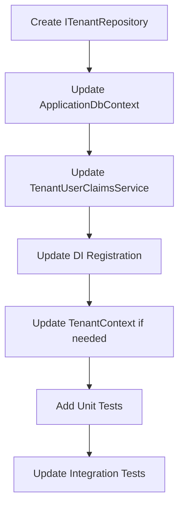
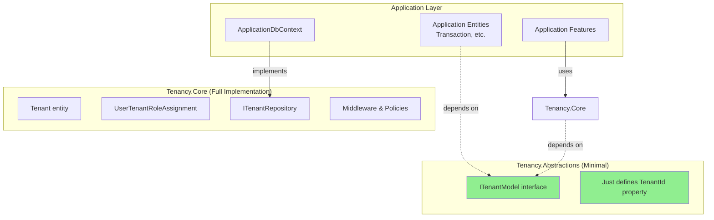

# Tenancy Architecture Solution

**Date**: 2025-12-09
**Status**: Proposal
**Context**: Solving architectural issues in [`TenantUserClaimsService`](../../../src/Controllers/Tenancy/TenantUserClaimsService.cs)

## Problem Statement

The [`TenantUserClaimsService`](../../../src/Controllers/Tenancy/TenantUserClaimsService.cs:9) has two interconnected architectural problems:

### Problem 1: Type Constraint Mismatch

[`UserTenantRoleAssignment`](../../../src/Entities/Tenancy/UserTenantRoleAssignment.cs) does not implement [`IModel`](../../../src/Entities/Models/IModel.cs), so it cannot be queried through [`IDataProvider.Get<T>()`](../../../src/Entities/Providers/IDataProvider.cs:15) which requires `where TEntity : class, IModel`.

```csharp
// Currently broken - won't compile
var tenantClaims = dataProvider.Get<UserTenantRoleAssignment>();
// Error: UserTenantRoleAssignment does not satisfy constraint 'IModel'
```

### Problem 2: Application Coupling

The tenancy system is designed to be reusable across applications, but [`IDataProvider`](../../../src/Entities/Providers/IDataProvider.cs) is application-specific. It defines:
- Application-specific concepts ([`IModel`](../../../src/Entities/Models/IModel.cs) with `Id` and `Key` properties)
- Application-specific operations (tied to YoFi.V3's data patterns)

**Goal**: Make tenancy portable so it can be reused in future applications without coupling to YoFi.V3's specific data layer.

## Root Cause Analysis

The deeper issue is **conceptual misalignment**:

1. **[`IModel`](../../../src/Entities/Models/IModel.cs) represents application domain entities** (Transactions, WeatherForecasts, etc.)
   - Has `long Id` (internal database key)
   - Has `Guid Key` (public-facing identifier)
   - Designed for YoFi.V3's specific primary key strategy

2. **Tenancy entities are infrastructure, not domain**
   - [`Tenant`](../../../src/Entities/Tenancy/Tenant.cs) and [`UserTenantRoleAssignment`](../../../src/Entities/Tenancy/UserTenantRoleAssignment.cs) are cross-cutting concerns
   - Should work with ANY application's data model
   - Shouldn't inherit application-specific patterns

3. **Current workaround creates technical debt**
   - [`Tenant`](../../../src/Entities/Tenancy/Tenant.cs:18) currently extends [`BaseModel`](../../../src/Entities/Models/BaseModel.cs) (which implements [`IModel`](../../../src/Entities/Models/IModel.cs))
   - This couples tenancy to YoFi.V3's primary key strategy
   - Comment in code acknowledges this is "broken" (line 13-15)

## Solution Options

### Option 1: Make UserTenantRoleAssignment Implement IModel

**Approach**: Have [`UserTenantRoleAssignment`](../../../src/Entities/Tenancy/UserTenantRoleAssignment.cs) implement [`IModel`](../../../src/Entities/Models/IModel.cs) (add `Guid Key` property).

**Pros**:
- ✅ Minimal code changes (just add one property)
- ✅ Works immediately with existing [`IDataProvider`](../../../src/Entities/Providers/IDataProvider.cs)
- ✅ Consistent with how [`Tenant`](../../../src/Entities/Tenancy/Tenant.cs) already works

**Cons**:
- ❌ Couples tenancy to YoFi.V3's primary key strategy
- ❌ Limits reusability - future apps must use same `Id`/`Key` pattern
- ❌ Violates stated design goal of application independence
- ❌ Technical debt acknowledged in existing code comments

**Implementation**:
```csharp
public record UserTenantRoleAssignment : IModel
{
    public long Id { get; set; }
    public Guid Key { get; set; } = Guid.NewGuid();  // Added
    public string UserId { get; set; } = string.Empty;
    public long TenantId { get; set; }
    public TenantRole Role { get; set; }
}
```

**Verdict**: ⚠️ Quick fix but violates design principles

---

### Option 2: Create ITenantRepository Interface

**Approach**: Define a minimal repository interface specifically for tenancy data access.

**Pros**:
- ✅ Decouples tenancy from application-specific [`IDataProvider`](../../../src/Entities/Providers/IDataProvider.cs)
- ✅ Clear separation of concerns
- ✅ Easy to implement differently in other applications
- ✅ Follows Repository pattern best practices
- ✅ Testable with mocks

**Cons**:
- ⚠️ Adds one more interface to the codebase
- ⚠️ Requires implementation in each data layer (Sqlite, future SQL Server, etc.)

**Implementation**:
```csharp
// New interface in YoFi.V3.Entities.Tenancy
public interface ITenantRepository
{
    Task<List<UserTenantRoleAssignment>> GetUserTenantRolesAsync(string userId);
    Task<UserTenantRoleAssignment?> GetUserTenantRoleAsync(string userId, long tenantId);
    Task AddUserTenantRoleAsync(UserTenantRoleAssignment assignment);
    Task RemoveUserTenantRoleAsync(UserTenantRoleAssignment assignment);
    Task<Tenant?> GetTenantAsync(long tenantId);
    Task<List<Tenant>> GetUserTenantsAsync(string userId);
}

// Implementation in ApplicationDbContext
public class ApplicationDbContext : IdentityDbContext<IdentityUser>,
    IDataProvider, ITenantRepository
{
    Task<List<UserTenantRoleAssignment>> ITenantRepository.GetUserTenantRolesAsync(string userId)
        => UserTenantRoleAssignments.Where(x => x.UserId == userId).ToListAsync();

    // ... other methods
}

// Updated service
public class TenantUserClaimsService<TUser>(ITenantRepository tenantRepository)
    : IUserClaimsProvider<TUser> where TUser : IdentityUser
{
    public async Task<IEnumerable<Claim>> GetClaimsAsync(TUser user)
    {
        var assignments = await tenantRepository.GetUserTenantRolesAsync(user.Id);

        return assignments.Select(a =>
            new Claim("tenant_role", $"{a.TenantId}:{a.Role}"));
    }
}
```

**Verdict**: ✅ **Recommended** - Clean, maintainable, reusable

---

### Option 3: Direct DbContext Dependency

**Approach**: Have [`TenantUserClaimsService`](../../../src/Controllers/Tenancy/TenantUserClaimsService.cs) take `DbContext` directly.

**Pros**:
- ✅ Simple and direct
- ✅ No new abstractions needed
- ✅ Full EF Core query capabilities

**Cons**:
- ❌ Couples tenancy to Entity Framework Core
- ❌ Can't reuse with other data access technologies (Dapper, ADO.NET, etc.)
- ❌ Harder to test (need full DbContext setup)
- ❌ Violates dependency inversion principle

**Implementation**:
```csharp
public class TenantUserClaimsService<TUser>(DbContext dbContext)
    : IUserClaimsProvider<TUser> where TUser : IdentityUser
{
    public async Task<IEnumerable<Claim>> GetClaimsAsync(TUser user)
    {
        var assignments = await dbContext.Set<UserTenantRoleAssignment>()
            .Where(x => x.UserId == user.Id)
            .ToListAsync();

        return assignments.Select(a =>
            new Claim("tenant_role", $"{a.TenantId}:{a.Role}"));
    }
}
```

**Verdict**: ⚠️ Works but limits flexibility

---

### Option 4: Generic Repository with Reflection

**Approach**: Use a generic `IRepository<T>` interface that doesn't constrain on [`IModel`](../../../src/Entities/Models/IModel.cs).

**Pros**:
- ✅ Works with any entity type
- ✅ Could be used throughout the application

**Cons**:
- ❌ Over-engineered for this specific problem
- ❌ Generic repositories often become anti-patterns
- ❌ Loses type safety and specific query capabilities
- ❌ Doesn't address the application coupling issue

**Verdict**: ❌ Not recommended - generic repositories are often anti-patterns

---

### Option 5: Separate Tenancy Database Context

**Approach**: Create a dedicated `TenantDbContext` separate from application data.

**Pros**:
- ✅ Complete separation of tenancy from application
- ✅ Could be in a separate database entirely
- ✅ Clear bounded context

**Cons**:
- ❌ Overkill for current needs
- ❌ Complicates deployment and migrations
- ❌ May cause transaction coordination issues
- ❌ Increases infrastructure complexity

**Verdict**: ❌ Over-engineered for this use case

---

## Comparison Matrix

| Criterion | Option 1<br/>Add IModel | Option 2<br/>ITenantRepository | Option 3<br/>DbContext | Option 4<br/>Generic Repo | Option 5<br/>Separate Context |
|-----------|-------------------------|--------------------------------|------------------------|---------------------------|-------------------------------|
| **Reusability** | ❌ Poor | ✅ Excellent | ⚠️ Fair | ⚠️ Good | ✅ Excellent |
| **Implementation Effort** | ✅ Minimal | ⚠️ Moderate | ✅ Minimal | ❌ High | ❌ Very High |
| **Testability** | ✅ Good | ✅ Excellent | ⚠️ Fair | ✅ Good | ✅ Excellent |
| **Design Principles** | ❌ Violates SRP | ✅ Follows SOLID | ⚠️ Violates DIP | ⚠️ Anti-pattern risk | ✅ Strong boundaries |
| **Maintenance** | ⚠️ Tech debt | ✅ Clean | ⚠️ Coupled | ❌ Complex | ⚠️ Complex |
| **Migration Path** | ❌ Hard to change | ✅ Easy to extract | ❌ Hard to change | ⚠️ Moderate | ✅ Already separated |

## Recommended Solution: Option 2 (ITenantRepository)

### Rationale

1. **Achieves stated goals**: Makes tenancy reusable without application coupling
2. **Clean architecture**: Repository pattern is well-understood and appropriate here
3. **Balanced complexity**: Not too simple (Option 1) nor over-engineered (Options 4, 5)
4. **Future-proof**: Easy to extract into a library later
5. **Testable**: Simple to mock for unit tests

### Implementation Plan



#### Step 1: Define ITenantRepository Interface

Location: [`src/Entities/Tenancy/ITenantRepository.cs`](../../../src/Entities/Tenancy/)

```csharp
namespace YoFi.V3.Entities.Tenancy;

/// <summary>
/// Repository for tenant-related data operations.
/// </summary>
/// <remarks>
/// This interface enables the tenancy system to be application-independent
/// by not depending on application-specific data provider abstractions.
/// </remarks>
public interface ITenantRepository
{
    /// <summary>
    /// Gets all tenant role assignments for a specific user.
    /// </summary>
    /// <param name="userId">User ID from Identity system</param>
    /// <returns>List of role assignments</returns>
    Task<List<UserTenantRoleAssignment>> GetUserTenantRolesAsync(string userId);

    /// <summary>
    /// Gets a specific user's role on a specific tenant.
    /// </summary>
    /// <param name="userId">User ID from Identity system</param>
    /// <param name="tenantId">Tenant ID</param>
    /// <returns>Role assignment or null if not found</returns>
    Task<UserTenantRoleAssignment?> GetUserTenantRoleAsync(string userId, long tenantId);

    /// <summary>
    /// Adds a new tenant role assignment.
    /// </summary>
    /// <param name="assignment">Assignment to add</param>
    Task AddUserTenantRoleAsync(UserTenantRoleAssignment assignment);

    /// <summary>
    /// Removes a tenant role assignment.
    /// </summary>
    /// <param name="assignment">Assignment to remove</param>
    Task RemoveUserTenantRoleAsync(UserTenantRoleAssignment assignment);

    /// <summary>
    /// Gets a tenant by ID.
    /// </summary>
    /// <param name="tenantId">Tenant ID</param>
    /// <returns>Tenant or null if not found</returns>
    Task<Tenant?> GetTenantAsync(long tenantId);

    /// <summary>
    /// Gets all tenants accessible to a specific user.
    /// </summary>
    /// <param name="userId">User ID from Identity system</param>
    /// <returns>List of tenants</returns>
    Task<List<Tenant>> GetUserTenantsAsync(string userId);

    /// <summary>
    /// Saves all pending changes.
    /// </summary>
    Task<int> SaveChangesAsync(CancellationToken cancellationToken = default);
}
```

#### Step 2: Implement in ApplicationDbContext

Update [`src/Data/Sqlite/ApplicationDbContext.cs`](../../../src/Data/Sqlite/ApplicationDbContext.cs:12)

```csharp
public class ApplicationDbContext(DbContextOptions<ApplicationDbContext> options)
    : IdentityDbContext<IdentityUser>(options), IDataProvider, ITenantRepository
{
    // ... existing code ...

    #region ITenantRepository Implementation

    Task<List<UserTenantRoleAssignment>> ITenantRepository.GetUserTenantRolesAsync(string userId)
        => UserTenantRoleAssignments
            .Where(x => x.UserId == userId)
            .Include(x => x.Tenant)
            .ToListAsync();

    Task<UserTenantRoleAssignment?> ITenantRepository.GetUserTenantRoleAsync(
        string userId, long tenantId)
        => UserTenantRoleAssignments
            .Where(x => x.UserId == userId && x.TenantId == tenantId)
            .Include(x => x.Tenant)
            .SingleOrDefaultAsync();

    Task ITenantRepository.AddUserTenantRoleAsync(UserTenantRoleAssignment assignment)
    {
        UserTenantRoleAssignments.Add(assignment);
        return Task.CompletedTask;
    }

    Task ITenantRepository.RemoveUserTenantRoleAsync(UserTenantRoleAssignment assignment)
    {
        UserTenantRoleAssignments.Remove(assignment);
        return Task.CompletedTask;
    }

    Task<Tenant?> ITenantRepository.GetTenantAsync(long tenantId)
        => Tenants
            .Where(x => x.Id == tenantId)
            .SingleOrDefaultAsync();

    Task<List<Tenant>> ITenantRepository.GetUserTenantsAsync(string userId)
        => Tenants
            .Where(t => t.RoleAssignments.Any(ra => ra.UserId == userId))
            .ToListAsync();

    #endregion
}
```

#### Step 3: Update TenantUserClaimsService

Update [`src/Controllers/Tenancy/TenantUserClaimsService.cs`](../../../src/Controllers/Tenancy/TenantUserClaimsService.cs:9)

```csharp
using System.Security.Claims;
using Microsoft.AspNetCore.Identity;
using NuxtIdentity.Core.Abstractions;
using YoFi.V3.Entities.Tenancy;

namespace YoFi.V3.Controllers.Tenancy;

public class TenantUserClaimsService<TUser>(ITenantRepository tenantRepository)
    : IUserClaimsProvider<TUser> where TUser : IdentityUser
{
    /// <summary>
    /// Get all user tenant roles for a specific user, as a list of Claim objects.
    /// </summary>
    /// <param name="user">Which user</param>
    /// <returns>Claims which represent the user's tenant role assignments</returns>
    public async Task<IEnumerable<Claim>> GetClaimsAsync(TUser user)
    {
        var assignments = await tenantRepository.GetUserTenantRolesAsync(user.Id);

        return assignments.Select(a =>
            new Claim("tenant_role", $"{a.TenantId}:{a.Role}"));
    }
}
```

#### Step 4: Update DI Registration

Update [`src/Data/Sqlite/ServiceCollectionExtensions.cs`](../../../src/Data/Sqlite/ServiceCollectionExtensions.cs)

```csharp
services.AddScoped<IDataProvider, ApplicationDbContext>();
services.AddScoped<ITenantRepository, ApplicationDbContext>();  // Add this line
```

#### Step 5: Update TenantContext (if needed)

Review [`src/Controllers/Tenancy/TenantContext.cs`](../../../src/Controllers/Tenancy/TenantContext.cs:6) - may need to use `ITenantRepository` instead of `IDataProvider`.

#### Step 6: Add Unit Tests

Create tests for the new service with mocked `ITenantRepository`.

#### Step 7: Update Integration Tests

Ensure existing integration tests still pass with the new implementation.

### Migration Notes

**Breaking Changes**: None - this is adding functionality, not removing it.

**Backwards Compatibility**: Fully compatible with existing code.

**Rollout Strategy**: Can be implemented incrementally without disrupting existing functionality.

## Alternative: Hybrid Approach

If you want to move faster but keep options open:

1. **Phase 1 (Quick Fix)**: Use Option 1 - make [`UserTenantRoleAssignment`](../../../src/Entities/Tenancy/UserTenantRoleAssignment.cs) implement [`IModel`](../../../src/Entities/Models/IModel.cs)
2. **Phase 2 (Proper Solution)**: Implement Option 2 - create [`ITenantRepository`](../../../src/Entities/Tenancy/)
3. **Phase 3 (Future)**: Extract tenancy into a reusable library

This gives you a working system immediately while allowing for proper architecture later.

## Decision Criteria

Choose the solution based on:

1. **Immediate need** vs **long-term reusability**
2. **Development time available**
3. **Likelihood of reusing tenancy in other projects**
4. **Team's comfort with different patterns**

## Open Questions

1. Should [`Tenant`](../../../src/Entities/Tenancy/Tenant.cs) also stop implementing [`IModel`](../../../src/Entities/Models/IModel.cs)?
2. Do we want to support queries beyond the basic CRUD operations?
3. Should tenant operations be in a separate Feature class (like `TransactionsFeature`)?
4. How will this interact with the planned `TenantDataProvider` mentioned in the design doc?

## Next Steps

1. Review this analysis and select preferred option
2. Create detailed implementation tasks
3. Implement chosen solution
4. Update documentation
5. Add comprehensive tests

## Future Library Extraction Strategy

### The Dependency Problem

When extracting tenancy into a reusable library, there's a circular dependency concern:

- **Application entities** (like [`Transaction`](../../../src/Entities/Models/Transaction.cs)) need to reference `TenantId`
- But you don't want **application entity definitions** to depend on the entire tenancy library
- Yet the tenancy library needs to work with tenant-scoped entities

### Solution: Two-Layer Library Architecture



### Recommended: Option A - Minimal Abstractions Package

Create two NuGet packages:

#### 1. YourOrg.Tenancy.Abstractions (Minimal)

**Purpose**: Define the contract that application entities implement
**Dependencies**: None (or just System.ComponentModel.DataAnnotations)
**Size**: Tiny (one interface, maybe an attribute)

```csharp
namespace YourOrg.Tenancy.Abstractions;

/// <summary>
/// Marks an entity as tenant-scoped.
/// </summary>
public interface ITenantModel
{
    /// <summary>
    /// The tenant that owns this data.
    /// </summary>
    long TenantId { get; set; }
}
```

**Application entities depend on this**:
```csharp
// In your application's Entities project
using YourOrg.Tenancy.Abstractions;

public class Transaction : BaseModel, ITenantModel
{
    public long TenantId { get; set; }  // From ITenantModel

    // Optional: Can add navigation property in application-specific OnModelCreating
    // public virtual Tenant? Tenant { get; set; }
}
```

#### 2. YourOrg.Tenancy.EntityFramework (Full Implementation)

**Purpose**: Complete tenancy system
**Dependencies**:
- YourOrg.Tenancy.Abstractions
- Microsoft.EntityFrameworkCore
- Microsoft.AspNetCore.Identity (optional)

**Contains**:
- `Tenant` entity
- `UserTenantRoleAssignment` entity
- `ITenantRepository` interface
- `TenantContext` and middleware
- Authorization policies
- `IUserClaimsProvider<TUser>` implementation

```csharp
namespace YourOrg.Tenancy.EntityFramework;

public record Tenant
{
    public long Id { get; set; }
    public string Name { get; set; } = string.Empty;
    // ... other properties
}

public interface ITenantRepository
{
    Task<List<UserTenantRoleAssignment>> GetUserTenantRolesAsync(string userId);
    // ... other methods
}
```

### Package Dependency Flow

```
Application.Entities
    └─> YourOrg.Tenancy.Abstractions (minimal)

Application.Data
    ├─> Application.Entities
    └─> YourOrg.Tenancy.EntityFramework
        └─> YourOrg.Tenancy.Abstractions

Application.Controllers
    └─> YourOrg.Tenancy.EntityFramework
```

### Alternative: Option B - Guid-Only with No Navigation

**Approach**: Use `Guid TenantId` as a pure foreign key, no navigation properties, no ITenantModel interface.

```csharp
// In application entities - no interface needed
public class Transaction : BaseModel
{
    public Guid TenantId { get; set; }  // Just a Guid property
    // NO navigation property to Tenant
}

// In ApplicationDbContext.OnModelCreating
entity.HasIndex(e => e.TenantId);  // Just index it

// Tenancy library doesn't know about your entities
// It only manages Tenant and UserTenantRoleAssignment
```

**Pros**:
- ✅ Zero coupling between application entities and tenancy library
- ✅ Simplest possible integration
- ✅ Application controls its own entity design

**Cons**:
- ❌ No EF Core navigation properties (can't do `transaction.Tenant.Name`)
- ❌ No compile-time guarantee that entities are properly tenant-scoped
- ❌ Manual foreign key relationship setup in each application

### Alternative: Option C - Convention-Based (Like EF Core)

**Approach**: Tenancy library looks for properties by convention, similar to how EF Core finds `Id`.

```csharp
// Tenancy library uses reflection to find TenantId
public static class TenantScopedQueryExtensions
{
    public static IQueryable<T> ForTenant<T>(
        this IQueryable<T> query,
        long tenantId) where T : class
    {
        // Uses reflection to find TenantId property
        var property = typeof(T).GetProperty("TenantId");
        if (property == null)
            throw new InvalidOperationException($"{typeof(T).Name} must have TenantId property");

        var parameter = Expression.Parameter(typeof(T), "x");
        var propertyAccess = Expression.Property(parameter, property);
        var comparison = Expression.Equal(propertyAccess, Expression.Constant(tenantId));
        var lambda = Expression.Lambda<Func<T, bool>>(comparison, parameter);

        return query.Where(lambda);
    }
}
```

**Pros**:
- ✅ No interface dependency needed
- ✅ Flexible for applications

**Cons**:
- ❌ Runtime errors instead of compile-time
- ❌ Performance overhead from reflection
- ❌ Less discoverable/explicit

### Comparison of Library Extraction Options

| Aspect | Option A<br/>Two Packages | Option B<br/>Guid Only | Option C<br/>Convention |
|--------|---------------------------|------------------------|-------------------------|
| **Coupling** | Minimal (abstractions only) | None | None |
| **Type Safety** | ✅ Compile-time | ⚠️ Manual | ❌ Runtime |
| **Navigation Properties** | ✅ Supported | ❌ Not supported | ⚠️ Manual setup |
| **Discoverability** | ✅ Clear interface | ⚠️ Documentation needed | ⚠️ Convention docs |
| **Package Count** | 2 packages | 1 package | 1 package |
| **Flexibility** | ✅ High | ✅ Very High | ✅ High |
| **Maintenance** | ⚠️ Two packages | ✅ Simple | ⚠️ Reflection code |

### Recommended Strategy

**For maximum reusability**: Use **Option A (Two-Layer Architecture)**

1. **Now**: Keep everything in YoFi.V3, but organize code as if it's already in two packages:
   - Put `ITenantModel` in `YoFi.V3.Entities.Tenancy` (future abstractions package)
   - Put `Tenant`, `ITenantRepository`, middleware in `YoFi.V3.Controllers.Tenancy` (future core package)

2. **Future extraction**: When ready, literally move code into two NuGet packages:
   ```
   YourOrg.Tenancy.Abstractions/
       ITenantModel.cs

   YourOrg.Tenancy.EntityFramework/
       Entities/
           Tenant.cs
           UserTenantRoleAssignment.cs
       Repositories/
           ITenantRepository.cs
       Middleware/
           TenantContextMiddleware.cs
       Authorization/
           RequireTenantRoleAttribute.cs
           TenantRoleHandler.cs
   ```

3. **Migration path**: Applications upgrade by:
   ```xml
   <!-- Remove local tenancy code -->
   <!-- Add packages -->
   <PackageReference Include="YourOrg.Tenancy.Abstractions" Version="1.0.0" />
   <PackageReference Include="YourOrg.Tenancy.EntityFramework" Version="1.0.0" />
   ```

### Implementation Now in YoFi.V3

Since you're not extracting yet, implement as follows:

1. Create `ITenantModel` interface in `YoFi.V3.Entities.Tenancy`:
```csharp
namespace YoFi.V3.Entities.Tenancy;

public interface ITenantModel
{
    long TenantId { get; set; }
}
```

2. Make [`Transaction`](../../../src/Entities/Models/Transaction.cs) implement it:
```csharp
public class Transaction : BaseTenantModel, ITenantModel
{
    // TenantId comes from BaseTenantModel
}
```

3. `ITenantRepository` can use `ITenantModel` for generic operations (if needed):
```csharp
public interface ITenantRepository
{
    // Existing methods...

    // Future: Generic tenant-scoped queries
    IQueryable<T> GetForTenant<T>(long tenantId) where T : class, ITenantModel;
}
```

This structure makes future extraction straightforward without requiring changes to your application entities.
