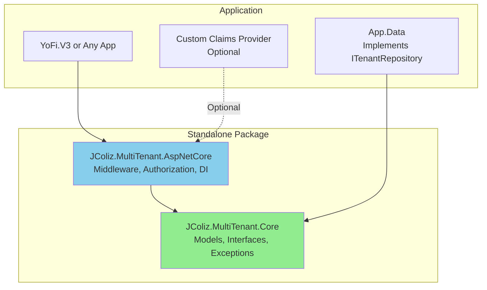
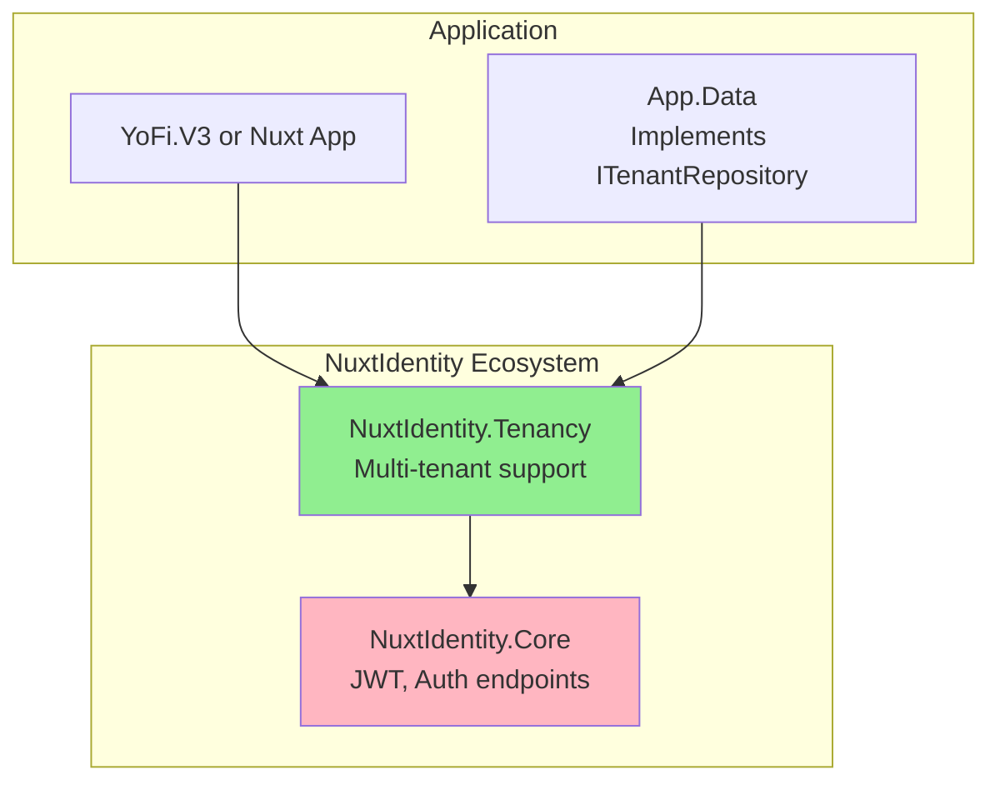

# Tenancy Library Extraction: Decision Analysis

**Date:** 2025-12-14
**Status:** Decision Document
**Related:** [`TENANCY.md`](../TENANCY.md), [`ADR-0009`](../adr/0009-accounts-and-tenancy.md)

## Executive Summary

This document analyzes two viable approaches for extracting YoFi.V3's multi-tenancy system into a reusable library. The status quo (keeping tenancy in YoFi.V3) is deliberately excluded—maintaining it in-application risks accidental coupling and misses the opportunity to share an excellent architecture with the community.

Based on analysis of the current implementation, dependencies, and architectural goals, this document provides detailed comparison, package naming analysis, and actionable recommendations.

## Current State Analysis

### Implementation Structure

YoFi.V3's tenancy system is well-organized across two main locations:

**Core Domain Layer** (`src/Entities/Tenancy/`):
- `Models/` - [`Tenant`](../../src/Entities/Tenancy/Models/Tenant.cs), [`UserTenantRoleAssignment`](../../src/Entities/Tenancy/Models/UserTenantRoleAssignment.cs), [`ITenantModel`](../../src/Entities/Tenancy/Models/ITenantModel.cs)
- `Providers/` - [`ITenantProvider`](../../src/Entities/Tenancy/Providers/ITenantProvider.cs), [`ITenantRepository`](../../src/Entities/Tenancy/Providers/ITenantRepository.cs)
- `Exceptions/` - 8 domain-specific exceptions

**Web/Controllers Layer** (`src/Controllers/Tenancy/`):
- `Api/` - [`TenantController`](../../src/Controllers/Tenancy/Api/TenantController.cs) and DTOs
- `Authorization/` - Role-based authorization components
- `Context/` - [`TenantContext`](../../src/Controllers/Tenancy/Context/TenantContext.cs), [`TenantContextMiddleware`](../../src/Controllers/Tenancy/Context/TenantContextMiddleware.cs)
- `Features/` - [`TenantFeature`](../../src/Controllers/Tenancy/Features/TenantFeature.cs) business logic
- `Exceptions/` - HTTP exception handler

### Dependency Analysis

**NuxtIdentity Dependency (SOFT COUPLING):**
- Only 1 interface used: `IUserClaimsProvider<TUser>` from `NuxtIdentity.Core.Abstractions`
- Used by: [`TenantUserClaimsService`](../../src/Controllers/Tenancy/Authorization/TenantUserClaimsService.cs) (40 lines)
- Purpose: Add `tenant_role` claims to JWT tokens during authentication
- **Impact:** Easy to abstract or provide alternative implementations

**ASP.NET Core Dependencies (CORE):**
- Microsoft.AspNetCore.Authorization (authorization handlers, policies)
- Microsoft.AspNetCore.Identity (IdentityUser base class)
- Microsoft.AspNetCore.Http (middleware, HttpContext)
- Microsoft.Extensions.DependencyInjection (service registration)

**Entity Framework Core Dependencies (IMPLEMENTATION DETAIL):**
- Currently used in [`ApplicationDbContext`](../../src/Data/Sqlite/ApplicationDbContext.cs) to implement `ITenantRepository`
- Not required by the tenancy abstractions themselves

### Key Architectural Observations

1. **Clean Separation:** Domain models are separate from web infrastructure
2. **Interface-Driven:** Uses `ITenantProvider` and `ITenantRepository` abstractions
3. **Minimal NuxtIdentity Coupling:** Only uses 1 interface for claims
4. **Mature Implementation:** Production-ready with comprehensive test coverage
5. **Reusability Design:** Already structured with extraction in mind

## Option A: Standalone Multi-Tenancy Library

**Package Name:** `JColiz.MultiTenant.AspNetCore` (see naming analysis below)

### Architecture



### Package Structure

**Following Microsoft.Extensions.Logging pattern with 3 packages:**

**Package 1: `JColiz.MultiTenant.Abstractions`** (Minimal interfaces)
```
JColiz.MultiTenant.Abstractions/
├── ITenantModel.cs          # Interface for tenant-scoped entities
├── ITenantProvider.cs       # Interface for accessing current tenant
└── ITenantRepository.cs     # Interface for tenant data operations

Dependencies: None (zero dependencies for maximum compatibility)
Purpose: Allow other projects (like Entities) to depend on tenant concepts
         without pulling in implementations or ASP.NET Core
```

**Package 2: `JColiz.MultiTenant`** (Domain models and exceptions)
```
JColiz.MultiTenant/
├── Models/
│   ├── Tenant.cs
│   ├── UserTenantRoleAssignment.cs
│   └── TenantRole.cs
└── Exceptions/
    ├── TenancyException.cs (base)
    ├── TenantNotFoundException.cs
    ├── TenantAccessDeniedException.cs
    ├── UserTenantRoleNotFoundException.cs
    ├── DuplicateUserTenantRoleException.cs
    ├── TenantContextNotSetException.cs
    └── TenancyResourceNotFoundException.cs

Dependencies: JColiz.MultiTenant.Abstractions
Purpose: Provides concrete domain models and business exceptions
```

**Package 3: `JColiz.MultiTenant.AspNetCore`** (ASP.NET Core integration)
```
JColiz.MultiTenant.AspNetCore/
├── Authorization/
│   ├── RequireTenantRoleAttribute.cs
│   ├── TenantRoleHandler.cs
│   ├── TenantRoleRequirement.cs
│   └── IClaimsEnricher.cs              ← NEW abstraction
├── Context/
│   ├── TenantContext.cs
│   └── TenantContextMiddleware.cs
├── Api/
│   ├── TenantController.cs (optional)
│   └── Dto/ (3 DTOs)
├── Features/
│   └── TenantFeature.cs
├── Exceptions/
│   └── TenancyExceptionHandler.cs
└── ServiceCollectionExtensions.cs

Dependencies: JColiz.MultiTenant.Abstractions, JColiz.MultiTenant, ASP.NET Core packages
Purpose: Complete ASP.NET Core integration with middleware, authorization, and API
```

**Why 3 packages?**
- ✅ **Abstractions package** - Allows Entities project to depend on `ITenantModel` without AspNetCore
- ✅ **Base package** - Domain models and exceptions that don't need web infrastructure
- ✅ **AspNetCore package** - Web-specific implementations and middleware
- ✅ **Follows Microsoft pattern** - Same structure as Microsoft.Extensions.Logging
- ✅ **Minimal dependencies** - Each package has exactly what it needs

### Claims Provider Abstraction

Replace NuxtIdentity dependency with a generic interface:

```csharp
namespace JColiz.MultiTenant.AspNetCore.Authorization;

/// <summary>
/// Provides custom claims to be added to user authentication tokens.
/// </summary>
public interface IClaimsEnricher
{
    /// <summary>
    /// Gets additional claims for the specified user ID.
    /// </summary>
    Task<IEnumerable<Claim>> GetClaimsAsync(string userId);
}

/// <summary>
/// Default implementation that adds tenant role claims.
/// </summary>
public class TenantClaimsEnricher(ITenantRepository repository) : IClaimsEnricher
{
    public async Task<IEnumerable<Claim>> GetClaimsAsync(string userId)
    {
        var userRoles = await repository.GetUserTenantRolesAsync(userId);
        return userRoles
            .Where(ur => ur.Tenant != null)
            .Select(ur => new Claim("tenant_role", $"{ur.Tenant.Key}:{ur.Role}"));
    }
}
```

**Integration with NuxtIdentity:**
```csharp
// In application code
public class NuxtIdentityTenantClaimsProvider<TUser>(
    IClaimsEnricher enricher)
    : IUserClaimsProvider<TUser>
    where TUser : IdentityUser
{
    public async Task<IEnumerable<Claim>> GetClaimsAsync(TUser user)
        => await enricher.GetClaimsAsync(user.Id);
}
```

### Pros

✅ **Maximum Reusability** - Works with any ASP.NET Core app (not just Nuxt+Identity)
✅ **Clean Abstraction** - No dependency on specific auth frameworks
✅ **Broader Audience** - Useful for MVC, Blazor, API-only projects
✅ **Independent Evolution** - Can evolve without coordinating with NuxtIdentity
✅ **Standard Pattern** - Follows established .NET library patterns
✅ **Clear Separation** - Authentication vs authorization concerns are separate

### Cons

❌ **More Boilerplate** - Users must wire up claims enrichment manually
❌ **Additional Package** - Need to create and maintain separate repo/packages
❌ **Discovery Challenge** - Users need to find it (not bundled with NuxtIdentity)
❌ **Integration Work** - Requires adapter code for NuxtIdentity integration
❌ **Documentation Overhead** - Must document for generic ASP.NET Core use

### Implementation Effort

- **New Repository:** Yes (separate GitHub repo)
- **Package Count:** 2 packages (`Core` + `AspNetCore`)
- **Breaking Changes to YoFi.V3:** Minimal (namespace changes only)
- **Time to Extract:** 3-4 days (abstraction layer + testing + naming)
- **Maintenance:** Independent of NuxtIdentity

## Option B: NuxtIdentity.Tenancy Package

**Package Name:** `NuxtIdentity.Tenancy`

### Architecture



### Package Structure

**Package: `NuxtIdentity.Tenancy`**
```
NuxtIdentity.Tenancy/
├── Models/
│   ├── Tenant.cs
│   ├── UserTenantRoleAssignment.cs
│   ├── TenantRole.cs
│   └── ITenantModel.cs
├── Providers/
│   ├── ITenantProvider.cs
│   └── ITenantRepository.cs
├── Authorization/
│   ├── RequireTenantRoleAttribute.cs
│   ├── TenantRoleHandler.cs
│   ├── TenantRoleRequirement.cs
│   └── TenantUserClaimsService.cs      ← Uses NuxtIdentity directly
├── Context/
│   ├── TenantContext.cs
│   └── TenantContextMiddleware.cs
├── Api/
│   ├── TenantController.cs
│   └── Dto/ (3 DTOs)
├── Features/
│   └── TenantFeature.cs
├── Exceptions/
│   ├── [8 domain exceptions]
│   └── TenancyExceptionHandler.cs
└── ServiceCollectionExtensions.cs
```

### Integration Pattern

```csharp
// In application Program.cs
builder.Services
    .AddNuxtIdentity<IdentityUser>(options => { })
    .AddTenancy();  // Extension method from NuxtIdentity.Tenancy

// Claims are automatically added via IUserClaimsProvider<T>
```

### Pros

✅ **Tight Integration** - Seamless experience for Nuxt + .NET Identity users
✅ **Cohesive Ecosystem** - All auth concerns in one place
✅ **Discovery** - Users installing NuxtIdentity will find tenancy support
✅ **Less Boilerplate** - Claims provider works out-of-the-box
✅ **Shared Docs** - Can document alongside NuxtIdentity patterns
✅ **Version Coordination** - Can ensure compatibility with NuxtIdentity versions

### Cons

❌ **Limited Scope** - Only useful for projects using NuxtIdentity
❌ **Coupled Evolution** - Breaking changes in NuxtIdentity affect tenancy
❌ **NuxtIdentity Dependency** - Can't be used without NuxtIdentity.Core
❌ **Smaller Audience** - Excludes non-Nuxt ASP.NET Core projects
❌ **Mixing Concerns** - Authorization/tenancy bundled with authentication
❌ **Repository Location** - Must live in NuxtIdentity repo (or submodule complexity)

### Implementation Effort

- **New Repository:** No (add to NuxtIdentity repo)
- **Package Count:** 1 package
- **Breaking Changes to YoFi.V3:** Minimal (namespace changes only)
- **Time to Extract:** 1-2 days (minimal abstraction needed)
- **Maintenance:** Coordinated with NuxtIdentity releases

## Package Naming Analysis for Option A

Choosing the right package name is critical for discoverability, clarity, and adoption. Here's a detailed analysis of potential names.

### Naming Criteria

1. **Discoverability** - Easy to find via NuGet search
2. **Clarity** - Immediately obvious what it does
3. **Scope** - Accurately represents what's included
4. **Conventions** - Follows .NET naming patterns
5. **Uniqueness** - Not confused with existing packages
6. **Future-Proof** - Allows for ecosystem growth
7. **⭐ Industry Standard** - Uses "MultiTenant" terminology (ecosystem convention)

### Key Insight from Competitive Analysis

**All major .NET multi-tenancy libraries use "MultiTenant" or "MultiTenancy" in their names:**
- `Finbuckle.MultiTenant` (~1.5M downloads)
- `SaasKit.Multitenancy` (~400K downloads)
- `Autofac.Multitenant` (~800K downloads)
- `ABP.MultiTenancy` (part of ABP Framework)

**Why This Matters:**
- ✅ Developers search for "multi-tenant" or "multitenancy"
- ✅ Establishes immediate category recognition
- ✅ NuGet search optimization
- ✅ Aligns with ecosystem expectations

**New Requirement:** Package name MUST include "MultiTenant" or "MultiTenancy"

### Top Candidates (Revised)

#### 1. `JColiz.MultiTenant` ⭐ RECOMMENDED

**Package Structure:**
```
JColiz.MultiTenant.Core
JColiz.MultiTenant.AspNetCore
JColiz.MultiTenant.EntityFrameworkCore (future)
```

**Pros:**
- ✅ **Industry Standard** - Uses "MultiTenant" like all competitors
- ✅ **Searchable** - Matches developer search terms
- ✅ **Branded** - Associates with your work (like Finbuckle, Polly, Serilog)
- ✅ **Namespace Control** - You own the `JColiz.*` prefix
- ✅ **Ecosystem Ready** - Natural naming for suite of libraries
- ✅ **Professional** - Follows established .NET library patterns
- ✅ **Differentiated** - "JColiz" distinguishes from generic names

**Cons:**
- ❌ **Brand Building** - Requires establishing "JColiz" as known brand
- ❌ **Less Obvious** - Doesn't describe RBAC focus in name

**Why This Works:**
- Follows proven pattern (Finbuckle, Serilog, Polly, AutoMapper)
- "MultiTenant" ensures discoverability
- "JColiz" provides differentiation and branding
- Can build ecosystem: `JColiz.MultiTenant.*`, `JColiz.Identity.*`, etc.

**Marketing:**
> "JColiz.MultiTenant: Role-based multi-tenancy with security-first design for ASP.NET Core"

#### 2. `MultiTenant.RBAC` or `MultiTenancy.RBAC`

**Pros:**
- ✅ **Concise and memorable** - Short, easy to type and remember
- ✅ **Conceptually accurate** - "Scope" conveys tenant-scoped data isolation
- ✅ **Distinctive** - Unique enough to be memorable and brandable
- ✅ **Available on NuGet** - No conflicts (checked)
- ✅ **Great for branding** - Can build ecosystem around it
- ✅ **Clean namespace** - `using TenantScope.AspNetCore;` reads well

**Cons:**
- ❌ Less explicit about "multi-tenant" (but scope concept is clear)
- ❌ Might be confused with IoC scoping (minor concern)

**Ecosystem Potential:**
```
TenantScope.Core                     (domain models, interfaces)
TenantScope.AspNetCore               (web infrastructure)
TenantScope.EntityFrameworkCore      (optional EF implementations)
TenantScope.Abstractions             (optional interfaces-only package)
```

**Marketing Tagline:**
> "TenantScope: Secure multi-tenant data isolation and role-based authorization for ASP.NET Core"

**Why This Works Best:**
- "Scope" emphasizes the core feature (tenant-scoped operations)
- Short, memorable, professional
- Natural fit for future ecosystem packages
- Unique name with no NuGet collisions

**Package Structure:**
```
MultiTenant.RBAC.Core
MultiTenant.RBAC.AspNetCore
```

**Pros:**
- ✅ **Industry Standard** - "MultiTenant" prefix
- ✅ **Descriptive** - "RBAC" clarifies the focus
- ✅ **Searchable** - Both "multi-tenant" and "RBAC" are key terms
- ✅ **Clear Differentiation** - Immediately distinct from Finbuckle

**Cons:**
- ❌ **Generic Prefix** - Less brandable
- ❌ **Might Conflict** - If Microsoft releases official package
- ❌ **Two Concepts** - Multi-tenancy + RBAC in name

**Why This Could Work:**
- Clearly states the unique value proposition
- Highly searchable for specific use case
- Differentiates from strategy-based solutions

#### 3. `AspNetCore.MultiTenant.RBAC`

**Package Structure:**
```
AspNetCore.MultiTenant.RBAC
```

**Pros:**
- ✅ **Framework-First** - Like `AspNetCore.HealthChecks.*`
- ✅ **Clear Stack** - ASP.NET Core specific
- ✅ **Industry Standard** - "MultiTenant" terminology
- ✅ **Descriptive** - Full picture in name

**Cons:**
- ❌ **Implies Official** - Might confuse users (not from Microsoft)
- ❌ **Long Name** - Verbose
- ❌ **Framework Lock** - Name tied to ASP.NET Core

#### 4. `MultiTenancy.AspNetCore` (Generic)

**Pros:**
- ✅ **Extremely searchable** - Matches exact terms developers search for
- ✅ **Zero ambiguity** - Crystal clear about purpose
- ✅ **Professional** - Follows established .NET conventions
- ✅ **Descriptive** - Accurately describes functionality

**Cons:**
- ❌ **Generic name** - Less distinctive, harder to build brand
- ❌ **Microsoft risk** - Could conflict with future official packages
- ❌ **Less memorable** - Descriptive but not unique

**Ecosystem:**
```
MultiTenancy.Core
MultiTenancy.AspNetCore
MultiTenancy.EntityFrameworkCore
```

**Package Structure:**
```
MultiTenancy.Core
MultiTenancy.AspNetCore
```

**Pros:**
- ✅ **Extremely Searchable** - Exact match for common searches
- ✅ **Industry Standard** - "MultiTenancy" terminology
- ✅ **Clear Purpose** - Zero ambiguity
- ✅ **Professional** - Established .NET pattern

**Cons:**
- ❌ **Generic** - Hard to build brand identity
- ❌ **Microsoft Risk** - Could conflict with future official package
- ❌ **No Differentiation** - Doesn't convey RBAC focus
- ❌ **Less Memorable** - Too generic to stand out

#### 5. `YoFi.MultiTenant` (Project-Branded)

**Package Structure:**
```
YoFi.MultiTenant.Core
YoFi.MultiTenant.AspNetCore
```

**Pros:**
- ✅ **Industry Standard** - "MultiTenant" terminology
- ✅ **Project Association** - Links to YoFi project
- ✅ **Namespace Control** - You own `YoFi.*`

**Cons:**
- ❌ **Finance Confusion** - YoFi implies finance-specific
- ❌ **Less Professional** - Project name less established than personal brand
- ❌ **Generic Conflict** - YoFi doesn't convey multi-tenancy expertise

**Assessment:** `JColiz.MultiTenant` is better than `YoFi.MultiTenant` for personal branding

### Deprecated Candidates (Don't Use "MultiTenant")

❌ **`TenantScope`** - Doesn't follow industry naming convention
❌ **`TenantKit`** - Doesn't follow industry naming convention
❌ **`Multiverse`** - Creative but doesn't follow convention

**Why Rejected:** Competitive analysis shows ALL major players use "MultiTenant" or "MultiTenancy". Not following this convention hurts discoverability.

### Competitive Positioning

| Package Name | Searchability | Brand | Differentiation | Convention | Ecosystem |
|--------------|---------------|-------|-----------------|------------|-----------|
| **`JColiz.MultiTenant`** | ⭐⭐⭐⭐⭐ | ⭐⭐⭐⭐⭐ | ⭐⭐⭐⭐ | ⭐⭐⭐⭐⭐ | ⭐⭐⭐⭐⭐ |
| `MultiTenant.RBAC` | ⭐⭐⭐⭐⭐ | ⭐⭐⭐ | ⭐⭐⭐⭐⭐ | ⭐⭐⭐⭐⭐ | ⭐⭐⭐⭐ |
| `AspNetCore.MultiTenant.RBAC` | ⭐⭐⭐⭐ | ⭐⭐ | ⭐⭐⭐⭐⭐ | ⭐⭐⭐⭐ | ⭐⭐⭐ |
| `MultiTenancy.AspNetCore` | ⭐⭐⭐⭐⭐ | ⭐⭐ | ⭐⭐ | ⭐⭐⭐⭐⭐ | ⭐⭐⭐⭐ |
| `YoFi.MultiTenant` | ⭐⭐⭐⭐ | ⭐⭐⭐ | ⭐⭐⭐ | ⭐⭐⭐⭐⭐ | ⭐⭐⭐⭐ |
| ~~`TenantScope`~~ | ⭐⭐⭐ | ⭐⭐⭐⭐ | ⭐⭐⭐ | ⭐ | ⭐⭐⭐⭐ |

### Final Recommendation: `JColiz.MultiTenant`

**Full Package Structure:**
```
JColiz.MultiTenant.Core                    (1.0.0)
  └── Domain models, interfaces, exceptions
  └── No ASP.NET Core dependencies
  └── Can be used in any .NET project

JColiz.MultiTenant.AspNetCore              (1.0.0)
  └── Depends on: JColiz.MultiTenant.Core
  └── Middleware, authorization, API controllers
  └── Full ASP.NET Core integration

JColiz.MultiTenant.EntityFrameworkCore     (future)
  └── EF Core repository implementations
```

**NuGet Package Metadata:**
```xml
<PropertyGroup>
  <PackageId>JColiz.MultiTenant.AspNetCore</PackageId>
  <Version>1.0.0</Version>
  <Authors>jcoliz</Authors>
  <Description>
    Role-based multi-tenancy with security-first design for ASP.NET Core.
    Provides Owner/Editor/Viewer roles per tenant, JWT claims integration,
    declarative authorization policies, and tenant data isolation.
  </Description>
  <PackageTags>multi-tenant;multitenancy;aspnetcore;authorization;saas;rbac;jwt;security</PackageTags>
  <PackageLicenseExpression>MIT</PackageLicenseExpression>
  <RepositoryUrl>https://github.com/jcoliz/MultiTenant</RepositoryUrl>
  <PackageProjectUrl>https://github.com/jcoliz/MultiTenant</PackageProjectUrl>
  <PackageReadmeFile>README.md</PackageReadmeFile>
  <PackageIcon>icon.png</PackageIcon>
</PropertyGroup>
```

**Why `JColiz.MultiTenant` Is The Winner:**

1. **✅ Industry Standard** - Uses "MultiTenant" like ALL major competitors
2. **✅ Highly Searchable** - Will appear in "multi-tenant", "multitenancy" searches
3. **✅ Personal Brand** - Associates with your work (like Finbuckle, Serilog, Polly)
4. **✅ Professional Pattern** - Proven naming convention in .NET
5. **✅ Ecosystem Ready** - Natural base for suite of libraries
6. **✅ Namespace Control** - You own `JColiz.*` for future packages
7. **✅ Differentiated** - "JColiz" prefix distinguishes from generic names
8. **✅ No Conflicts** - Unique combination on NuGet

**Marketing Tagline:**
> "JColiz.MultiTenant: Role-based multi-tenancy with security-first design for ASP.NET Core. The RBAC-focused alternative to strategy-based solutions."

**Positioning:**
- **vs Finbuckle:** "Use Finbuckle for complex tenant resolution strategies. Use JColiz.MultiTenant for RBAC and authorization."
- **vs Generic Names:** "Not just another generic multi-tenancy package—focused specifically on role-based access control."

### Alternative If Personal Branding Feels Uncomfortable

**`MultiTenant.RBAC.AspNetCore`** - If you prefer descriptive over branded naming, this clearly states the value proposition and follows industry convention.

### Changed Recommendation Rationale

**Original:** `TenantScope.AspNetCore` (unique, brandable)
**Updated:** `JColiz.MultiTenant.AspNetCore` (follows ecosystem convention)

**Why Changed:**
1. Competitive analysis revealed universal use of "MultiTenant/MultiTenancy"
2. Discoverability is critical—developers search for "multi-tenant"
3. Following conventions reduces friction for adoption
4. Still achieves branding through "JColiz" prefix
5. Aligns with successful patterns (Finbuckle, Serilog, Polly)

**Key Insight:** Creative names can work for unique categories, but multi-tenancy is an established category with naming conventions. Following those conventions while adding personal branding (`JColiz`) provides best of both worlds.

### Legacy Names (Pre-Competitive Analysis)

The following were considered before understanding ecosystem conventions:

- ~~`TenantScope`~~ - Creative but doesn't signal multi-tenancy
- ~~`TenantKit`~~ - "Kit" suffix doesn't match convention
- ~~`Multiverse`~~ - Too creative, unclear purpose

These names prioritized uniqueness over discoverability. The competitive analysis showed this was backwards—discoverability via industry-standard terminology is more important than creative differentiation.

**Learning:** In established categories, follow naming conventions. Differentiate through features and quality, not creative package names.

### Branded Options Analysis

**`JColiz.*` vs `YoFi.*` Branding:**

| Aspect | `JColiz.MultiTenant` | `YoFi.MultiTenant` |
|--------|---------------------|-------------------|
| **Professional** | ⭐⭐⭐⭐⭐ Personal brand | ⭐⭐⭐ Project brand |
| **Confusion Risk** | ✅ Clear | ⚠️ Implies finance-specific |
| **Longevity** | ✅ Your brand endures | ⚠️ Tied to project |
| **Ecosystem Potential** | ✅ Suite of JColiz tools | ⚠️ Limited to YoFi context |
| **Precedent** | ✅ Like Finbuckle, Polly | ❌ Less common |

**Recommendation:** `JColiz.*` for personal brand that can span multiple projects and domains.

### ~~Legacy Section: Branded Options~~ (Replaced Above)

**Pros:**
- ✅ **Personal/project branding** - Associates with your work
- ✅ **Namespace control** - You own the prefix
- ✅ **Follows patterns** - Like `Serilog.*`, `Polly.*`, `Finbuckle.*`

**Cons:**
- ❌ **Brand decision required** - Personal (JColiz) vs project (YoFi)?
- ❌ **Less discoverable** - Requires knowing about JColiz/YoFi first
- ❌ **YoFi confusion** - Implies finance-specific (but tenancy is generic)

**Consideration:** Good if building a suite of libraries, less ideal for standalone

#### 4. `AspNetCore.MultiTenant`

**Pros:**
- ✅ **Framework-first** - Like `AspNetCore.HealthChecks.*`
- ✅ **Clear technology stack**
- ✅ **Community library pattern**

**Cons:**
- ❌ **Implies Microsoft official** - Could confuse users
- ❌ **Many packages use this** - Crowded namespace
- ❌ **Less room for expansion** - Framework-specific naming

#### 5. `TenantKit.AspNetCore`

**Pros:**
- ✅ **"Kit" suffix popular** - In .NET ecosystem
- ✅ **Implies complete solution**
- ✅ **Memorable and brandable**

**Cons:**
- ❌ **"Kit" might over-promise** - Suggests more than provided
- ❌ **Slightly informal** - Less professional tone

#### 6. Creative Options: `Multiverse`, `TenantHub`, etc.

**Pros:**
- ✅ **Creative and memorable**
- ✅ **Unique branding opportunities**

**Cons:**
- ❌ **Not immediately clear** - Requires explanation
- ❌ **May seem unprofessional** - Too whimsical for enterprise

### Competitive Landscape

**Existing Multi-Tenancy Packages:**
- `Finbuckle.MultiTenant` - Well-established, comprehensive (strategy-based approach)
- `SaasKit.Multitenancy` - Older, less maintained
- `Autofac.Multitenant` - IoC-focused
- `Microsoft.AspNetCore.MultiTenancy` - Doesn't exist (namespace available)

**Your Differentiation:**
- ✅ Role-based authorization (Owner/Editor/Viewer)
- ✅ Security-first design (403 for tenant enumeration prevention)
- ✅ Claims-based with JWT integration
- ✅ Lightweight, focused implementation
- ✅ Production-ready from real-world use (YoFi.V3)

### Repository and Namespace Structure

**GitHub Repository:** `github.com/jcoliz/MultiTenant`

**Namespace Structure:**
```csharp
namespace JColiz.MultiTenant.Core.Models;
namespace JColiz.MultiTenant.Core.Providers;
namespace JColiz.MultiTenant.Core.Exceptions;

namespace JColiz.MultiTenant.AspNetCore.Authorization;
namespace JColiz.MultiTenant.AspNetCore.Context;
namespace JColiz.MultiTenant.AspNetCore.Api;
```

**Using Statements:**
```csharp
using JColiz.MultiTenant.Core.Models;
using JColiz.MultiTenant.AspNetCore;
```

**Service Registration:**
```csharp
builder.Services.AddMultiTenant();  // Extension method
```

## Detailed Comparison Matrix

| Criteria | Option A: `TenantScope.AspNetCore` | Option B: `NuxtIdentity.Tenancy` |
|----------|-----------------------------------|----------------------------------|
| **Reusability** | ⭐⭐⭐⭐⭐ Any ASP.NET Core project | ⭐⭐⭐ NuxtIdentity users only |
| **Discoverability** | ⭐⭐⭐⭐ Searchable on NuGet | ⭐⭐⭐⭐⭐ Bundled with NuxtIdentity |
| **Integration Effort** | ⭐⭐⭐ Moderate (adapter needed) | ⭐⭐⭐⭐⭐ Minimal (native) |
| **Maintenance Burden** | ⭐⭐⭐ Independent versioning | ⭐⭐⭐⭐ Coordinated releases |
| **Target Audience** | ⭐⭐⭐⭐⭐ All ASP.NET Core developers | ⭐⭐⭐ Nuxt + .NET Identity users |
| **Time to Deliver** | ⭐⭐⭐ 3-4 days (abstraction + naming) | ⭐⭐⭐⭐ 1-2 days (minimal changes) |
| **Architectural Purity** | ⭐⭐⭐⭐⭐ Clean separation | ⭐⭐⭐ Auth + tenancy mixed |
| **NuxtIdentity Users** | ⭐⭐⭐ Requires adapter class | ⭐⭐⭐⭐⭐ Native integration |
| **Non-Nuxt Users** | ⭐⭐⭐⭐⭐ Full support | ⭐ Cannot use |
| **Community Impact** | ⭐⭐⭐⭐⭐ Broad .NET community | ⭐⭐⭐ Nuxt ecosystem only |
| **Coupling Risk** | ⭐⭐⭐⭐⭐ No framework coupling | ⭐⭐ Tightly coupled to NuxtIdentity |
| **Branding Potential** | ⭐⭐⭐⭐⭐ Strong unique identity | ⭐⭐⭐ Part of NuxtIdentity brand |

## Why Not Keep It In YoFi.V3?

Deliberately excluded from analysis because:
- ❌ **Accidental Coupling Risk** - Will attract YoFi-specific dependencies over time
- ❌ **Missed Opportunity** - Excellent architecture should benefit the community
- ❌ **Increasing Extraction Cost** - Gets harder as code evolves with YoFi-specific changes
- ❌ **No Learning Sharing** - Valuable patterns remain hidden
- ❌ **Technical Debt** - Known that extraction is needed, delaying creates debt

## Migration Path for Option A: `TenantScope.AspNetCore`

### Step-by-Step Implementation

#### Step 1: Repository Setup
```bash
# Create new repository
mkdir TenantScope
cd TenantScope
dotnet new sln -n TenantScope

# Create projects
dotnet new classlib -n JColiz.MultiTenant.Core
dotnet new classlib -n JColiz.MultiTenant.AspNetCore
dotnet new nunit -n JColiz.MultiTenant.Tests

# Add to solution
dotnet sln add **/*.csproj
```

#### Step 2: Extract Core Domain

**Copy from YoFi.V3 to `TenantScope.Core`:**
- `src/Entities/Tenancy/Models/*` → `Models/`
- `src/Entities/Tenancy/Providers/*` → `Providers/`
- `src/Entities/Tenancy/Exceptions/*` → `Exceptions/`

**Update namespaces:**
```csharp
// Before
namespace YoFi.V3.Entities.Tenancy.Models;

// After
namespace TenantScope.Core.Models;
```

#### Step 3: Extract Web Infrastructure

**Copy from YoFi.V3 to `TenantScope.AspNetCore`:**
- `src/Controllers/Tenancy/Authorization/*` → `Authorization/`
- `src/Controllers/Tenancy/Context/*` → `Context/`
- `src/Controllers/Tenancy/Api/*` → `Api/`
- `src/Controllers/Tenancy/Features/*` → `Features/`
- `src/Controllers/Tenancy/Exceptions/*` → `Exceptions/`
- `src/Controllers/Tenancy/ServiceCollectionExtensions.cs` → root

**Create claims abstraction:**
```csharp
// TenantScope.AspNetCore/Authorization/IClaimsEnricher.cs
public interface IClaimsEnricher
{
    Task<IEnumerable<Claim>> GetClaimsAsync(string userId);
}

// TenantScope.AspNetCore/Authorization/TenantClaimsEnricher.cs
public class TenantClaimsEnricher(ITenantRepository repository)
    : IClaimsEnricher
{
    public async Task<IEnumerable<Claim>> GetClaimsAsync(string userId)
    {
        var roles = await repository.GetUserTenantRolesAsync(userId);
        return roles
            .Where(r => r.Tenant != null)
            .Select(r => new Claim("tenant_role",
                $"{r.Tenant.Key}:{r.Role}"));
    }
}
```

#### Step 4: Update YoFi.V3

**Add package references:**
```xml
<PackageReference Include="TenantScope.Core" Version="1.0.0" />
<PackageReference Include="TenantScope.AspNetCore" Version="1.0.0" />
```

**Create NuxtIdentity adapter:**
```csharp
// src/Controllers/Integration/NuxtIdentityTenantClaimsProvider.cs
public class NuxtIdentityTenantClaimsProvider<TUser>(
    IClaimsEnricher enricher)
    : IUserClaimsProvider<TUser>
    where TUser : IdentityUser
{
    public async Task<IEnumerable<Claim>> GetClaimsAsync(TUser user)
        => await enricher.GetClaimsAsync(user.Id);
}
```

**Update service registration:**
```csharp
// Program.cs
builder.Services
    .AddTenantScope()  // From TenantScope.AspNetCore
    .AddScoped<IUserClaimsProvider<IdentityUser>,
        NuxtIdentityTenantClaimsProvider<IdentityUser>>();
```

#### Step 5: Testing & Documentation

1. Run YoFi.V3 test suite (all tests should pass)
2. Create sample projects in TenantScope repo
3. Write comprehensive README with multiple auth scenarios
4. Document NuxtIdentity integration pattern
5. Create GitHub repo with MIT license

## Migration Path for Option B: `NuxtIdentity.Tenancy`

### Step-by-Step Implementation

#### Phase 1: Integration (Days 1-2)
1. Create branch in NuxtIdentity repository
2. Add `src/NuxtIdentity.Tenancy` project
3. Move tenancy code with namespace updates
4. Update internal references
5. Run NuxtIdentity test suite

#### Phase 2: Migration (Day 2)
6. Update YoFi.V3 package references
7. Remove local tenancy code from YoFi.V3
8. Run full YoFi.V3 test suite
9. Fix any integration issues

#### Phase 3: Release (Coordinated with NuxtIdentity)
10. Update NuxtIdentity README
11. Publish new NuxtIdentity version
12. Announce tenancy support

## Success Criteria

### For Option A (`TenantScope.AspNetCore`)

- ✅ `TenantScope.Core` and `TenantScope.AspNetCore` packages published to NuGet
- ✅ Zero NuxtIdentity dependency in core packages
- ✅ Clean `IClaimsEnricher` abstraction implemented
- ✅ NuxtIdentity adapter class created and documented
- ✅ Sample projects for multiple auth scenarios (JWT, Cookies, NuxtIdentity)
- ✅ YoFi.V3 successfully migrated with all tests passing
- ✅ Comprehensive README with quick-start guide
- ✅ GitHub repo with MIT license and CI/CD pipeline
- ✅ API documentation (XML comments → docs site)

### For Option B (`NuxtIdentity.Tenancy`)

- ✅ Package added to NuxtIdentity ecosystem
- ✅ Seamless integration with NuxtIdentity.Core
- ✅ YoFi.V3 successfully migrated and tests passing
- ✅ Documentation in NuxtIdentity docs
- ✅ Version compatibility matrix

## Implementation Decisions Needed

1. **Core package structure:** Create separate `TenantScope.Core` (recommended for framework-agnostic domain models) or bundle everything in `TenantScope.AspNetCore`?
   - **Recommendation:** Separate packages for cleaner dependencies

2. **Repository location:** Create new `github.com/jcoliz/TenantScope` or keep as submodule in YoFi.V3?
   - **Recommendation:** New repository for cleaner separation

3. **Optional features:** Should tenant management API (`TenantController`) be included or optional?
   - **Recommendation:** Include by default, document how to exclude if not needed

4. **EF Core package:** Create `TenantScope.EntityFrameworkCore` with base `ITenantRepository` implementation for EF Core?
   - **Recommendation:** Phase 2 (after initial release proves viable)

5. **Claims format:** Keep `tenant_role: "key:role"` format fixed or make it configurable?
   - **Recommendation:** Fixed for v1.0, configuration option in v1.1+

## Next Steps

### For Option A (`TenantScope.AspNetCore`):

**Phase 1: Foundation (Days 1-2)**
1. Create `github.com/jcoliz/TenantScope` repository
2. Set up solution structure (`Core` + `AspNetCore` + `Tests`)
3. Extract domain models to `TenantScope.Core`
4. Extract web infrastructure to `TenantScope.AspNetCore`
5. Create `IClaimsEnricher` abstraction
6. Build and run tests locally

**Phase 2: Integration (Day 3)**
7. Create NuxtIdentity adapter class and documentation
8. Update YoFi.V3 to use packages (local NuGet feed first)
9. Run full YoFi.V3 test suite
10. Fix any integration issues

**Phase 3: Release (Day 4)**
11. Write comprehensive README with examples
12. Set up GitHub Actions CI/CD
13. Create sample applications
14. Publish packages to NuGet
15. Announce on relevant channels

### For Option B (`NuxtIdentity.Tenancy`):

**Phase 1: Integration (Days 1-2)**
1. Create branch in NuxtIdentity repository
2. Add `src/NuxtIdentity.Tenancy` project
3. Move tenancy code with namespace updates
4. Update internal references
5. Run NuxtIdentity test suite

**Phase 2: Migration (Day 2)**
6. Update YoFi.V3 package references
7. Remove local tenancy code from YoFi.V3
8. Run full YoFi.V3 test suite
9. Fix any integration issues

**Phase 3: Release (Coordinated with NuxtIdentity)**
10. Update NuxtIdentity README
11. Publish new NuxtIdentity version
12. Announce tenancy support

## Conclusion & Recommendation

Your tenancy implementation is architecturally excellent and addresses a universal need in ASP.NET Core applications. The minimal coupling to NuxtIdentity (single interface) makes extraction straightforward.

### Primary Recommendation: Option A - `TenantScope.AspNetCore`

**Create a standalone, framework-agnostic multi-tenancy library named `TenantScope`.**

**Key Reasons:**
1. **Broader Impact** - Serves entire .NET community, not just Nuxt users
2. **Clean Architecture** - Proper separation between authentication and authorization
3. **Future-Proof** - Independent of any specific auth framework
4. **Professional Branding** - `TenantScope` is memorable, searchable, and unique
5. **Minimal Coupling** - Only 1 interface dependency, easily abstracted
6. **Avoids Accidental Coupling** - Extraction now prevents YoFi-specific dependencies

**Timeline:** 3-4 days from start to NuGet publication

**Trade-off:** Slightly more initial work (abstraction layer + adapter) in exchange for maximum long-term value and reusability.

### Alternative: Option B - `NuxtIdentity.Tenancy`

**Choose this if:**
- Primary goal is tight NuxtIdentity ecosystem integration
- Want faster delivery (1-2 days vs 3-4 days)
- Confident NuxtIdentity is long-term strategy
- Prefer managing fewer repositories

**Trade-off:** Limited to NuxtIdentity users, couples authorization with authentication.

### Decision Framework

**Choose Option A if you answer "yes" to any:**
- Will you use this in non-Nuxt ASP.NET Core projects?
- Do you want maximum community impact?
- Is architectural purity important?
- Might you change auth frameworks in the future?

**Choose Option B if you answer "yes" to all:**
- Is your exclusive focus Nuxt + .NET Identity applications?
- Do you want the absolute fastest path to extraction?
- Are you comfortable with NuxtIdentity dependency?
- Do you prefer coordinated releases within one ecosystem?

**Final Recommendation: Option A (`TenantScope.AspNetCore`)** - the superior architectural choice with broader impact, professional branding, and long-term flexibility. The accidental coupling risk of keeping it in YoFi.V3 makes extraction urgent, not optional.
