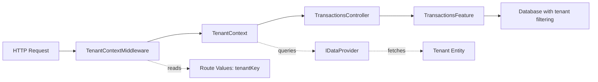

# Tenant Context Middleware Testing Plan

## Overview

This document outlines the comprehensive testing strategy for [`TenantContextMiddleware`](../../src/Controllers/Tenancy/TenantContextMiddleware.cs), which extracts tenant information from HTTP requests and populates the [`TenantContext`](../../src/Controllers/Tenancy/TenantContext.cs) for downstream use by application features.

## Architecture Context



### Key Components

1. **TenantContextMiddleware**: ASP.NET Core middleware that intercepts requests
2. **TenantContext**: Scoped service implementing `ITenantProvider`
3. **Route Values**: Tenant key passed as route parameter `{tenantKey:guid}`
4. **TransactionsController**: Example controller using tenant context via route `api/tenant/{tenantKey:guid}/[controller]`
5. **TransactionsFeature**: Application feature that depends on `ITenantProvider`

## Testing Strategy: Hybrid Approach

### Why Hybrid?

- **Unit Tests**: Fast, focused tests for middleware logic isolation
- **Integration Tests**: Confidence that the full pipeline works end-to-end
- **Combined**: Best coverage with reasonable execution time

## Part 1: Unit Tests

### Test File Location
`tests/Unit/Tests/TenantContextMiddlewareTests.cs`

### Test Cases

#### 1. Valid Tenant Key Extraction
**Test**: `InvokeAsync_ValidTenantKeyInRoute_SetsTenantContext`
- **Given**: HTTP request with valid GUID in route values
- **When**: Middleware processes the request
- **Then**:
  - `TenantContext.SetCurrentTenantAsync()` called with correct GUID
  - Next middleware in pipeline is invoked
  - No exceptions thrown

#### 2. Invalid Tenant Key Format
**Test**: `InvokeAsync_InvalidTenantKeyFormat_SkipsTenantSetup`
- **Given**: Route value "tenantKey" is not a valid GUID (e.g., "abc123")
- **When**: Middleware processes the request
- **Then**:
  - `TenantContext.SetCurrentTenantAsync()` is NOT called
  - Next middleware still invoked (request continues)
  - No exceptions thrown

#### 3. Missing Tenant Key
**Test**: `InvokeAsync_MissingTenantKey_SkipsTenantSetup`
- **Given**: No "tenantKey" in route values
- **When**: Middleware processes the request
- **Then**:
  - `TenantContext.SetCurrentTenantAsync()` is NOT called
  - Next middleware invoked
  - No exceptions thrown

#### 4. Tenant Not Found in Database
**Test**: `InvokeAsync_TenantNotFoundInDatabase_ThrowsException`
- **Given**: Valid GUID but tenant doesn't exist in database
- **When**: Middleware processes request
- **Then**:
  - `TenantContext.SetCurrentTenantAsync()` throws `InvalidOperationException`
  - Exception bubbles up (not caught by middleware)

#### 5. Next Delegate Invocation
**Test**: `InvokeAsync_Always_InvokesNextDelegate`
- **Given**: Valid or invalid tenant scenarios
- **When**: Middleware processes request
- **Then**: Next middleware delegate is always called

#### 6. Null Route Value
**Test**: `InvokeAsync_NullTenantKeyValue_SkipsTenantSetup`
- **Given**: Route values contains "tenantKey" but value is null
- **When**: Middleware processes the request
- **Then**: Request continues without setting tenant context

### Mocking Requirements

```csharp
// Required mocks for unit tests
Mock<RequestDelegate> nextDelegateMock;
Mock<HttpContext> httpContextMock;
Mock<TenantContext> tenantContextMock;
Mock<IDataProvider> dataProviderMock;
```

### Test Helper Structure

```csharp
[TestFixture]
public class TenantContextMiddlewareTests
{
    private Mock<RequestDelegate> _nextMock;
    private Mock<TenantContext> _tenantContextMock;
    private TenantContextMiddleware _middleware;
    private DefaultHttpContext _httpContext;

    [SetUp]
    public void Setup()
    {
        _nextMock = new Mock<RequestDelegate>();
        _tenantContextMock = new Mock<TenantContext>();
        _middleware = new TenantContextMiddleware(_nextMock.Object);
        _httpContext = new DefaultHttpContext();
    }

    // Helper method to set route values
    private void SetTenantKeyInRoute(Guid? tenantKey)
    {
        if (tenantKey.HasValue)
            _httpContext.Request.RouteValues["tenantKey"] = tenantKey.Value.ToString();
    }
}
```

## Part 2: Integration Tests

### Test File Location
`tests/Integration.Controllers/TenantContextMiddlewareIntegrationTests.cs`

### Test Infrastructure

```csharp
public class TenantContextMiddlewareIntegrationTests : IClassFixture<WebApplicationFactory<Program>>
{
    private readonly WebApplicationFactory<Program> _factory;
    private readonly HttpClient _client;

    // Test database with known tenants
    private Guid _validTenantKey;
    private Guid _invalidTenantKey;
}
```

### Test Cases

#### 1. End-to-End Request with Valid Tenant
**Test**: `GetTransactions_ValidTenantKey_ReturnsTenantData`
- **Given**:
  - Tenant exists in database with ID
  - Transactions exist for that tenant
- **When**: `GET /api/tenant/{validTenantKey}/transactions`
- **Then**:
  - Returns 200 OK
  - Returns only transactions for that tenant
  - Response contains expected transaction data

#### 2. Multiple Tenants Isolation
**Test**: `GetTransactions_DifferentTenants_ReturnsIsolatedData`
- **Given**:
  - Tenant A with 3 transactions
  - Tenant B with 5 transactions
- **When**:
  - Request to Tenant A endpoint
  - Request to Tenant B endpoint
- **Then**:
  - Tenant A request returns only 3 transactions
  - Tenant B request returns only 5 transactions
  - No cross-tenant data leakage

#### 3. Non-Existent Tenant
**Test**: `GetTransactions_NonExistentTenant_Returns500`
- **Given**: Valid GUID format but tenant doesn't exist
- **When**: `GET /api/tenant/{nonExistentGuid}/transactions`
- **Then**:
  - Returns 500 Internal Server Error
  - Error message indicates tenant not found

#### 4. Invalid Tenant Key Format
**Test**: `GetTransactions_InvalidTenantKeyFormat_Returns400OrRouteNotMatched`
- **Given**: Invalid GUID format in URL
- **When**: `GET /api/tenant/invalid-guid/transactions`
- **Then**:
  - Returns 404 Not Found (route constraint fails)
  - OR 400 Bad Request if route matches

#### 5. Tenant Context Across Multiple Requests
**Test**: `ConcurrentRequests_DifferentTenants_MaintainsIsolation`
- **Given**: Multiple simultaneous requests for different tenants
- **When**: Concurrent requests to different tenant endpoints
- **Then**: Each request gets correct tenant data (no cross-contamination)

#### 6. Controller Integration
**Test**: `TransactionController_UsesTenantFromMiddleware_Successfully`
- **Given**: Tenant context set by middleware
- **When**: Controller action executes
- **Then**:
  - [`TransactionsFeature`](../../src/Application/Features/TransactionsFeature.cs) receives correct tenant
  - Data queries filtered by tenant ID
  - No manual tenant passing required

### Test Database Setup

```csharp
// Fixture for integration tests
public class TenantIntegrationTestFixture : IDisposable
{
    public ApplicationDbContext DbContext { get; }
    public Guid TenantAKey { get; }
    public Guid TenantBKey { get; }

    public TenantIntegrationTestFixture()
    {
        // Setup SQLite in-memory database
        // Seed with test tenants and transactions
    }
}
```

## Part 3: Test Data Strategy

### Tenant Fixtures

```csharp
public static class TenantTestData
{
    public static Tenant CreateTestTenant(string name = "Test Tenant")
    {
        return new Tenant
        {
            Key = Guid.NewGuid(),
            Name = name,
            Id = 0 // Will be assigned by database
        };
    }

    public static List<Transaction> CreateTransactionsForTenant(long tenantId, int count)
    {
        var transactions = new List<Transaction>();
        for (int i = 0; i < count; i++)
        {
            transactions.Add(new Transaction
            {
                TenantId = tenantId,
                Date = DateOnly.FromDateTime(DateTime.Now.AddDays(-i)),
                Amount = 100m * (i + 1),
                Payee = $"Payee {i + 1}",
                Key = Guid.NewGuid()
            });
        }
        return transactions;
    }
}
```

## Part 4: Edge Cases and Error Scenarios

### Critical Edge Cases

1. **Null HttpContext**: Should not occur in ASP.NET Core, but handle defensively
2. **Disposed TenantContext**: Scoped lifetime should prevent this
3. **Database Connection Failure**: When fetching tenant
4. **Concurrent Requests**: Same tenant, different requests
5. **Empty Route Values Dictionary**: No route parameters at all

### Error Handling Strategy

```csharp
// Current behavior (from code analysis)
- Missing/Invalid GUID → Skip tenant setup, continue request
- Tenant not found → InvalidOperationException from TenantContext
- Database error → Exception bubbles up to error handler middleware

// Tests should verify this behavior is intentional and consistent
```

## Part 5: Test Organization

### Directory Structure

```
tests/
├── Unit/
│   └── Tests/
│       └── TenantContextMiddlewareTests.cs          # Unit tests
└── Integration.Controllers/                          # New project
    ├── YoFi.V3.Tests.Integration.Controllers.csproj
    ├── TenantContextMiddlewareIntegrationTests.cs
    └── Fixtures/
        └── TenantTestFixture.cs
```

### Project Dependencies

**Integration.Controllers project needs**:
- `Microsoft.AspNetCore.Mvc.Testing` (WebApplicationFactory)
- Reference to `YoFi.V3.BackEnd` project
- `Microsoft.EntityFrameworkCore.Sqlite` (for in-memory database)
- NUnit test framework

## Part 6: Test Execution Plan

### Phase 1: Unit Tests (Week 1)
1. Create test file and basic structure
2. Implement mocking helpers
3. Write and verify all 6 unit test cases
4. Achieve >90% code coverage for middleware class

### Phase 2: Integration Tests (Week 1-2)
1. Create Integration.Controllers test project
2. Set up WebApplicationFactory configuration
3. Create test database fixtures
4. Implement all 6 integration test cases
5. Verify tenant isolation works correctly

### Phase 3: Documentation (Week 2)
1. Document testing patterns for future middleware
2. Create examples for other developers
3. Update project README with testing guidance

## Part 7: Success Criteria

### Definition of Done

- ✅ All unit tests passing (6 tests minimum)
- ✅ All integration tests passing (6 tests minimum)
- ✅ Code coverage >85% for `TenantContextMiddleware`
- ✅ No flaky tests (100% pass rate over 10 runs)
- ✅ Tests run in <5 seconds (unit) and <30 seconds (integration)
- ✅ CI/CD pipeline includes all tests
- ✅ Documentation updated

### Quality Gates

1. **Unit Tests**: Must cover all code paths
2. **Integration Tests**: Must verify real database interaction
3. **Performance**: Integration tests must complete in reasonable time
4. **Isolation**: No test interdependencies
5. **Clarity**: Test names clearly describe what they verify

## Part 8: Future Enhancements

### Potential Additions

1. **Load Testing**: Verify middleware performance under load
2. **Security Testing**: Ensure no tenant key spoofing possible
3. **Authorization Integration**: Test with TenantRoleHandler when implemented
4. **Logging Verification**: Assert proper logging occurs
5. **Metrics**: Track middleware execution time

### Tech Debt to Address

From code analysis:
```csharp
// TODO in middleware code (line 10):
// "Authorization will place this value in HttpContext.Items,
// so we can use that instead"

// TODO in middleware code (line 16-31):
// Role extraction code is commented out
```

**Recommendation**: Create tests for current behavior, then update tests when TODOs are implemented.

## Appendix A: Code References

### Files to Test
- [`TenantContextMiddleware.cs`](../../src/Controllers/Tenancy/TenantContextMiddleware.cs) - Main subject under test
- [`TenantContext.cs`](../../src/Controllers/Tenancy/TenantContext.cs) - Dependency to mock/use

### Related Controllers
- [`TransactionsController.cs`](../../src/Controllers/TransactionsController.cs) - Integration test target

### Application Features
- [`TransactionsFeature.cs`](../../src/Application/Features/TransactionsFeature.cs) - Consumer of tenant context

### Existing Test Patterns
- [`TransactionsTests.cs`](../../tests/Unit/Tests/TransactionsTests.cs) - Unit test pattern example
- [`SimpleTests.cs`](../../tests/Integration.Data/SimpleTests.cs) - Integration test pattern example

## Appendix B: Sample Test Code Snippets

### Unit Test Example

```csharp
[Test]
public async Task InvokeAsync_ValidTenantKeyInRoute_SetsTenantContext()
{
    // Arrange
    var tenantKey = Guid.NewGuid();
    SetTenantKeyInRoute(tenantKey);

    _tenantContextMock
        .Setup(x => x.SetCurrentTenantAsync(tenantKey))
        .Returns(Task.CompletedTask);

    // Act
    await _middleware.InvokeAsync(_httpContext, _tenantContextMock.Object);

    // Assert
    _tenantContextMock.Verify(x => x.SetCurrentTenantAsync(tenantKey), Times.Once);
    _nextMock.Verify(x => x.Invoke(_httpContext), Times.Once);
}
```

### Integration Test Example

```csharp
[Test]
public async Task GetTransactions_ValidTenantKey_ReturnsTenantData()
{
    // Arrange
    var tenant = await SeedTenantWithTransactions("Tenant A", 3);

    // Act
    var response = await _client.GetAsync($"/api/tenant/{tenant.Key}/transactions");

    // Assert
    response.EnsureSuccessStatusCode();
    var transactions = await response.Content.ReadFromJsonAsync<List<TransactionResultDto>>();
    Assert.That(transactions, Has.Count.EqualTo(3));
    Assert.That(transactions.All(t => t != null), Is.True);
}
```

## Next Steps

1. Review this plan with the team
2. Get approval on test approach and coverage
3. Create test projects and files
4. Implement unit tests first (faster feedback)
5. Implement integration tests
6. Run full test suite and verify coverage
7. Update CI/CD pipeline
8. Document patterns for future use
