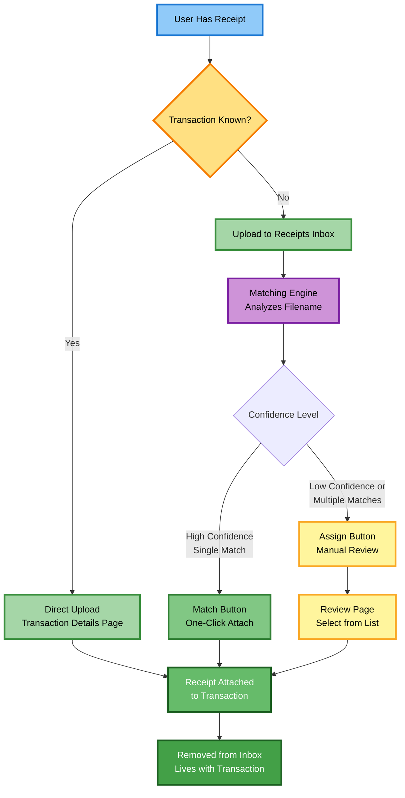

# Product Requirements Document: Transaction Receipts

## Problem Statement

Users have receipts and invoices related to transactions that they need to retain for record-keeping, expense reporting, and tax purposes. Without a systematic way to store these documents, users risk losing them or spending significant time searching through email, photos, or physical files. By attaching receipts directly to transactions, users can easily find documentation later and have better context when reviewing or categorizing transactions.

---

## Goals & Non-Goals

### Goals
- [ ] Enable users to retain receipts and invoices with minimal friction
- [ ] Automatically match receipts to transactions when possible (filename-based matching)
- [ ] Support "inbox zero" workflow for unmatched receipts
- [ ] Allow direct receipt upload when transaction is known

### Non-Goals
- ❌ OCR/text extraction from receipts
- ❌ In-app preview/viewing of receipts (download only)
- ❌ Receipt editing/annotation
- ❌ Multiple receipts per transaction
- ❌ Sharing receipts outside the tenant
- ❌ Receipt archive/search functionality (V1 - may be added in V2)

## Feature Overview

### Receipts Flow Diagram

**Key Principle**: The Receipts Inbox is a **to-do list** for unmatched receipts. Once a receipt is matched to a transaction, it **leaves the inbox** and lives with the transaction. This enables "inbox zero" - when the inbox is empty, all receipts are properly filed.

---

## Functional Stories

### Story 1: Direct Receipt Upload
**As a** User
**I want** to directly attach a receipt to a transaction
**So that** I can retain documentation immediately when I know which transaction it belongs to

**Acceptance Criteria**:
- [ ] From transaction details page "Receipt" subsection, user can upload a file
- [ ] User can download the receipt from transaction details page
- [ ] User can download the receipt from transactions list page (download icon is the only indicator of receipt existence)
- [ ] User can delete the receipt from transaction details page
- [ ] Upload control is hidden after a receipt is uploaded (only one receipt per transaction)

### Story 2: Receipts Inbox for Bulk Upload
**As a** User
**I want** to upload multiple receipts before knowing which transactions they belong to
**So that** I don't lose receipts while waiting for bank imports or manual transaction entry

**Acceptance Criteria - Upload**:
- [ ] User can access a dedicated "Receipts Inbox" page
- [ ] User can upload multiple files simultaneously
- [ ] If one upload fails, the remaining files continue to process
- [ ] If any upload fails, a details pane shows the errors listed per file
- [ ] Failed uploads must be explicitly re-uploaded through normal flow

**Acceptance Criteria - Inbox Management**:
- [ ] User can view all **unmatched** receipts in the inbox (matched receipts are removed)
- [ ] Inbox shows count of receipts needing attention
- [ ] User can download any receipt from inbox
- [ ] User can delete individual receipts from inbox
- [ ] User can select multiple receipts and delete them at once
- [ ] User can see filename guidance to help the system match receipts to transactions
- [ ] When inbox is empty, user sees "Inbox Zero" empty state with encouragement

### Story 3: Automatic Matching Suggestions
**As a** User
**I want** the system to suggest which inbox receipts match which transactions
**So that** I can quickly match receipts without manual searching

**Acceptance Criteria - From Receipts Inbox**:
- [ ] When viewing receipts inbox, matching state is computed and displayed for each receipt
- [ ] If system finds a single high-confidence match, a "Match" button is shown with transaction preview (date, payee, amount)
- [ ] Clicking "Match" button immediately attaches to the matched transaction, **removes receipt from inbox**, and shows toast notification with link to transaction
- [ ] If system finds multiple matches OR only a single low-confidence match, an "Assign" button is shown
- [ ] Clicking "Assign" button navigates to the Match Review Page (Story 4)
- [ ] "Match" and "Assign" buttons are mutually exclusive
- [ ] If no matches found, no button is shown (user can manually attach via transaction details or delete)

**Acceptance Criteria - From Transaction Details Page**:
- [ ] In "Receipt" subsection, if potential inbox matches exist, additional text and "Match" or "Assign" button are shown
- [ ] Uses same confidence logic as Receipts Inbox to determine which button to show
- [ ] Shows preview of matched receipt filename
- [ ] Matching affordance is not shown if transaction already has a receipt
- [ ] Matching affordance is not shown if no potential inbox matches exist
- [ ] Upload control remains available even when potential matches exist
- [ ] Clicking "Match" button immediately attaches receipt to transaction, **removes from inbox**, shows toast notification, and updates page to show receipt
- [ ] Clicking "Assign" button navigates to Match Review Page (Story 4)
- [ ] After successful matching, the potential matches affordance is removed/hidden

### Story 4: Manual Match Review
**As a** User
**I want** to review and select from multiple potential transaction matches
**So that** I can confidently assign the receipt to the correct transaction

**Acceptance Criteria**:
- [ ] Page displays the inbox receipt details (filename, size, file type, preview thumbnail if supported)
- [ ] Page shows list of potential matching transactions, ordered by match confidence
- [ ] Confidence score is not displayed to user (only affects ordering)
- [ ] Each transaction shows key details to aid decision (date, payee, amount, category)
- [ ] User can click "Match" on any transaction to complete the assignment
- [ ] After matching, receipt is **removed from inbox** and user is returned to the originating page (Receipts Inbox or Transaction Details)
- [ ] User can cancel/go back without matching (receipt stays in inbox)
- [ ] Page handles "no matches found" state with clear messaging and option to search all transactions
- [ ] Page clearly indicates which page the user came from (breadcrumb or back button)

---

## System Requirements

### File Handling
- [ ] Supported file types: PDF, PNG, JPG (described to users as "receipts and invoices")
- [ ] Maximum file size: 7MB
- [ ] Upload progress indication (loading state shown during upload)
- [ ] Toast or dialog notifications shown on upload failure
- [ ] Only one receipt allowed per transaction

### Receipt Lifecycle (Inbox Zero Model)
- [ ] Receipts inbox shows only **unmatched** receipts
- [ ] When a receipt is matched to a transaction, it is **immediately removed from the inbox**
- [ ] Matched receipts live with their transactions (accessible from transaction details or transactions list)
- [ ] Users cannot browse all receipts from a single page in V1 (must search transactions or view transaction details)
- [ ] Future consideration: Add "Receipts Archive" page for browsing all matched receipts (V2)

### Tenant Scoping & Security
- [ ] All receipts (inbox and matched) are tenant-scoped
- [ ] All users in a tenant can view and manage all receipts in that tenant
- [ ] All users in a tenant can view and manage all inbox receipts in that tenant

### Race Condition Handling
- [ ] If two users attempt to match the same inbox receipt simultaneously, the second user receives a toast error notification
- [ ] No data loss occurs in race condition scenarios
- [ ] User can retry the operation after receiving race condition error

### Matching Algorithm
- [ ] Matching state is computed when receipts inbox is fetched (if performance becomes an issue, will switch to stored state with periodic updates)
- [ ] Algorithm determines "high confidence" vs "low confidence" matches to decide between "Match" and "Assign" buttons
- [ ] Date is required in filename to enable matching
- [ ] Only transactions within ±1 week of receipt date are considered for matching
- [ ] Limits on number of inbox receipts will be established based on real-life performance testing
- [ ] Detailed matching algorithm specification deferred to technical design
- [ ] Algorithm should favor precision over recall (better to show "Assign" than wrong "Match")

---

## Technical Approach (Optional)

[Brief description of the intended technical approach, if you have one in mind]

**Layers Affected**:
- [ ] Frontend (Vue/Nuxt)
- [ ] Controllers (API endpoints)
- [ ] Application (Features/Business logic)
- [ ] Entities (Domain models)
- [ ] Database (Schema changes)

**Storage Strategy**:
- **Production**: Receipt files stored in Azure Storage Account blob container
- **Container**: Receipt files stored in container file system (mount local volume if needed for functional tests)
- **Development**: Receipt files stored in local file system

**API Design Considerations**:
- API endpoints use "attachments" terminology for technical accuracy
- Frontend UI uses "receipts" terminology for user clarity

**High-Level Entity Concepts**:

**Attachment Entity** (new):
- Id (Guid - unique identifier)
- TenantId (Guid - tenant scope)
- TransactionId (Guid? - null when in inbox, set when matched)
- Filename (string - original filename)
- ContentType (string - MIME type)
- FileSizeBytes (long - file size)
- StoragePath (string - path to blob/file)
- UploadedAt (DateTime)
- UploadedByUserId (Guid)
- MatchedAt (DateTime? - null when in inbox)
- MatchedByUserId (Guid? - null when in inbox)

**Transaction Entity** (modified):
- Add: AttachmentId (Guid? - foreign key to Attachment, null if no receipt)

**Key Business Rules**:
1. **Inbox Zero Principle**: Receipts inbox only shows unmatched receipts. Matched receipts are removed from inbox and live with transactions.
2. **One Receipt Per Transaction**: Users can attach only one receipt to a transaction. To change receipts, delete existing then upload new.
3. **Race Condition Handling**: If two users match the same inbox receipt simultaneously, one succeeds and one receives a toast error. Rare occurrence handled with minimal complexity.
4. **Matching Confidence**: Algorithm favors precision over recall. Better to require user review ("Assign") than suggest wrong match ("Match").

**Code Patterns to Follow**:
- Entity pattern: [`BaseTenantModel`](../src/Entities/Models/BaseTenantModel.cs) or [`BaseModel`](../src/Entities/Models/BaseModel.cs)
- CRUD operations: [`TransactionsController.cs`](../src/Controllers/TransactionsController.cs) and [`TransactionsFeature.cs`](../src/Application/Features/TransactionsFeature.cs)
- Tenant-scoped authorization: Existing pattern with `[RequireTenantRole]`
- Testing: NUnit with Gherkin comments (Given/When/Then)

---

## Open Questions

- [x] **Q** What constitutes "high confidence"? **A** Algorithm specification in technical design. Goal: >90% acceptance rate for "Match" button. "Assign" shown when confidence <90% or multiple matches exist.

- [x] **Q** "file-name guidance" undefined **A** Guidance will be provided as help text on Receipts Inbox page. Example format: "YYYYMMDD_PayeeName.pdf" or "YYYY-MM-DD Payee.jpg". Final specification in technical design.

- [x] **Q** Do receipts depart from inbox when matched? **A** Yes. Receipts inbox uses "inbox zero" model. Matched receipts are removed from inbox and live with transactions. This provides clear action list and sense of completion.

- [x] **Q** Can users browse all receipts? **A** Not in V1. Users find receipts via transaction details or search transactions. V2 may add "Receipts Archive" page for browsing all matched receipts.

- [x] **Q** What about receipts that never match? **A** They stay in inbox indefinitely. Users can manually match via transaction details or delete. Future consideration: Auto-archive or notify for receipts >90 days old.

- [x] **Q** Performance with many inbox receipts? **A** Matching requires date in filename and only considers transactions ±1 week. Limits on inbox size will be established through performance testing.

---

## Success Metrics

**Adoption Metrics**:
- % of transactions with receipts attached (target: 20% in first 3 months)
- % of users who upload at least one receipt (target: 40% in first 3 months)
- Average receipts inbox count per user (target: <5, indicating healthy "inbox zero" behavior)

**Effectiveness Metrics**:
- % of inbox receipts successfully matched (target: >70%)
- % of "Match" suggestions accepted (target: >85%, validates confidence algorithm)
- % of receipts deleted from inbox without matching (low is good - indicates receipts are valuable)

**Efficiency Metrics**:
- Average time from upload to match (target: <2 days for automatic, <7 days for manual)
- % of matches requiring manual review page (target: <30%, indicates good confidence threshold)

---

## Dependencies & Constraints

**Dependencies**:
- Azure Storage Account provisioning (production)
- File upload library with multipart form data support
- Blob storage client library (Azure SDK)
- File system access (local dev and container)

**Constraints**:
- 7MB maximum file size (balances usability with storage costs)
- PDF, PNG, JPG only (most common receipt formats)
- Single receipt per transaction (simplifies UX and data model)
- No in-app preview in V1 (download only to reduce scope)

---

## Notes & Context

**Design Rationale**:
- **"Receipts" vs "Attachments"**: User-facing terminology uses "receipts" (clearer purpose) while technical/API uses "attachments" (accurate and flexible).
- **Inbox Zero Model**: Receipts depart inbox when matched, creating clear to-do list and sense of accomplishment. Matched receipts live with transactions.
- **No Archive in V1**: Defers complexity of browsing all receipts. Users can search transactions to find receipts. Archive page may be added in V2 if user feedback indicates need.
- **Match vs Assign**: Two-button approach balances automation (one-click match) with user control (review multiple options). Confidence threshold heavily favors precision to avoid annoying users with wrong suggestions.

**Related Documents**:
- [Companion Design Document - TBD]
- [Matching Algorithm Specification - TBD]

**Future Considerations** (V2+):
- Receipts Archive page for browsing all matched receipts
- Multiple receipts per transaction
- Receipt preview/viewing in-app
- Email-to-inbox (receipts@yofi.app)
- Mobile camera capture with enhanced UX
- Auto-archive receipts >90 days in inbox

---

## Handoff Checklist (for AI implementation)

When handing this off for detailed design/implementation:
- [ ] Document stays within PRD scope (WHAT/WHY). If implementation details are needed, they are in a separate Design Document. See [`PRD-GUIDANCE.md`](PRD-GUIDANCE.md).
- [ ] All user stories have clear acceptance criteria
- [ ] Open questions are resolved or documented as design decisions
- [ ] Technical approach section indicates affected layers
- [ ] Code patterns to follow are referenced (links to similar controllers/features)
