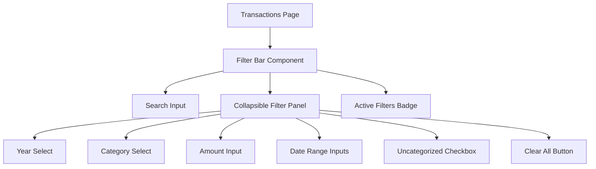

# Transaction Filtering UI Recommendations

## Executive Summary

This document provides architectural recommendations for implementing transaction filtering in YoFi.V3, balancing power-user needs with minimal/modern UX principles. The solution emphasizes progressive disclosure, keyboard accessibility, and mobile-first responsive design.

## Current State Analysis

### Existing Implementation
- **Basic date range filtering** - Two date inputs (From/To) visible at all times in a card (lines 305-351 in [`transactions.vue`](../../src/FrontEnd.Nuxt/app/pages/transactions.vue))
- **Always visible** - Filter card takes up significant space even when not in use
- **Limited functionality** - Only supports date range, no text search or advanced filters
- **No default date filter** - Document specifies "default to prior 12 months" but not implemented

### Requirements from Document
1. **Single text search** (most common) - Multi-field search across payee, category, memo, amount
2. **Category blank/whitespace filter** - Find uncategorized transactions
3. **Specific year filter** - Most common, often combined with other filters
4. **Single field substring search** - Targeted field-specific search
5. **Exact amount search** - Find specific transaction amounts
6. **Date range filter** - Less common but needed

## Recommended UI Pattern: Collapsible Filter Bar

### Design Philosophy
- **Progressive disclosure** - Start minimal, expand when needed
- **Keyboard-first** - Power users can filter without mouse
- **Mobile-responsive** - Gracefully degrade to mobile
- **Persistent context** - Active filters remain visible

### Visual Design

```
┌─────────────────────────────────────────────────────────────────┐
│  [🔍 Search transactions...]                    [⚙️ Filters (2)] │  ← Collapsed State
└─────────────────────────────────────────────────────────────────┘

┌─────────────────────────────────────────────────────────────────┐
│  [🔍 starbucks]                                 [⚙️ Filters (2)] │  ← With Search Text
└─────────────────────────────────────────────────────────────────┘

┌─────────────────────────────────────────────────────────────────┐
│  [🔍 Search all fields...]                      [⚙️ Filters (2)] │  ← Expanded State
├─────────────────────────────────────────────────────────────────┤
│  Date Range:                                                     │
│  [Last 30d] [Last 3mo] [Last 12mo] [This year] [All time]       │
│  Or custom: From [        ]  To [        ]                      │
│                                                                  │
│  Search specific field:                                         │
│  Payee: [          ]  Category: [          ]  Memo: [        ]  │
│                                                                  │
│  Amount: [      ]     ☐ Uncategorized                           │
│                                                                  │
│  [Reset to Defaults]  [Clear All Filters]                       │
└─────────────────────────────────────────────────────────────────┘
```

### Component Architecture



## Detailed Recommendations

### 1. **Primary Search Bar** (Always Visible)

**Purpose**: Handle the most common use case (80% of filtering) - Multi-field search

**Features**:
- Full-width text input with search icon
- Placeholder: "Search all fields..." to indicate it searches everywhere
- Real-time search (debounced 300ms) or search-on-blur/Enter
- **Multi-field substring search** across: payee, category, memo, amount (if parseable as decimal)
- Clear button (×) appears when text is present
- Focus on mount if no transactions visible

**Implementation**:
```vue
<div class="search-bar">
  <input
    v-model="searchText"
    type="text"
    placeholder="Search all fields... (payee, category, memo, amount)"
    class="form-control form-control-lg"
    @input="debouncedSearch"
    data-test-id="transaction-search"
  />
  <button v-if="searchText" @click="clearSearch" class="btn-clear">
    <FeatherIcon icon="x" size="16" />
  </button>
</div>
```

**Search Behavior**: Backend performs substring search
- Frontend sends search text as query parameter: `?search=starbucks`
- Backend performs **case-insensitive substring search** (SQL `LIKE '%searchterm%'`)
- Searches across: payee, category, memo
- **Amount search**: Backend attempts to parse search text as decimal first:
  - If parse succeeds → Compare as decimal: `t.Amount == parsedAmount`
  - If parse fails → Skip amount field in search (only search text fields)
  - This avoids inefficient string conversion of amount column
- Returns transactions matching ANY field (OR condition)
- Benefits: Works with pagination, efficient at database level, type-safe amount comparison

### 2. **Collapsible Filter Panel** (Hidden by Default)

**Purpose**: Advanced filtering for field-specific searches and date ranges

**Trigger**:
- "Filters" button with badge showing active filter count
- Button shows `(0)` when no filters, `(2)` when 2 active, etc.
- Badge uses primary color to indicate active state

**Panel Content** (Priority Order):
1. **Date Range Section** - Quick-select buttons (Last 30 days, Last 3 months, **Last 12 months**, This year, All time) + custom From/To date inputs
2. **Field-Specific Search Section** - Three text inputs for **substring search**:
   - **Payee** text input - Searches only payee field (substring match)
   - **Category** text input - Searches only category field (substring match)
   - **Memo** text input - Searches only memo field (substring match)
   - Note: These are AND conditions (all specified fields must match)
3. **Amount Input** - Exact match search (equals comparison)
4. **Uncategorized Toggle** - Checkbox for blank/whitespace categories
5. **Reset to Defaults Button** - Clears all filters AND restores default 12-month filter
6. **Clear All Button** - Reset all advanced filters to "All time" (no date restriction)

**Important Distinction**:
- **Primary search bar** (always visible) - Multi-field OR search (fast, finds anything)
- **Field-specific inputs** (in panel) - Single-field AND search (precise, narrow results)
- Example: Panel inputs `Payee: "starbucks"` AND `Category: "dining"` finds only Starbucks transactions categorized as dining

**Animation**: Smooth slide-down/slide-up with 200ms transition

**Mobile Behavior**:
- On mobile (< 768px), panel becomes a slide-up modal from bottom
- Covers 60% of screen
- Includes "Apply" button to close modal
- Uses backdrop to dismiss

### 3. **Active Filter Chips** (Optional Enhancement)

**Display** active filters as dismissible chips below the search bar:

```
[🔍 Search...]  [⚙️ Filters (3)]

[Year: 2024 ×]  [Category: Groceries ×]  [Uncategorized ×]
```

**Benefits**:
- Immediate visual feedback of active filters
- One-click removal of individual filters
- Helps users understand why result set is filtered

**Implementation**: Only show if 1+ advanced filters are active (not for search text)

### 4. **Smart Defaults**

Based on document requirements:

**Initial Load Behavior**:
- Default to **prior 12 months** automatically
- Show chip: `[Last 12 months ×]` to indicate default filter
- User can clear this default filter if they want all data
- Store user preference in localStorage (e.g., "always show all" vs "default 12 months")

**Restoring Default Filter**:
If user clears the "Last 12 months" chip, provide easy ways to restore it:
1. **"Reset to defaults" button** in the expanded filter panel (clears all filters AND restores 12-month default)
2. **Date range quick-select buttons** in filter panel: `[Last 30 days] [Last 3 months] [Last 12 months] [This year] [All time]`
3. **Filter panel includes "Date Range" section** with:
   - Quick-select buttons (mentioned above)
   - OR custom From/To date inputs
   - Selecting "Last 12 months" button creates the same chip as the default

**Visual Design for Date Range Filter**:
```
┌─────────────────────────────────────────────────────────────────┐
│  Date Range:                                                     │
│  [Last 30 days] [Last 3 months] [Last 12 months] [This year]    │
│  [All time]                                                      │
│                                                                  │
│  Or select custom range:                                        │
│  From: [          ]  To: [          ]                           │
└─────────────────────────────────────────────────────────────────┘
```

**Saved Filter Preferences**:
- Remember last-used filters per workspace (localStorage)
- "Reset to defaults" option in filter panel (restores 12-month default)
- Show indicator when using saved filters vs defaults

### 5. **URL Query Parameters** (Shareable Filters)

**Enable deep linking and bookmarking**:

Pattern: `/transactions?search=starbucks&year=2024&category=dining`

**Benefits**:
- Share filtered views with teammates
- Browser back/forward works correctly
- Bookmark common filter combinations
- Analytics/debugging (know what users search for)

**Implementation**:
- Use Vue Router's query params
- Sync filter state ↔ URL bidirectionally
- Parse URL params on mount
- Update URL when filters change (use `replaceState` to avoid history spam)

### 6. **Keyboard Shortcuts** (Power User Feature)

**Quick access**:
- `Ctrl/Cmd + K` - Focus search bar
- `Ctrl/Cmd + F` - Open advanced filters
- `Escape` - Close filter panel
- `Ctrl/Cmd + Backspace` - Clear all filters

**Implementation**:
```vue
onMounted(() => {
  window.addEventListener('keydown', handleKeyboardShortcuts)
})

onUnmounted(() => {
  window.removeEventListener('keydown', handleKeyboardShortcuts)
})

function handleKeyboardShortcuts(e: KeyboardEvent) {
  if ((e.ctrlKey || e.metaKey) && e.key === 'k') {
    e.preventDefault()
    searchInputRef.value?.focus()
  }
  // ... other shortcuts
}
```

## Alternative Patterns Considered

### ❌ Pattern 1: Cryptic Text Syntax (Current Historical Approach)

**Example**: `c=auto parts,y=2024`

**Pros**:
- Single input, no additional UI
- Power users can type quickly

**Cons**:
- Non-discoverable (users don't know syntax exists)
- Error-prone (typos, wrong syntax)
- Difficult to remember exact syntax
- No visual feedback
- Not mobile-friendly
- Inaccessible (screen readers can't help)

**Verdict**: ❌ Reject - Poor UX for modern applications

### ❌ Pattern 2: Always-Visible Filter Grid

**Example**: Multiple dropdowns/inputs always visible above table

**Pros**:
- All options discoverable immediately
- No clicking required

**Cons**:
- Takes up significant vertical space
- Clutters UI when not needed (most common case)
- Overwhelming for simple searches
- Not mobile-friendly

**Verdict**: ❌ Reject - Contradicts minimal/modern preference

### ⚠️ Pattern 3: Filter Sidebar (Gmail-style)

**Example**: Persistent sidebar on left/right with filter options

**Pros**:
- Doesn't push content down
- Can show many options
- Familiar pattern (Gmail, Notion)

**Cons**:
- Reduces transaction table width
- May not collapse well on mobile
- Takes permanent screen real estate

**Verdict**: ⚠️ Possible Alternative - Consider if table width not critical

### ✅ Pattern 4: Collapsible Filter Bar (Recommended)

See detailed design above.

**Verdict**: ✅ Recommended - Best balance of discoverability, space efficiency, and mobile support

## Implementation Strategy

### Phase 1: Foundation (MVP)
1. Add search input above existing date filters
2. Implement multi-field text search (payee, category, memo, amount)
3. Add default 12-month filter with dismissible chip
4. Move date filters into collapsible panel

### Phase 2: Enhanced Filters
1. Add year dropdown to filter panel
2. Add category dropdown (populated from existing transaction data)
3. Add exact amount input
4. Add uncategorized toggle
5. Implement "Clear All" button

### Phase 3: UX Polish
1. Add active filter chips below search bar
2. Implement filter count badge
3. Add smooth animations
4. Add keyboard shortcuts
5. Persist filter preferences to localStorage

### Phase 4: Advanced Features
1. URL query parameter sync
2. Saved filter presets ("Show monthly expenses", "Find uncategorized", etc.)
3. Mobile slide-up modal for filter panel
4. Filter history/recent filters

## Technical Considerations

### Component Structure

**New Component**: `TransactionFilterBar.vue`
```vue
<script setup lang="ts">
interface FilterOptions {
  // Multi-field search (primary search bar)
  searchText: string

  // Field-specific substring searches
  payee: string | null
  category: string | null
  memo: string | null

  // Exact match and date filters
  amount: number | null
  fromDate: Date | null
  toDate: Date | null
  uncategorizedOnly: boolean
}

const emit = defineEmits<{
  'filter-change': [filters: FilterOptions]
}>()

// Component logic...
</script>
```

**Integration Point**: Replace lines 305-351 in [`transactions.vue`](../../src/FrontEnd.Nuxt/app/pages/transactions.vue)

### API Contract Changes

**Current**: `getTransactions(from?: Date, to?: Date, tenantKey?: Guid)`

**Recommended**: Add filter query parameters to controller endpoint:
```csharp
[HttpGet()]
public async Task<IActionResult> GetTransactions(
    [FromQuery] string? search = null,           // Multi-field OR search (payee, category, memo, amount)
    [FromQuery] string? payee = null,            // Field-specific substring search
    [FromQuery] string? category = null,         // Field-specific substring search
    [FromQuery] string? memo = null,             // Field-specific substring search
    [FromQuery] decimal? amount = null,          // Exact amount match
    [FromQuery] DateTime? fromDate = null,       // Date range start
    [FromQuery] DateTime? toDate = null,         // Date range end
    [FromQuery] bool? uncategorizedOnly = null)  // Filter for blank/whitespace category
```

**Filter Logic**:
- **`search`** parameter: Substring match on (payee OR category OR memo OR amount) - Fast, broad search
- **`payee`, `category`, `memo`** parameters: Substring match on specific fields with AND logic
- **`amount`** parameter: Exact match (equals comparison)
- **`uncategorizedOnly`** parameter: Overrides `category` parameter, finds blank/whitespace categories
- All filters combined with AND logic (narrow results progressively)

**Date Range Calculation**: Frontend calculates actual dates and sends to backend
- Quick-select buttons are **UI convenience only**
- Clicking "Last 3 months" calculates `fromDate = today - 90 days` and `toDate = today`
- Frontend sends calculated dates as ISO 8601 strings in query parameters
- Backend receives concrete dates, not relative descriptions
- This approach ensures:
  - Backend logic remains simple (just filter by date range)
  - Time zone handling is explicit (frontend uses user's local timezone)
  - API is straightforward to use from other clients (mobile app, CLI, etc.)
  - Query results are deterministic and cacheable

**Example**:
```typescript
// Frontend logic when user clicks "Last 3 months"
function applyLast3Months() {
  const today = new Date()
  const threeMonthsAgo = new Date(today)
  threeMonthsAgo.setMonth(today.getMonth() - 3)

  filters.fromDate = threeMonthsAgo
  filters.toDate = today

  // API call sends: ?fromDate=2024-09-20T00:00:00Z&toDate=2024-12-20T23:59:59Z
}
```

**Backend Feature Layer**: Implement filtering logic using EF Core expressions:
```csharp
public async Task<IReadOnlyCollection<TransactionResultDto>> GetTransactionsAsync(
    TransactionFilterDto filters)
{
    var query = dbContext.Transactions.AsQueryable();

    // Multi-field OR search (primary search bar)
    if (!string.IsNullOrWhiteSpace(filters.Search))
    {
        // Try to parse search text as decimal for amount comparison
        var isNumericSearch = decimal.TryParse(filters.Search, out var searchAmount);

        if (isNumericSearch)
        {
            // Search text is a valid decimal - include amount field in search
            query = query.Where(t =>
                t.Payee.Contains(filters.Search) ||
                t.Category.Contains(filters.Search) ||
                t.Memo.Contains(filters.Search) ||
                t.Amount == searchAmount);  // Decimal comparison, not string conversion
        }
        else
        {
            // Search text is not a decimal - search only text fields
            query = query.Where(t =>
                t.Payee.Contains(filters.Search) ||
                t.Category.Contains(filters.Search) ||
                t.Memo.Contains(filters.Search));
        }
    }

    // Field-specific substring searches (AND logic)
    if (!string.IsNullOrWhiteSpace(filters.Payee))
    {
        query = query.Where(t => t.Payee.Contains(filters.Payee));
    }

    if (!string.IsNullOrWhiteSpace(filters.Category))
    {
        query = query.Where(t => t.Category.Contains(filters.Category));
    }

    if (!string.IsNullOrWhiteSpace(filters.Memo))
    {
        query = query.Where(t => t.Memo.Contains(filters.Memo));
    }

    // Exact amount match (field-specific filter)
    if (filters.Amount.HasValue)
    {
        query = query.Where(t => t.Amount == filters.Amount.Value);
    }

    // Date range
    if (filters.FromDate.HasValue)
    {
        query = query.Where(t => t.Date >= filters.FromDate.Value);
    }

    if (filters.ToDate.HasValue)
    {
        query = query.Where(t => t.Date <= filters.ToDate.Value);
    }

    // Uncategorized filter (blank/whitespace category)
    if (filters.UncategorizedOnly == true)
    {
        query = query.Where(t => string.IsNullOrWhiteSpace(t.Category));
    }

    return await query.ToListNoTrackingAsync();
}
```

**Key Implementation Notes**:
- `.Contains()` performs case-insensitive substring search in SQL (maps to `LIKE '%term%'`)
- **Amount search optimization**: Parse search text as decimal in memory first, then use decimal comparison in query
  - Avoids inefficient `t.Amount.ToString().Contains()` which forces string conversion on every row
  - Only includes amount field in search if text is a valid decimal
  - Example: Search "42.50" matches amount field; search "coffee" skips amount field
- Field-specific filters use AND logic (progressively narrow results)
- Multi-field search uses OR logic (broaden results)
- All filters combined with AND at top level

### Performance Considerations

1. **Debounce search input** - 300ms delay to avoid excessive API calls
2. **Server-side filtering** - All filtering done in database for performance
3. **Index strategy** - Add database indexes on commonly filtered columns:
   - `Transaction.Payee`
   - `Transaction.Category`
   - `Transaction.Date`
4. **Result pagination** - Consider adding pagination if transaction count grows (>1000 rows)

### Accessibility

1. **ARIA labels** on all filter controls
2. **Keyboard navigation** - Tab through all inputs
3. **Screen reader announcements** - "Showing 42 filtered transactions"
4. **Focus management** - Return focus to trigger button when closing panel
5. **High contrast support** - Ensure filter chips/badges visible in high contrast mode

### Testing Strategy

**Unit Tests** (Frontend):
- Filter state management
- Debounce logic
- URL parameter parsing/serialization

**Integration Tests** (Controller):
- All filter combinations
- Edge cases (empty strings, null values, invalid dates)
- Default 12-month filter behavior

**Functional Tests** (Playwright):
- Search for transaction by payee
- Apply multiple filters
- Clear individual filters
- Clear all filters
- Keyboard shortcuts
- Mobile filter panel behavior

## UI/UX Best Practices Applied

### 1. **Progressive Disclosure**
Hide complexity until needed. 80% of users just need search, 20% need advanced filters.

### 2. **Recognition Over Recall**
Filter options are visible and clickable, not hidden behind cryptic syntax users must memorize.

### 3. **Feedback and Visibility**
Active filters shown as chips/badges. Result count updates in real-time.

### 4. **Consistency**
Follows Bootstrap conventions used elsewhere in app ([`ModalDialog.vue`](../../src/FrontEnd.Nuxt/app/components/ModalDialog.vue) pattern).

### 5. **Error Prevention**
Date range validation, amount number validation, prevent invalid filter combinations.

### 6. **Flexibility and Efficiency**
Keyboard shortcuts for power users, but mouse-friendly for casual users.

### 7. **Aesthetic and Minimalist Design**
Clean, uncluttered interface. No unnecessary decorations or information.

## Comparison: Modern Financial Applications

### Mint (Intuit)
- **Pattern**: Always-visible filter bar with dropdowns
- **Search**: Separate search input above filters
- **Takeaway**: Works but feels cluttered. We can do better.

### YNAB (You Need A Budget)
- **Pattern**: Minimal search bar + "Filter" button → modal
- **Search**: Powerful single search across all fields
- **Takeaway**: ✅ Close to our recommended approach

### Monarch Money
- **Pattern**: Search bar + collapsible filter panel
- **Search**: Search-as-you-type with instant results
- **Takeaway**: ✅ Exactly our recommended pattern

### Lunch Money
- **Pattern**: Tabs for common filters + search bar
- **Search**: Basic search, limited filter options
- **Takeaway**: Good for simple cases, less flexible

### QuickBooks Online
- **Pattern**: Multiple dropdowns always visible
- **Search**: No unified search, must pick field first
- **Takeaway**: ❌ Traditional but cluttered

**Consensus**: Modern financial apps favor **search-first UI with collapsible advanced filters**.

## Recommendation Summary

### ✅ Implement: Collapsible Filter Bar Pattern

**Reasoning**:
1. ✅ Aligns with minimal/modern preference (Gmail/Notion-style)
2. ✅ Handles most common case (text search) efficiently
3. ✅ Provides power-user features without clutter
4. ✅ Mobile-responsive with slide-up modal pattern
5. ✅ Follows industry best practices (Monarch, YNAB)
6. ✅ Extensible for future filter types
7. ✅ Accessible and keyboard-friendly
8. ✅ Shareable via URL parameters

**Key Features**:
- Always-visible search bar (80% use case)
- Collapsible advanced filters (20% use case)
- Active filter chips for visibility
- Smart defaults (12-month filter)
- URL query parameter support
- Keyboard shortcuts for power users

**Development Effort**: Medium
- Frontend: ~8 hours (search bar + filter panel component)
- Backend: ~4 hours (filter parameter support + query building)
- Testing: ~4 hours (unit + integration + functional tests)
- **Total**: ~16 hours (~2 days)

## Next Steps

1. **Review and approve** this recommendation
2. **Create detailed implementation plan** with subtasks
3. **Design mockups** (optional, can use wireframes from this doc)
4. **Implement Phase 1** (MVP: search + date filters)
5. **User testing** with Phase 1 before building Phase 2
6. **Iterate** based on feedback

## Questions for Stakeholder

1. **Saved filter presets** - Do users need the ability to save frequently-used filter combinations (e.g., "Monthly Groceries", "Uncategorized 2024")?
2. **Category management** - Should there be a separate UI for managing the list of categories, or auto-populate from existing transaction data?
3. **Bulk operations** - Will users need to perform bulk actions on filtered results (e.g., "Categorize all" button)?
4. **Export filtered results** - Should filtered transactions be exportable to CSV/Excel?
5. **Analytics** - Should we show summary stats for filtered results (total amount, transaction count, average, etc.)?

## References

- Current transactions page: [`src/FrontEnd.Nuxt/app/pages/transactions.vue`](../../src/FrontEnd.Nuxt/app/pages/transactions.vue)
- Modal pattern reference: [`src/FrontEnd.Nuxt/app/components/ModalDialog.vue`](../../src/FrontEnd.Nuxt/app/components/ModalDialog.vue)
- Filter requirements: [`docs/wip/transactions/TRANSACTION-FILTERING.md`](TRANSACTION-FILTERING.md)
- Bootstrap documentation: https://getbootstrap.com/docs/5.3/components/collapse/
- Vue transition documentation: https://vuejs.org/guide/built-ins/transition.html
