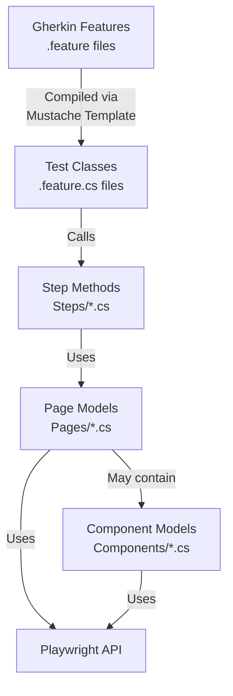

# Functional (E2E) Tests

Playwright-driven browser-based tests running against the Front End. Top-quality and exhaustive functional tests
are an absolute requirement to release new features quickly. Having these, we can be assured that new
changes do not break existing features.

## Principles

1. **Behavior-Driven Development**. When crafting new functionality, *start* by writing the behavior into a functional test, and then implement the feature in code.
2. **Completeness**: All user scenarios should be covered by functional tests
3. **Fast, simple, reliable**: In order to be effective, developers need to be able to quickly run them locally before every commit. If the tests are flaky, or difficult to setup or run, or take too long, we won't actually run them locally.
4. **Multiple Targets**: Tests can be run against multiple target environments. (See "Targets", below.)
5. **Pre-deployment CI**: Functional tests absolutely must run in automated tests. Failed tests must block deployment.
6. **Non-destructive**. We must be able to run the functional tests against a deployed instance, so it must be sufficiently isolated that it doesn't interfere with real-life use.
7. **Gherkin**: Tests will be written in strict Gherkin form.
8. **Generated Future**: In the future, we'll use C# code generation to convert the Gherkin features into running C# tests. In the meantime, the hand-written tests will mimic the generated code in the future. The [FunctionalTest.mustache](./Features/FunctionalTest.mustache) file gives the template for these tests
9. **Page Object Models**: We use page and component models to encapsulate knowledge about the structure of specific pages or controls.

## Test Architecture

The functional tests follow a layered architecture that separates test intent from implementation:



**Flow:**
- **Gherkin Features** define test scenarios in business-readable language
- **Test Classes** are generated from Gherkin, containing `[Test]` methods that call step methods
- **Step Methods** orchestrate the test flow by calling page models
- **Page Models** encapsulate page structure and provide interaction methods
- **Component Models** are reusable UI components shared across multiple pages
- **Playwright API** provides browser automation (locators, actions, assertions)

This separation ensures maintainability: UI changes only affect Page/Component Models, not test scenarios.

## Targets

1. **Docker container**. Run against a locally-built or remotely-pulled container image.
2. **Local build**. Run against the locally-built development bits running in Visual Studio or running with `dotnet watch`.
3. **Deployed instance**. Run against any deployed version in Azure App Service, including the production environment.

The choice of target is governed by a `.runsettings` file, providing details about the target.

### Local build

You can run tests against a build running locally, either in Visual Studio or with `dotnet watch`. In one window, launch the app. In another, run the functional tests with `local.runsettings`.

### Docker container

Running in a docker container is a future project.

### Deployed instance

Likewise, running against a deployed instance is for the far future. Right now, the codebase cannot even be deployed!!

## Getting Started

Before running the tests, there are two key prerequisites.

1. Install [.NET 10.0 SDK](https://dotnet.microsoft.com/en-us/download)
2. Install Chromium for Playwright

To install Chromium for Playwright, first build the functional tests. Then run the install script which is generated in the build. This only needs to be done once on initial setup, then again
whenever the Playwright packages are updated to a new version.

```Powershell
.\bin\Debug\net10.0\playwright.ps1 install chromium
```

## Adding new tests

1. Write new Gherkin scenarios in a [Feature](./Features/) file. Either create a new feature, or add new scenarios to an existing feature.
2. Ensure the steps are available in [FunctionalTest.cs](./Steps/FunctionalTest.cs)
3. Write additional [Page](./Pages/) or [Component](./Components/) models if page functionality is new or changed.
4. Write or update new C# test files in the [Feature](./Features/) directory, following the [Instructions](./INSTRUCTIONS.md) provided. GitHub Copilot is excellent at this!

## Known issues

Unfortunately, the [Playwright Test for VSCode](https://marketplace.visualstudio.com/items?itemName=ms-playwright.playwright) does not support C# test runners. This request was made and rejected. See [Feature: Playwright Test for VSCode Support for C# Projects ](https://github.com/microsoft/playwright/issues/38045).

To bring up the Playwright debugger, change the `PWDEBUG` environment variable using the `.runsettings` file.

```xml
  <RunConfiguration>
    <EnvironmentVariables>
      <PWDEBUG>0</PWDEBUG>
    </EnvironmentVariables>
  </RunConfiguration>
```
