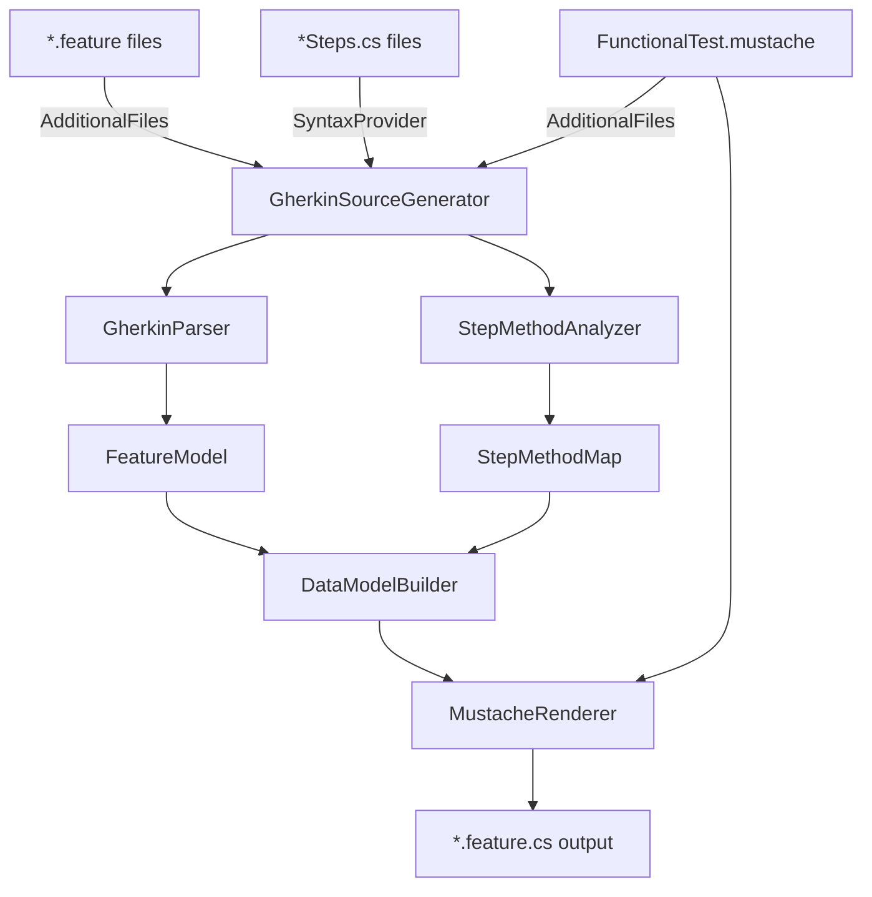

# Gherkin Source Generator Implementation Plan

## Overview

Replace LLM-based test generation with a C# Roslyn Incremental Source Generator that automatically generates NUnit test classes from Gherkin `.feature` files at build time.

## Project Structure

### New Project Location

```
tests/
├── Functional/                              # Existing functional tests
├── Functional.Generator/                    # NEW: Source generator project
│   ├── YoFi.V3.Tests.Functional.Generator.csproj
│   ├── GherkinSourceGenerator.cs           # Main incremental generator
│   ├── Models/
│   │   ├── FeatureModel.cs                 # Parsed feature data
│   │   ├── ScenarioModel.cs                # Scenario data
│   │   └── StepModel.cs                    # Step data (including hooks)
│   ├── Parsers/
│   │   ├── GherkinParser.cs                # Wraps Gherkin.Net library
│   │   └── TagParser.cs                    # Parses @tags from features
│   ├── Analyzers/
│   │   ├── StepMethodAnalyzer.cs           # Roslyn-based step discovery
│   │   └── StepMethodResolver.cs           # Maps steps to methods
│   └── Generators/
│       ├── MustacheRenderer.cs             # Renders existing template
│       └── DataModelBuilder.cs             # Builds Mustache data model
└── Functional.Generator.Tests/             # NEW: Tests for the generator
    ├── YoFi.V3.Tests.Functional.Generator.Tests.csproj
    ├── StepMethodAnalyzerTests.cs
    ├── StepMethodResolverTests.cs
    ├── GherkinParserTests.cs
    ├── DataModelBuilderTests.cs
    └── TestData/
        ├── Sample.feature                   # Test feature files
        └── SampleSteps.cs                   # Test step definitions
```

**Rationale for Location:**
- ✅ Generator is **test infrastructure**, belongs in `tests/` not `src/`
- ✅ Parallel to `Functional/` shows clear relationship
- ✅ Separate test project follows .NET conventions (Generator vs Generator.Tests)
- ✅ Does not pollute main source tree

## Architecture

### Component Diagram



### Component Responsibilities

#### 1. GherkinSourceGenerator (Main Entry Point)

```csharp
[Generator]
public class GherkinSourceGenerator : IIncrementalGenerator
{
    public void Initialize(IncrementalGeneratorInitializationContext context)
    {
        // 1. Collect .feature files
        var featureFiles = context.AdditionalTextsProvider
            .Where(f => f.Path.EndsWith(".feature"));

        // 2. Collect step definition classes
        var stepClasses = context.SyntaxProvider
            .ForAttributeWithMetadataName("YoFi.V3.Tests.Functional.Attributes.GivenAttribute", ...)
            .Combine(...WhenAttribute...)
            .Combine(...ThenAttribute...);

        // 3. Collect mustache template
        var template = context.AdditionalTextsProvider
            .Where(f => f.Path.EndsWith("FunctionalTest.mustache"));

        // 4. Combine and generate
        context.RegisterSourceOutput(
            featureFiles.Combine(stepClasses).Combine(template),
            GenerateTestClass);
    }
}
```

**Key Design Points:**
- Uses incremental generation for fast rebuilds
- Only regenerates when `.feature`, step classes, or template changes
- Leverages Roslyn's syntax provider for efficient step method discovery

#### 2. GherkinParser

```csharp
public class GherkinParser
{
    public FeatureModel ParseFeature(string featureContent)
    {
        // Use Gherkin.Net library
        var parser = new Gherkin.Parser();
        var doc = parser.Parse(featureContent);

        return new FeatureModel
        {
            Name = doc.Feature.Name,
            Description = doc.Feature.Description,
            Tags = ParseTags(doc.Feature.Tags),
            Background = ParseBackground(doc.Feature.Background),
            Scenarios = ParseScenarios(doc.Feature.Children)
        };
    }
}
```

**Handles:**
- Feature metadata (name, description, tags)
- Background steps → `[SetUp]` method
- Scenarios → test methods
- Scenario Outlines → `[TestCase]` attributes
- Data tables → `DataTable` objects

#### 3. StepMethodAnalyzer (Roslyn-based)

```csharp
public class StepMethodAnalyzer
{
    public StepMethodMap AnalyzeStepClass(SyntaxNode classNode, SemanticModel model)
    {
        var map = new StepMethodMap();

        foreach (var method in GetMethodsWithStepAttributes(classNode))
        {
            var attributes = GetStepAttributes(method);
            foreach (var attr in attributes)
            {
                var pattern = GetAttributePattern(attr);
                var methodName = method.Identifier.Text;
                var parameters = GetMethodParameters(method);

                map.Add(pattern, methodName, parameters);
            }
        }

        return map;
    }
}
```

**Discovers:**
- Methods with `[Given("pattern")]`, `[When("pattern")]`, `[Then("pattern")]`
- Pattern syntax: `{placeholder}`, `(.+)` regex captures, trailing `:`
- Method signatures (parameter types and names)
- Multiple attributes per method

**Validation:**
- Warns if step pattern in `.feature` has no matching method
- Warns if parameter count mismatch

#### 4. StepMethodResolver

```csharp
public class StepMethodResolver
{
    private readonly StepMethodMap _stepMap;

    public StepModel ResolveStep(Step gherkinStep, string currentKeyword)
    {
        // Handle "And" by using previous keyword context
        var effectiveKeyword = gherkinStep.Keyword.Trim() == "And"
            ? currentKeyword
            : gherkinStep.Keyword.Trim();

        // Find matching method by pattern
        var match = _stepMap.FindMatch(effectiveKeyword, gherkinStep.Text);

        return new StepModel
        {
            Keyword = gherkinStep.Keyword.Trim(),
            Text = gherkinStep.Text,
            Method = match.MethodName,
            Args = ExtractArgs(gherkinStep.Text, match.Pattern),
            HasDataTable = gherkinStep.DataTable != null,
            DataTableRows = ConvertDataTable(gherkinStep.DataTable)
        };
    }

    public List<StepModel> ProcessScenario(Scenario scenario, string hookMethod)
    {
        var steps = new List<StepModel>();
        bool hookInserted = false;
        string currentKeyword = "Given";

        foreach (var step in scenario.Steps)
        {
            var keyword = step.Keyword.Trim();
            if (keyword != "And") currentKeyword = keyword;

            // Insert hook before first "Then"
            if (!hookInserted && currentKeyword == "Then" && hookMethod != null)
            {
                steps.Add(new StepModel
                {
                    Keyword = "Hook",
                    Text = "Before first Then Step",
                    Method = hookMethod,
                    Args = ""
                });
                hookInserted = true;
            }

            steps.Add(ResolveStep(step, currentKeyword));
        }

        return steps;
    }
}
```

**Key Feature: Hooks as Special Steps**
- Treats hooks as `StepModel` with `Keyword = "Hook"`
- Inserts hook step before first `Then` step
- Works seamlessly with existing Mustache template

#### 5. DataModelBuilder

```csharp
public class DataModelBuilder
{
    public object BuildTemplateData(FeatureModel feature, StepMethodResolver resolver)
    {
        var hookMethod = feature.GetHookMethod(); // From @hook:before-first-then tag

        return new
        {
            Using = feature.GetTag("using"),
            Namespace = feature.GetTag("namespace"),
            FeatureDescription = feature.Name,
            Description = feature.Description.Split('\n'),
            FeatureName = ToCamelCase(feature.Name),
            BaseClass = feature.GetTag("baseclass"),
            Background = BuildBackgroundSteps(feature.Background, resolver),
            Rules = feature.Scenarios.Select(s => new
            {
                Name = s.Name,
                Scenarios = new[]
                {
                    new
                    {
                        Name = s.Name,
                        Method = ToCamelCase(s.Name),
                        Args = GetMethodArgs(s),
                        ExplicitTag = s.Tags.Contains("@explicit"),
                        Examples = GetExamples(s),
                        Steps = resolver.ProcessScenario(s, hookMethod)
                    }
                }
            })
        };
    }
}
```

**Output matches existing Mustache template structure**

#### 6. MustacheRenderer

```csharp
public class MustacheRenderer
{
    private readonly StubbleVisitorRenderer _renderer;
    private readonly string _template;

    public MustacheRenderer(string templateContent)
    {
        _renderer = new StubbleBuilder().Build();
        _template = templateContent;
    }

    public string Render(object data)
    {
        return _renderer.Render(_template, data);
    }
}
```

**Uses existing [`FunctionalTest.mustache`](tests/Functional/Features/FunctionalTest.mustache:1) template**

### Data Models

#### StepModel (Central to Design)

```csharp
public class StepModel
{
    public string Keyword { get; set; }         // "Given", "When", "Then", "And", "Hook"
    public string Text { get; set; }            // Original step text
    public string Method { get; set; }          // Method name to call
    public string Args { get; set; }            // Comma-separated arguments
    public bool HasDataTable { get; set; }      // True if DataTable needed
    public List<string> DataTableRows { get; set; } // Table row data
}
```

**Example for regular step:**
```csharp
new StepModel
{
    Keyword = "When",
    Text = "user selects option \"Weather\" in nav bar",
    Method = "SelectOptionInNavbar",
    Args = "\"Weather\"",
    HasDataTable = false
}
```

**Example for hook:**
```csharp
new StepModel
{
    Keyword = "Hook",
    Text = "Before first Then Step",
    Method = "SaveScreenshotAsync",
    Args = "",
    HasDataTable = false
}
```

## Testing Strategy

### TDD Approach with `[Explicit]` Attribute

This project follows a **strict Test-Driven Development (TDD)** approach:

1. **Write tests first** - Before implementing any feature, write comprehensive unit tests
2. **Mark as `[Explicit]`** - All new tests that are expected to fail (due to unimplemented functionality) MUST be marked with `[Explicit]` attribute
3. **Commit explicit tests** - It is **encouraged** to commit failing tests marked `[Explicit]` - this documents work in progress and intended functionality
4. **Tests remain skipped** - `dotnet test` automatically skips tests marked `[Explicit]`, ensuring CI/CD builds remain green
5. **Run explicitly during development** - To run specific explicit tests:
   - Execute them individually in your IDE or test explorer, OR
   - Use `dotnet test --filter "FullyQualifiedName~<TestName>"` to run a specific test by name
6. **Remove `[Explicit]` when passing** - Once the implementation is complete and the test passes, remove the `[Explicit]` attribute to include it in the standard test suite
7. **Never commit failing non-explicit tests** - All tests without `[Explicit]` must pass. Use `[Explicit]` as the mechanism for work-in-progress tests

**AI-Assisted Development Workflow:**

With AI assistance, you can work more efficiently by writing **multiple related tests at once**:

```csharp
// Write all tests for a component in one session, all marked [Explicit]
[TestFixture]
public class StepMethodAnalyzerTests
{
    [Test]
    [Explicit("Feature not yet implemented")]
    public void AnalyzeStepClass_SingleGivenAttribute_FindsMethod() { /* ... */ }

    [Test]
    [Explicit("Feature not yet implemented")]
    public void AnalyzeStepClass_MultipleAttributes_FindsAllMethods() { /* ... */ }

    [Test]
    [Explicit("Feature not yet implemented")]
    public void AnalyzeStepClass_ParameterPlaceholder_ExtractsParameter() { /* ... */ }

    [Test]
    [Explicit("Feature not yet implemented")]
    public void AnalyzeStepClass_RegexPattern_MatchesCorrectly() { /* ... */ }
}

// Then implement the feature to make tests pass
// Remove [Explicit] from tests as they pass (can be multiple at once)
// Commit when all tests in the batch are passing
```

**Typical AI-assisted workflow:**
1. **Plan test suite** - Design all tests for a component (e.g., all StepMethodAnalyzer tests)
2. **Write all tests** - Use AI to generate comprehensive test suite, mark all `[Explicit]`
3. **Commit test suite** - Documents complete intended functionality
4. **Implement feature** - Use AI to implement the component
5. **Run tests** - Execute explicit tests to verify implementation
6. **Remove `[Explicit]` in batch** - Once all tests pass, remove attributes from passing tests
7. **Commit implementation** - Both implementation and passing tests

This batch approach is more efficient than one-test-at-a-time while still maintaining clean builds.

**Benefits:**
- ✅ Tests document complete intended functionality upfront
- ✅ AI can generate comprehensive test coverage in one session
- ✅ Prevents broken builds from work-in-progress tests
- ✅ Clear signal of implementation status
- ✅ Easy to find incomplete work (`grep -r "\[Explicit\]"`)
- ✅ CI/CD builds pass cleanly while features are in development
- ✅ More efficient development cycle with AI assistance

### 1. Unit Tests (TDD Approach)

**Test Project:** `tests/Functional.Generator.Tests/`

#### StepMethodAnalyzerTests.cs

```csharp
[TestFixture]
public class StepMethodAnalyzerTests
{
    [Test]
    public void AnalyzeStepClass_SingleGivenAttribute_FindsMethod()
    {
        // Given: A step class with [Given] attribute
        var source = @"
            public class TestSteps {
                [Given(""user has launched site"")]
                protected async Task GivenLaunchedSite() { }
            }";

        // When: Analyzing the class
        var analyzer = new StepMethodAnalyzer();
        var map = analyzer.AnalyzeStepClass(ParseSource(source));

        // Then: Method should be found
        Assert.That(map.HasPattern("Given", "user has launched site"), Is.True);
        Assert.That(map.GetMethod("Given", "user has launched site"), Is.EqualTo("GivenLaunchedSite"));
    }

    [Test]
    public void AnalyzeStepClass_ParameterPlaceholder_ExtractsParameter()
    {
        // Given: Step with {parameter} placeholder
        var source = @"
            [When(""user selects option {option} in nav bar"")]
            protected async Task SelectOptionInNavbar(string option) { }";

        // When: Analyzing
        var map = analyzer.AnalyzeStepClass(ParseSource(source));

        // Then: Should extract parameter name
        var pattern = map.GetPattern("When", "user selects option (.+) in nav bar");
        Assert.That(pattern.Parameters, Has.Count.EqualTo(1));
        Assert.That(pattern.Parameters[0].Name, Is.EqualTo("option"));
    }
}
```

#### StepMethodResolverTests.cs

```csharp
[TestFixture]
public class StepMethodResolverTests
{
    [Test]
    public void ResolveStep_SimpleGiven_MapsToMethod()
    {
        // Given: A step and a method map
        var step = CreateStep("Given", "user has launched site");
        var map = CreateMapWith("Given", "user has launched site", "GivenLaunchedSite");
        var resolver = new StepMethodResolver(map);

        // When: Resolving the step
        var result = resolver.ResolveStep(step, "Given");

        // Then: Should map correctly
        Assert.That(result.Method, Is.EqualTo("GivenLaunchedSite"));
        Assert.That(result.Args, Is.Empty);
    }

    [Test]
    public void ResolveStep_AndKeyword_UsesContextKeyword()
    {
        // Given: An "And" step after a "Then" step
        var step = CreateStep("And", "page loaded ok");
        var map = CreateMapWith("Then", "page loaded ok", "ThenPageLoadedOk");
        var resolver = new StepMethodResolver(map);

        // When: Resolving with "Then" context
        var result = resolver.ResolveStep(step, "Then");

        // Then: Should find method using "Then" keyword
        Assert.That(result.Method, Is.EqualTo("ThenPageLoadedOk"));
        Assert.That(result.Keyword, Is.EqualTo("And")); // Original preserved
    }

    [Test]
    public void ProcessScenario_WithHook_InsertsHookBeforeFirstThen()
    {
        // Given: Scenario with Given/When/Then steps and hook method
        var scenario = CreateScenario(
            CreateStep("Given", "user has launched site"),
            CreateStep("When", "user navigates to weather"),
            CreateStep("Then", "page loaded ok"),
            CreateStep("And", "page heading is Weather")
        );

        // When: Processing with hook
        var steps = resolver.ProcessScenario(scenario, "SaveScreenshotAsync");

        // Then: Hook should be inserted before first Then
        Assert.That(steps.Count, Is.EqualTo(5));
        Assert.That(steps[2].Keyword, Is.EqualTo("Hook"));
        Assert.That(steps[2].Method, Is.EqualTo("SaveScreenshotAsync"));
        Assert.That(steps[3].Keyword, Is.EqualTo("Then")); // Original Then follows
    }
}
```

#### DataModelBuilderTests.cs

```csharp
[TestFixture]
public class DataModelBuilderTests
{
    [Test]
    public void BuildTemplateData_SimpleFeature_BuildsCorrectStructure()
    {
        // Given: A simple feature model
        var feature = CreateFeature("Weather Forecasts",
            tags: new[] { "@using:YoFi.V3.Tests.Functional.Steps" });

        // When: Building template data
        var data = builder.BuildTemplateData(feature, resolver);

        // Then: Should have correct structure
        Assert.That(data.Using, Is.EqualTo("YoFi.V3.Tests.Functional.Steps"));
        Assert.That(data.FeatureName, Is.EqualTo("WeatherForecasts"));
    }
}
```

### 2. Integration Tests (End-to-End Generation)

```csharp
[TestFixture]
public class GeneratorIntegrationTests
{
    [Test]
    public void Generate_WeatherFeature_ProducesCorrectOutput()
    {
        // Given: Actual Weather.feature file
        var featureContent = File.ReadAllText("TestData/Weather.feature");
        var stepClassContent = File.ReadAllText("TestData/WeatherSteps.cs");
        var templateContent = File.ReadAllText("TestData/FunctionalTest.mustache");

        // When: Running full generation pipeline
        var generator = new GherkinSourceGenerator();
        var output = generator.Generate(featureContent, stepClassContent, templateContent);

        // Then: Should produce compilable C# code
        Assert.That(output, Does.Contain("public class WeatherForecasts : WeatherSteps"));
        Assert.That(output, Does.Contain("[SetUp]"));
        Assert.That(output, Does.Contain("await GivenLaunchedSite();"));

        // And: Should compile successfully
        var compilation = CompileCode(output);
        Assert.That(compilation.GetDiagnostics().Where(d => d.Severity == DiagnosticSeverity.Error), Is.Empty);
    }
}
```

### 3. Snapshot Testing (Verify Output Consistency)

```csharp
[TestFixture]
public class SnapshotTests
{
    [Test]
    public void Generate_Weather_MatchesSnapshot()
    {
        // Given: Weather.feature
        var output = GenerateFromFeature("Weather.feature");

        // When/Then: Should match approved snapshot
        Approvals.Verify(output);
    }
}
```

**Uses ApprovalTests.Net for snapshot verification**

### 4. Manual Testing (Verification Steps)

After implementation:

1. **Build test** - Verify generator project compiles
2. **Reference test** - Add generator reference to Functional project
3. **Regeneration test** - Delete `Weather.feature.cs`, rebuild, verify recreation
4. **Incremental test** - Modify `Weather.feature`, verify only it regenerates
5. **Full suite test** - Run all functional tests to verify generated code works

## Implementation Plan

### Phase 1: Foundation (TDD)

- [ ] Create `tests/Functional.Generator/` project with NuGet packages
  - `Gherkin` (v28.0.0) - Gherkin parser
  - `Stubble.Core` (v1.10.8) - Mustache rendering
  - `Microsoft.CodeAnalysis.CSharp` (v4.8.0) - Roslyn analysis
- [ ] Create `tests/Functional.Generator.Tests/` project
- [ ] Copy test data files (sample `.feature`, sample steps, template)
- [ ] Write unit tests for `GherkinParser` (TDD)
- [ ] Implement `GherkinParser` to pass tests
- [ ] Write unit tests for `TagParser` (TDD)
- [ ] Implement `TagParser` to pass tests

### Phase 2: Step Discovery (TDD)

- [ ] Write unit tests for `StepMethodAnalyzer` (TDD)
- [ ] Implement `StepMethodAnalyzer` using Roslyn to pass tests
- [ ] Write unit tests for `StepMethodResolver` (TDD)
- [ ] Implement `StepMethodResolver` to pass tests
- [ ] Add hook insertion tests
- [ ] Implement hook insertion logic

### Phase 3: Code Generation (TDD)

- [ ] Write unit tests for `DataModelBuilder` (TDD)
- [ ] Implement `DataModelBuilder` to pass tests
- [ ] Write unit tests for `MustacheRenderer` (TDD)
- [ ] Implement `MustacheRenderer` to pass tests
- [ ] Write integration test for full pipeline
- [ ] Implement full pipeline to pass integration test

### Phase 4: Source Generator Integration

- [ ] Implement `GherkinSourceGenerator` class
- [ ] Add incremental generation pipeline
- [ ] Add diagnostic reporting for missing step methods
- [ ] Test generator in isolation

### Phase 5: Integration with Functional Tests

- [ ] Reference generator from `Functional.csproj`
- [ ] Configure `.feature` and `.mustache` as `AdditionalFiles`
- [ ] Delete existing `*.feature.cs` files
- [ ] Build and verify regeneration
- [ ] Run full functional test suite
- [ ] Fix any discrepancies

### Phase 6: Documentation and Cleanup

- [ ] Update `tests/Functional/README.md` with generator info
- [ ] Add `tests/Functional.Generator/README.md`
- [ ] Document troubleshooting steps
- [ ] Archive `tests/Functional/INSTRUCTIONS.md` (no longer needed for LLM)
- [ ] Add entry to main project documentation

## Project Configuration

### Functional.Generator.csproj

```xml
<Project Sdk="Microsoft.NET.Sdk">
  <PropertyGroup>
    <TargetFramework>netstandard2.0</TargetFramework>
    <LangVersion>latest</LangVersion>
    <EnforceExtendedAnalyzerRules>true</EnforceExtendedAnalyzerRules>
    <IsRoslynComponent>true</IsRoslynComponent>
    <IncludeBuildOutput>false</IncludeBuildOutput>
  </PropertyGroup>

  <ItemGroup>
    <PackageReference Include="Gherkin" Version="28.0.0" />
    <PackageReference Include="Stubble.Core" Version="1.10.8" />
    <PackageReference Include="Microsoft.CodeAnalysis.CSharp" Version="4.8.0" PrivateAssets="all" />
    <PackageReference Include="Microsoft.CodeAnalysis.Analyzers" Version="3.3.4" PrivateAssets="all" />
  </ItemGroup>
</Project>
```

### Functional.csproj (Integration)

```xml
<ItemGroup>
  <!-- Reference the source generator -->
  <ProjectReference Include="..\Functional.Generator\YoFi.V3.Tests.Functional.Generator.csproj"
                    OutputItemType="Analyzer"
                    ReferenceOutputAssembly="false" />

  <!-- Include feature files and template as additional files -->
  <AdditionalFiles Include="Features\**\*.feature" />
  <AdditionalFiles Include="Features\**\*.mustache" />

  <!-- Exclude generated files from source control -->
  <Compile Remove="Tests\*.feature.cs" />
  <Compile Include="Tests\*.feature.cs" />
</ItemGroup>
```

### .gitignore Addition

```gitignore
# Auto-generated test files (generated by source generator at build time)
tests/Functional/Tests/*.feature.cs
```

## Benefits Over LLM Approach

| Aspect | LLM (Current) | Source Generator (Proposed) |
|--------|---------------|----------------------------|
| **Automation** | Manual regeneration | Automatic on every build |
| **Speed** | Slow (API calls) | Fast (local, incremental) |
| **Cost** | API fees per generation | Zero after development |
| **Consistency** | Can vary | 100% deterministic |
| **Validation** | Runtime errors | Compile-time diagnostics |
| **Offline** | Requires API access | Works offline |
| **IDE Integration** | None | Full Visual Studio/VS Code |
| **Type Safety** | No compile checks | Validates step signatures |
| **Debugging** | Difficult | Standard C# debugging |
| **CI/CD** | Extra step required | Built into compile |

## Risks and Mitigations

### Risk: Roslyn Complexity
- **Impact**: Difficult to implement step discovery
- **Mitigation**: Start with simpler syntax tree queries, iterate
- **Fallback**: Use reflection on compiled assembly instead of Roslyn

### Risk: Mustache Template Changes
- **Impact**: Breaking changes to template structure
- **Mitigation**: Version template, provide migration guide
- **Fallback**: Keep old template for compatibility mode

### Risk: Generator Bugs
- **Impact**: Build failures, incorrect test generation
- **Mitigation**: Comprehensive unit tests, snapshot tests
- **Fallback**: Keep LLM instructions as documentation fallback

### Risk: Learning Curve
- **Impact**: Team unfamiliar with source generators
- **Mitigation**: Detailed documentation, examples
- **Fallback**: Provide standalone CLI tool alternative

## Success Criteria

- [ ] All existing `.feature.cs` files regenerate identically (or with known improvements)
- [ ] Full functional test suite passes with generated tests
- [ ] Build time shows minimal increase (<5 seconds)
- [ ] Incremental builds only regenerate changed features
- [ ] Diagnostic messages guide developers when step methods missing
- [ ] Unit test coverage >90% for generator code
- [ ] Documentation complete and reviewed

## Timeline Estimate

**Note:** Per project rules, no time estimates provided. Complexity assessment only:

- **Phase 1-3**: Foundation and core logic (medium complexity)
- **Phase 4**: Source generator integration (medium complexity, new to team)
- **Phase 5**: Integration testing (low complexity, mostly verification)
- **Phase 6**: Documentation (low complexity)

**Recommended Approach:** Implement incrementally, validate each phase before proceeding.

## Conclusion

This source generator approach provides a robust, maintainable solution for automatic test generation from Gherkin feature files. By treating hooks as special steps and using your existing Mustache template, the design is clean and leverages proven patterns. Comprehensive unit testing ensures reliability, and incremental generation ensures fast build times.
